# 用 FIFA 2021 阐述探索性数据分析(上)

> 原文：<https://pub.towardsai.net/exploratory-data-analysis-expounded-with-fifa-2021-part-1-f20c465d483e?source=collection_archive---------0----------------------->

## 使用 FIFA 21 作为案例研究，了解如何像专业人员一样使用 python 进行统计分析并生成见解。


古列尔莫·巴西尔在 [Unsplash](https://unsplash.com?utm_source=medium&utm_medium=referral) 上拍摄的照片

**我为什么决定写这个话题的一个小故事。**

*来了一个对学习数据科学很好奇的家伙。他在网上搜索，通过 Udemy、Coursera、YouTube 等获得了一些学习数据科学的资源。*

*通过教程，他使用了一个干净的小数据集，他非常兴奋地知道了许多关于数据科学的知识，但却解决了现实世界的问题；他发现，如果你熟悉足球，数据科学是一种不同的球类游戏，具有未定义的格式，就像谢菲尔德对拜仁慕尼黑的比赛一样；你知道这场比赛对谢菲尔德来说有多难，哈哈。*

*他注意到现实生活中的数据集是杂乱的，所以这让他陷入混乱，他患有冒名顶替综合症。从长远来看，他后来发现他需要处理缺失的值，问聪明的问题等等，他后来发现这不仅仅是做分析。*

*他发现 EDA 没有得到很好的解释，尤其是在初级阶段，正如大多数教程中所预期的那样，形式整齐划一，可能是因为它没有特定的模式或其他原因；他不得不通过大量的资源、实践和解决现实世界的问题来学习它，这就是为什么他简化了探索性数据分析。在这里，我将使用 FIFA 2021 数据集给出一些重要的提示和代码解释。*

> 我没有特殊的才能。我只是强烈地好奇——阿尔伯特·爱因斯坦。

**强烈好奇**在这种情况下，意味着我们作为数据从业者不断学习并变得非常好奇，这就是为什么我们寻求探索数据以获得有意义的信息，而在玩 FIFA 2021 时，我很想获得以下问题的详细答案:

*   FIFA 2021 最快的顶级球员有哪些？
*   哪些球员工资最高？
*   谁是最高的运动员？
*   谁是最强的选手？
*   谁是长传最好的球员？
*   谁是短传最好的球员？
*   谁是最好的防守者？

**注:**这一切我们将在本教程中通过探索性数据分析来发现。

# 您将从本文中学到什么:

*   什么是探索性数据分析？
*   为什么要进行探索性数据分析？
*   重命名列并检查缺少的值
*   使用日期时间功能
*   特征创建
*   删除丢失的值
*   描述性统计分析
*   使用 Pandas nlargest 进行基础数据分析以获得洞察力

点击此处链接到 [Jupyter 笔记本](https://nbviewer.jupyter.org/github/Gift-Ojeabulu/FIFA2021ANALYSIS/blob/main/MainFIFA2021ANALYSIS-Copy1.ipynb)获取帖子。

# 什么是探索性数据分析？

*(****【EDA】****)是一种对* [*数据集进行分析*](https://en.wikipedia.org/wiki/Data_analysis)*[](https://en.wikipedia.org/wiki/Data_set)**来概括其主要特征的方法，常采用直观的方法。一个* [*统计模型*](https://en.wikipedia.org/wiki/Statistical_model) *可以用也可以不用，但主要是 EDA 是为了看看数据能告诉我们什么，超越正式的建模或假设检验任务。(来源:* [*维基百科*](https://en.wikipedia.org/wiki/Exploratory_data_analysis) *)***

> **探索性数据分析是一种态度，一种灵活的状态，一种寻找我们认为不存在的东西以及我们认为可能存在的东西的意愿——约翰·图基**

****探索性数据分析**从我的角度来看，简单来说，就是通过统计技术和数据可视化，对数据进行调查、检查和转换，从而得出对理性决策有用的信息。**

# **为什么要进行探索性数据分析？**

***“EDA 的主要目的是在做任何假设之前帮助查看数据。它可以帮助识别明显的错误，以及更好地理解* *数据内的模式，检测异常值或异常事件，发现变量间有趣的关系”。(来源:*[*Ibm.com*](https://www.ibm.com/cloud/learn/exploratory-data-analysis)*)***

**我喜欢探索性数据分析，因为它帮助我提出数据智能问题，更好地探索和执行数据集的数据可视化，以识别模式并揭示对数据科学生命周期的后续步骤有用的宝贵见解。**

**它向我展示了超越直觉和分析的反思性思维，这与批判性思维技能如分析、解释、解决问题和决策有关。**

# **准备我们的数据集**

**在开始任何数据科学项目时，理解数据是非常重要的。如果您对数据集知之甚少或一无所知，我们就无法对任何数据进行有效的分析。**

**因此，我会建议尽量对你的数据有充分的了解。在本文中，我整理了数据的详细变量描述，以便在开始探索性数据分析之前理解我们的数据集。**

**既然我们理解了探索性数据分析，让我们直接进入本文的实践方面。我们将使用从 [Kaggle](https://www.kaggle.com/batuhandemirci/fifa-2021-team-and-player-dataset?select=players.csv) 获得的 FIFA 2021 数据集。**

**数据集和笔记本的描述在 [GitHub repo](https://github.com/Gift-Ojeabulu/FIFA2021ANALYSIS) 中提供。您将有一个数据集和笔记本的文件夹。我建议打开笔记本，跟着文章走，以便更好地理解。我试着让笔记本简单，有很好的注释，详细和有条理。**

**[此处链接到详细的变量描述](https://fifauteam.com/fifa-20-attributes-guide/#:~:text=REACTIONS%2000,time%20have%20low%20reaction%20capacity.)**

**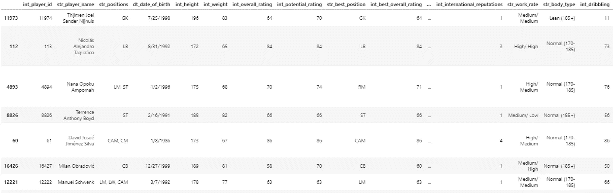**

*   **我们导入`Pandas,matplotlib` `numpy ,seaborn`进行基本的数据操作、数值计算和可视化。**
*   **我们使用`filterwarnings`模块使警告静音。**
*   **`*Word Cloud*`用于表示不同大小的文本数据，从提到最多的词到提到最少的词。**
*   **我们导入`Word Cloud`来根据生成的每个词的大小-频率可视化我们的文本数据，并使用计数器来保存容器中存在的每个元素的计数，最后，我们读取 CSV 数据集并使用`***.***sample()`函数查看它，以便我们获得数据集的随机概览。**

**由此，我们可以推断出 FIFA 数据集包含三种类型的特征(数字、分类和日期特征)。**

**记住这一点，让我们做一些基本的数据清理和特征创建。**

> *****注意:*** *使用这些技术的目的是执行本文中的任务。我的意思是你根据选择或者你的用例要求来选择方法。***

# **重命名列并检查缺少的值**

```
**#Viewing the columns available in our Dataset
data_fifa.columns#Checking for columns with missing values
data_fifa.columns[data_fifa.isnull().any()]**
```

**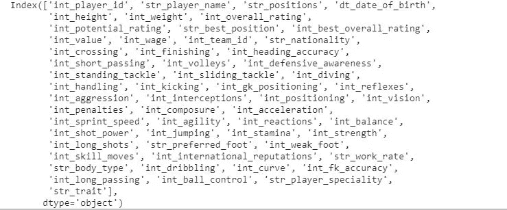******

*   **我们使用来自 Pandas 的`.columns`来显示我们数据集中的列，我们可以推断出我们正在处理一个有很多列的数据集。**
*   **我们使用`.columns[data_fifa.Isnull().any()]`来检查数据集中具有缺失值的列的列表，其中`Isnull()` 用于检测类似数组的对象的缺失值，我们发现有三列具有缺失值，因此我们应该想办法通过删除列、填充列或任何其他技术来处理具有缺失值的列，因为缺失值是脏数据的属性。**
*   **现实生活中的数据存在常见错误，如拼写或标点错误、与字段相关的不正确数据、不完整或过时的数据**、**，甚至是数据库中重复的数据。所有这些都会对我们的数据集产生负面影响，进而影响我们的分析，因此处理和处理数据集中的这些问题至关重要。**

*   **在这一部分中，我们将列名重命名为一个更短且描述性更好的名称，这是数据科学家的一个好习惯，我们采用了 Camel case 命名约定。**

# ****使用日期功能****

**`DateTime`提供日期和时间类。这些类提供了几个函数来处理日期、时间和时间间隔。Date 和`DateTime`对象，所以当你操作它们时，你操作的是对象而不是字符串或时间戳。**

*   **我们只是将对象列转换为对象列，然后使用日期时间属性将该列转换为分别带有`***.****dt.year*`和`.*dt.month*`的年份和月份。**
*   ****时间序列分析**是一种统计技术，涉及时间序列类型的数据或趋势分析。时间序列数据是指数据处于一系列特定的周期或间隔中。……横截面数据:在同一时间点收集的一个或多个变量的数据。**

# **特征创建**

****特征创建**简单来说就是从预先存在的数据中生成额外的特征，以创建更准确的机器学习模型。**

```
**#Subtract 2021 from Date Of Birth to get Agetoday = pd.to_datetime('2021-03-10')data_fifa['age'] = today.year - data_fifa['D.O.B'].dt.year**
```

*   **这里，我们从当前年份 2021 中减去日期年，得到一个名为`age`的新列。**
*   **获得年份后，需要创建一个名为“PlayersAge”的功能。为此，我们将从玩家的年份中减去今天的日期，例如 2021–03–1972，得到玩家的年龄。**

# **删除丢失的值**

**处理缺失值有不同的方法，但我们将对其他数据集采用删除列方法。情况可能会有所不同，如使用不同的技术填充列等，但在这种情况下，我们决定删除不一致的数据列，如位置和总体列，以及其他不重要或不太重要的列。**

```
**columns = ['int_team_id', 'str_player_speciality','str_trait','int_player_id','D.O.B','year','Positions','OverallRating']data_fifa = data_fifa.drop(columns, axis=1, inplace=**False** )data_fifa.sample(4).T**
```

**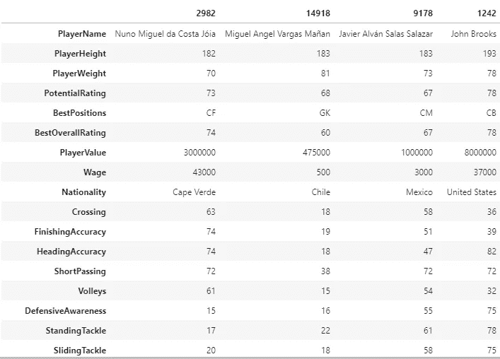**

**1**

*   **我们删除了 int_team_id **、**重复列和我们的`date` 列，因为我们已经转换为一个对象，并从它们创建了一个附加特征。**

```
**data_fifa.shape**
```

**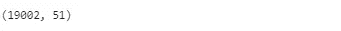**

**我们使用`shape`方法检查行和列中数据集的形状，这里有 19002 行和 51 列。**

```
**data_fifa.info()**
```

**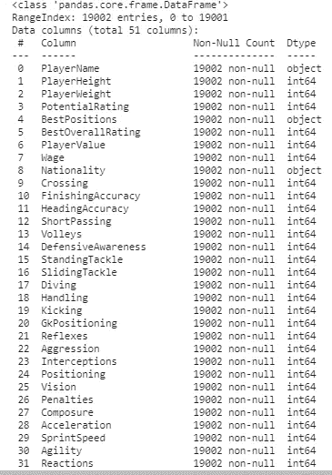**

*   ***`info()`*总结了我们的数据集，我们可以用这个地方的。datatype 函数，因为它提供了关于数据类型、非空值和内存使用的信息。****

```
**data_fifa.describe().apply(lambda s: s.apply(lambda x: format(x,
'f')))**
```

**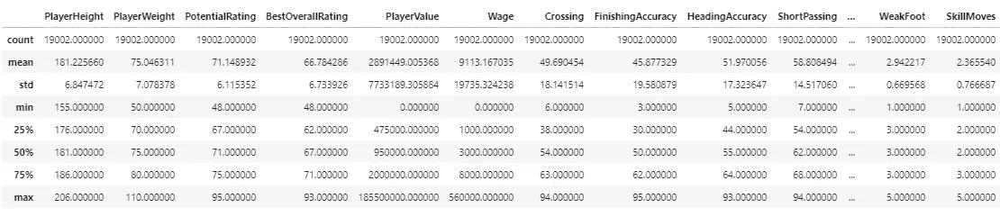**

*   **`.describe()`对数据集的详细统计理解，要查看包括分类列在内的所有列，请尝试。description(include = ' all ')引入了 object 数据类型的最高值和频率值，它显示了集中趋势的度量值—平均值和中值，以及离差的度量值—标准差、四分位距、最大值和最小值。**
*   **`.apply(lambda s: s.apply(lambda x: format(x, ‘f’)` 用于去除均值和标准差中的指数，使其更加明确。**

```
 **data_fifa.nunique()**
```

**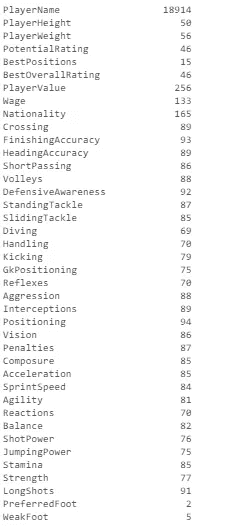**

*   **`unique()`函数打印每一列中唯一元素的数量，它与 pandas value_counts()相似但不同，后者打印序列中唯一值的数量。**

# ****熊猫 nlargest 基础数据分析****

**我们之前说过 Python 中的 Pandas 用于数据操作，我们将使用`nlargest`方法从我们的数据中获得洞察力。Pandas `nlargest()`用于从一个数据帧或序列中获取 n 个最大的**值。****

> ***注:在这一部分，我们将回答几个我们对 FIFA 21 持怀疑态度的问题。***

## ****最快的顶级玩家****

**我们将回答 FIFA 2021 最快的前 10 名球员是谁？**

```
**player_name = data_fifa[["Acceleration","PlayerName","BestPositions",’age’,’Nationality’,’SprintSpeed’]].nlargest(7, [’Acceleration’]).set_index(’PlayerName’)
player_name**
```

**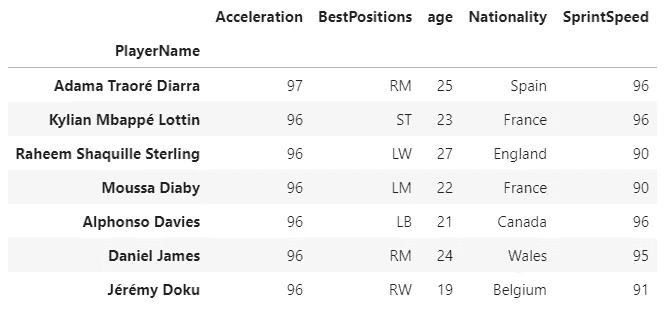**

*   **我们了解了 FIFA 2021 中最快的 7 名球员以及他们的年龄和国籍，我们发现 Adaome Traore 是 FIFA 2021 中最快的球员，加速度为 97，而前 7 名中的其他人为 96。**
*   **`Acceleration`是国际足联中的球员属性，决定了球员在球场上奔跑速度(冲刺速度)的增量。`acceleration`速率告诉玩家多快可以到达他们`sprint speed`的顶点。**
*   **因此，我们选择加速度而不是速度来确定最快的玩家，因此深入了解数据集中的每个特征非常重要。**

## **最高的运动员**

```
**player_name =
data_fifa[["PlayerHeight","PlayerName","PlayerWeight","BestPositions",’age’,’Nationality’]].nlargest(10, [’PlayerHeight’]).set_index(’PlayerName’)
player_name**
```

**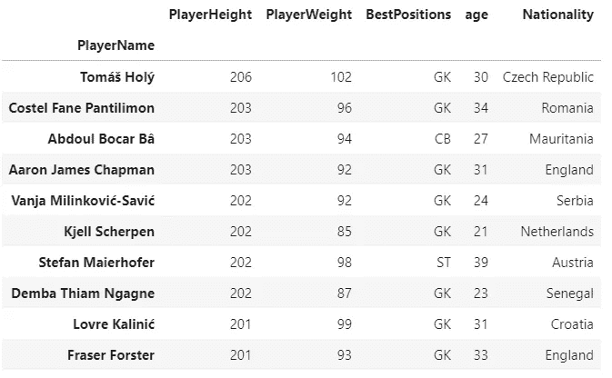**

*   **我们将回答 2021 年 FIFA 最高的 10 名球员。该数据集中以厘米为单位测量的`Height`，其中前 10 名最高的足球运动员在`206–201cm`之间，当转换为英尺时，在`6.76–6.6ft` 的范围内，但这里有一点很明显，即 10 名足球运动员中有 8 名是守门员，所以我们可以说身高对于守门员来说是一个巨大的优势。**

## **最强的选手**

```
**player_name = data_fifa[["Strength","PlayerName","PlayerHeight","Stamina",’age’,’Nationality’,’PlayerWeight’,’BestPositions’]].nlargest(7, [’Strength’]).set_index(’PlayerName’)
player_name**
```

**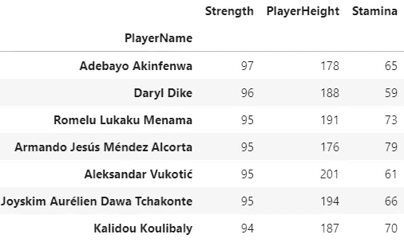**

*   **最强选手是**阿德巴约·阿金费瓦**，综合评分`97`。**
*   **`strength`是强大的品质或程度，而`stamina`是能量和力量用于长期持续做某事，这就是为什么我们选择力量来衡量最强的球员。**

## **防守意识/能力最佳防守者**

```
**player_name = data_fifa[["DefensiveAwareness","PlayerName","BestPositions",'age','Nationality']].nlargest(10, ['DefensiveAwareness']).set_index('PlayerName')
player_name**
```

**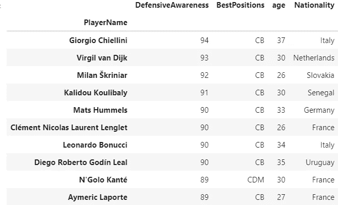**

*   **意大利的`Georgio Chilleinni`和荷兰的`Virgil van Dirk`是最好的防守者，防守能力分别为 94 和 93。**
*   **你可能想知道为什么我不选择最佳防守者，而选择最佳意识防守者。仅根据防守意识来评定最佳防守者是有偏见的，因为其他因素也有助于成为最佳防守者，尽管防守能力有更强的相关性，但评定最佳防守者的其他因素包括速度、力量和头球能力。**

## **最佳长传球员**

```
**player_name = data_fifa[["LongPassing","PlayerName","ShortPassing","Stamina",’age’,’Nationality’,’PlayerWeight’,’BestPositions’]].nlargest(10, [’LongPassing’]).set_index(’PlayerName’)
player_name**
```

**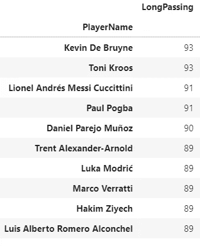**

*   **良好的传球能力是一个中场球员最重要的属性。FIFA 2021 长传最好的球员是`Kevin De Bruyne`和`Toni` `Kroos`，综合评分 93。**
*   **`Lionel Messi`和`Paul Pogba`，综合评分 91。我们刚刚深入了解了前 10 名长传球员。**

## **最佳短传球员**

```
**player_name = data_fifa[["ShortPassing","PlayerName","LongPassing","Stamina",'age','Nationality','PlayerWeight','BestPositions']].nlargest(10, ['ShortPassing']).set_index('PlayerName')player_name**
```

**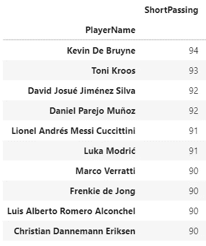**

*   **我们有 94 分的`Kevin De Bruyne`和 93 分的`Toni Kroos` 。我们可以说德布鲁因和托尼·克罗斯是 FIFA 21 中传球最多的球员。**

**既然传球能力是选择最佳中场考虑最多的因素。在理想的情况下，你不能只衡量传球能力排名前 10 位的中场球员，因为在选择最佳中场球员时还有许多其他因素要考虑，有些中场球员的评级是相同的。**

## ****付费玩家最多****

```
**player_name = data_fifa[["Wage","PlayerName","PlayerValue","BestOverallRating",’age’,’Nationality’,’PotentialRating’,’InternationalReputations’]].nlargest(10, [’Wage’]).set_index(’PlayerName’)
player_name**
```

**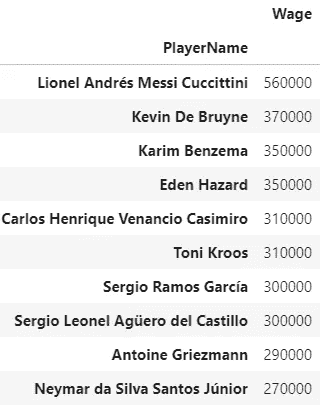**

*   **`Messi` 和`De Bruyne`是 FIFA 21 中收入最高的球员，分别为 56 万美元和 37 万美元。**

# ****我们在这里得出结论…****

**在数据分析阶段，我们不能过分强调探索性数据分析的重要性。深入理解它会让你比其他数据从业者更有优势。**

**我们只是通过探索性的数据分析，对 FIFA 2021 中我们知道和不知道的事情有了一些洞察。**

**您刚刚学习了基本的数据清理和要素创建、描述性统计(包括分散和集中趋势测量)、熊猫 n 大的数据分析。**

**这是一篇很长的帖子，但是我希望你已经学到了很多，并将在你的下一个项目中使用这里探索的技术。**

**恭喜你！你现在通过探索性的数据分析，对 FIFA 2021 有了详细的了解。**

**在本教程系列的下一部分，我们将提出更多的问题，使用数据可视化来回答这些问题，并获得更多的见解。多有趣啊！？我相信你很期待。**

**关于 FIFA 2021 你还有什么好奇想知道的？**

**请使用下面的评论部分。后会有期，快乐分析！**

**在 Linkedin 上与我联系**

**在推特[上与我联系](https://twitter.com/GiftOjeabulu_)**