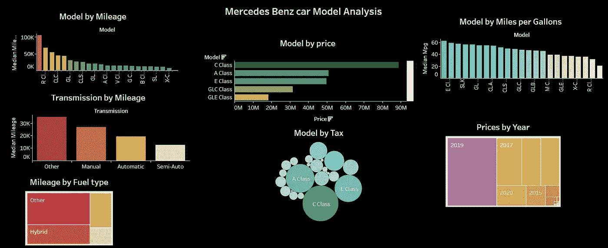
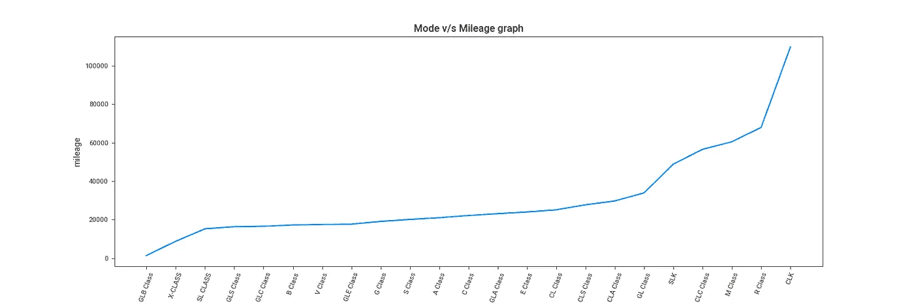
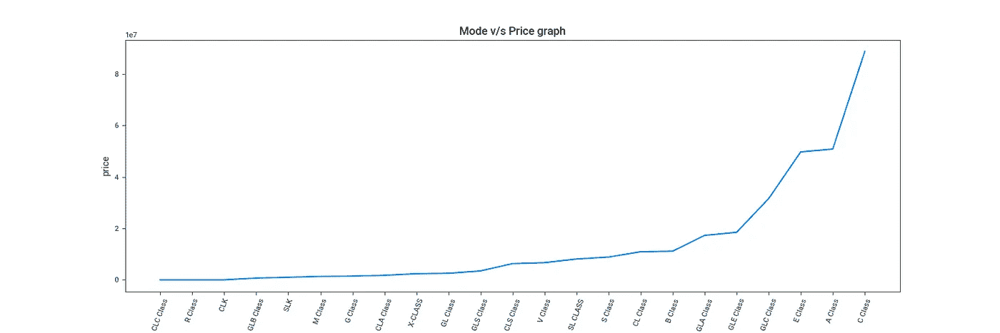
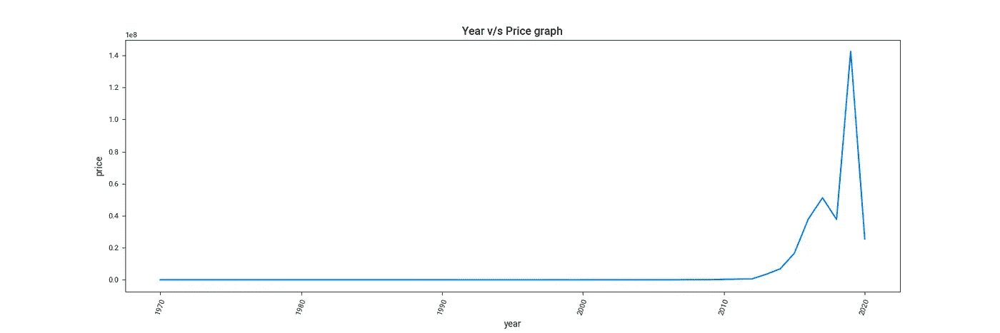
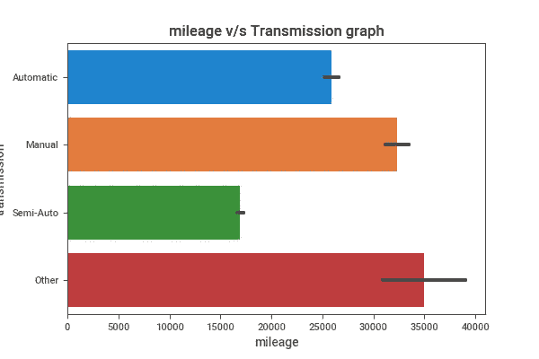
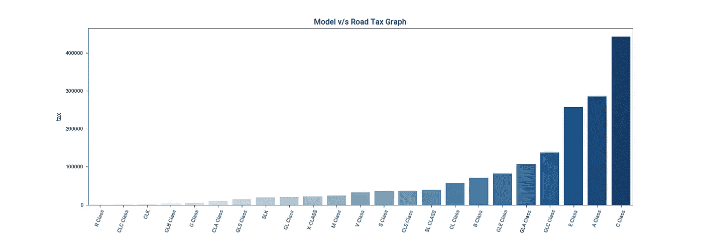
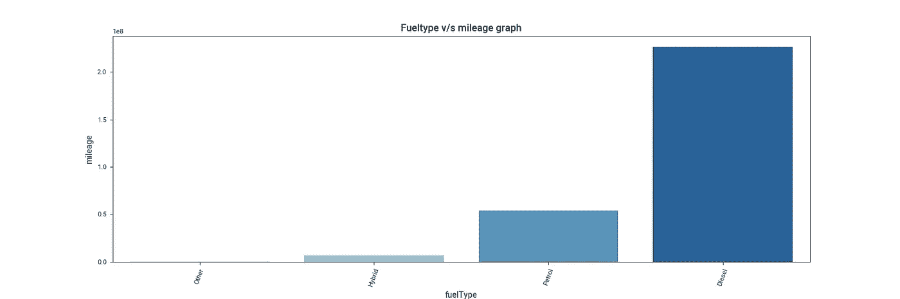

# 奔驰汽车模型的探索性数据分析

> 原文：<https://pub.towardsai.net/exploratory-data-analysis-for-mercedes-benz-car-models-48f7ca22a103?source=collection_archive---------0----------------------->

## 对梅赛德斯-奔驰车型的分析以及一些有助于商业决策的额外见解。

Tableau 仪表板(图片由作者提供)

这篇文章将分析决定奔驰汽车型号的重要变量。奔驰汽车模型数据集的探索性数据分析将是本文的重点。顾名思义，EDA 可以让我们更好地理解数据。在此阶段，我们将研究这些数据的统计特征，生成可视化效果，并测试假设。本文将尝试从 Kaggle 上提供的数据集中回答以下问题。

1.  每个变量的分布是什么？
2.  有什么明显的异常值吗？
3.  变量的最大值和最小值是否合理？您是否看到任何似乎无效的值？
4.  使用 python 及其库对数据集进行可视化分析所需的统计数据。
5.  如何通过对指标的深入分析，从视觉效果中提取应对业务挑战的重要建议。
6.  根据里程、英里/加仑(mpg)和价格(以欧元计),哪些梅赛德斯-奔驰汽车型号是高效的
7.  奔驰每款车型的纳税等级是多少？
8.  根据燃料类型和里程，哪种汽车型号会是更好的选择。

# 步骤 0:安装库

在这一步中，我们将安装所需的库，以便更好地理解我们的数据集。探索性数据分析是在 Sweetviz 库的帮助下进行的。Sweetviz 是一个开源 Python 包，只需两行代码即可创建优雅、高密度的视觉效果，从而启动 EDA(探索性数据分析)。输出是一个完全独立的 HTML 应用程序。

# 步骤 1:导入库

导入所需的库，以分析所需的数据推断、可视化和数据驱动决策的实现，从而生成有效的业务模型。

# 第二步:阅读梅赛德斯二手车列表数据集

# 第三步:分析梅赛德斯二手车列表数据集

## 1)使用 Sweetviz 库的梅赛德斯二手车列表数据集概述

该子步骤包括数据集的简短概述。这指定了具体的视觉效果和统计数据，以快速理解数据并做出高效的数据驱动型决策。 [***如需概览分析点击此处***](https://www.kaggle.com/sarveshtalele/mercedes-benz-car-models-analysis/data)

# 2)扣款展示

这是探索性数据分析的重要一步；这一步可以检索最具创新性和耐人寻味的推断，以做出数据驱动的决策。

# 可视化和分析

## a)v/s 型每加仑英里数

V/s 型每加仑英里数(图片由作者提供)

# 洞察力

使用所有数据平均值的目的是以每加仑英里数显示汽车模型的整体性能。我们可以从提供的数据中得出以下结论:

1.  大约有 15 种汽车型号的每加仑行驶里程高于平均水平。
2.  就每加仑英里数而言，E 级车比 G 级车高出 5.4%以上。
3.  当英里/加仑平均值较大时，汽车可以比平均值较低时行驶更远。
4.  还可以推断，与其他车型相比，高于平均值的梅赛德斯汽车车型排放的二氧化碳更少。

# b)v/s 型里程

V/s 车型里程(图片由作者提供)

# 洞察力

1.  根据统计数据的中位数，超过 11 款梅赛德斯车型的里程性能更好。
2.  然而，与我们数据的中值相比，梅赛德斯 CLK 车型的里程数高出约 12.51%，而 CLK 车型的里程数总计高出 15.67%。
3.  随后，CLK 车型的总油耗为 3265.30 加仑，每加仑 33.6 英里。
4.  因此，我们可以推断，mpg 值较高的车型有以下用途。

*   油耗降低。
*   降低维护成本

# c)车型 v/s 价格

型号 v/s 价格(图片由作者提供)

[要了解更多信息，请点击此处](https://www.youtube.com/watch?v=YlBAKiUnp_Q)

# d)年销售价格

年份 v/s 价格(图片由作者提供)

# 洞察力

1.  价格图遵循趋势线 y = 1.3 + 2.5x ( x $10⁸$).
    用最小二乘法估计趋势线。这种方法可用于预测未来价格，并提供历史销售和发展机会的快速概览。
2.  趋势线的斜率为(m) = 2.5。在正斜率的情况下，销售额从左向右增长。
3.  从左到右，销量都在增长。然而，2019 年至 2020 年的降价对公司利润率的影响更大，因为汽车制造商的销售因疫情而停止，导致价格下降。
    *(奔驰股票归戴姆勒股份公司所有)*
4.  在严重的疫情期间，即从 2020 年 1 月 10 日至 2020 年 11 月 6 日，该公司亏损了-2.53 %，成交量为 1300 万至 2400 万。

# e)里程 v/s 传输

里程 v/s 传输(图片由作者提供)

# 洞察力

1.  与其他变速箱系统相比，手动变速箱是三种最新变速箱系统中里程最多的。

*   手动变速器包括更多的齿轮和更简单的设计，导致更轻的传动系统。
*   一个更简单的设计降低了汽车的年油耗，从而降低了维护成本。

2.另一类可能包括以下传输系统(这些是传输系统的一些示例)

*   Tiptronic 变速器:Tiptronic 是一种自动变速器，允许驾驶员进行全自动换档或手动换档。Tiptronic 使用变矩器而不是离合器。
*   双离合变速器(DCT):双离合变速器有两个齿轮轴，每个齿轮轴有一个离合器。双系统允许更快更平稳的换档。

# f)增值税模式

增值税模式(图片由作者提供)

# 洞察力

**道路税描述:**

1.  这是任何买车的人都必须缴纳的税。道路税是一种州级税收，这意味着它是由几个州的政府在州一级征收的。
2.  对于征收道路税，每个州都有自己的一套规章制度。由于各州收取的百分比不同，税额也不同。根据中央机动车辆法，如果一辆车使用超过一年，必须一次付清全部道路税。
3.  购买车辆的个人支付道路税，该税基于车辆的出厂价。道路税的计算取决于以下因素:

a.车辆载客量
b .车辆发动机容量
c .车龄
d .车辆重量
*注:这是根据印度法规*

**分析**

1.  尽管奔驰 C 级拥有更先进的内置技术，使 C 级界面更加友好，但它的道路税远高于奔驰 A 级，高达 9.29%。
2.  说到每加仑行驶里程和价格，A 级车比 C 级车更好。

# g)燃料型 v/s 里程

燃料型 v/s 里程(图片由作者提供)

# 洞察力

1.  对于长途旅行，建议使用柴油发动机。对于那些嗜车族来说，装有柴油发动机的奔驰汽车型号有 79%的可能性成为他们的首选。
2.  尽管柴油发动机比石油发动机具有更高的效率和更低的成本，但是对于频繁行驶的车辆，例如卡车、公共汽车和越野车，柴油发动机是有限的。由于温室气体的增加，柴油发动机被限制用于频繁行驶的车辆，如卡车、公共汽车和越野车。

# 结论

推导和统计分析是在充分考虑使用数据集的梅赛德斯模型汽车的指标的情况下确定的。为了更好地理解我们的数据集，笔记本探讨了传输、英里/加仑、里程和道路税指标。

1.  对于那些想买车旅行或日常使用的人来说，每加仑的英里数应该大于 30 英里。
2.  里程是影响车辆燃料使用的另一个因素。保养一辆汽车的费用是由它的里程数决定的。
3.  手动变速器有更多的档位和更简单的设计，使它们更轻。
4.  由于较高的温室气体排放，柴油发动机被限制用于经常旅行的车辆，如卡车、公共汽车和越野车

## 社交账户:

1.  [Github 这里](https://github.com/Wyverical/Data-Analytics/tree/main/Mercedes%20Benz%20Car%20Model%20Analysis)
2.  [这里摇摇晃晃](https://www.kaggle.com/sarveshtalele)