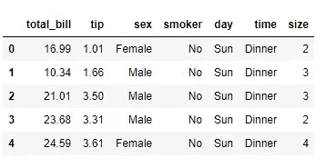
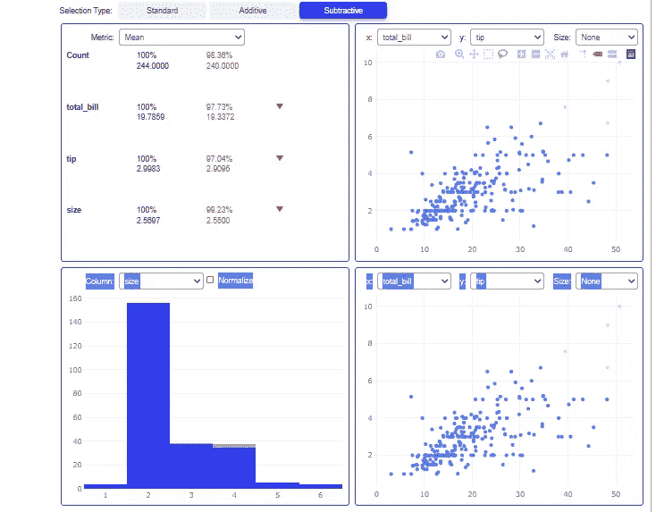
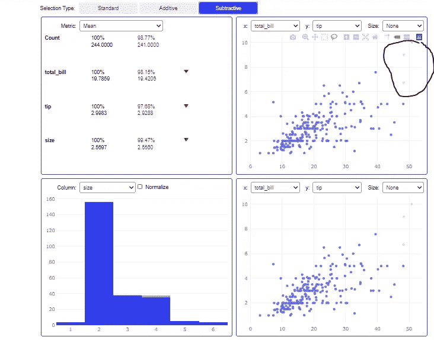

# 几秒钟内完成探索性数据分析

> 原文：<https://pub.towardsai.net/exploratory-data-analysis-in-few-seconds-4bf4e11d2b0e?source=collection_archive---------4----------------------->

## [数据分析](https://towardsai.net/p/category/data-analysis)

## 通过熊猫可视化分析实现 EDA


由 [lynn lynum](https://unsplash.com/@kirbyworks?utm_source=medium&utm_medium=referral) 在 [Unsplash](https://unsplash.com?utm_source=medium&utm_medium=referral) 上拍摄

EDA 是理解数据的一种方式。这一点非常重要，因为它有助于我们借助图形和图表了解异常值、数据中的特征关系。

EDA 是一个耗时的过程，因为我们需要使用 Matplot、seaborn 等库在不同的功能之间进行可视化。

有一种方法可以通过使用库 Pandas 可视化分析的一行代码来自动化这个过程。

# 关于熊猫视觉分析

1.  这是一个用于探索性数据分析的开源 python 库。
2.  它创建了一个交互式用户界面来可视化 Jupyter Notebook 中的数据集。
3.  创建的可视化可以作为图像从界面本身下载。
4.  它有一个选择类型，这将有助于可视化模式有和没有离群值。

# 履行

1.  **安装**

我们将从使用 pip install 安装 pandas visual analysis 开始。

```
!pip install pandas_visual_analysis
```

**2。导入数据集**

我在这里使用的数据集已经存在于 seaborn 库中，使用下面给出的代码可以很容易地加载它。

```
import seaborn as sns
df=sns.load_dataset('tips')
df.head()
```



数据集(来源-按作者)

**3。EDA 使用 Pandas 视觉分析**

在这一步中，我们将导入 pandas 可视化分析，并将其用于我们正在使用的数据集的探索性数据分析。

```
from pandas_visual_analysis import VisualAnalysis
VisualAnalysis(df)
```

这将在几秒钟内创建一个包含数据集所有可视化内容的用户界面。在这里，您可以清楚地看到数据集的不同属性。



可视化(作者来源)

# 理解输出

让我们了解用户界面中的不同部分:

1.  统计分析:这一部分将显示所有数字特征的统计属性，如平均值、中值、众数和分位数。
2.  散点图-借助散点图显示 2 个不同特征之间的分布。您可以从下拉列表中选择要绘制在 X 轴和 Y 轴上的要素。
3.  直方图-它借助直方图显示 2 个不同特征之间的分布。

有 3 种类型的数据选择将显示可视化。通过使用减法选择类型，您可以拖动并选择要分析其可视化效果的数据点，通过使用加法选择类型，您可以再次拖动并添加那些被排除的数据点。

如果您想在几秒钟内看到不同特征之间的可视化如何在有和没有异常值的情况下变化，此功能非常有用。



在这里你可以看到，我已经通过选择减法选择排除了由钢笔标记的离群值，它也改变了所有其他部分的可视化。

**这就是你如何使用熊猫可视化分析进行 EDA。与其他库相比，使用此库的一个主要优势是您可以自定义您的数据点选择。**

# 在你走之前

*感谢阅读！如果你想和我联系，请随时通过 jsc1534@gmail.com 联系我或者我的* [*LinkedIn 个人资料*](http://www.linkedin.com/in/juhi-sharma-ds) *。另外，你可以在我的*[*GitHub*](https://github.com/jsc1535/pandas_visual_analysis)*账号上找到这篇文章的代码和一些真正有用的数据科学项目。*