# 探索性数据分析:小步前进

> 原文：<https://pub.towardsai.net/exploratory-data-analysis-in-python-ebdf643a33f6?source=collection_archive---------0----------------------->

## [数据分析](https://towardsai.net/p/category/data-analysis)


数据科学通常被认为由高级统计和机器学习技术组成。然而，任何数据科学努力的另一个关键组成部分往往被低估或遗忘:探索性数据分析(EDA)。这是一种经典的、未被充分利用的方法，可以帮助您快速建立与新数据的关系。

使用多种探索技术探索每个数据集并比较结果总是更好。这一步旨在理解数据集，识别缺失值和异常值，如果有的话，使用视觉和定量方法来了解它所讲述的故事。它为你的项目提出了下一步的逻辑步骤、问题或研究领域。

## **数据探索和预处理步骤:**

1.  变量和数据类型的标识
2.  分析基本指标
3.  非图形单变量分析
4.  图形单变量分析
5.  双变量分析
6.  变量转换
7.  缺失值处理
8.  异常值处理
9.  相关分析
10.  降维

我将在本文中讨论前 4 个步骤，其余的将在接下来的文章中讨论。

## **数据集:**

为了分享我的理解和技巧，我知道，我将举一个最近 Analytics Vidhya 网站竞赛的数据集为例— [贷款违约挑战](https://datahack.analyticsvidhya.com/contest/ltfs-datascience-finhack-an-online-hackathon/)。让我们尝试使用 EDA 从数据集中获得一些见解。

我使用了原始数据集的一个子集进行分析。这里可以下载[。](https://github.com/Swetha14/LTFS---Loan-Default-Challenge/blob/master/train_sample.zip)

原始数据集可以在[这里](https://github.com/Swetha14/LTFS---Loan-Default-Challenge/blob/master/train.zip)找到。

示例数据集包含 29 列和 233155 行。

## **变量识别:**

探索性数据分析的第一步是识别数据集中变量的类型。变量有两种类型——数值型和分类型。它们可以进一步分类如下:

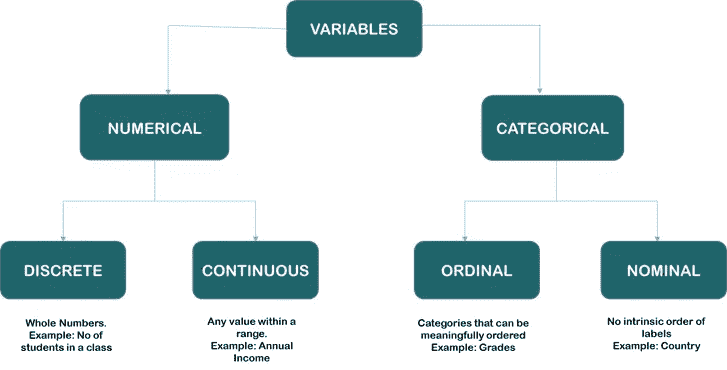

变量分类

一旦确定了变量的类型，下一步就是确定预测变量(输入)和目标变量(输出)。

在上面的数据集中，数值变量是，

```
Unique ID, disbursed_amount, asset_cost, ltv, Current_pincode_ID, PERFORM_CNS.SCORE, PERFORM_CNS.SCORE.DESCRIPTION, PRI.NO.OF.ACCTS, PRI.ACTIVE.ACCTS, PRI.OVERDUE.ACCTS, PRI.CURRENT.BALANCE, PRI.SANCTIONED.AMOUNT, PRI.DISBURSED.AMOUNT, NO.OF_INQUIRIES
```

分类变量是，

```
branch_id, supplier_id, manufacturer_id, Date.of.Birth, Employment.Type, DisbursalDate, State_ID, Employee_code_ID, MobileNo_Avl_Flag, Aadhar_flag, PAN_flag, VoterID_flag, Driving_flag, Passport_flag, loan_default
```

目标值为 ***loan_default、*** ，其余 28 个特征可假设为预测变量。

描述数据集中所有变量的数据字典可以在[这里](https://github.com/Swetha14/LTFS---Loan-Default-Challenge/blob/master/Data%20Dictionary.xlsx)找到。

## **导入库:**

```
#importing libraries 
import pandas as pd 
import numpy as np
import matplotlib as plt 
import seaborn as sns 
```

Pandas library 是用于数据操作的数据分析工具，Numpy 用于科学计算，Matplotlib & Seaborn 用于数据可视化。

## **导入数据集:**

```
train = pd.read_csv("train.csv")
```

让我们使用 read_csv 方法导入数据集，并将其赋给变量‘train’

## **数据类型的识别:**

的。方法来标识数据集中变量的数据类型。

```
train.dtypes
```

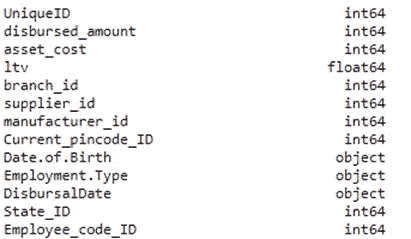

上述代码的输出片段

*出生日期*和*支出日期*都是对象类型。在数据清理期间，我们必须将其转换为日期时间类型。

## **数据集的大小:**

我们可以使用。塑造方法。

```
train.shape
```

## **数值型变量的统计汇总:**

Pandas describe()用于查看一些基本的统计信息，如数据帧或一系列数值的计数、百分位数、平均值、标准差和最大值。因为它给出了每个变量的计数，所以我们可以使用这种方法来识别丢失的值。

```
train.describe()
```

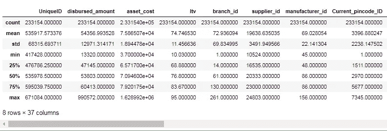

上述代码的输出片段

# **非图形单变量分析:**

## **获取唯一值的计数:**

Pandas 中的 value_counts()方法返回一个序列，其中包含一列中所有唯一值的计数。输出将按降序排列，因此第一个元素是出现频率最高的元素。

让我们对 *loan_default* 列应用值计数。

```
train['loan_default'].value_counts()
```

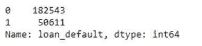

## **获取列表&唯一值的数量:**

Pandas 中的 nunique()函数返回一列中有几个不同观察值的序列。

```
train['branch_id'].nunique()
```

类似地，pandas 的 unique()函数返回数据集中唯一值的列表。

```
train['branch_id'].unique()
```

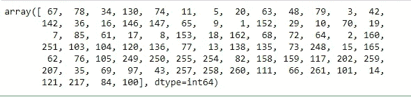

## **基于条件的过滤:**

可以使用不同的条件过滤数据集，这些条件可以使用 python 中的逻辑运算符来实现。比如==(双倍等于)、≤(小于等于)、≥(大于等于)等。

让我们将同样的方法应用到我们的数据集，并过滤掉具有 *Employment 的列。键入*作为“受薪”

```
train[(train['Employment.Type'] == "Salaried")]
```


上述代码的输出片段

现在让我们使用 AND (&)操作符根据两个条件筛选出记录。

```
train[(train['Employment.Type'] == "Salaried") & (train['branch_id'] == 100)]
```

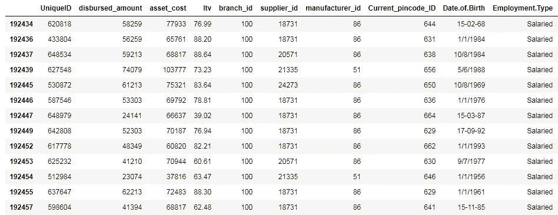

上述代码的输出片段

您也可以使用 OR 运算符(|)来尝试相同的示例。

## **查找空值:**

当我们从 CSV 文件导入数据集时，许多空白列作为空值导入到数据框中，这可能会在以后操作该数据框时产生问题。Pandas isnull()方法用于检查和管理数据框中的空值。

```
train.apply(lambda x: sum(x.isnull()),axis=0)
```

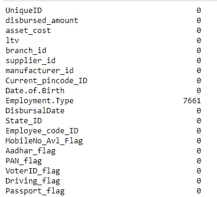

上述代码的输出片段

我们可以看到在就业一栏中有 7661 条缺失的记录。键入'。在数据预处理阶段，这些缺失的记录应该被删除或估算。我将在下一篇文章中详细讨论处理缺失值的不同方法。

**使用 to_datetime()和 astype()方法进行数据类型转换:**

Pandas astype()方法用于改变一列的数据类型。to_datetime()方法用于改变，特别是对 datetime 类型。当数据框从 CSV 文件导入时，列的数据类型会自动设置，但这通常不是它实际应有的数据类型。例如，在上面的数据集中，*出生日期*和*支出日期*都设置为对象类型，但它们应该是日期时间。

to_datetime()的示例:

```
train['Date.of.Birth']= pd.to_datetime(train['Date.of.Birth'])
```

astype()的示例:

```
train['ltv'] **=** train['ltv'].astype('int64')
```

# 图形单变量分析:

## **直方图:**

直方图是用来显示数字数据的最常见的图形之一。直方图我们可以从直方图中学到两个重要的东西:

1.  数据分布-数据是正态分布还是偏斜分布(向左或向右)
2.  识别异常值-不在任何其他数据点附近的极低或极高的值。

让我们为数据集中的*‘ltv’*特征绘制直方图

```
train['ltv'].hist(bins=25)
```

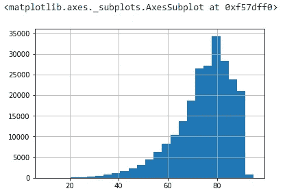

这里，分布向左倾斜。

```
train['asset_cost'].hist(bins=200)
```

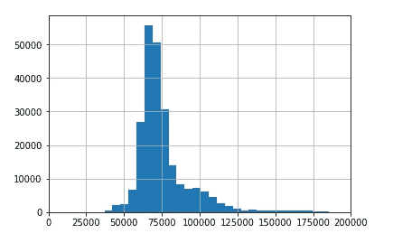

上面这个是正态分布，右端有几个异常值。

## **箱线图:**

箱线图是给定数据集的统计汇总的直观表示。

该摘要包括:

*   最低限度
*   第一四分位数
*   中位数(第二个四分位数)
*   第三个四分位数
*   最高的

它还用于识别数据集中的异常值。

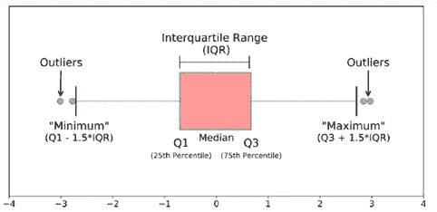

示例:

```
print(train.boxplot(column='disbursed_amount'))
```

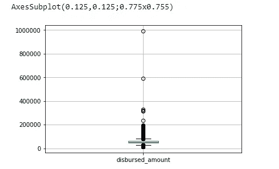

这里我们可以看到平均值在 50000 左右。在 60000 和 1000000 处也有一些异常值，这些异常值应该在预处理阶段进行处理。

```
train.boxplot(column=’disbursed_amount’, by = ‘Employment.Type’)
```

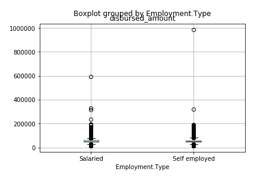

```
sns.boxplot(x=train['asset_cost'])
```

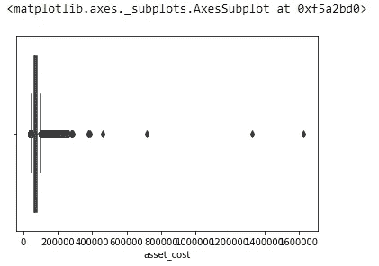

## **计数图:**

计数图可以看作是分类变量而不是数值变量的直方图。它用于查找每个类别的频率。

```
sns.countplot(train.loan_default)
```

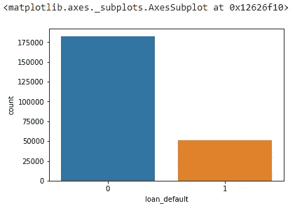

```
sns.countplot(train.manufacturer_id)
```

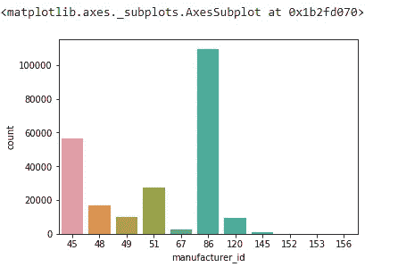

在这里，我们可以看到类别“86”在其他类别中占主导地位。

这些是探索性数据分析的基本的初始步骤。我希望在接下来的几篇文章中介绍其余的步骤。我希望这篇短文对您有所帮助。