# 使用 TensorFlow Extended 探索和验证数据集

> 原文：<https://pub.towardsai.net/explore-and-validate-datasets-with-tensorflow-extended-fc52cc5e582?source=collection_archive---------1----------------------->

## 通过实例介绍 TensorFlow 数据验证

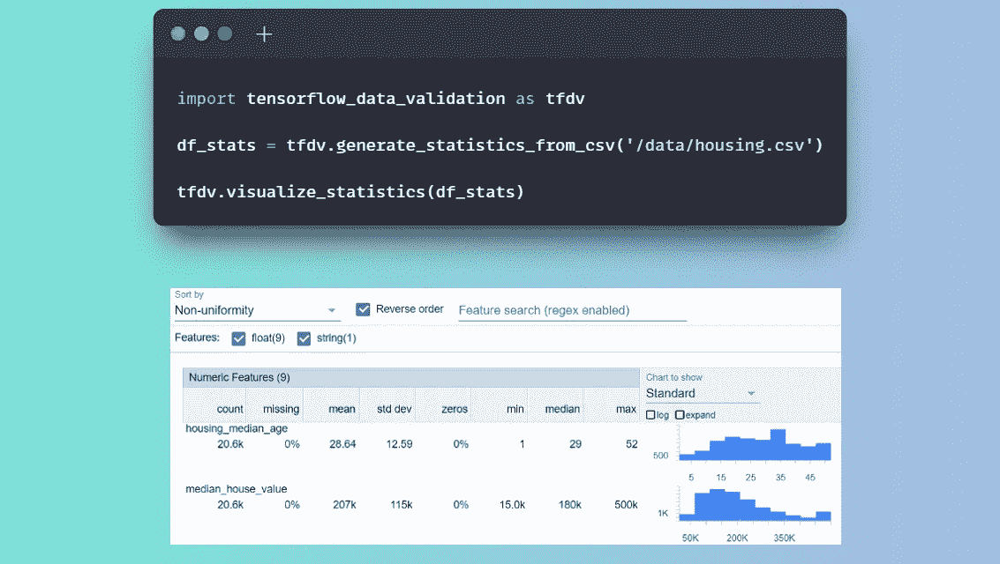

图片由作者提供。

# 目录

1.  [简介](#a270)
2.  [观察描述性统计](#81e3)
3.  [比较不同组的数据](#552c)
4.  [数据验证](#b391)
    4.1 [推断并保存模式](#baed)
    4.2 [使用模式进行数据验证](#675d)
5.  [监控偏斜和漂移](#c161)
    5.1 [连续变量](#bff5)
    5.2 [分类变量](#a05b)
6.  [结论](#ec5f)
7.  [参考文献](#aa9d)

# 1.介绍

数据质量是任何分析工作流程无可争议的基石。

一旦投入生产，机器学习(ML)管道就需要自动分析、验证和跟踪数据变化的机制。

**TensorFlow Extended(TFX)**是 Google 实现的基于 tensor flow 的 ML 平台。它提供了一系列组件来创建和维护完整的 ML 管道。每个组件也可以单独使用。

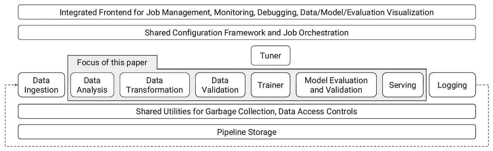

ML 平台的高级组件。来自[1]。

在本文中，我们将使用 **TensorFlow 数据验证(TFDV)** 库。它是 TFX 的一部分，通过以下方式支持 ML 工程师:

*   **实验过程中的数据探索**和描述性统计。
*   **从给定数据集自动推断**模式**的**。
*   **针对生产模式的新数据的数据验证**。
*   **监控**新数据中的**异常值和偏斜**。

我们将使用*加州房价*数据集，可以在 Kaggle 上免费获得(CCO⁴).它包含了从 1990 年人口普查中得出的加州各区房价中值。对于这个例子，我们将提供代码片段，这些代码片段可以很容易地在**谷歌实验室** ⁵.上复制和执行

有可能在`pip install tfx`前安装 TFX。关于依赖性和兼容性的更多信息可以在官方的*⁶.用户指南*中找到

# 2.观察描述性统计

TFDV 允许一个简单的，可视化的数据探索，可以支持早期的实验。

我们可以通过调用`generate_statistics_from_csv` ⁷.从 CSV 文件中生成描述性统计数据该方法返回一个`DatasetFeatureStatisticsList`协议缓冲区，可以用`visualize_statistics` ⁸:直观地浏览

```
import tensorflow_data_validation as tfdvdf_stats = tfdv.generate_statistics_from_csv('/content/housing.csv')
tfdv.visualize_statistics(df_stats)
```

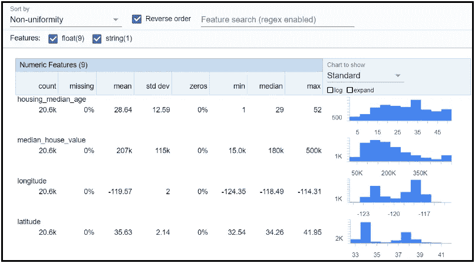

`visualize_statistics. Image by author.`的输出

TFDV 可以从不同的输入源生成统计数据:

*   CSV 文件:`generate_statistics_from_csv` ⁷.
*   熊猫数据帧:`generate_statistics_from_dataframe` ⁹.
*   TFRecord 文件:`generate_statistics_from_tfrecord` ⁰.

`visualize_statistics`函数利用*面*生成变量的动态可视化，包括以下信息:

*   连续特征:计数、缺失、平均值、标准差、零、最小值、中值、最大值。
*   分类特征:计数、缺失、唯一值、上限值、上限值频率、平均字符串长度。

也可以过滤特定变量并展开它们的图表:

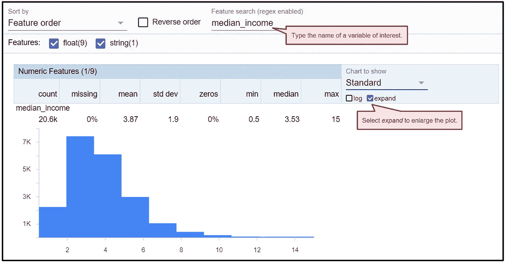

对具体特征的探索。图片由作者提供。

# 3.比较不同的数据集

我们可以一次检查两个数据集的描述性信息，并一起可视化地研究它们。该过程需要生成两个数据集的统计数据，然后将它们传递给`visualize_statistics`:

```
import pandas as pd
import numpy as np
from tensorflow_data_validation.statistics import stats_options as options**# load the data**
housing = pd.read_csv('/content/housing.csv')**# for reproducibility**
np.random.seed(42)**# split randomly in train (50%) and test (50%) batches** test_indices = np.random.rand(len(housing)) < 0.5
train_batch = housing[~test_indices]
test_batch = housing[test_indices]**# generate train batch statistics** train_stats = tfdv.generate_statistics_from_dataframe(
  train_batch,
  stats_options = options.StatsOptions()
  )**# generate test batch statistics** test_stats = tfdv.generate_statistics_from_dataframe(
  test_batch,
  stats_options = options.StatsOptions()
  )**# compare statistics** tfdv.visualize_statistics(
  lhs_statistics = train_stats,
  rhs_statistics = test_stats,
  lhs_name = 'Train Batch',
  rhs_name = 'Test Batch')
```

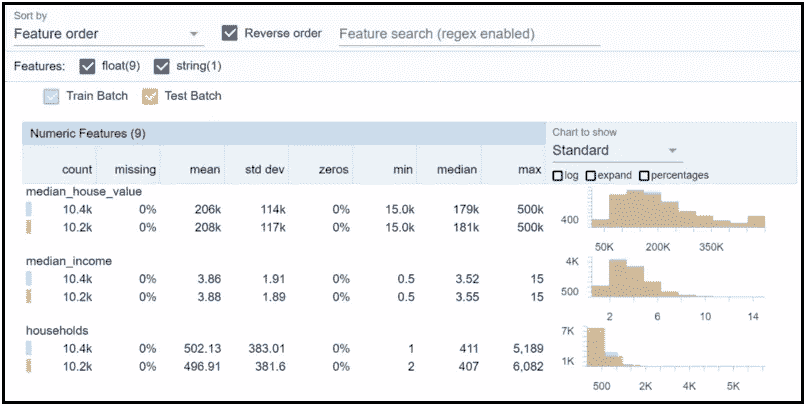

在同一个动态图表上训练和测试批次。图片作者。

我们可以进一步研究特定变量，并快速发现两组变量的差异:

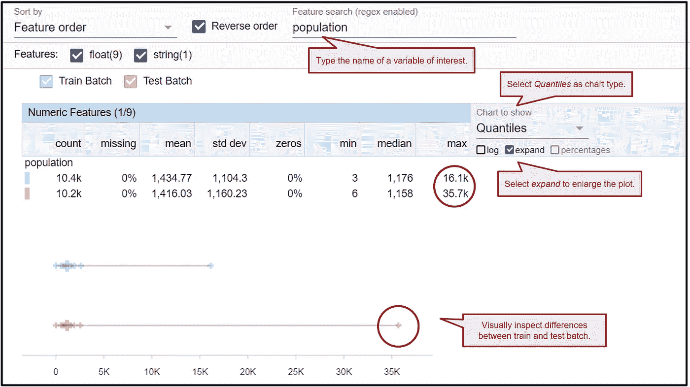

图片由作者提供。

这一组能力使 TFDV 成为早期探索性分析的有用工具。

# 4.数据有效性

TFDV 可以从输入数据集中推断出模式。一旦模式被接受，我们就可以保存它以备将来在生产管道中使用。特别是，我们可以验证新数据并检查是否违反了模式约束。这有利于确保数据质量:

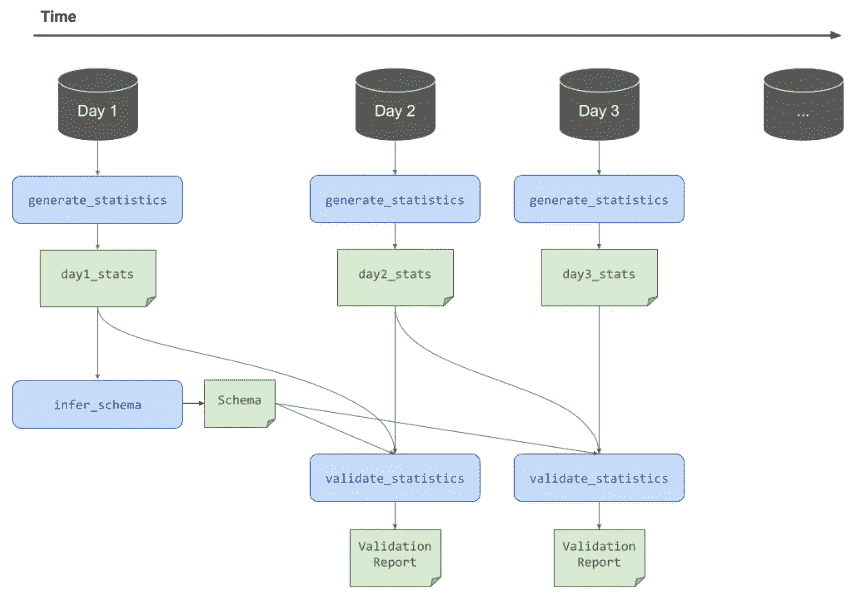

如何使用推断的模式来验证新到达的数据。图片来自 **TensorFlow 博客**。

## 4.1 推断并保存模式

*   使用`infer_schema`推断并检查**训练批次**上的模式:

```
train_schema = tfdv.infer_schema(statistics = train_stats)
tfdv.display_schema(schema = train_schema)
```

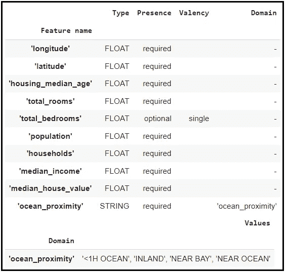

图片作者。

*   将模式保存在本地以备将来使用:

```
tfdv.write_schema_text(train_schema, 'schema.pbtxt')
```

## 4.2 使用模式进行数据验证

*   读取先前生成的模式:

```
uploaded_schema = tfdv.load_schema_text('schema.pbtxt')
```

*   用`validate_statistics` ⁴:根据模式验证**测试批次**

```
eval_anomalies = tfdv.validate_statistics(
  statistics = test_stats,
  schema = uploaded_schema
  )tfdv.display_anomalies(eval_anomalies)
```


图片由作者提供。

验证会突出异常，例如分类特征中出现意外值。

我们也可以在验证期间放松模式约束。例如，对于给定的变量，通过强加一部分必须在模式约束下的观察值:

```
ocean = tfdv.get_feature(uploaded_schema, 'ocean_proximity')
ocean.distribution_constraints.min_domain_mass = 0.9
```

# 5.偏斜和漂移监控器

TFDV 支持识别数据中的**偏斜**和**漂移**。可以在模式中定义漂移或偏斜比较器，并在生产管道中使用它们进行验证。

## 5.1 连续变量

让我们考虑一个数字特征，比如`population`，让我们为这个变量创建一个具有不同分布的新批次:

```
from matplotlib import pyplot as plt
plt.style.use('ggplot')**# create new batch and cause a drift in the population variable** new_batch = housing[test_indices].copy()
**# r(i) = r(i) + mean(ṟ) + noise** new_batch['population'] = \
  new_batch['population'] + \
  new_batch['population'].mean(axis=0) + \
  np.random.normal(0, 100)**# plot the population of training vs. new batch** bins = np.linspace(0, 15000, 1000)
plt.figure(figsize = (12, 7))
plt.hist(
  train_batch['population'], 
  bins, 
  alpha = 0.5, 
  label = 'Train Batch Population'
  )
plt.hist(
  new_batch['population'], 
  bins, 
  alpha = 0.5, 
  label = 'New Batch Population'
  )
plt.legend(loc = 'upper right')
plt.show()
```

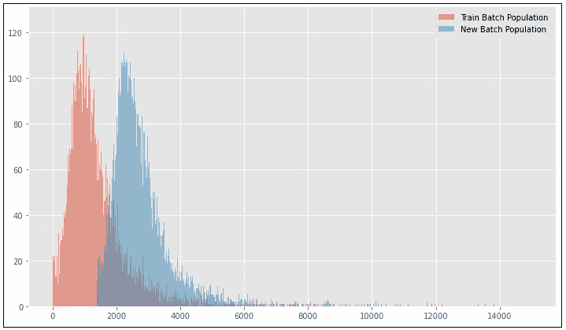

列车批次和新到达数据中总体变量的分布。图片作者。

为了监控新到达数据中的这种异常，我们必须:

*   用`generate_statistics_from_<...>`生成新批次的统计数据。
*   创建一个**比较器**。当我们寻找特征分布的变化时，我们定义了一个`drift_comparator`。
*   在**数字**特征的情况下，我们指定一个`jensen_shannon_divergence` ⁵阈值。
*   使用`validate_statistics`将统计数据与模式进行比较。

```
**# generate new batch statistics**
new_stats = tfdv.generate_statistics_from_dataframe(
  new_batch,
  stats_options = options.StatsOptions()
  )**# Set a threshold for monitoring anomalies in 'population'** pop = tfdv.get_feature(uploaded_schema, 'population')
pop.drift_comparator.jensen_shannon_divergence.threshold = 0.01**# check for anomalies in the new batch**
new_anomalies = tfdv.validate_statistics(
  statistics = new_stats,
  schema = uploaded_schema,
  previous_statistics = train_stats
  )tfdv.display_anomalies(new_anomalies)
```

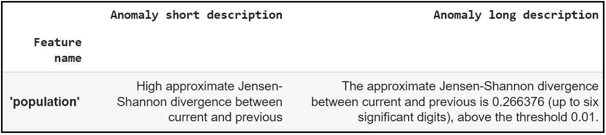

图片由作者提供。

我们获得了详细的描述，可以很容易地支持异常的清晰识别。

## 5.2 分类变量

让我们考虑一个分类变量`ocean_proximity`，表示房子离海洋有多远。让我们添加一个新值`>1 DAY`，并为其分配 30%的观察值:

```
**# create new value '>1 DAY' for 'ocean_proximity**
idx = np.random.rand(len(new_batch)) < 0.3
new_batch.loc[idx, "ocean_proximity"] = '>1 DAY'**# plot the differences** fig, ax = plt.subplots(1, 2)
train_batch['ocean_proximity'] \
  .value_counts(normalize = True) \
  .plot(kind = 'bar', ax = ax[0], color = 'salmon') \
  .set_title('Train Batch')
new_batch['ocean_proximity'] \
  .value_counts(normalize = True) \
  .plot(kind = 'bar', ax = ax[1], color = 'c') \
  .set_title('New Batch')
fig.show()
```

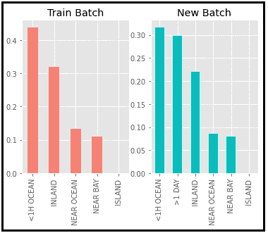

图片由作者提供。

我们可以像监视数值变量一样监视这些变化，但是使用不同的阈值类型:

*   用`generate_statistics_from_<...>`生成新批次的统计数据。
*   创建一个**比较器**:在**分类**特征的情况下，我们指定一个`infinity_norm`(l-无穷范数⁵)阈值。
*   用`validate_statistics`将统计数据与模式进行比较。

```
**# generate new batch statistics** new_stats = tfdv.generate_statistics_from_dataframe(
  new_batch,
  stats_options = options.StatsOptions()
  )**# set a threshold for monitoring anomalies in 'ocean proximity'** prox = tfdv.get_feature(uploaded_schema, 'ocean_proximity')
prox.drift_comparator.infinity_norm.threshold = 0.01**# Check for anomalies in the new batch** new_anomalies = tfdv.validate_statistics(
  statistics = new_stats,
  schema = uploaded_schema,
  previous_statistics = train_stats
  )tfdv.display_anomalies(new_anomalies)
```

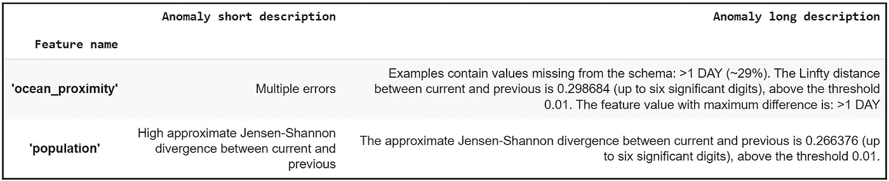

图片由作者提供。

我们被告知对`ocean_proximity`功能检测到多个错误。首先，模式中缺少一个新值(`>1 DAY`)。然后，变量分布发生了变化。

模式不一定是固定的实体。它可以随着时间的推移进行调整，例如，通过添加新值:

```
tfdv.get_domain(uploaded_schema, 'ocean_proximity').value.append(
  '>1 DAY')
```

# 6.结论

生产中的机器学习管道需要验证新到达的数据，并确保数据质量和持续监控。

在这篇文章中，我们探讨了 **TensorFlow 数据验证(TFDV)** 作为一种有效而简单的数据探索、验证和监控工具。

⁷官方文件提供了进一步的信息和样本笔记本。

# 7.参考

[1]贝勒、布雷克、程、菲德尔、福、哈克、海卡尔、伊斯皮尔、贾恩、科科、辜、卢、梅瓦尔德、莫迪、波利佐蒂斯、拉梅什、罗伊、黄、维克、威尔凯维奇、张、津克维奇、([链接](http://doi.acm.org/10.1145/3097983.3098021) [)](http://doi.acm.org/10.1145/3097983.3098021))

[2] E. Breck，N. Polyzotis，S. Roy，S. E. Whang，M. Zinkevich，*机器学习的数据验证*，第二届 SysML 会议论文集，美国加州帕洛阿尔托，2019 ( [链接](https://mlsys.org/Conferences/2019/doc/2019/167.pdf))。

[3][https://www . ka ggle . com/datasets/camnugent/California-housing-prices](https://www.kaggle.com/datasets/camnugent/california-housing-prices)

[https://creativecommons.org/publicdomain/zero/1.0/](https://creativecommons.org/publicdomain/zero/1.0/)

[https://research.google.com/colaboratory/](https://research.google.com/colaboratory/)

[https://www.tensorflow.org/tfx/guide](https://www.tensorflow.org/tfx/guide)

[7][https://www . tensor flow . org/tfx/data _ validation/API _ docs/python/tfdv/generate _ statistics _ from _ CSV](https://www.tensorflow.org/tfx/data_validation/api_docs/python/tfdv/generate_statistics_from_csv)

[8][https://www . tensor flow . org/tfx/data _ validation/API _ docs/python/tfdv/visualize _ statistics](https://www.tensorflow.org/tfx/data_validation/api_docs/python/tfdv/visualize_statistics)

[9][https://www . tensor flow . org/tfx/data _ validation/API _ docs/python/tfdv/generate _ statistics _ from _ data frame](https://www.tensorflow.org/tfx/data_validation/api_docs/python/tfdv/generate_statistics_from_dataframe)

[10][https://www . tensor flow . org/tfx/data _ validation/API _ docs/python/tfdv/generate _ statistics _ from _ TF record](https://www.tensorflow.org/tfx/data_validation/api_docs/python/tfdv/generate_statistics_from_tfrecord)

[https://pair-code.github.io/facets/](https://pair-code.github.io/facets/)

[12][https://blog . tensor flow . org/2018/09/introducing-tensor flow-data-validation . html](https://blog.tensorflow.org/2018/09/introducing-tensorflow-data-validation.html)

[13][https://www . tensor flow . org/tfx/data _ validation/API _ docs/python/tfdv/infer _ schema](https://www.tensorflow.org/tfx/data_validation/api_docs/python/tfdv/infer_schema)

[14][https://www . tensor flow . org/tfx/data _ validation/API _ docs/python/tfdv/validate _ statistics](https://www.tensorflow.org/tfx/data_validation/api_docs/python/tfdv/validate_statistics)

[15][https://en.wikipedia.org/wiki/Jensen-Shannon_divergence](https://en.wikipedia.org/wiki/Jensen%E2%80%93Shannon_divergence)

[https://en.wikipedia.org/wiki/Chebyshev_distance](https://en.wikipedia.org/wiki/Chebyshev_distance)

[https://www.tensorflow.org/tfx/data_validation/get_started](https://www.tensorflow.org/tfx/data_validation/get_started)