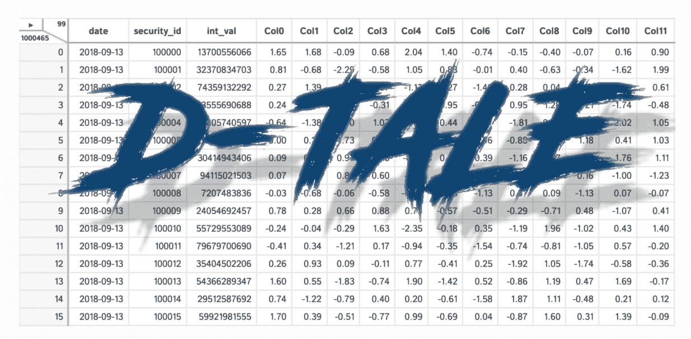
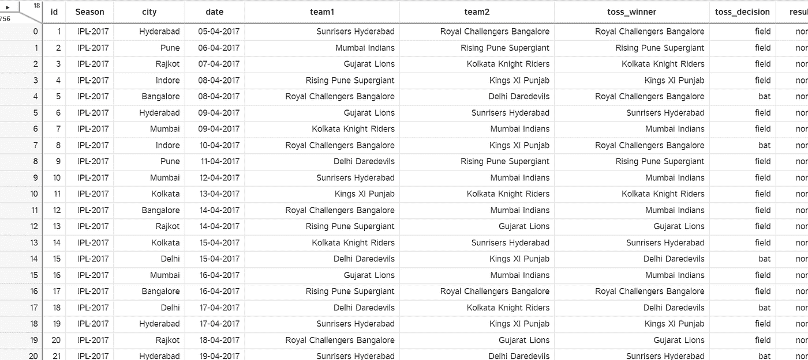
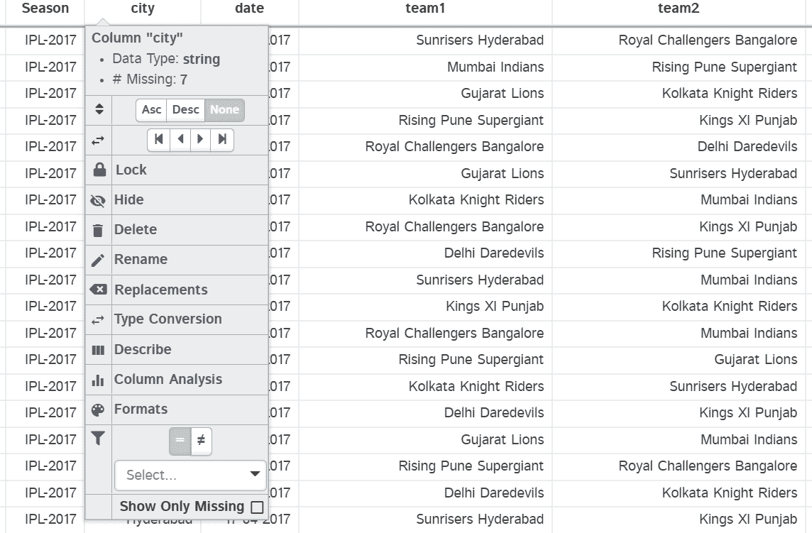
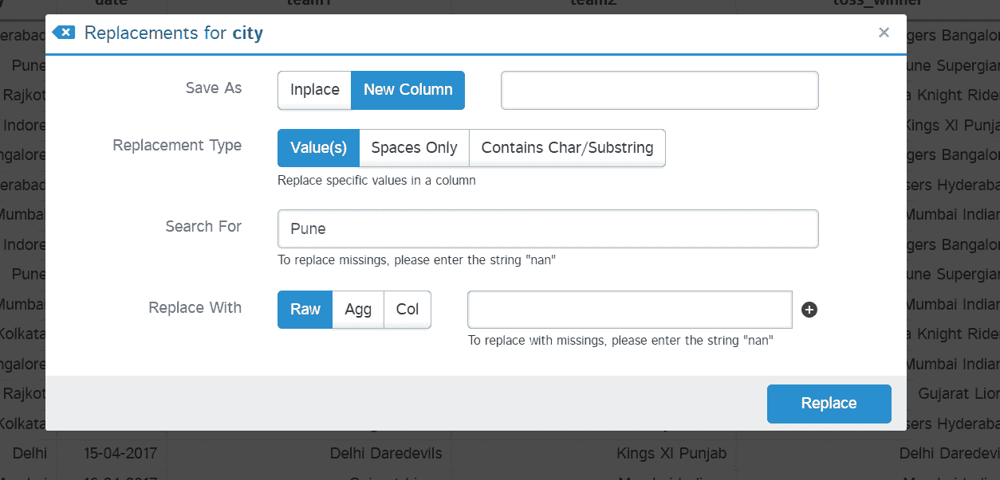
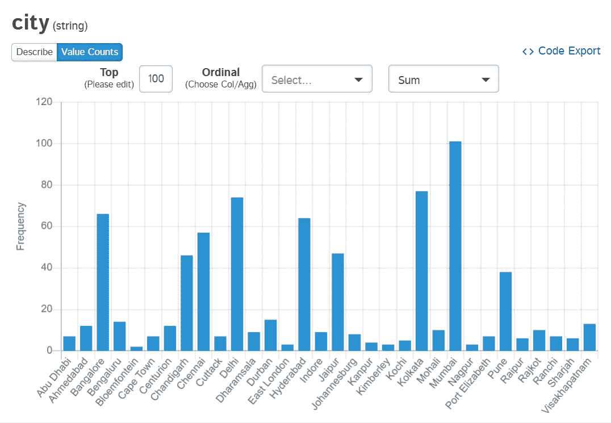
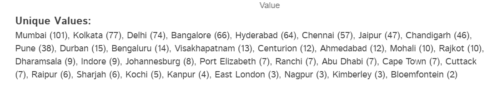
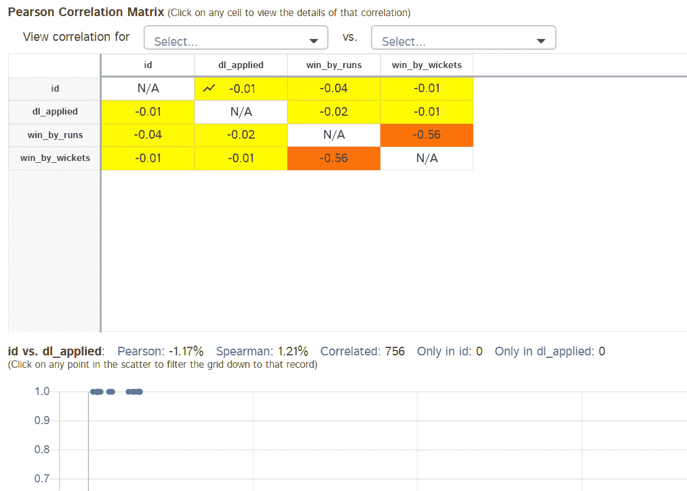
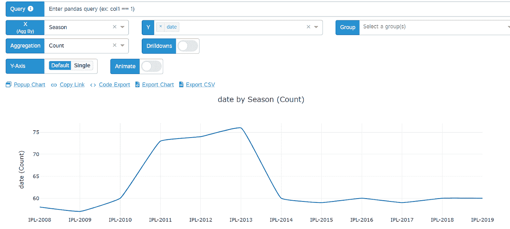

# 探索用于数据探索的 D 表

> 原文：<https://pub.towardsai.net/exploring-d-tale-for-data-exploration-7c5a2e47ef8d?source=collection_archive---------1----------------------->

## [数据分析](https://towardsai.net/p/category/data-analysis)

## 探索性数据分析的 D 表介绍

参考:【https://pypi.org/project/dtale/ 

> 目标是将数据转化为信息，将信息转化为洞察力——卡莉·菲奥莉娜

要解决任何数据科学问题，理解原始数据是必要的&以某种方式将原始数据转换成信息以供进一步工作。探索性数据分析(EDA)是在数据收集过程之后对数据进行探索的步骤。如果你是一个初学者，那么首先要熟悉 EDA 术语，因为在本文中我将介绍一个库，即 **D-Tale** (可以用来使你的工作更快)，它只使用一行代码来执行 EDA，但要理解它的功能&输出，需要有 EDA 知识。要了解 EDA 的概况，可以看我之前的[文章](https://medium.com/analytics-vidhya/overview-of-exploratory-data-analysis-with-haberman-dataset-6b7e2cf73a58)。

本文分为以下几个部分:

1.  D-Tale 简介
2.  实施 D-Tale
3.  探索童话

# **D-Tale 简介**

D-Tale 是 Flask 后端和 React 前端的结合，为您提供了一种查看和分析 Pandas 数据结构的简单方法。它与 ipython 笔记本和 python/ipython 终端无缝集成。因此， *D-Tale 是一个开源解决方案，您可以通过它来可视化、分析和学习如何对 Pandas 数据结构进行编码。*目前，该库支持 DataFrame、Series、MultiIndex、DatetimeIndex & RangeIndex 等 Pandas 对象。

# **D 表的实施**

下载数字童话:

做一些基本的事情:

使用 D-Tale:

# **探索 D-Tale**

让我们在 DataFrame 中做一些惊人的事情。

输出如下所示:

参考:作者

现在，当我们单击任一列时，可以有很多选项，如下所示:

参考:作者

如果我点击替换，我可以替换值或描述关于列值的一切；

参考:作者

参考:作者

您还可以从右上方的导出代码选项中获取 python 代码来实现特定的输出；

还可以看到独特的价值观；

参考:作者

您还可以看到离群值并删除它们；

参考:作者

也有助于了解列之间的相关性；

参考:作者

此外，它可以用来获得任何类型的图形；

参考:作者

只要探索这个图书馆。它真的有很多让 EDA 变得更容易的属性。

你可以从 [Github](https://github.com/rajviishah/D-Tale) 找到源代码。

如果您有任何疑问，请通过 [LinkedIn](http://nkedin.com/in/rajviishah/) 联系我。

参考资料:

*   https://pypi.org/project/dtale/
*   [https://towards data science . com/introduction-to-d-tale-5 eddd 81 abe3f](https://towardsdatascience.com/introduction-to-d-tale-5eddd81abe3f)
*   [https://www.youtube.com/watch?v=xSXGcuiEzUc&feature = youtu . be](https://www.youtube.com/watch?v=xSXGcuiEzUc&feature=youtu.be)