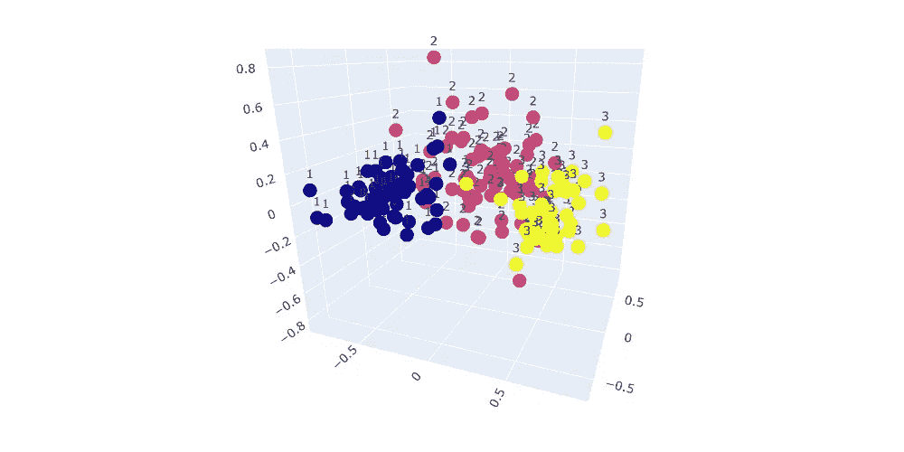

# 利用数据可视化探索数据集:利用主成分分析进行葡萄酒分类

> 原文：<https://pub.towardsai.net/exploring-dataset-with-data-visualization-wine-classification-using-pca-d133427183fb?source=collection_archive---------2----------------------->

## [数据可视化](https://towardsai.net/p/category/data-visualization)

## 光看数据能看出我的数据有多好，我的模型能有多好吗？完整的代码可在我的回购[。](https://github.com/arditoibryan/Projects/tree/master/20200528_Wine_Classifier)

创建葡萄酒分类器是初学者在他们的第一个机器学习项目中提出的最简单的实验之一。在本教程中，我已经详细介绍了如何构建一个模型，如果您对该模型感兴趣，请随意研究它并使用我提供的代码进行实验。


照片由[凯西·李](https://unsplash.com/@kathyli0928?utm_source=medium&utm_medium=referral)在 [Unsplash](https://unsplash.com?utm_source=medium&utm_medium=referral) 上拍摄

然而，本文将关注数据可视化。具体来说，我如何估计我可以从数据中使用 ML 建立一个模型有多好，如果必要的话，如果更灵活的推理功能可能需要深度学习。



葡萄酒等级的 3D 表示

上面，你可以看到最终的结果:让我来指导你如何用代码获得它。

# 创建模型

在文章的第一部分，我将创建一个分类模型。因为它将被证明是非常准确的，所以我将解释如何从一开始就理解和可视化数据，甚至在构建模型之前，就已经可以很好地估计模型的性能。

## 导入数据集

```
import pandas as pd#importing dataset
X = pd.read_csv('/content/drive/My Drive/Colab Notebooks/Projects/20200528_Wine_Classifier/wine_data.csv')
X
```

## 分离特征和标签

```
y = X.pop('Wine')
yk = list(y).copy()
k
```

## 分割数据集

```
import numpy as np
from sklearn.model_selection import train_test_splitX_train, X_test, y_train, y_test = train_test_split(X, y, test_size=0.33, random_state=42)
print(X_train.shape, X_test.shape, y_train.shape, y_test.shape)
```

## 训练模型

该模型不需要任何调整，因为我可以使用一个简单的朴素贝叶斯分类器来执行分类。

```
#GaussianNB
from sklearn.naive_bayes import GaussianNBclf = GaussianNB()
clf = clf.fit(X_train, y_train)y_predict = clf.predict(X_test)from sklearn.metrics import accuracy_score
print(accuracy_score(y_test, y_predict))
```

但是，我仍将使用另一种分类模型来查看结果如何变化:

```
#RandomForestClassifier
from sklearn.ensemble import RandomForestClassifier
clf = RandomForestClassifier(n_estimators=10)
clf = clf.fit(X_train, y_train)
y_predict = clf.predict(X_test)
from sklearn.metrics import accuracy_score
print(accuracy_score(y_test, y_predict))#cross validation
from sklearn.model_selection import cross_val_scorescores = cross_val_score(clf, X, y, cv=5)
scores
```

## 主成分分析:可视化数据

现在，我有几种方法可以将数据可视化。我最喜欢的工作之一是研究问题的多维性。通过首先缩放特征，然后降低维度，我可以在压缩的 3D 空间中绘制所有特征。

```
from sklearn.preprocessing import MinMaxScalerscaler = MinMaxScaler()
scaler.fit(X)X_ = pd.DataFrame(scaler.transform(X))
X_.columns = X.columns
X_df = X_from sklearn.decomposition import PCA
import matplotlib.pyplot as pltpca = PCA(n_components=3)
pca_result = pca.fit_transform(df)
pca_result
```

我现在将使用 Plotly 在 3D 空间中绘制结果。通过选择颜色参数，我将能够在图形中可视化不同的类别。

```
yimport plotly.express as px
fig = plt.figure(figsize=(14, 8))x = list(pca_result[:,0])
y = list(pca_result[:,1])
z = list(pca_result[:,2])fig = px.scatter_3d(df, x=x, y=y, z=z, text=k, color=k)
fig.show()
```

## 结论

结果非常有趣:如您所见，数据集中的所有样本在一部分空间中很容易区分。通过使用分类模型，甚至可以说是线性模型，我们能够获得非常高的性能。


葡萄酒等级的 3D 表示