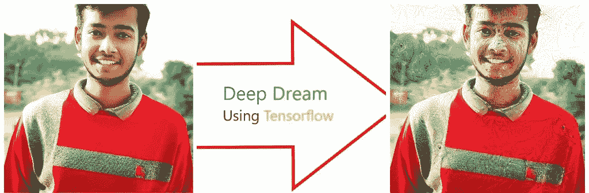
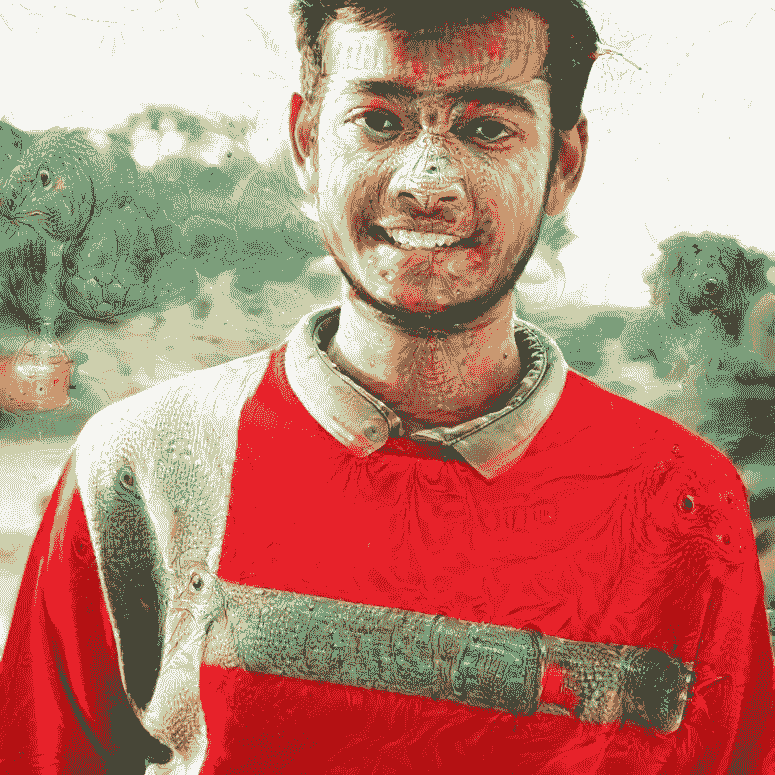
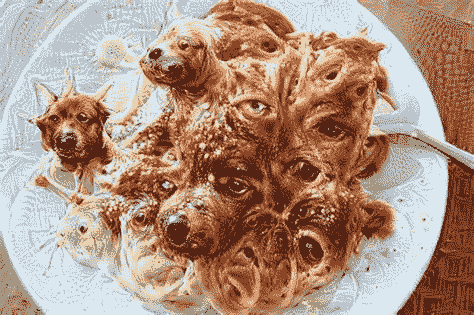
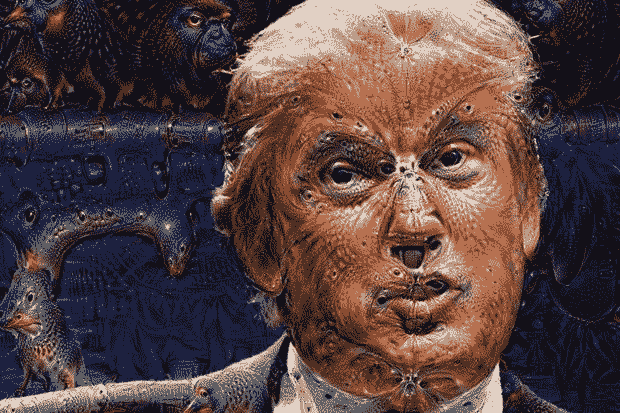
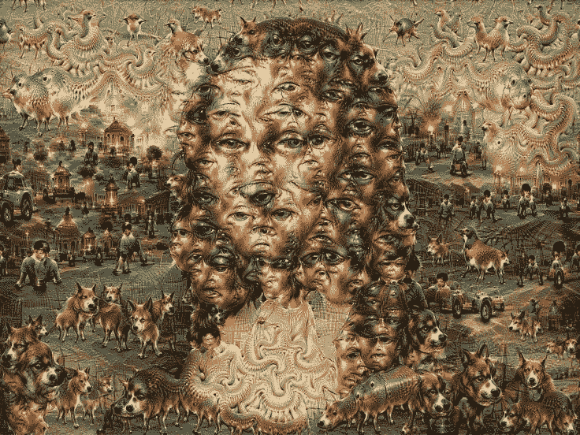
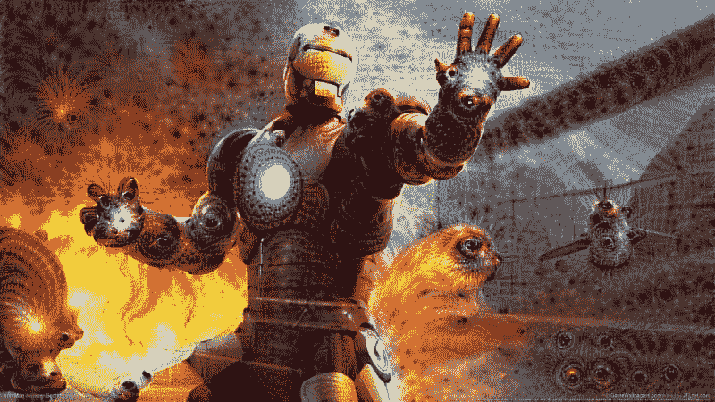

# 使用 Tensorflow 2.0 探索深层梦境

> 原文：<https://pub.towardsai.net/exploring-deep-dream-using-tensorflow-2-0-93ecd1091fa3?source=collection_archive---------0----------------------->

## 使用 Tensorflow | [向 AI](https://towardsai.net) 潜入深梦

使用张量流的深度梦

我深深的梦所产生的形象。

每当任何人听到深度学习或神经网络时，他们首先想到的是它用于物体检测、人脸识别、自然语言处理和语音识别。
但是神经网络也能够生成图像。其中一种最先进的方法叫做深度梦境。

# 这是什么？

Deep Dream 是谷歌工程师 Alex Mordvintsev 创建的一个计算机视觉程序，它使用卷积神经网络通过算法 pareidolia 来寻找和增强图像中的模式，从而在故意过度处理的图像中创建一个梦一样的幻觉外观。

## 一些使用深梦生成的图像

# 它是如何工作的？

简单地说，许多层次的神经网络处理输入到程序中的图像。人工神经元被计算，它们总和的权重通过大致三层的网络进行处理:低层、中层和高层。较低的级别负责更基本的边、角和纹理。通过最大化这些层次，这幅画最终会看起来更像梵高的作品。更高的层次负责更详细、更层次化的输入，比如建筑物和其他精致的物体。当更高的级别被最大化时，图片看起来更像一个乱糟糟的达利。

# 让我们创造我们第一个简单的梦。

在本教程中，我们将使用 Tensorflow 2.0，并在 Google Colab 上运行它。
在接下来的 6 个步骤中，我们将建立第一个深度梦境模型。
那么让我们开始吧。

## 1.导入所有依赖项

在这里，我们将使用印度女演员迪皮卡·帕度柯妮的形象，然后预处理它。

输出:-

## 2.准备特征提取模型

下载并准备一个预先训练好的图像分类模型。您将使用 InceptionV3，它类似于 DeepDream 中最初使用的模型。
InceptionV3 架构相当庞大(关于模型架构的图表，请参见 TensorFlow 的研究报告)。对于 DeepDream，感兴趣的层是那些卷积连接在一起的层。在 InceptionV3 中有 11 个这样的层，命名为‘mixed 0’到‘mixed 10’。使用不同的图层会产生不同的梦幻般的图像。较深的层响应较高级别的特征(例如眼睛和脸)，而较早的层响应较简单的特征(例如边缘、形状和纹理)。随意试验下面选择的层，但是请记住，更深的层(那些具有更高指数的层)将需要更长的时间来训练，因为梯度计算更深。

## 3.计算损失

损失是所选层中激活的总和。损耗在每一层都是归一化的，因此较大层的贡献不会超过较小层。

## 4.梯度上升

一旦你计算了所选层的损失，剩下的就是计算图像的梯度，并将它们添加到原始图像中。向图像添加梯度增强了网络看到的图案。在每一步，你都会创造出一个图像，这个图像会越来越多地激发网络中某些层的活动。

输出:-

## 5.把它提高一个八度

很好，但是第一次尝试有一些问题:
(a)输出有噪声(这可以通过 tf.image.total_variation loss 解决)。
(b)图像分辨率低。
(c)这些模式看起来好像都是以相同的粒度发生的。
为了克服这些问题，我们可以执行前面的梯度上升方法，然后增加图像的大小(称为八度音阶)，并对多个八度音阶重复这个过程。

输出:-

万岁，我们刚刚使用深度梦境生成了一个图像。
如果您不喜欢手动编写深度梦境算法，而是想用深度梦境创建图像，以下是解决方案。
可以使用 DeepDreamGenerator。

链接:-

 [## 深度梦境发生器

### 这项技术是原始深度梦境方法的更高级版本。它能够使用自己的…

deepdreamgenerator.com](https://deepdreamgenerator.com/) 

注意:-在上面的例子中，一些代码行没有显示，因为在 Medium 中只显示了 GitHub gist 的前 11 行。所以强烈建议你下载 colab 笔记本(。ipnyb 文件)。

我的深梦回购链接:-

 [## abhinavsp 0730/深 _ 梦

### 我的媒体博客的深梦模式。通过在…上创建帐户，为 abhinavsp0730/Deep_Dream 开发做贡献

github.com](https://github.com/abhinavsp0730/Deep_Dream) 

## 参考资料:Tensorflow 官方文档

你知道吗，你可以按 50 次拍手键？如果你喜欢这个博客，鼓掌来表达你的爱。

谢谢你。