# 使用熊猫和海牛探索描述性统计

> 原文：<https://pub.towardsai.net/exploring-descriptive-statistics-using-pandas-and-seaborn-1b8501e1f27f?source=collection_archive---------1----------------------->

## [编程](https://towardsai.net/p/category/programming)，[统计](https://towardsai.net/p/category/statistics)

## 定量方法和直观方法


照片由 [Lukas](https://www.pexels.com/@goumbik?utm_content=attributionCopyText&utm_medium=referral&utm_source=pexels) 从 [Pexels](https://www.pexels.com/photo/chart-graph-hand-paper-590014/?utm_content=attributionCopyText&utm_medium=referral&utm_source=pexels) 拍摄

# **Python 中的描述性统计**

描述性统计包括那些总结数据集分布的集中趋势、分散性和形状的统计。

1.  集中趋势的度量
2.  扩散/分散的度量
3.  对称度[将在以后的文章中讨论]

# 资料组

导入统计图所需的所有库，并从`bmi.csv` 文件中给出的数据集创建一个数据框。

该数据集包含身高、体重、年龄、身体质量指数和性别列。让我们计算这个数据集的描述性统计数据。

这个项目中使用的代码可以从 GitHub 上的 [Jupyter 笔记本中获得。](https://github.com/IndhumathyChelliah/statistics_python/tree/master/descriptive_statistics)

```
**import** numpy **as** np
**import** pandas **as** pd
**import** matplotlib.pyplot **as** plt
% matplotlib inlinedf=pd.read_csv(**"bmi.csv"**)
df
```

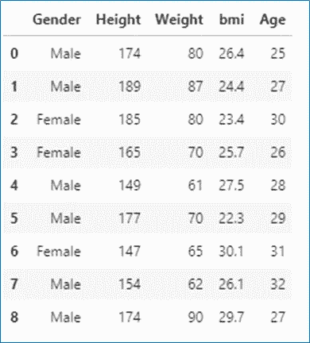

数据帧

# 集中趋势的度量

集中趋势的度量用于描述数据的中间/中心值。
`Mean, Median, Mode`是集中趋势的量度。

## **1。平均值**

*   Mean 是数据集的`average value`。
*   平均值的计算方法是将数据集中的所有值相加，然后除以数据集中值的个数。
*   我们只能计算数值变量的平均值

**公式计算的意思是**

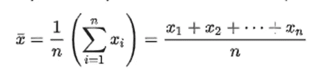

来源:[维基](https://en.wikipedia.org/wiki/Mean)

*   **计算数据集中“年龄”列的平均值。**


年龄

*   **数学计算**


平均值计算[图片由作者提供]

*   **使用 Python 计算特定变量(“年龄”)的平均值。**

```
df[**"Age"**].mean()
```

**输出:**

*   **计算数据帧中所有列的平均值。**

```
df.mean()
```

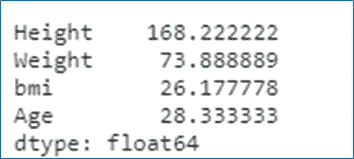

所有列的平均值

仅数值数据类型的计算平均值。数据集中的“性别”列被排除。

## **2。中位数**

*   中位数是数据集中的 `middle number` 。
*   当我们有异常值时，中位数是最好的衡量标准。

**找出数据集中“年龄”列的中间值。**

**数学计算**

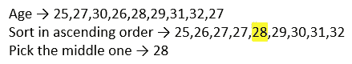

求中间值

如果我们有偶数个数据，求中间两项的平均值。

**举例:**
年龄→ 4，12，24，8，16，20
排序→ 4，8， **12，16** ，20，24
挑中间的→ 12，16
求平均值→ 28/2 =14

**使用 Python 计算特定变量(“年龄”)的中值。**

```
df[**"Age"**].median()
```

**输出:** 28

**计算数据帧中所有列的中值。**

```
df.median()
```

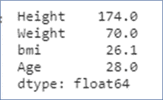

所有列的中值

仅为数值数据类型计算中值。数据集中的“性别”列被排除。

## **3。模式**

模式用于查找数据集中的公共数字。

**使用数学计算的特定变量(“年龄”)的计算模式**

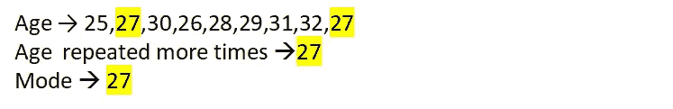

**使用 Python 计算特定变量(“年龄”)的模式。**

```
df[**"Age"**].mode()
```

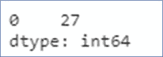

方式

## **计算数据帧中所有列的模式。**

```
df.mode()
```

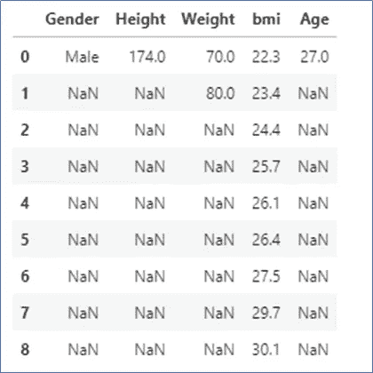

方式

这里，在`bmi`列中，所有的数字都是唯一的。所以，所有的数字都会显示出来。
`Weight` 栏，70.0 和 80.0 重复的次数比较多，所以都显示。

# 传播的量度

*   扩散/分散的度量用于描述数据是如何扩散的。它还描述了数据集的**可变性**。
*   **标准差、方差、极差、IQR、**用于描述价差/离差的度量
*   扩散的度量可以显示在类似**箱线图**的图表中。

## 1.差异

方差用于描述数据集中的每个数字离平均值有多远。

**计算人口方差的公式**

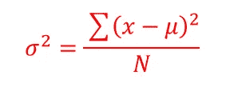

人口差异[图片由作者提供]

σ2 —总体方差
μ—总体均值
N—数据集中的数据总数。

**计算数据集中“年龄”列的方差**

```
df[**"Age"**].var()
```

**输出:** 5.5

**计算数据帧中所有列的方差**

```
df.var()
```

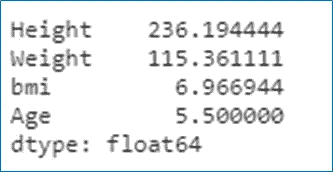

差异

仅对数值数据类型计算方差。不包括“性别”一栏。

## 2.标准偏差

*   标准差是数据偏离平均值的程度。
*   标准差是方差的平方根。
*   标准差越大，价差越大。

**计算数据集中** `**“Age”**` **列的标准差**

```
df[**"Age"**].std()
```

**输出**:2。36860 . 68686868661

**计算数据集中所有列的标准偏差。**

```
df.std()
```

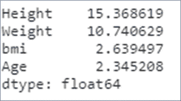

标准偏差

## **3。范围**

*   该范围是最大值和最小值之间的差值
*   范围越大，离差越大。

**计算数据集中“年龄”列的范围**

```
m1=df[**"Age"**].max()
m1
*#Output:32* m2=df[**"Age"**].min()
m2
*#Output:25* range=m1-m2
range
*#Output: 7*
```

## 4.四分位数间距(IQR)

*   四分位数通过分成四个部分来描述数据的分布。中位数正好将数据分为两部分。
*   **Q1(下四分位数)**是排序数据集前半部分的中间值。
*   **Q2** -是中间值
*   **Q3(上四分位数)**是排序数据集后半部分的中间值
*   四分位范围是第 75 百分位(Q3)和第 25 百分位(Q1)之间的差值。
*   50%的数据属于这个范围。

**计算数据集中** `**“Age”**` **列的 IQR。**

```
Q1=df[**"Age"**].quantile(0.25)
Q1
*#Output : 27.0* Q3=df[**"Age"**].quantile(0.75)
Q3
*#Output: 30.0* IQR=Q3-Q1
IQR
*#Output: 3.0*
```

## 描述()

describe()函数生成描述性统计数据。它用于查看一些基本的统计信息，如平均值、中值、最小值、最大值、百分位数、数据帧的计数或一系列数值。

1.  **系列**

```
df[**"Age"**].describe()
```

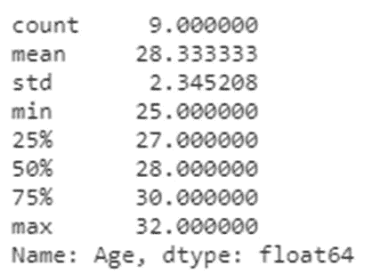

描述()

**2。数据帧**

```
df.describe()
```

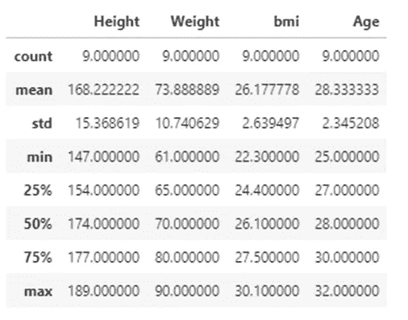

描述()

25%→Q1-下四分位数
50% →中位数
75%→Q3-上四分位数

3. `include=”all”`
输入的所有列都将包括在输出中。

```
df.describe(include=**"all"**)
```


df.describe(include="all ")

## 五点总结

五点总结包括五个价值

1.  最小值
2.  Q1-下四分位数
3.  中位数
4.  Q3-上四分位数
5.  最大值

# 统计图表

统计图用于识别异常值、可视化分布、发现关系以及数据集中变量之间的相关性。

## 箱线图

箱线图用于描述数据在数据集中的分布情况。该图代表`five-point summary`(最小值、最大值、中间值、下四分位数和上四分位数)。该图用于识别**异常值**。

*   胡须—表示数据的分布
*   方框—代表 IQR—50%的数据位于此范围内

```
df.boxplot(column=**"Age"**)
```

**输出:**

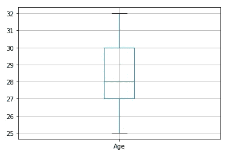

箱形图

**解释箱线图**

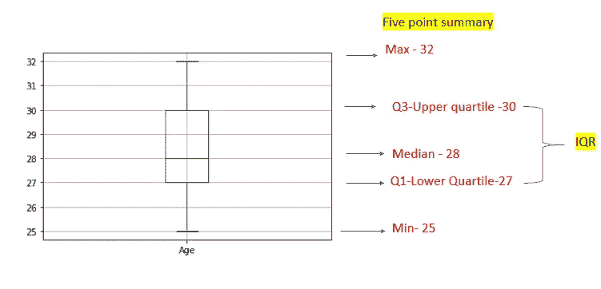

箱线图的细节

在“年龄”类别中，没有异常值。

## 按性别类别分组的箱线图

```
df.boxplot(column=**"Age"**,by=**"Gender"**)
```

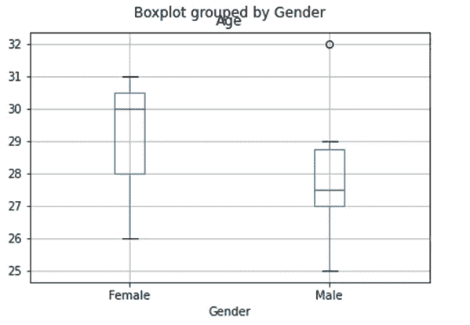

按性别分组的箱线图

这里我们有一个“男性”类别的异常值。

让我们为`**“Male”**`类目下的 `“Age”`算一个五分总结

## 单独计算男性“年龄”的平均值。

```
df1=df.set_index(**"Gender"**)
df2=df1.loc[**"Male"**,**"Age"**]
df2.mean()
#Output: 28.0
```

## 计算 Q1、第三季度和 IQR

```
q1=df2.quantile(0.25)
print (**"Q1 :"**,q1)
q3=df2.quantile(0.75)
print (**"Q3 :"**,q3)
IQR=q3-q1
print (**"IQR :"**,IQR
```

**输出:**

```
Q1 : 27.0
Q3 : 28.75
IQR : 1.75
```

**计算上须的长度**

上**须**的长度是不大于 `third quartile(Q3)`加上 1.5 倍 `interquartile **range(IQR)**`的最大值

```
whisker=(IQR*1.5)+Q3
print(**"Length of Upper Whisker :"**,whisker)
*#Output:Length of Upper Whisker : 31.375*
```

上须长度不得大于 31.375
男性年龄→ 25，27，28，29， **32** ，27

**32** 落在**上须范围**上方。因此，它是一个 `**outlier.**`T12，所以上须的长度被作为 **29** (第二个最大值)落在上须范围内。

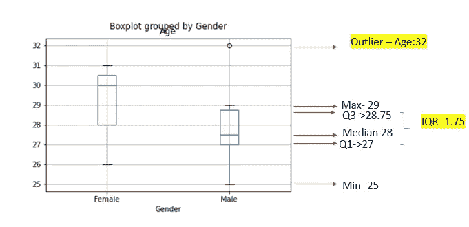

箱线图解释

## 使用 seaborn 的箱线图

```
sns.boxplot(x=**"Age"**,data=df)
```

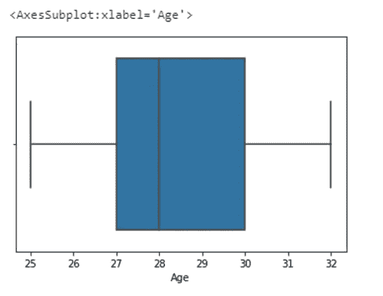

使用 seaborn 的箱线图

## 按性别类别分组的箱线图

```
sns.boxplot(x=**"Age"**,y=**"Gender"**,data=df)
```

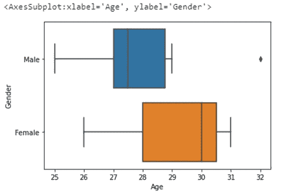

按性别分组的箱线图

# **可视化数据分布**

# 绘制单变量分布

**直方图**

*   该图将显示单变量(单变量)的**分布。**
*   直方图是一个条形图，其中代表数据变量的轴被分成一组离散的条柱，每个条柱内的观察值计数使用相应条柱的高度显示。
*   直方图→绘制**变量**与每个箱中的**计数/频率**的关系。

## **绘制直方图的不同方式**

1.  **利用熊猫**

**数据帧中所有列的直方图**

```
df.hist()
```

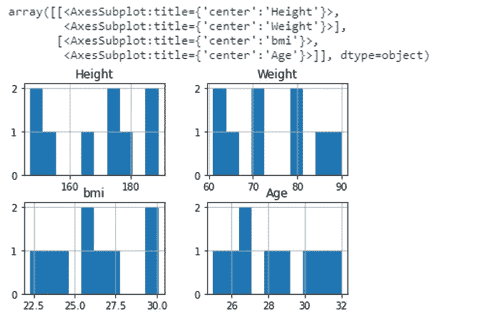

柱状图

## 特定列“年龄”的直方图

```
df[**"Age"**].hist()
```

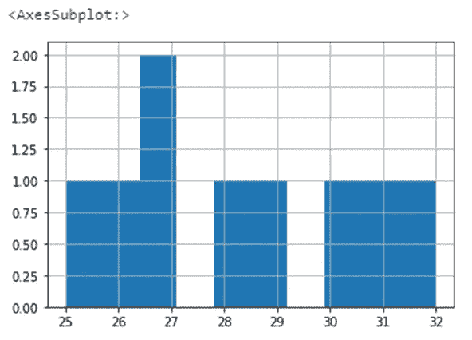

柱状图

在上图中，只有年龄 **27** 出现两次，所以年龄 **27** 的计数显示为 **2** 。其余所有年龄只出现一次。因此所有其他年龄计数都显示为 1。

# 选择箱子尺寸

```
df[**"Age"**].hist(bins=20)
```

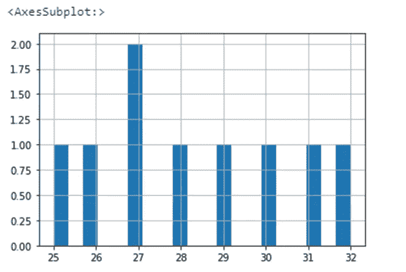

柱状图

## 2.使用 matplotlib

```
plt.hist(df[**"Age"**])
```

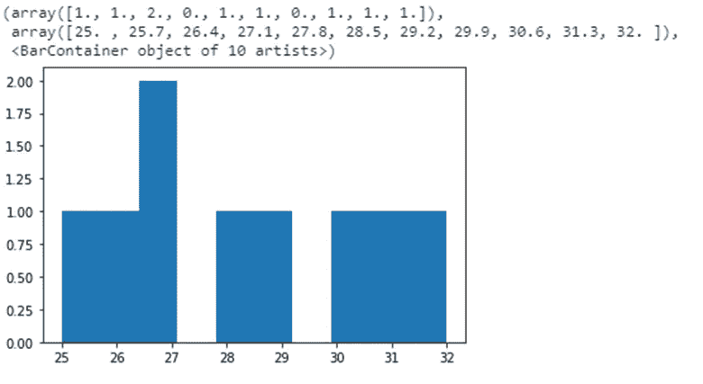

柱状图

# 绘制多元分布图

**成对图或散点图**

Pairplot 用于描述数据集中的成对关系。Pairplot 用于可视化数据集中所有变量的单变量分布及其所有成对关系。
对角线图是直方图，所有其他图是散点图。

```
sns.pairplot(df)
```

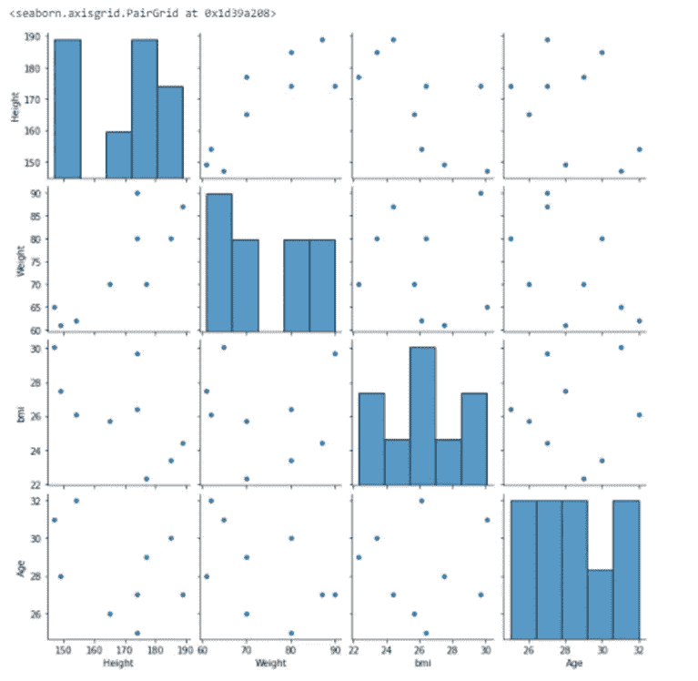

配对图

# 资源

[seaborn——分布](https://seaborn.pydata.org/tutorial/distributions.html)
[熊猫。](https://pandas.pydata.org/pandas-docs/stable/reference/api/pandas.Series.hist.html#pandas.Series.hist)
[熊猫。data frame . hist](https://pandas.pydata.org/pandas-docs/stable/reference/api/pandas.DataFrame.hist.html)
[matplotlib-hist](https://matplotlib.org/3.3.1/api/_as_gen/matplotlib.pyplot.hist.html)
[describe()](https://pandas.pydata.org/pandas-docs/stable/reference/api/pandas.DataFrame.describe.html)

# 我的另一个关于统计的博客

[](https://towardsdatascience.com/central-limit-theorem-clearly-explained-4fe60def52d6) [## 中心极限定理——解释清楚

### 抽样分布，标准误差

towardsdatascience.com](https://towardsdatascience.com/central-limit-theorem-clearly-explained-4fe60def52d6) [](/inferential-statistics-for-data-science-91cf4e0692b1) [## 数据科学的推断统计学

### 概率基础，概率分布

pub.towardsai.net](/inferential-statistics-for-data-science-91cf4e0692b1) [](https://medium.com/analytics-vidhya/important-terms-in-statistics-machine-learning-4bfa5962e9be) [## 统计学中的重要术语-机器学习

### 统计和概率概念

medium.com](https://medium.com/analytics-vidhya/important-terms-in-statistics-machine-learning-4bfa5962e9be) [](/hypothesis-testing-test-of-mean-variance-proportion-77ec2bfdd749) [## 假设检验-均值、方差、比例的检验

### p 值法、临界值法、置信区间法

pub.towardsai.net](/hypothesis-testing-test-of-mean-variance-proportion-77ec2bfdd749) 

*请关注此空间，了解更多关于 Python 和数据科学的文章。如果你喜欢看我的更多教程，就关注我的* [***中***](https://medium.com/@IndhumathyChelliah)[***LinkedIn***](https://www.linkedin.com/in/indhumathy-chelliah/)*[***推特***](https://twitter.com/IndhuChelliah) ***。****

*【https://indhumathychelliah.medium.com/membership】点击此处成为中等会员:[](https://indhumathychelliah.medium.com/membership)*