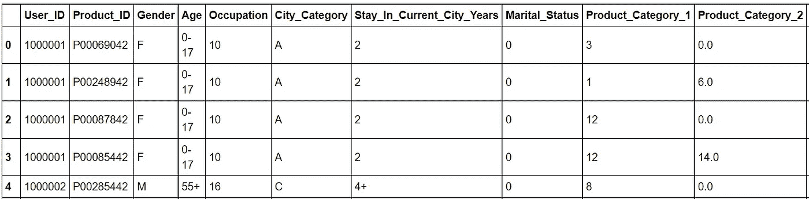
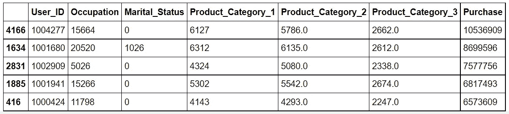
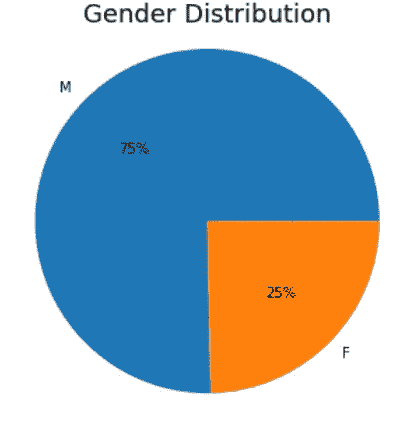
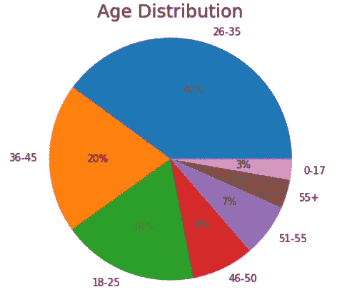
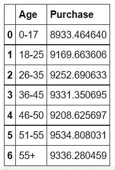
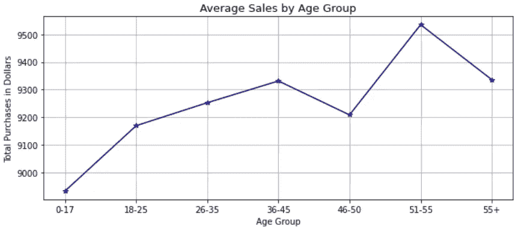
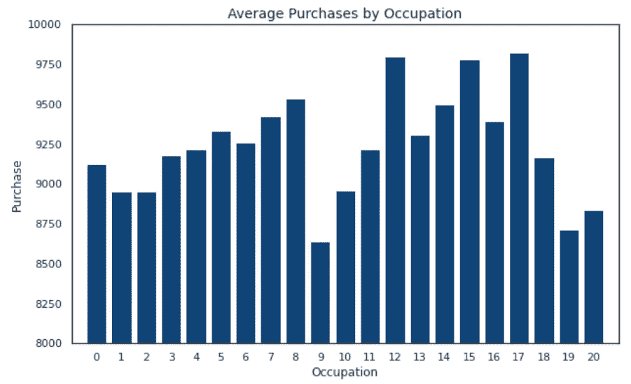
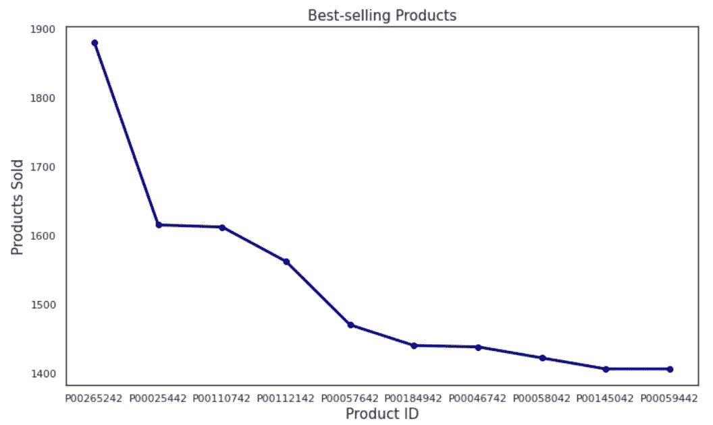

# 用 Python 探索电子商务交易

> 原文：<https://pub.towardsai.net/exploring-e-commerce-transactions-with-python-64d4b24926f?source=collection_archive---------1----------------------->

## [编程](https://towardsai.net/p/category/programming)

“目标是将数据转化为信息，将信息转化为见解”。

―卡莉·菲奥莉娜


照片由[拉兹万·苏驰](https://unsplash.com/@nullplus?utm_source=medium&utm_medium=referral)在 [Unsplash](https://unsplash.com?utm_source=medium&utm_medium=referral) 上拍摄

**电子商务**

电子商务是通过互联网买卖产品或服务。在过去的几年里，电子商务呈指数增长。20 世纪 90 年代中期，亚马逊和阿里巴巴等电子商务巨头的崛起改变了零售业的面貌。他们在很大程度上利用了全球互联网渗透和金融系统的数字化，这导致了许多实体企业的销售额下降。随着互联网接入和采用在全球范围内迅速增加，数字购买者的数量每年都在增加。2020 年，超过 20 亿人在线购买商品或服务，同年，全球电子零售销售额超过 4.2 万亿美元。

**客户分析**

客户分析被定义为从收集到的数据中产生关于客户的可行见解的过程。当个人访问电子商务平台时，从他们进入网站、搜索产品、浏览产品、购买产品到离开网站，他们的活动都会被跟踪。因为需要了解客户的重要性，所以必须记录所采取的每一个行动，并将其存储为客户档案的潜在有用数据。

客户分析有助于更好地理解客户的行为，并允许公司在客户需求变化时改变业务策略。它还提供了一种方法来分析哪些获取和保留客户的渠道有效，哪些渠道无效。

为了建立客户分析平台，电子商务公司需要关注客户的关键特征。其中一些关键功能包括:

**客户档案和分组**:您可以根据客户的偏好、购买历史和浏览模式对他们进行分组，从而建立个人档案。这种描述可用于创建目标受众，并个性化最适合每个群体的产品。

**价值预测**:这是客户在其关系期间将为企业提供的估计总收入。这一估计是通过使用早期交易模式、交易频率和交易量等因素做出的。价值预测有助于规划向哪类客户投入资源，以获得最大的业务价值。

**情感分析**:这是寻找客户对其购买的产品所表达的特定词语或句子背后的情感的过程。情绪可以是积极的、消极的或中性的。情绪可以用来回应客户投诉和改善客户服务。

**【流失分析】**:这是分析客户何时购买产品/服务或不购买产品/服务的可能性的过程。这一决定是基于客户之前在平台中的购买活动。流失率的提高会对企业的收入产生重大影响。

**路线图**

本文的剩余部分将介绍一个程序，该程序将探索和分析电子商务交易并总结发现。将使用 Python 执行以下步骤。

1.导入所需的软件库。

2.访问数据集并将其导入数据框。

3.分析数据。

4.清理数据。

5.将数据可视化。

6.报告观察结果。

**程序**

这项计划的目标是探索和分析电子商务销售交易，并总结调查结果。

**导入所需的软件库**

```
*# Import the libraries.*
import pandas as pd
import matplotlib.pyplot as plt
import matplotlib.gridspec as gridspec
import seaborn as sns
import numpy as np
```

**访问并导入数据集**

```
*# Import the dataset from a website.*
data_source_url = "https://raw.githubusercontent.com/Jotaherrer/DataAnalysis/master/e_commerce/e_commerce.csv"
ecommerce = pd.read_csv(data_source_url)
```

**分析数据**

```
*# Print the first 5 rows of data.*
ecommerce.head(5)
```



电子商务数据集是从 GitHub 获得的。

数据变量包括:

1.  用户 ID —唯一的用户标识符。
2.  产品 ID —唯一的产品标识符。
3.  性别—客户的性别(M =男性或 F =女性)。
4.  年龄—年龄类别(0-17 岁、18-25 岁、26-35 岁、36-45 岁、46-50 岁、51-55 岁、55 岁以上)。
5.  职业——客户的职业，用数字表示。
6.  City _ Category 城市的区域分类。
7.  停留在当前城市的年数-在当前城市的年数。
8.  婚姻状况—单身或已婚。
9.  Product_Category_1 —购买了 1 件产品。
10.  Product_Category_2 —购买了 2 件产品。
11.  Product_Category_3 —购买了 3 件或更多产品。
12.  购买——购买的美元金额。

```
*# Show information about the data columns.*
ecommerce.info()<class 'pandas.core.frame.DataFrame'>
RangeIndex: 550068 entries, 0 to 550067
Data columns (total 12 columns):
 #   Column                      Non-Null Count   Dtype  
---  ------                      --------------   -----  
 0   User_ID                     550068 non-null  int64  
 1   Product_ID                  550068 non-null  object 
 2   Gender                      550068 non-null  object 
 3   Age                         550068 non-null  object 
 4   Occupation                  550068 non-null  int64  
 5   City_Category               550068 non-null  object 
 6   Stay_In_Current_City_Years  550068 non-null  object 
 7   Marital_Status              550068 non-null  int64  
 8   Product_Category_1          550068 non-null  int64  
 9   Product_Category_2          376430 non-null  float64
 10  Product_Category_3          166821 non-null  float64
 11  Purchase                    550068 non-null  int64  
dtypes: float64(2), int64(5), object(5)
```

有 550，068 笔客户交易来自电子商务平台和 12 个栏目。数据集包含整数、对象和浮点值。

```
*# Check for NA or missing values in features.*
ecommerce.isna().sum()User_ID                            0
Product_ID                         0
Gender                             0
Age                                0
Occupation                         0
City_Category                      0
Stay_In_Current_City_Years         0
Marital_Status                     0
Product_Category_1                 0
Product_Category_2            173638
Product_Category_3            383247
Purchase                           0
dtype: int64
```

Product_Category_2 变量有 173，638 个空值，Product_Category_3 变量有 383，247 个空值。

**清理数据**

我们将用零替换空值来清理数据。

```
*# Replace the null values with zero (0).*
ecommerce.fillna(0, inplace=**True**)
```

**将数据可视化**

数据帧包括每个客户进行的每笔交易。让我们找出在产品上花钱最多的用户。

```
*# Sum the purchase amounts by user id and show the users that have  # spent the most money on products.* 
purchases = ecommerce.groupby(['User_ID']).sum().reset_index()
purchases = purchases.sort_values('Purchase',ascending=**False**)
purchases.head()
```



```
*# Visualize the distribution of sales by gender.*
plt.figure(figsize=(8,5))
ecommerce.Gender.value_counts().plot(kind='pie', autopct='**%1.0f%%**')
plt.axis('equal')
plt.title("Gender Distribution", fontsize='18')
plt.show()
```



```
*# Visualize the distribution of sales by age groups.*
plt.figure(figsize=(8,5))
ecommerce.Age.value_counts().plot(kind='pie', autopct='**%1.0f%%**')
plt.axis('equal')
plt.title("Age Distribution", fontsize='18')
plt.show()
```



找出每个年龄组的平均销售额。

```
*# Show the average sale amount for each age group.*
purchase_by_age = ecommerce.groupby('Age')['Purchase'].mean().reset_index()
purchase_by_age
```



51-55 岁年龄组在产品上花费最多。

按年龄组显示平均销售额。

```
*# Visualize the distribution of average purchase amounts for each   # age group.*
plt.figure(figsize=(10,4))
plt.plot(purchase_by_age.Age, purchase_by_age.Purchase, color='darkblue', marker='*')
plt.grid()
plt.xlabel('Age Group', fontsize=10)
plt.ylabel('Total Purchases in Dollars', fontsize=10)
plt.title('Average Sales by Age Group', fontsize=13)
plt.show()
```



按职业形象化购买。

```
*# Visualize purchases by occupation.*
*# Group by occupation.*
occupation = ecommerce.groupby('Occupation')['Purchase'].mean().reset_index()

*# Plot bar chart for average purchases by occcupation.*
sns.set(style="white", rc={"lines.linewidth": 3})
fig, ax1 = plt.subplots(figsize=(10,6))
sns.barplot(x=occupation['Occupation'],y=occupation['Purchase'],color='#004488',ax=ax1)
plt.axis([-1,21,8000,10000])
plt.title('Average Purchases by Occupation', fontsize='14')
plt.show()
```



把最畅销的产品形象化。

```
*# Visualize the best selling products.* 
*# Group by product ID*
product = ecommerce.groupby('Product_ID')['Purchase'].count().reset_index()
product.rename(columns={'Purchase':'Count'},inplace=**True**)
product_sorted = product.sort_values('Count',ascending=**False**)

*# Plot the line.* 
plt.figure(figsize=(12,7))
plt.plot(product_sorted['Product_ID'][:10], product_sorted['Count'][:10], linestyle='-', color='darkblue', marker='o')
plt.title("Best-selling Products", fontsize='15')
plt.xlabel('Product ID', fontsize='15')
plt.ylabel('Products Sold', fontsize='15')
plt.show()
```



调查结果摘要包括以下内容:

*   用户在产品上花费的最大金额是 10，536，909 美元。
*   75%的购买是由男性进行的，25%的购买是由女性进行的。
*   26-35 岁年龄组占总购买量的 40%,其次是 36-45 岁年龄组，占总购买量的 20%。
*   平均而言，51-55 岁年龄组在产品上花费最多，其次是 55 岁以上年龄组。
*   平均而言，花钱最多的顾客的职业包括数字 12、15 和 17。不幸的是，没有职业号码的翻译来说明职业的类型。
*   最畅销的产品是 P00265242、POOO25442 和 P00110742。不幸的是，没有产品编号的翻译来说明产品的类型。

感谢阅读我的文章！如果您有任何问题或意见，请告诉我。

如果你喜欢阅读这样的故事，并想支持我成为一名作家，可以考虑报名成为一名媒体成员。会员资格让你可以无限制地接触媒体上的故事。你可以使用此链接[https://medium.com/@dniggl/membership](https://medium.com/@dniggl/membership)注册