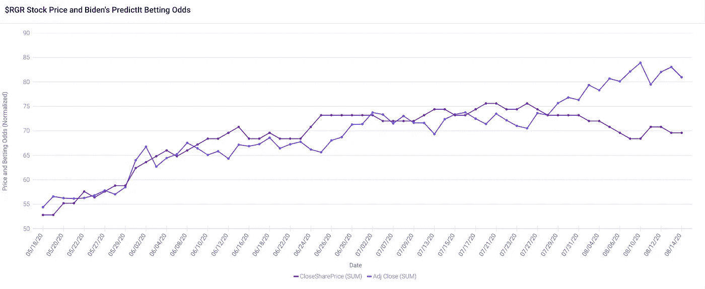
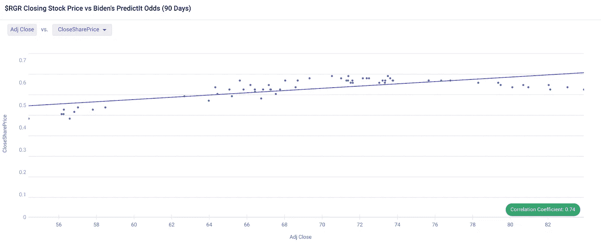

# 探索股票市场相关性

> 原文：<https://pub.towardsai.net/exploring-stock-market-correlations-7e865a8c225a?source=collection_archive---------3----------------------->

## [统计数据](https://towardsai.net/p/category/statistics)

## 与 r 一起验证见解。

由[萨曼莎·索菲亚](https://unsplash.com/@samanthasophia?utm_source=medium&utm_medium=referral)在 [Unsplash](https://unsplash.com?utm_source=medium&utm_medium=referral) 上拍摄的照片

*免责声明:本文不构成财务建议。这只是为了教育目的。我不认可本文中提到的任何公司或资产。*

# 背景

在我们开始之前，一个显而易见的问题是:“股票价格是可以预测的吗？”

关于这个主题的学术文献通常会产生“不太好的结果”，无数的文章警告市场，反对市场。

从表面上看，答案似乎是“不”

然而，这并不是因为我们不能预测股票价格，而是因为成功预测股票价格的人正在秘密地做这件事。这应该是显而易见的，因为一旦市场中的“优势”众所周知，它就会很快被磨损。

因此，从事股市预测的人工智能工程师签署了严格的保密协议，所以你不会在学术文献中找到他们的工作。

RenTec 或许是有史以来最成功的对冲基金*，[利用统计数据和人工智能预测股价](https://digital.hbs.edu/platform-rctom/submission/billionaire-robots-machine-learning-at-renaissance-technologies/)。这就解决了。以下是一些更好的人工智能投资平台:*

*   *[叛乱研究](https://www.rebellionresearch.com/)*
*   *[天际线](https://www.skyline.ai/investment-management/)*
*   *[AI 投资](http://www.aiinvestments.pl/results/)*
*   *[波形图](https://www.wavenure.com/en)*

# *选择资产*

*$RGR (Ruger)是一个非常受欢迎的股票，交易量一直很高，创造了许多潜在的预测数据。最近，由于社会动荡，销售额猛增。*

*因为它的流行，我不太可能在传统的数据源(例如，订单簿)中发现低效之处。换句话说，在别人都在玩的零和、血腥游戏中，我不会赢。*

*我将更有可能看到与替代数据来源的相关性。*

# *选择(替代)数据*

## *政治*

*由于 2020 年总统大选将(大概)是今年剩余时间里影响股市的最大事件，我们应该看看我们可以从中收集到哪些替代数据。*

*乔·拜登承诺，如果当选，将采取一系列措施结束枪支暴力:*

*   *让枪支制造商对他们的产品承担民事责任。*
*   *禁止攻击性武器和大容量弹匣。*
*   *管制现有攻击性武器的拥有。*
*   *限制个人可以购买的枪支数量。*

*乍一看，如果拜登当选，这些措施似乎会导致枪支股票价格暴跌。然而，有一个重要的警告。*

*当总统赢得选举时，他们不会立即就职，这意味着他们在就职前没有政治权力(2021 年 1 月 20 日，11 月 3 日选举日之后的两个多月)。*

*如果拜登赢得选举，我认为将会出现“枪支泛滥”美国人会在就职典礼前(或拜登的措施颁布前)囤积武器弹药，导致枪支股价暂时反弹。*

*至少，对拜登获胜的担忧可能会在大选前提高枪支股票的价格。*

## *准备数据*

*PredictIt 提供了关于拜登赢得大选的连续投注赔率的数据。*

*我导出了拜登 90 天的[预测](https://www.predictit.org/markets/detail/3698/Who-will-win-the-2020-US-presidential-election) `CloseSharePrice`数据，以及雅虎[90 天的`Adj Close`美元 RGR 价格金融](https://finance.yahoo.com/quote/RGR/history?period1=1589500800&period2=1597449600&interval=1d&filter=history&frequency=1d)。*

# *确定相关性*

*我把数据上传到 [Apteo](http://apteo.co) 去寻找见解。*

*首先，让我们绘制 RGR 股票价格的标准化值— `Adj Close` —相对于拜登的预测赔率— `CloseSharePrice`。*

**

*由 [Apteo](http://apteo.co) 提供。*

*看起来它们关系非常密切，但是让我们计算两者之间的相关系数来量化它(相关系数是 0 到 1 之间的数字，用来量化线性相关性)。*

**

*通过 [Apteo](http://apteo.co) 。*

*的确，相关系数比较强，r =0.74。*

# *外卖食品*

*正如我之前所写的，相关性本身并不意味着因果关系。*

* [## 当相关性意味着因果关系时

### 因果关系可以通过研究和实验设计来确定。

medium.com](https://medium.com/datadriveninvestor/when-correlation-does-imply-causation-f71ac1f3d09c) 

也就是说，我们有一个合理的逻辑基础来解释拜登的预测赔率和鲁格的股价之间的因果关系，所以我们发现的相关性加强了我们的假设。

仅美国股市就有数千只其他股票，更广泛地说有数十万种资产，还有数百万种替代数据来源，进一步探索的机会是无限的。*