# 使用线性回归探索道琼斯工业平均指数

> 原文：<https://pub.towardsai.net/exploring-the-dow-jones-industrial-average-using-linear-regression-92481d7d7333?source=collection_archive---------0----------------------->

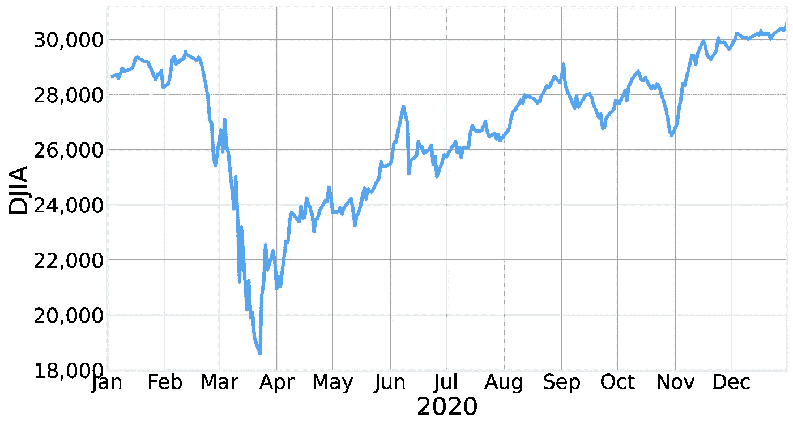

2020 年道琼斯工业平均指数(作者图)

## 特征选择和模型漂移的简单例子

道琼斯工业平均指数(DJIA)于 1896 年由 T2·查尔斯·道(Charles Dow)首次推出，此后成为 T4 证券交易所(New York Stock Exchange)股票市场表现的主要参考指标之一。

在这篇文章中，我们将使用它来更好地理解简单线性回归模型的优缺点，它们所依赖的假设，以及我们如何使用它们进行特征选择。

道琼斯指数的价值是所谓的[价格加权指数](https://www.investopedia.com/terms/p/priceweightedindex.asp)，即 30 只知名股票的平均价格。道指[成份股](https://en.wikipedia.org/wiki/Historical_components_of_the_Dow_Jones_Industrial_Average)会随着时间的推移而变化，这是一个非常适合我们的例子。

为简单起见，我们将重点关注 2020 年期间 DJIA 的值，因为这包括由第一组 CoVID 锁定引起的崩溃(参见此处的以深入了解 CoVID 的数据驱动)。

为了能够更好地评估我们的模型，我们将把数据集分成[个训练和测试阶段](https://en.wikipedia.org/wiki/Training,_validation,_and_test_data_sets)。通过这种方式，我们可以仅使用训练期间的数据来训练模型，并通过将模型预测与测试数据集中的实际数据进行比较，来评估它对以前从未见过的数据的处理效果。我们任意选择将 2020 年 8 月 1 日之前的时间用于培训，将这一年的剩余时间用于测试:

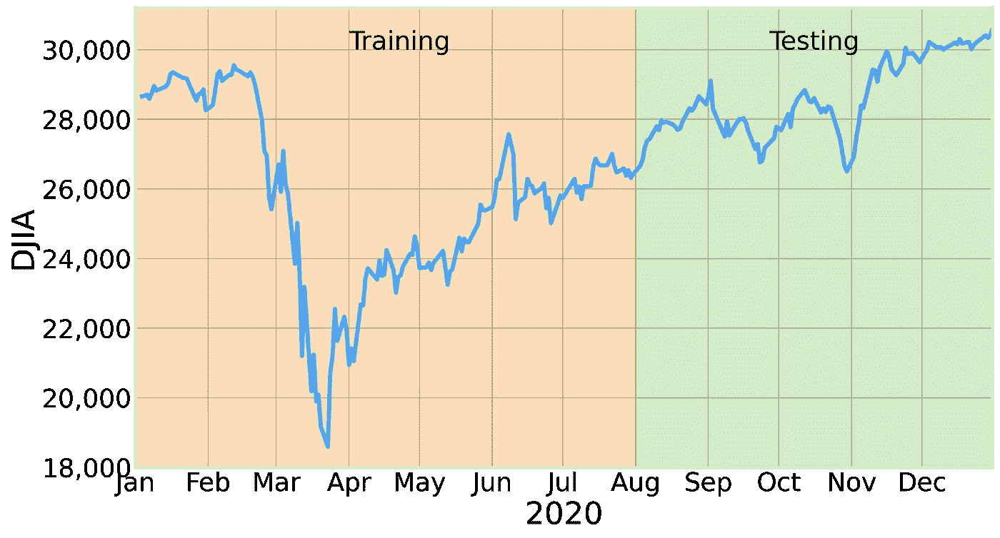

培训和测试时间(作者提供的数字)

# 特征选择

现在我们已经准备好训练我们的模型了。由于我们有兴趣了解更多的特征选择，我们开始用 35 只股票训练一个模型，看看我们是否能够成功地确定哪些股票要剔除。

我们使用奇妙的 [statsmodels](https://www.statsmodels.org/) Python 包来执行[普通最小二乘](https://en.wikipedia.org/wiki/Ordinary_least_squares) (OLS)线性回归拟合。OLS 如何运作的细节对我们的目的并不重要。只要说 OLS 通过最小化预测值和经验值之间的平方差来工作就够了。

statsmodels 为我们提供了模型的每个系数的详细统计分析，以及关于最终模型质量的许多其他统计结果。

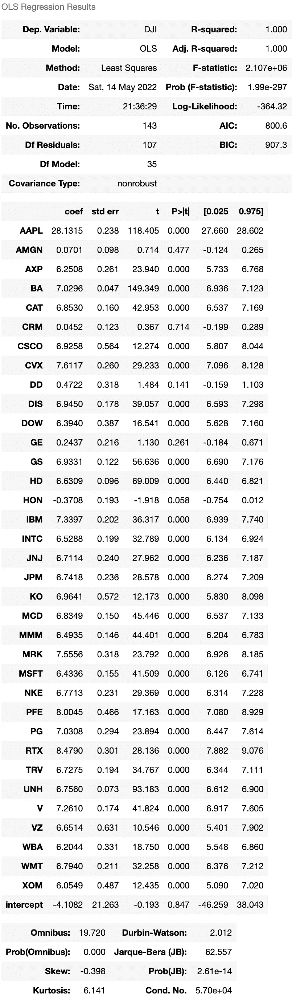

朴素模型的权重和统计值(图由作者提供)

这里我们看到每个模型特征的 6 列结果。特别是，我们有

*   **coeff** —该模型参数的估计值(分配给该特征的权重)
*   标准误差(STD err)—我们估计的标准误差(

根据这两个值，我们可以计算出估计值的 t 值:

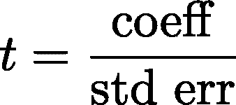

我们可以在第三列找到。这个值本质上为我们提供了一个度量标准，即相对于估计值，误差有多小:t 值越大，误差就越小，我们对估计值就越有信心。

为了更好地量化我们的信心，通常计算相关的 p 值。在相对常见的假设下，我们预计 t-score 遵循[标准分布](https://en.wikipedia.org/wiki/T-statistic)，获得至少与观察值一样极端的测试结果的概率就是 t-score 值右侧曲线下的面积。这个区域被称为 [p 值](https://en.wikipedia.org/wiki/P-value)，我们可以在上面结果的第四列中找到它。

解释 p 值有一些细微差别，但简单来说，p 值越小，我们估计的值不为零的证据就越强(如果给定要素的系数与零不可区分，则该要素与我们的模型不相关)。

p 值的典型阈值为:

*   p<0.05 —中度证据
*   p<0.01 —强有力的证据
*   p<0.001 —非常有力的证据

现在，我们可以仔细浏览上表，以确定哪些特征不重要，或者，我们可以绘制每个特征的 p 值，并快速获得所需的所有信息:

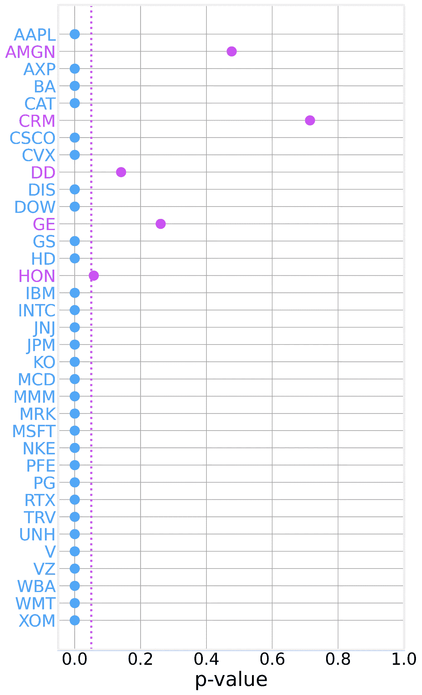

每个组件的 p 值。垂直虚线对应于 0.05 的阈值(作者提供的数字)

从这个图中，我们很快识别出权重与零没有显著差异的 5 个特征(股票): [AMGN](https://finance.yahoo.com/quote/AMGN/) 、 [CRM](https://finance.yahoo.com/quote/CRM/) 、 [DD](https://finance.yahoo.com/quote/DD/) 、 [GE](https://finance.yahoo.com/quote/GE/) 和 [HON](https://finance.yahoo.com/quote/HON/) 。在我们这个简单的例子中，这些股票之所以没有意义，是因为它们不属于这个时期的 DJIA。

如果我们现在删除这 5 个组件并训练一个新的改进模型，我们将获得:

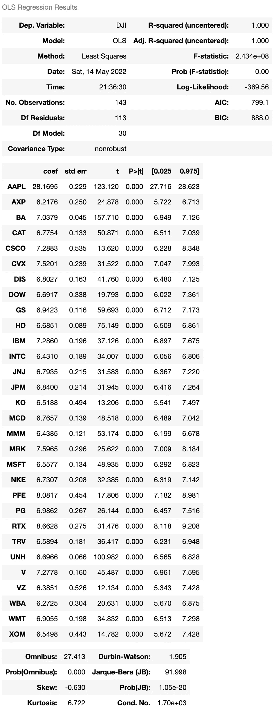

改进模型的权重和统计值(作者提供的图表)

没有不重要的成分:

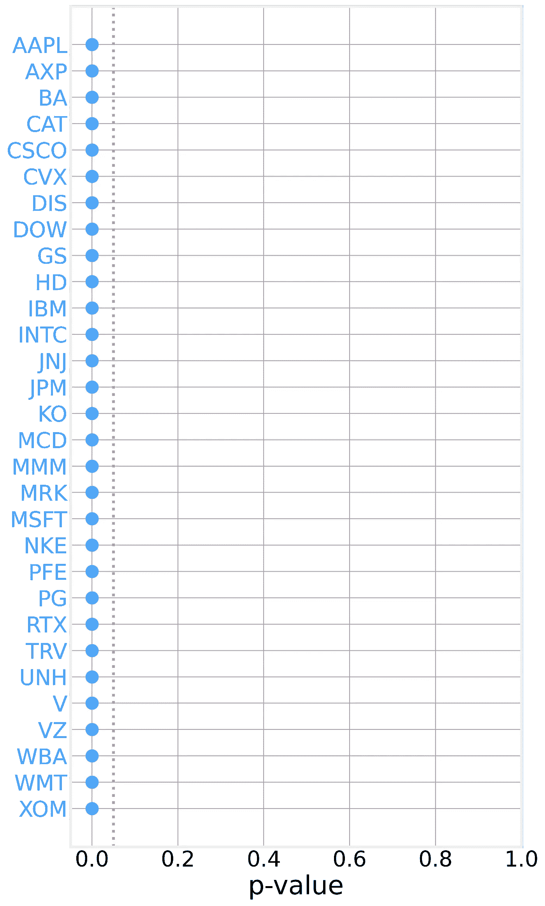

## 模型比较

这里需要注意的重要一点是，更新后的模型对几乎所有成分赋予了不同的权重，因此，如果我们对每只股票的贡献的适当估计感兴趣，而不仅仅是哪些股票是重要的，我们应该使用更新后的值:

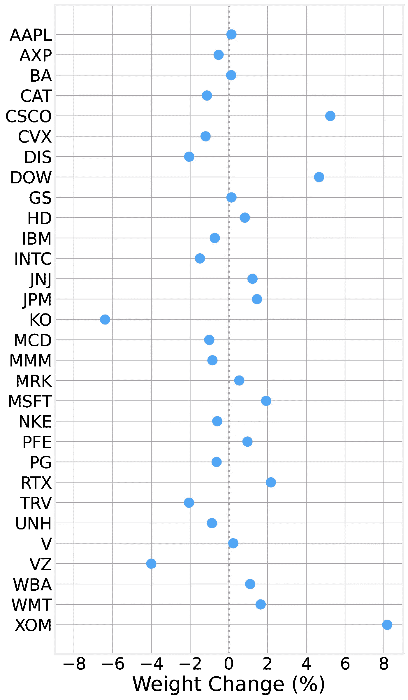

虽然我们已经花了相当多的时间来讨论我们训练的两个不同的模型，但我们实际上还没有查看模型结果。我们现在通过绘制训练期和测试期的经验数据和模型预测来做到这一点:

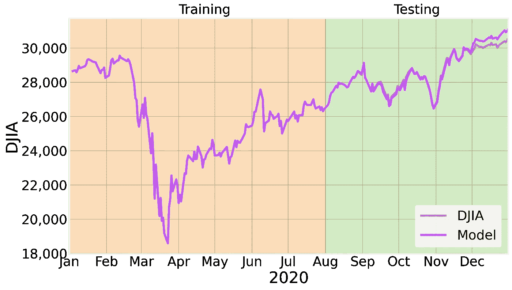

模型结果和经验数据之间的比较(作者提供的图表)

正如我们所看到的，在训练期间结果是非常好的(因为模型的 R2 是 1，这是应该预料到的)，但是随着我们越来越深入到测试阶段，我们开始看到一些差异。

# 模型漂移

通过绘制残差(模型和数据之间的差异)作为时间的函数，我们可以更清楚地了解情况:

模型预测和经验值之间的差异(作者提供的图表

正如我们所看到的，我们的模型在测试期的前几周工作得非常好，然后它就完全崩溃了。这种令人困惑的行为的原因非常简单:我们模型的基本假设不再有效。2020 年 8 月 31 日，DJIA 的组成发生了变化，辉瑞、雷神和埃克森美孚被淘汰，取而代之的是安进、霍尼韦尔和 Salesforce。

这称为模型漂移，可以定义为:

> 由于数据变化以及输入和输出变量之间的关系而导致的模型性能下降。

虽然你不太可能经常看到这种明显的效果，但你几乎肯定会在你投入生产的任何模型中看到类似的事情发生。随着时间的推移，世界会发生变化，您应用模型的新数据开始与您用来训练模型的数据发生显著差异。

您必须随时关注模型的性能，以确保尽快捕捉到任何明显的性能下降，此时您应该使用最新的可用数据重新训练您的模型。另一个选择是使用所谓的[在线机器学习](https://en.wikipedia.org/wiki/Online_machine_learning)，随着新数据的出现，你可以逐渐实时更新你的模型。

# 真正的 DJIA

尽管我们在上面获得了令人印象深刻的结果，但 DJIA 的实际计算方式却有所不同。正如我们在开头提到的，DJIA 是一个价格加权指数，计算方法是将所有个股的价格相加，然后除以所谓的 DJIA 除数， *d* 。换句话说:

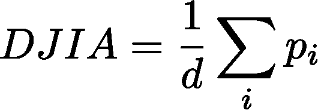

其中总和超过 30 个分量。根据这个定义，我们预计分配给每个单独组件的权重将是相同的(1/d)，但是，我们的模型为每个特征分配了不同的权重(尽管大多数权重相对接近)。

原因之一是除数 *d* 的值随时间变化。事实上，在我们考虑的期间，它改变了两次:

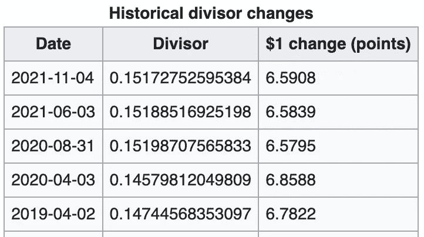

这清楚地表明了我们的模型是多么有限。我们不仅假设组件保持固定，而且假设各自的权重也是恒定的(这是此类线性模型中的基本假设)，我们通过数据证明这两种假设都是错误的。

尽管如此，我们还是得到了很好的结果，这证明了线性模型的强大。我们获得的不同权重是由于[协方差矩阵](https://www.stat.purdue.edu/~boli/stat512/lectures/topic3.pdf)的形式以及每只股票在考虑的时间内与指数相关的方式，但这是一个超出这篇已经很长的帖子范围的主题。

最后，你可以在笔记本上记下上述[的分析要点](https://gist.github.com/bmtgoncalves/cd2533cc6c9286ac3d4c0927fabe8096)。你应该仔细阅读代码以确保你理解了它。

如果你喜欢这篇文章，你可以通过使用我的链接[https://bgoncalves.medium.com/membership](https://bgoncalves.medium.com/membership)关注我并成为媒体的一员来支持我

我还出版了[周日简报](https://data4sci.com/newsletter)，这是一份每周时事通讯，我在其中涵盖了所有与数据科学、机器学习和人工智能相关的最新新闻、教程和博客帖子。