# 探索 NoSQL 家族

> 原文：<https://pub.towardsai.net/exploring-the-nosql-family-49e9f23313ad?source=collection_archive---------3----------------------->

## [数据科学](https://towardsai.net/p/category/data-science)

## 对数据科学家日益增长的需求的(长篇)入门

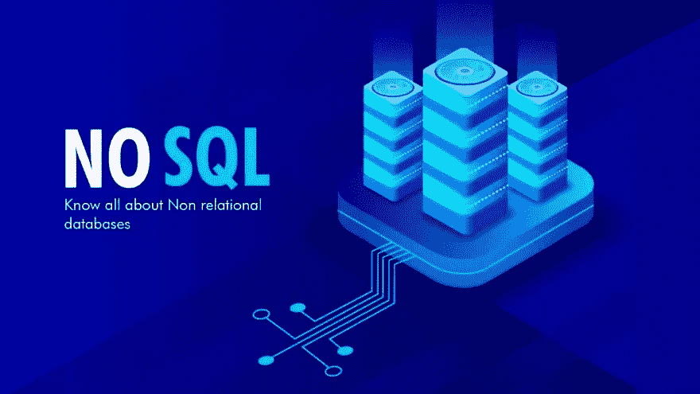

在数据科学应用中，NoSQL 数据库的知识似乎是一个不断增长的需求，然而，分类法是如此多样和以问题为中心，以至于掌握它们可能是一个挑战。这篇文章试图阐明一些概念，经常深入每个设计的特性。

我们首先简要介绍 NoSQL 及其出现背后的原因，然后分析 NoSQL 家族的四个成员，他们的行为和主要机制，以及他们的优点，缺点和典型的用例。

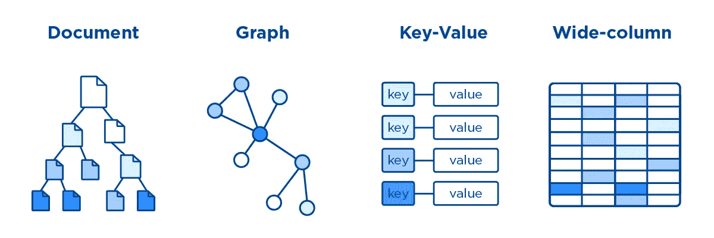

NoSQL 数据库系列及其表示。

## 什么是 NoSQL？

NoSQL(不仅仅是 SQL)在 2000 年代中后期成为传统 SQL 的替代品。在 Web 2.0 行业的推动下，它允许水平伸缩、分布式数据库和灵活的模型(无模式设计)。这种范式的转变意味着开发人员可以将更多的时间放在开发新功能上，而减少数据库设计的时间。通常情况下，NoSQL 解决方案是作为 SQL 解决方案的一种经济高效的替代方案而出现的，SQL 解决方案放松了 RDBM 的僵化。

最初，NoSQL 语言专注于键值模型，有效地消除了对 SQL 的需求，因此得名 NoSQL，是“不支持 SQL”的缩写。随着时间的推移，社区意识到每个工具都满足了一个特定的需求，抛弃了对共存驱动的方法的“死于 SQL”的感觉，NoSQL 看到它的意思变成了“不仅仅是 SQL”。

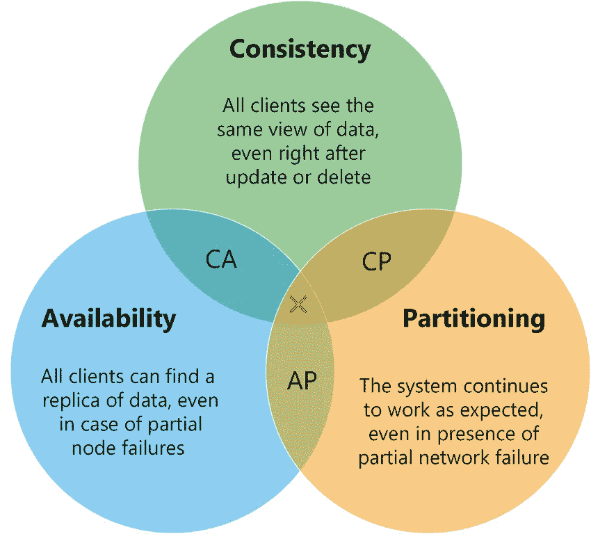

CAP 定理文氏图:该定理指出，没有数据库范例能够同时包含所有三个特征。

左边的图代表 CAP 定理，它表明分布式数据存储不可能同时提供三种保证中的两种以上。

传统的 RDBMs 关注于图表的左侧(一致性和可用性，CA)，而 NoSQL 数据库通过牺牲一致性以支持可用性和分区容差(AP)来实现水平分区和速度。

尽管有些数据库确实符合 ACID 标准，但大多数 NoSQL 数据库都围绕着所谓的“最终一致性”，而是遵循基本属性。最终一致性规定，集群中的所有节点最终将包含相同的数据版本。称为陈旧读取，这意味着多个查询可能会暂时返回不同的结果，这是放松一致性保证的直接结果。

**那么什么时候使用 NoSQL 呢？**简而言之:当不需要 ACID 合规性时，快速且廉价的可扩展性是强制性的，或者您的应用属于大数据类别。

在继续之前，请记住 NoSQL 的设计与 RDBMs 的设计有很大的不同，在前者中，数据往往是非规范化的，并且经常重复，因为与访问速度和可用性相比，存储被认为是一种廉价商品。这种范式与无一致性保证相结合，必然会产生暂时的分歧。

注意#1:一些作者认为 NoSQL 显然没有达到它的目标，它为通过 NewSQL 或分布式 SQL 在传统 SQL 中容纳类似 NoSQL 的特性铺平了道路。但是让我们暂时跳过这个话题。

注意#2:一些文档值 NoSQL 数据库允许类似 ACID 的事务，只要在同一个集合中执行，在 Azure 表存储中称为实体组事务；MongoDB 在 4.2 版本中增加了对类似 ACID 的分布式事务的支持。

注意#3:一些 SQL 数据库能够结合水平分片/缩放和分布式查询，例如，使用 PostgresSQL 的 Citus 扩展，或 YugabyteDB，一个 SQL/NoSQL 星球规模的分布式数据库。

## 键值数据库

最简单的 NoSQL 数据库围绕着关联数组的概念，换句话说，它简单地将给定的**键与任何类型的记录** **，**从简单的字符串或 JSON 到视频文件。

键值数据库被组织成分区或桶，其中可以包含一个或几个实体，每个记录由一个唯一的行键表示。记录又包含一个或多个字段。分区和行键的概念是 NoSQL 最重要的方面之一，因为它允许逻辑分区(由分区键定义)根据它们的工作负载在物理分区(节点)之间移动。同时，这也是新手的主要障碍之一:如果您的查询没有利用所选的键，选择错误的键将会带来灾难，而且一旦您选择了它，就没有回头路了。

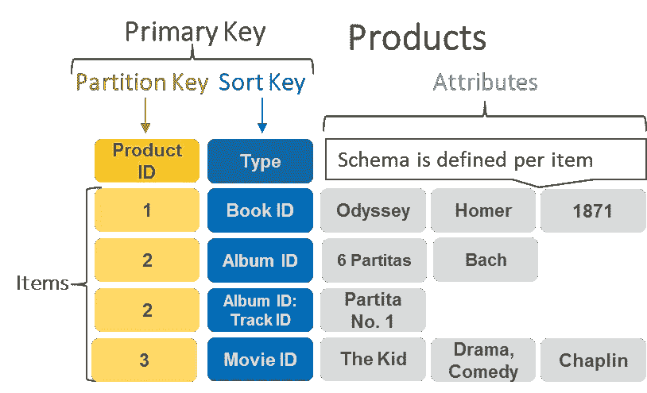

AWS 的 DynamoDB 存储图

对于键-值数据库来说，选择分区键和行键尤其具有挑战性，因为只能通过键进行查询。这是什么意思？在键值方面，JSON 可以用一个水平图来表示，图中的 *id* 字段表示与 JSON 值相关联的记录的键。

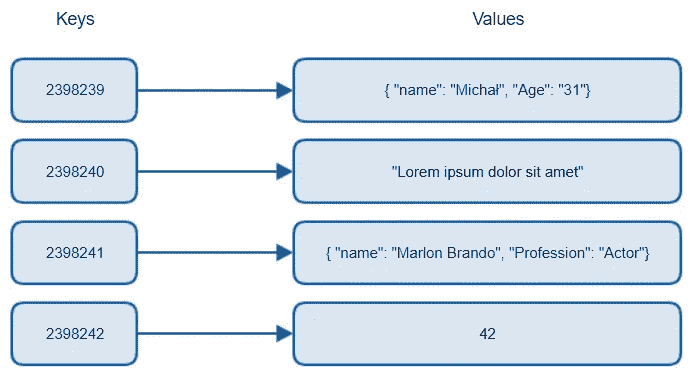

伪键值关联。请注意，值并不遵循固定的模式，在同一个分区中从 JSONs 到 strings 会有所不同。

只要您知道分区和记录键，CRUD 操作就会非常快。但是，如果您想检索“name”字段等于“Michal”的所有案例，该怎么办呢？与文档数据库不同，字段不会被自动索引，这意味着这样的查询将需要遍历每条记录，以查看它是否包含“name”字段以及它是否等于“Michal”——类似于 SQL 中的全表扫描。我希望这阐明了行键选择的重要性，以及为什么事先了解系统的用途很重要。当然，这些系统不是为现场查询而设计的，但我们只是陈述了它们作为通用数据库的局限性。

典型的关键字可以是任何被认为是唯一的关键字， *customerID* ， *supplierID* ， *sessionID，等等*。大多数开发人员选择使用组合键，例如， *UserID.session* 将存储会话数据； *UserID.user* 反过来表示用户的缓存信息，简化了单个字段的值，而不是类似字典的结构，加快了 CRUD 操作。

分区键怎么样？一开始，我们说过分区键允许系统根据它们的工作负载移动分区。因此，不适当的分区键选择的明显和最直接的后果是创建*热分区—* 频繁访问的实体组，但是不能被分布，因为它们作为单个单元(单个分区)操作。考虑到这一点，一个分区可以是 *UserID* ，而键则代表不同的用户属性 *UserID。姓名*，*用户标识。位置*，*用户标识。高度*。如果一个物理分区包含几个热逻辑分区(例如，一组频繁请求数据的用户)，该引擎就能够将逻辑分区分布到不同的集群上。没有适当的分区键，逻辑分区可能是一元的，因此不可能被分配。

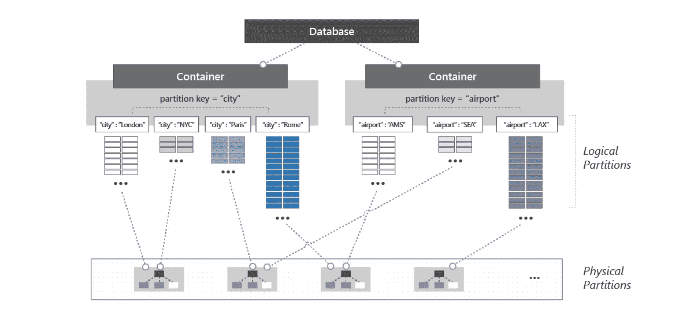

逻辑分区(LP)及其根据工作负载在物理分区(PP)之间的分布

键值数据库的另一个重要特性是，它们的记录可以有生存时间(TTL)，这是一个可以控制的自动过期日期。这使它们成为会话驱动存储的有力候选。

优势

*   可量测性
*   非常快的阅读速度
*   简单灵活的数据模型

不足之处

*   实体之间没有关系
*   没有类似事务的行为
*   仅支持每个键的查询
*   不支持一次检索多个键
*   缓慢的多次更新和集合扫描

供应商

*   雷迪斯
*   里亚克
*   Memcached
*   Azure Table 商店

用例

*   Web 会话缓存
*   存储用户首选项

## 文档数据库

文档存储数据库建立在键值背后的概念之上，扩展它以支持复杂的多层对象 documents。这种看似简单的差异具有几个后果:因为引擎熟悉多级或嵌套概念，所以所有字段，包括嵌套字段，都被索引，允许特定字段查询和选择；单据之间可以相互查询，但不能相互查询；非规范化设计模式允许直接数据检索，而不需要连接；一些文档存储数据库实现了类似 ACID 的属性。

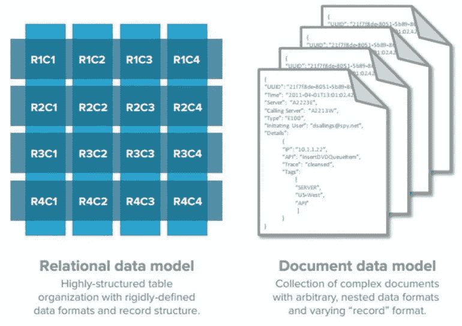

关系数据模型与文档数据模型

每个文档都可以看作关系模型中的一行，只是前者的模式没有预先定义，对象类型不需要相同。

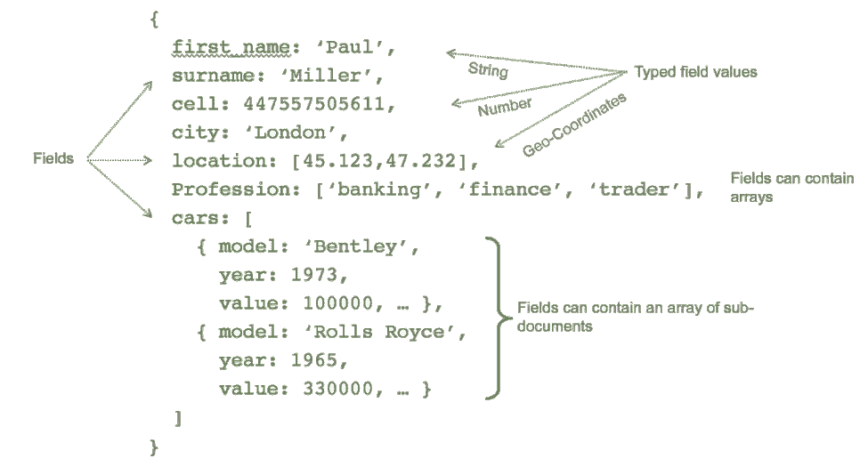

文档存储结构([来源](https://webassets.mongodb.com/_com_assets/cms/JSON_Example_Python_MongoDB-mzqqz0keng.png))

像它的键值前身一样，文档数据库也被构造成集合，集合又包含分区和它们的嵌套实体。在选择分区和文档(非行)键时，必须注意同样的问题。然而，如上所述，文档数据库中的值被自动索引，允许它们被查询。尽管如此，查询的效率仍然会受到查询字段的严重影响。

请注意，由于这种面向文档的结构，与它的键值对应不同，在文档存储数据库中没有创建组合键的强烈需求，因为每个字段的访问都集成在引擎中。

下图展示了 Azure Cosmos DB 中每个查询类型获得的性能，尽管可以扩展到文档存储数据库。该图从效率最高的点查询流向效率较低的表扫描。

使用 REST 表 API 查询 Azure CosmosDB 中分区键的性能。

在这本入门书的开始，我们规定 NoSQL 数据库位于 CAP 定理的 AP 谱中。在实践中，由于不断的发展，一些 NoSQL 数据库有能力在上限保证之间切换，允许开发者创建定制的解决方案。

Azure Cosmos DB 的一致性级别

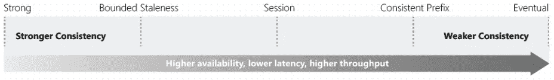

随着我们从强一致性走向最终一致性，我们能够在 CAP 定理中平衡一致性与可用性之间的权衡

优势

*   复杂对象的可伸缩性
*   面向文档的数据模型，JSON 或 XML 允许复杂的无模式结构
*   支持文档内的查询和连接
*   数据建模范例允许将所有数据存储在一个文档中
*   快速读写

不足之处

*   数据建模范例导致文档中的数据重复
*   复杂的设计导致不一致

供应商

*   MongoDB
*   Azure 文档数据库
*   AWS 发电机数据库
*   OrientDB
*   CouchDB

使用案例:

*   社交网络
*   电子商务
*   任何可以放松酸性物质依从性的东西

## 柱族数据库

列族数据库与 RDBMS 和键值存储共享概念。您可以将行视为键值存储中的键，将列视为值。他们的最佳使用情形是大型数据接收或数据分析，适合存储数十亿行和数万列。

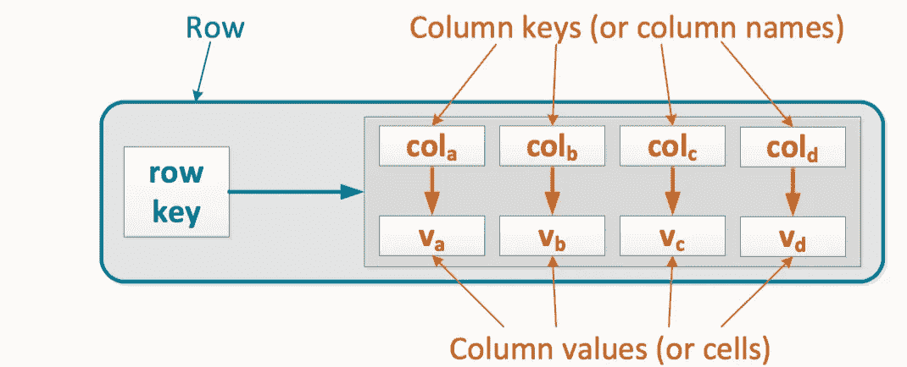

列存储模式([源](https://pandaforme.gitbooks.io/introduction-to-cassandra/content/Screen%20Shot%202016-02-24%20at%2011.46.09.png))

列背后的数据模型意味着它可以有效地处理稀疏矩阵，这是传统 RDBMS 的一个主要障碍。而在后者中，所有列都必须被填充——recall NULL 是一个值，被占用的空间对应于列的类型——占用存储空间，而前者实际上不占用存储空间，它只存储每列、每行(或每个键)的现有值。

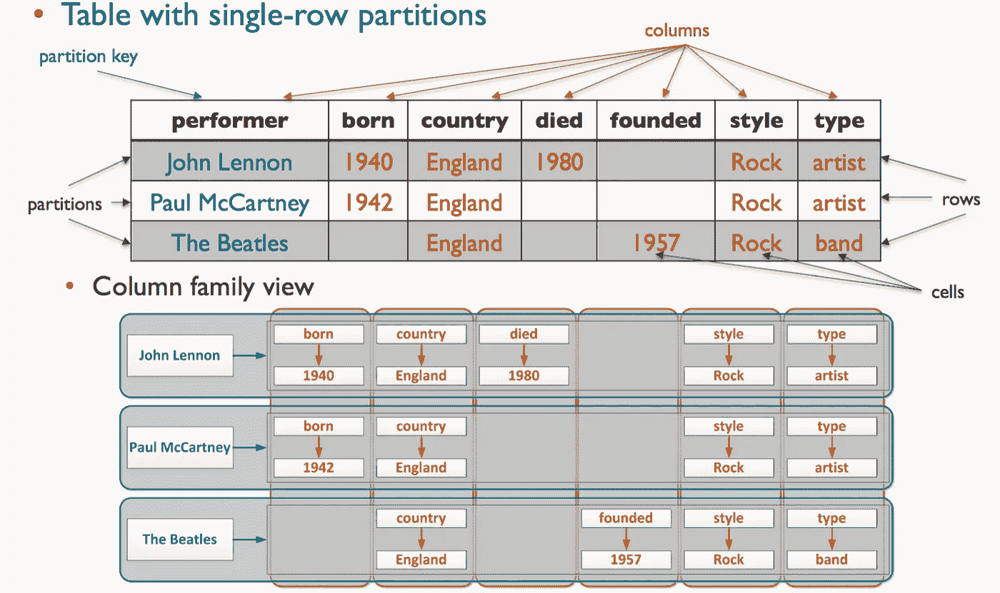

RDBMS vs 列存储([来源](https://pandaforme.gitbooks.io/introduction-to-cassandra/content/Screen%20Shot%202016-02-24%20at%2012.24.12.png)

在上图中，请注意键“John Lennon”和“Paul McCartney”没有为 *founded* 列设置值，在这里您可以看到一个 gap 实际上是一个不存在的列。您可以将列看作一个可变长度的集合，例如 Python 中的字典，其中每一项都是可选的。在这种情况下，第一行可以用 Python 表示为:

正如所料，就像 NoSQL 家族的其他成员一样，分区键的选择起着至关重要的作用，因为除了加快基于索引的查询之外，它还决定了哪些内容是连续存储的，哪些内容可以分成更小的块。

优势

*   可量测性
*   快速写/读

不足之处

*   更新/修改操作很慢

供应商

*   卡桑德拉
*   HBase
*   Google BigTable
*   德鲁伊特

使用案例:

*   遥感勘测
*   物联网
*   报告

## 图形数据库

最后的 NoSQL 数据库类型将焦点转移到实体之间的关系上。实体(如用户)由节点表示，而实体之间的连接决定了它们之间的关系。

图表引擎推荐引擎示例([来源](https://d1.awsstatic.com/product-marketing/Neptune/Neptune-Diagram_recommendation-relationships.ba1ed4bbfe14f9b810f64bb0b16065daa3006eed.png)

图形数据库存储每个节点内的关系信息，通过这样做，消除了关系数据库中所需的查找操作，节省了急需的资源。

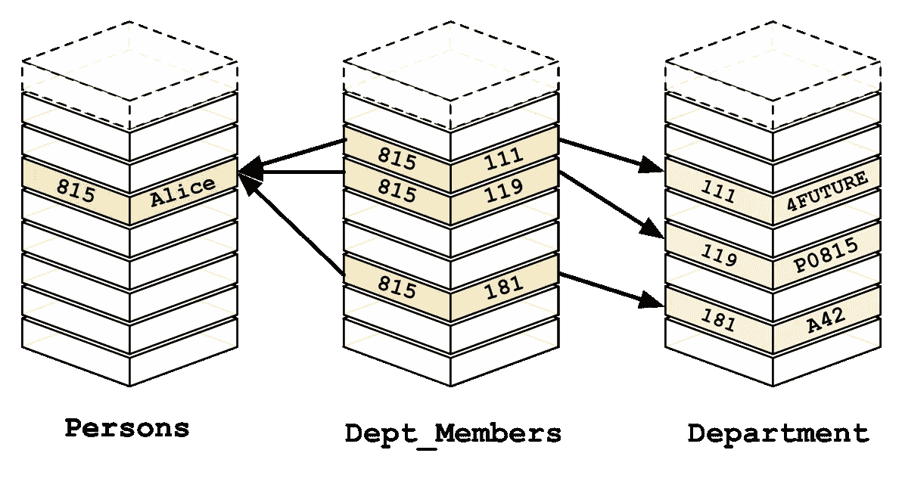

关系数据库中的查找过程([来源](https://s3.amazonaws.com/dev.assets.neo4j.com/wp-content/uploads/from_relational_model.png))

另一方面，图形数据库，因为关系是预先计算的，所以查询更快，因为它们不需要查找。

图形存储中的即时关系([来源](https://s3.amazonaws.com/dev.assets.neo4j.com/wp-content/uploads/relational_to_graph.png)

供应商

*   Neo4j
*   OrientDB
*   ArangoDB

使用案例:

*   知识图表
*   身份图
*   欺诈检测
*   推荐引擎
*   社交网络

## 结论

像在大多数技术中一样，选择适合手头问题的工具是开发人员的责任。第一个支柱始终是相同的:在钻研技术之前，确保您理解手头的业务问题。

希望这篇文章能帮助你实现上述目标！

接下来:NewSQL 和分布式 SQL，感谢阅读！