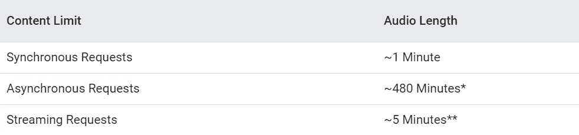
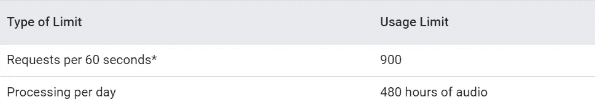
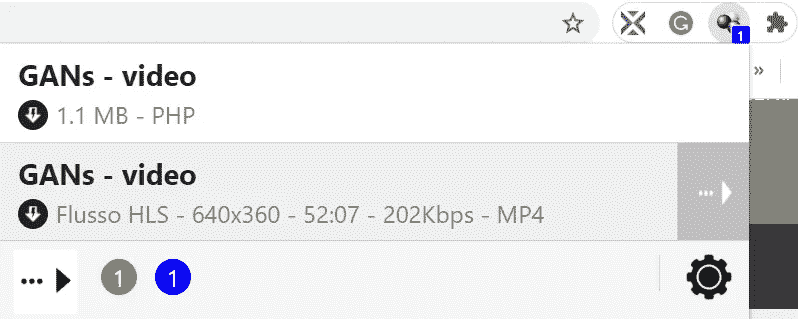
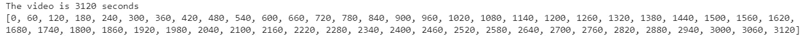
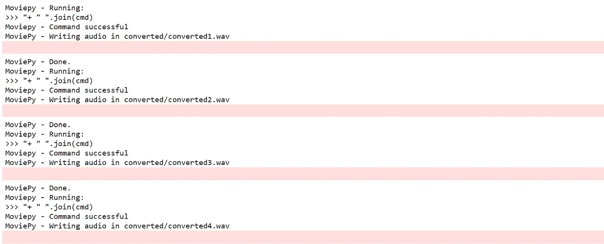

# 用 Python 从长视频中提取文本

> 原文：<https://pub.towardsai.net/extract-the-text-from-long-videos-with-python-81d30d655cfd?source=collection_archive---------1----------------------->

## [自然语言处理](https://towardsai.net/p/category/nlp)

## 使用 Google API 构建语音识别器的简单指南

图 1:[图片箱](https://pixabay.com/)上的照片

语音识别是一项有趣的任务，可以让您提高生活质量。在这个永无止境的 Covid 时期，我需要观看许多课程的视频，很容易失去注意力。与此同时，在我的大学网站上可以看到所有注册信息的可能性让我成为了一个完美主义者，所以我想把每一个字都记下来。但是它的成本很高，因为它需要大量的工作和窃取时间。

幸运的是，已经有 API 资源可用，如[谷歌](https://cloud.google.com/speech-to-text/)、[亚马逊](https://aws.amazon.com/it/transcribe/)、 [IBM](https://azure.microsoft.com/en-us/services/cognitive-services/speech-to-text/) 和许多其他资源，它们提供将音频转换成文本的服务。在本文中，我将只关注**谷歌语音转文本 API** ，我认为它是转录许多视频的最有效的应用程序。我将使用 Python 创建一个语音识别模型，将视频文件转换为文本格式。

**谷歌语音转文本 API**

Google 语音转文本提供了三种类型的 API 请求:

图 2: [信用:谷歌语音转文本的限制](https://cloud.google.com/speech-to-text/quotas)

*   在**同步请求**中，音频文件内容应该约为 1 分钟。在这种类型的请求中，您不需要将数据上传到 Google cloud。**我将集中讨论这种类型的请求**。
*   在**异步请求**中，音频文件应该约为 480 分钟。在这种类型的请求中，您需要将他们的数据上传到 Google cloud。
*   **流请求**适用于当您直接对着麦克风说话并需要实时转录数据时的流数据。

对于语音转文本，您需要了解的当前 API 使用限制是:

图 3: [信用:谷歌语音转文本的限制](https://cloud.google.com/speech-to-text/quotas)

该表显示，每天有 480 小时音频的**限制，而每 60 秒的“**流识别**请求的最大数量是 900。每天有这么多时间把音频转换成文本**是不是很神奇？尤其是**免费**的时候！如果不使用 python 尝试其他 API 或标准方法就不那么明显了。****

# **第一步:从网站下载视频**

****

**图 4:信用:[视频下载助手](https://chrome.google.com/webstore/detail/video-downloadhelper/lmjnegcaeklhafolokijcfjliaokphfk?hl=it)**

**我从我大学的网站上下载了一个视频，有一个 Chrome 扩展叫 ***视频下载助手*** 。并不是所有需要的操作都可以在浏览器内进行，所以我安装了一个名为 [***的外部 app 配套应用***](https://www.downloadhelper.net/install-coapp) 。如果您不是高级用户，视频的下载只能在上一个视频的 120 分钟后进行。**

****

**图 5:视频下载助手**

# **步骤 2:将库导入到 Jupiter 笔记本中**

**让我们安装我们将在这个程序中使用的库。**

****SpeechRecognition** 是一个 Python 库，用于执行支持谷歌 API 的语音识别，而 **moviepy** 允许剪切、读取和写入所有最常见的音频和视频格式。而且 moviepy 支持多种文件格式:**。ogv** ， **.mp4** ，**。mpeg** ，**。avi** ，**。mov** 。**

**一旦我们安装了库，我们就可以导入它们:**

# ****步骤 3:将视频文件切割成 1 分钟的大块，并将每个大块转换成文本格式****

**对我来说，视频格式为. mp4，时长 52 分钟。变量 **num_seconds_video** 包含我的视频的秒数。在我创建了一个用于将视频文件切割成特定数量的块的列表之后，它需要用于视频片段的开始和结束时间。关于这个概念的更多细节将在后面解释。**

****

**此外，我创建了一个空字典 diz，其中的键是字符串“chunk#”，值是从该块中提取的文本。在 for 循环中，我将把每一段视频转换成文本格式。**

****注意**:在运行 for 迭代之前，我创建了一个**文件夹【chunks】**包含视频的所有切片，以及一个**文件夹【converted】**将视频的所有切片转换成 wav 格式。如果不想满档的话建议你去做。**

1.  **基于初始文件“**videorl.mp4**”创建一个新的视频文件，该文件将在初始时间和结束时间(以秒为单位)之间剪切。例如，第一个块在 0 秒和 60 秒之间，第二个块在 58 秒和 120 秒之间，第三个块在 118 秒和 180 秒之间，依此类推，直到我到达 3058 秒和 3120 秒之间的最后一个块。**为了不丢失重要的单词，组块重叠 2 秒**。使用的函数是 **ffmpeg_extract_subclip( *文件名*、 *t1* 、 *t2* 、*目标名* )****
2.  **使用功能**video file clip(*filename*)**导入上一步创建的新音频文件**
3.  **将 mp4 文件转换成 **wav 格式**，与谷歌的 API 配合更好**
4.  **创建**识别器**实例**
5.  **导入格式为 wav 的音频文件**
6.  **使用 **Google 的云语音转文本 API** 从 wav 格式的音频文件中提取文本。**

****

# **步骤 5:将结果导出到文本文档中**

**作为最后一项任务，我们将创建一个独特的文本文件，它将包含所有块的文本。**

**我创建了一个列表，只包含从每个视频片段中提取的文本。在我用字符串分隔符“\n”连接列表的每个元素之后，那就是换行符。**

**最后，我创建了这个文件，它包含了所有的视频文本。**

**恭喜你！您获得了视频文本，或者代码仍在运行。如果文件很大，最后一种情况是正常的。不算太快，但至少你可以同时看网飞。最后，你将获得你的文本转录。它不会很完美，会因为两个组块之间 2 秒的重叠技巧而出现一些多余的单词，但我认为这是比松散信息更好的解决方案。我希望你喜欢这个指南，并发现它很有用。代码在 [Github](https://github.com/eugeniaring/Medium-Articles/blob/main/NLP/extractlog.py) 上。**