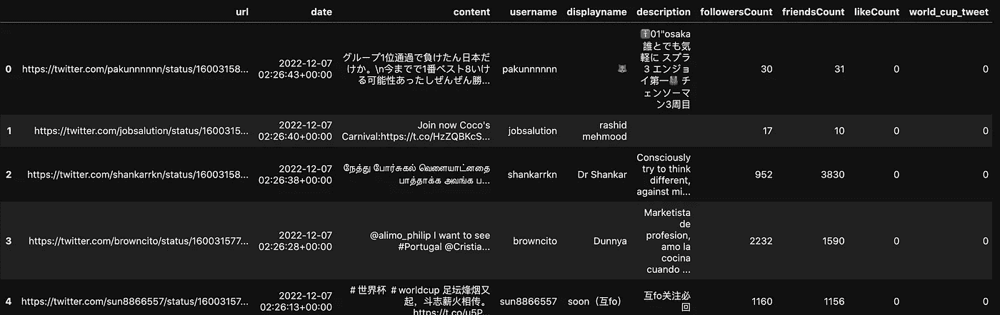
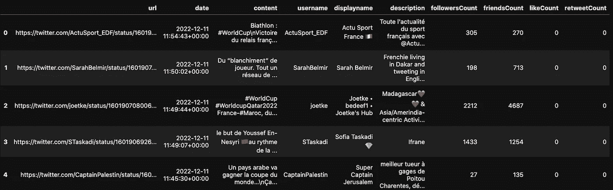
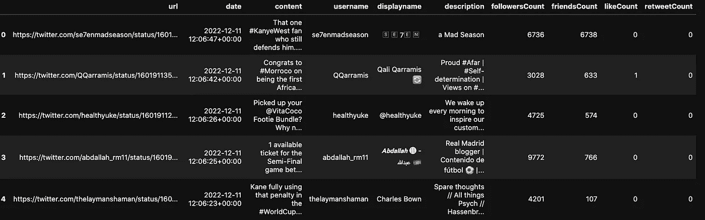

# 使用 Python 在几行代码中无限制地提取推文

> 原文：<https://pub.towardsai.net/extract-tweets-without-limitations-in-a-few-lines-of-code-using-python-21578f89a00c?source=collection_archive---------0----------------------->

## 数据量不应该是一个限制。

喜欢—关注—订阅—分享

# 介绍

如果你熟悉 Tweepy 库，你可能也熟悉这样一个事实，即你不能超过一定数量的 Tweepy，我认为这对于需要大量数据的实验来说是一个巨大的缺点。

城里来了个新玩家:`[snscrape](https://github.com/JustAnotherArchivist/snscrape)`专门为社交网络服务(简称 SNS)打造的 python 库。

它可以从脸书、Instagram、乳齿象、Reddit、Telegram、Twitter、VKontakte 和微博等各种平台收集用户资料、标签和特定用户帖子等信息。

只是锦上添花🍰，你不需要申请任何 API 凭证🎉。

# 我们开始吧

在这个概念教程中，我们将使用`[snscrape](https://github.com/JustAnotherArchivist/snscrape)`提取数千条推文，并在本地保存为数据帧。你可以得到更多。一切都是可能的🚀！

## 先决条件

首先，你必须安装`snscrape`库。但要做到这一点，你需要在电脑上安装 Python，从[官网](https://www.python.org/downloads/)下载安装即可。

一旦你安装了 Python，你就可以在你的终端或者 Jupyter 笔记本中使用下面的`pip`命令来安装`snscrape`:

```
# (1) From your terminal
pip3 install snscrape

# (2) From Jupyter Notebook
!pip3 install snscrape 
```

一旦成功，您应该能够使用以下语句导入它以供进一步使用:

```
import snscrape.modules.twitter as snt
```

这样，您就可以在任何需要使用`snscrape.modules.twitter`模块的地方使用`snt`。

## 抓取推文

一旦库被正确设置，你就可以开始收集你需要的推文了。在这一部分，我们将收集与 2022 年世界杯相关的推文。

拉推需要`TwitterSearchScraper`模块。在深入研究之前，让我们通过获取一个带有标签`#worldcup2022`的 tweet 样本来理解提取的 tweet 信息的输出格式

```
# Get Tweets with the #worldcup
world_cup_scraper = snt.TwitterSearchScraper("#worldcup")

print(type(world_cup_scraper))
```

打印声明显示:

`<class 'snscrape.modumes.twitter.TwitterSearchScraper'>`。这仅仅意味着`TwitterSearchScraper`模块的应用程序也返回一个`TwitterSearchScraper`对象。

为了能够获取实际的 tweets 数据，您需要应用如下所示的`get_items()`函数。

```
# Let's get the first tweet from the world_cup_scraper search
for world_cup_tweet in world_cup_scraper.get_items():
   break
```

前面的 for 循环只抓取第一条 tweet 的数据。我们可以通过键入下面的代码来显示 world_cup_tweet 的原始数据。

```
world_cup_tweet
```


第一条推文的原始数据(图片由作者提供)

正如你所看到的，原始数据是以`key=value`的格式显示的，其中一些带有绿色下划线。并非所有的列都有用。所以让我们只考虑在 column_name 列表中指定的那些。

```
column_names = ['url', 'date', 'content', 'username','displayname',
                'description', 'followersCount', 'friendsCount',
                'likeCount', 'world_cup_tweet']
```

请记住，如果您没有指定要收集的 tweet 的数量，这个抓取过程可能会永远运行下去，试图抓取所有的 tweet。为了简单起见，假设我们想要最多 200000 条推文。

```
total_tweet = 20000
```

将所有这些放在一起，我们得到下面的 helper 函数，它获取所需数量的 tweets。

```
# Putting all togeter
def grab_tweets(total_number):

    final_tweets = []

    for index, world_cup_tweet in enumerate(world_cup_scraper.get_items()):

        user = world_cup_tweet.user

        tweet_data = [world_cup_tweet.url, 
                      world_cup_tweet.date, 
                      world_cup_tweet.content, 
                      user.username, 
                      user.displayname,
                      user.description, 
                      user.followersCount,
                      user.friendsCount,
                      world_cup_tweet.likeCount, 
                      world_cup_tweet.retweetCount
                      ]

        final_tweets.append(tweet_data)

        if(index == total_number):
            break

    # Create the dataframe
    final_tweets_df = pd.DataFrame(final_tweets, columns = column_names)

    return final_tweets_df
```

*   `break`语句很重要，因为它允许程序在到达`total_number`时不再继续。

最后，我们可以调用指定了`total_number`参数的函数，然后我们用`.shape`属性显示数据的形状，用`.head()`函数显示前五行。

```
# Call the grab_tweets() function
final_tweets_data = grab_tweets(20000)

# Show the shape
print(final_tweets_data.shape)

# Show the first 5 rows 
final_tweets_data.head()
```

*   形状为(20000，10) → 20000 行 10 列。

下面是前五行。



推文的前 5 行(图片由作者提供)

## 具体语言的推文呢？

以前的推文是不分语言收集的，如果我们对特定语言的推文感兴趣，这并不理想。例如，假设我们只对法语推文感兴趣，这可以通过在`TwitterSearchScraper`模块中指定`lang`参数来实现，如下所示:

*   `TwitterSearchScraper("topic lang:language")`

为此，我们将创建一个新函数，并稍微修改之前的函数:

```
def get_language_specific_tweets(topic, total_number, lang="fr"):

    # Get the topic from using the scraper and the language
    topic_scraper = snt.TwitterSearchScraper(f"{topic} lang:{lang}")

    # Grab the tweets
    final_tweets_as_df = grab_tweets(topic_scraper, total_number)

    return final_tweets_as_df
```

这个新函数将感兴趣的主题(例如`#worldcup`)、tweets 的总数以及感兴趣的语言(默认为`french`)作为参数。

除此之外，我们稍微修改了一下原来的函数来满足前面函数的要求，因为这次我们有了一个新的参数:`topic_scraper`。

```
# Putting all togeter
def grab_tweets(scraper, total_number):

    final_tweets = []

    for index, world_cup_tweet in enumerate(scraper.get_items()):

        user = world_cup_tweet.user

        tweet_data = [world_cup_tweet.url, 
                      world_cup_tweet.date, 
                      world_cup_tweet.content, 
                      user.username, 
                      user.displayname,
                      user.description, 
                      user.followersCount,
                      user.friendsCount,
                      world_cup_tweet.likeCount, 
                      world_cup_tweet.retweetCount
                      ]

        final_tweets.append(tweet_data)

        if(index == total_number):
            break

    # Create the dataframe
    final_tweets_df = pd.DataFrame(final_tweets, columns = column_names)

    return final_tweets_df
```

这里最后举几个抓取法语推文和英语推文的例子。

```
# French Tweets
topic = "#worldcup"
lang = "fr"
fr_df = get_language_specific_tweets(topic, 200, lang)

fr_df.head()
```



法语推特(图片由作者提供)

```
# English Tweets about worldcup
topic = "#worldcup"
lang = "en"
en_df = get_language_specific_tweets(topic, 200, lang)
```



英文推文(图片作者)

# 结论

在这篇博客中，我们解释了如何使用`snscrape`库抓取推文。我们还演示了如何定制刮擦过程来满足您的需求。`snscrape`绝对是一个必去的图书馆，可以有效地收集用于多种目的的推文。

此外，如果你喜欢阅读我的故事，并希望支持我的写作，可以考虑[成为一个媒体成员](https://zoumanakeita.medium.com/membership)。每月支付 5 美元，你就可以无限制地阅读媒体上的故事。

欢迎在[媒体](https://zoumanakeita.medium.com/)、[推特](https://twitter.com/zoumana_keita_)和 [YouTube](https://www.youtube.com/channel/UC9xKdy8cz6ZuJU5FTNtM_pQ) 上关注我，或者在 [LinkedIn](https://www.linkedin.com/in/zoumana-keita/) 上问好。讨论人工智能、人工智能、数据科学、自然语言处理和人工智能是一种乐趣！