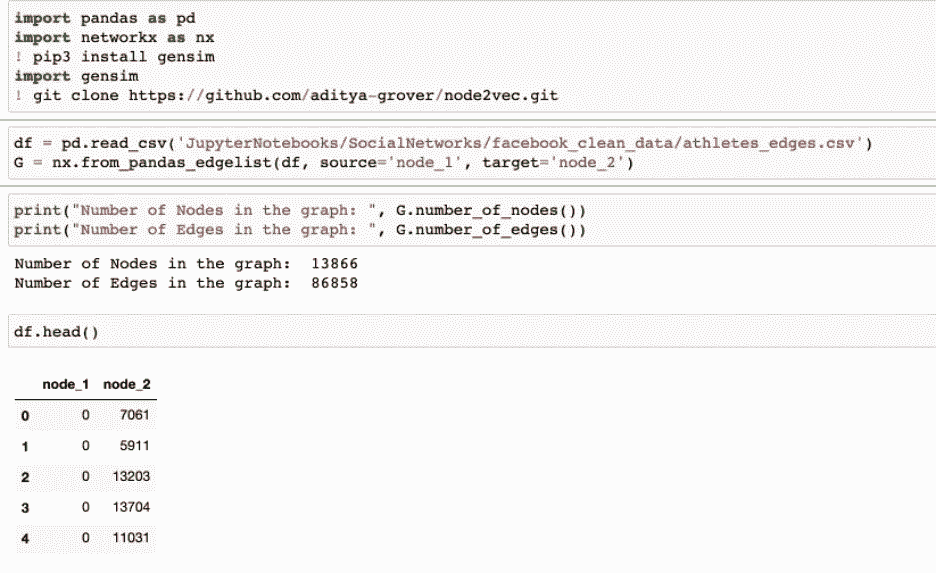
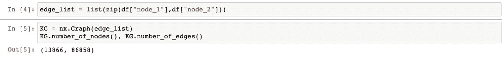
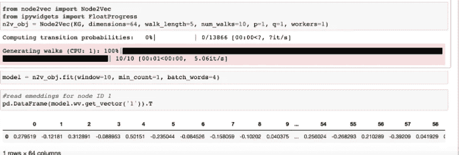
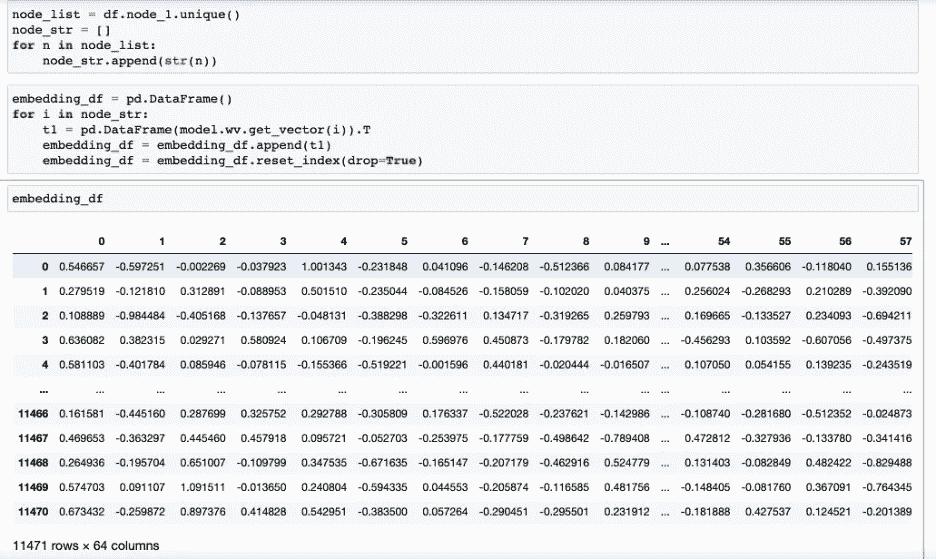
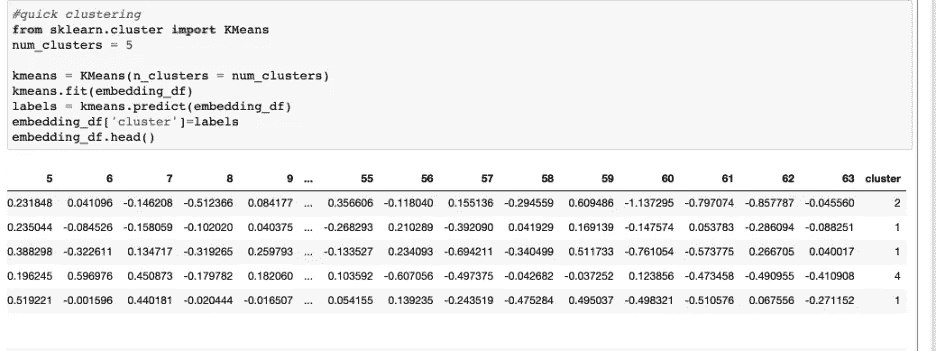
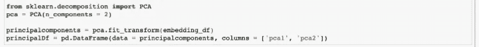
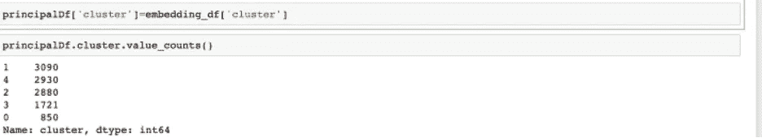
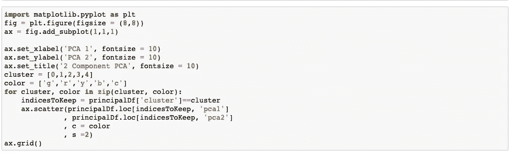
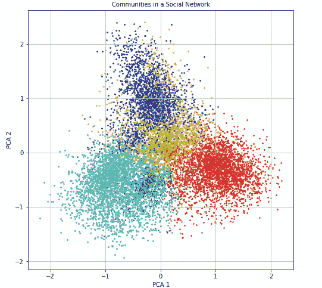

# 使用社会图网络的聚类

> 原文：<https://pub.towardsai.net/extracting-communities-from-social-graph-network-d9213ed9d25a?source=collection_archive---------0----------------------->

## [数据科学](https://towardsai.net/p/category/data-science)

当实体(节点——如人或组织)之间存在一组连接以及它们之间的交互(边——如友谊、契约)时，可以形成社交图网络。在当今世界，有许多社交网络存在——其中一个著名的是脸书的朋友网络。然而，只要我们可以在各种实体之间建立联系，我们就可以将我们周围的许多事情表示为一个社会网络或一个图表

**社交图网络的好处**

可以从这些图中为每个节点生成诸如度中心性、特征向量中心性的影响度量。图中节点与其他节点共享的连接或边也可以使用诸如 Node2Vec 的方法表示为向量，并且这些向量可以用作聚类的特征或者甚至是监督学习模型的特征。

通过在监督学习模型中使用这些向量，目标将是提高性能，而在聚类中使用它们将是找到在整个社交网络中共享相似子图结构的节点组。然后，这些组可用于推荐、客户细分、欺诈检测等。

**什么是 node2vec 嵌入？**

Node2Vec 是 Aditya Grover 和 Jure Leskovec 开发的一种算法，以向量的形式表示图中的节点。节点的向量表示基于图中的随机游走。该算法从 word2vec 的工作方式中获得灵感。然后，这些向量可以用于其他机器学习任务，如监督或无监督学习中的特征。算法的更多细节可以在这里找到[https://arxiv.org/pdf/1607.00653.pdf](https://arxiv.org/pdf/1607.00653.pdf)

**社交网络图上 node2vec 的实现**

在本文中，node2vec 算法是在一个网络图上实现的，该网络图是从快照数据集脸书 Gemsec 数据集生成的。[https://snap.stanford.edu/data/gemsec-Facebook.html](https://snap.stanford.edu/data/gemsec-Facebook.html)。这个数据集代表不同运动员的蓝色验证的脸书页面网络。节点代表运动员的页面，边代表运动员之间的相互喜欢。

步骤 1:导入必要的包并将数据读入 pandas 数据框

它们之间有 13K 个节点和 86K 条边。

步骤 2:在从 pandas 数据帧中提取的边缘列表上运行 Node2Vec。边是连接节点的关系。从这个边列表创建一个图形对象。为了创建图形对象，我们使用 networkx 包。

以下命令将生成 64 维嵌入，这是一个可以优化的参数。

步骤 3:图中所有节点的嵌入被提取并存储在 pandas 数据帧中

步骤 4:聚类:在运行 K-Means 聚类时，我们得到不同的聚类/社区，稍后我们将使用它们来可视化这些嵌入。对于本文，我们假设 5 个聚类，但是，有一些方法，如 scree plot，可以确定 K-Means 的最佳聚类数。

**可视化嵌入和聚类结果:**

为了获得所生成嵌入的视觉视角，我们使用主成分分析(PCA)来降低维度，并将所生成的维度与来自上述步骤的聚类相结合。确保在运行 PCA 之前删除集群列。

从上面的图中，我们可以看到 5 个不同的集群或社区，它们可以通过从图形网络中生成嵌入向量来提取。这些集群现在可用于进一步深入执行客户细分等任务。