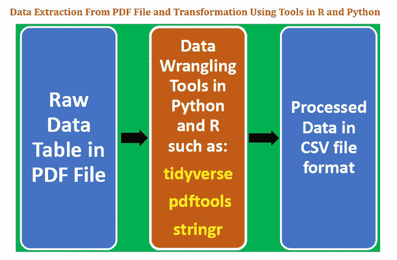
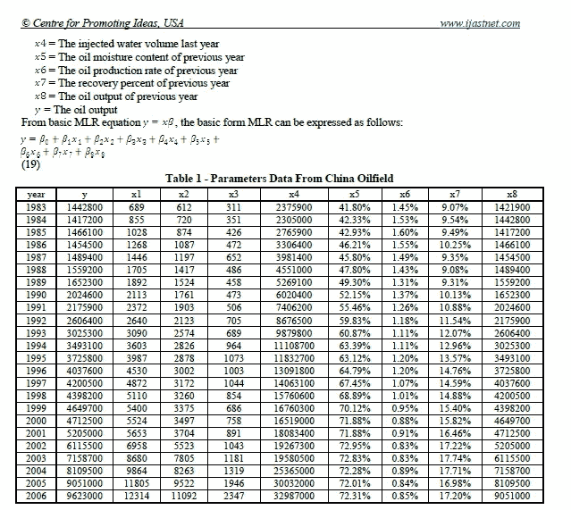
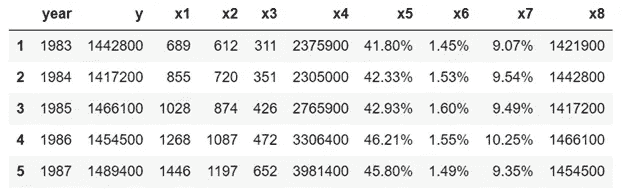
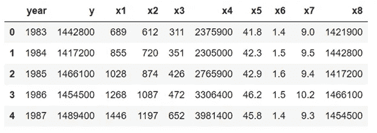
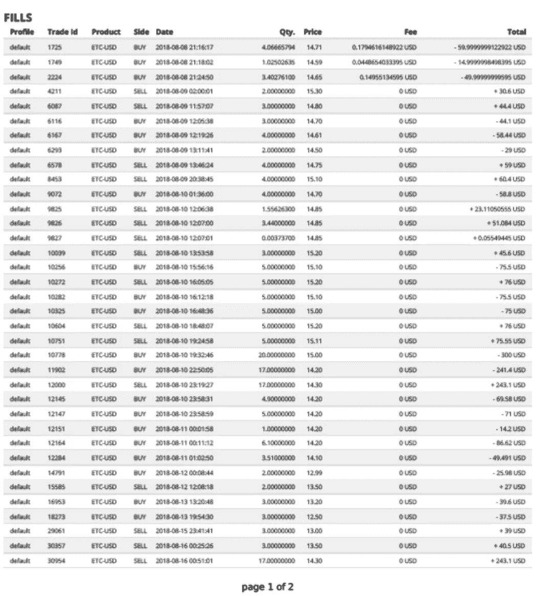
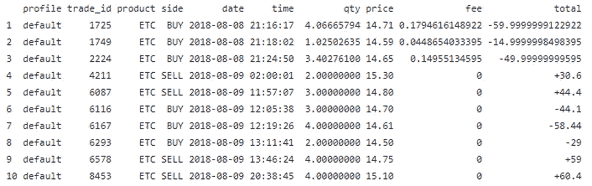

# 使用 Python 和 R 从 PDF 文件中提取数据

> 原文：<https://pub.towardsai.net/extracting-data-from-pdf-file-using-python-and-r-4ed8826bc5a1?source=collection_archive---------0----------------------->

## [数据挖掘](https://towardsai.net/p/category/data-mining)，[数据科学](https://towardsai.net/p/category/data-science)

## 使用 Python & R API 解析 PDF 文件的演示



数据是数据科学中任何分析的关键，无论是推理分析、预测分析还是规定分析。模型的预测能力取决于构建模型时所用数据的质量。数据以不同的形式出现，如文本、表格、图像、声音或视频。最常见的情况是，用于分析的数据必须经过挖掘、处理和转换，才能呈现为适合进一步分析的形式。

大多数分析中使用的最常见的数据集类型是存储在逗号分隔值( **csv** )表中的干净数据。然而，因为可移植文档格式( **pdf)** 文件是最常用的文件格式之一，所以每个数据科学家都应该了解如何从 **pdf** 文件中提取数据，并将数据转换成诸如" **csv"** 之类的格式，以便用于分析或建模。

从一个 **pdf** 文件中逐行复制数据太过繁琐，并且经常会由于过程中的人为错误而导致损坏。因此，了解如何以有效且无错误的方式从 **pdf** 导入数据非常重要。

在本文中，我们将着重于从一个 **pdf** 文件中提取一个数据表。对于从 **pdf** 文件中提取文本或图像等其他类型的数据，可以进行类似的分析。本文着重于从 pdf 文件中提取数字数据。为了从 pdf 文件中提取图像，python 有一个名为 [**minecart**](https://pypi.org/project/minecart/) 的包，可以用来从 pdf 中提取图像、文本和形状。

我们展示了如何从一个 **pdf** 文件中提取一个数据表，然后将其转换成适合进一步分析和建模的格式。我们将给出两个例子，一个使用 Python，另一个使用 r。

1.  从 **pdf** 文件中提取数据表。
2.  使用数据辩论和字符串处理技术清理、转换和结构化数据。
3.  将整洁的数据表保存为 **csv** 文件。
4.  介绍 R 中的数据角力和字符串处理包如**【tidy verse】****【pdf tools】****【stringr】**。

# 示例 1:使用 Python 从 PDF 文件中提取表格

假设我们想从一个 **pdf** 文件中提取下表。

— — — — — — — — — — — — — — — — — — — — — — — — —



— — — — — — — — — — — — — — — — — — — — — — — — —

**a)将表格复制粘贴到 Excel 中，并将文件保存为 table_1_raw.csv**

数据以一维格式存储，必须进行整形、清理和转换。

**b)导入必要的库**

```
import pandas as pd
import numpy as np
```

**c)导入原始数据并重塑数据**

```
df=pd.read_csv("table_1_raw.csv", header=None)df.values.shapedf2=pd.DataFrame(df.values.reshape(25,10))column_names=df2[0:1].values[0]df3=df2[1:]df3.columns = df2[0:1].values[0]df3.head()
```



**d)使用字符串处理工具执行数据辩论**

我们从上表中注意到，列 **x5** 、 **x6** 和 **x7** 是用百分比表示的，因此我们需要去掉百分比(%)符号:

```
df4['x5']=list(map(lambda x: x[:-1], df4['x5'].values))df4['x6']=list(map(lambda x: x[:-1], df4['x6'].values))df4['x7']=list(map(lambda x: x[:-1], df4['x7'].values))
```

**e)将数据转换成数字形式**

我们注意到列 **x5** 、 **x6** 和 **x7** 的列值具有字符串数据类型，因此我们需要将它们转换为数字数据，如下所示:

```
df4['x5']=[float(x) for x in df4['x5'].values]df4['x6']=[float(x) for x in df4['x6'].values]df4['x7']=[float(x) for x in df4['x7'].values]
```

**f)查看转换数据的最终形式**

```
df4.head(n=5)
```



**g)将最终数据导出至 csv 文件**

```
df4.to_csv('table_1_final.csv',index=False)
```

# 示例 2:使用 R 从 PDF 文件中提取表格

这个例子说明了如何使用 r 中的数据角力技术从一个 **pdf** 文件中提取一个表格。让我们假设我们从一个 **pdf** 文件名 **trade_report.pdf** 中得到下面的表格:

— — — — — — — — — — — — — — — — — — — — — — — — —



— — — — — — — — — — — — — — — — — — — — — — — —

我们希望提取该表，整理数据，并将其转换为数据框表，以备进一步分析。最终的数据表可以方便地导出并存储在“**CSV”**文件中。特别是，我们希望实现以下目标:

I)在列**产品**中，我们希望从产品 ETC-USD 中删除 USD。

ii)将**日期**列拆分成两个单独的列，即**日期**和**时间**。

iii)从列**费用**和**总计**中删除美元。

这个例子的数据集和代码可以从这个库下载:[https://github . com/bot 13956/extract _ table _ from _ pdf _ file _ using _ R](https://github.com/bot13956/extract_table_from_pdf_file_using_R)。

**a)导入必要的库**

```
library("tidyverse")library("stringr")library("pdftools")
```

b)提取表格并转换成文本文件

```
**# define file path**pdf_file <- file.path("C:\\Users\\btayo\\Desktop\\TRADE", "trade_report.pdf")**# convert pdf file to text (txt) file**text <- pdf_text(pdf_file)
```

**c)利用字符串处理工具清理和组织数据**

```
tab <- str_split(text, "\n")[[1]][6:31]tab[1] <- tab[1]%>%str_replace("\\.","")
                %>%str_replace("\r","")col_names <- str_replace_all(tab[1],"\\s+"," ")
             %>%str_replace(" ", "")
             %>%str_split(" ")
             %>%unlist()col_names <- col_names[-3]col_names[2] <- "Trade_id"col_names <- append(col_names, "Time", 5)col_names <- append(col_names,"sign",9)length(col_names)==11tab <- tab[-1]dat <- data.frame(
               x=tab%>%str_replace_all("\\s+"," ")
                    %>%str_replace_all("\\s*USD","")
                    %>%str_replace(" ",""),stringsAsFactors = FALSE)data <- dat%>%separate(x,col_names,sep=" ")data<-data%>%mutate(total=paste(data$sign,data$Total,sep=""))
          %>%select(-c(sign,Total))names(data)<- names(data)%>%tolower()data$product <- data$product%>%str_replace("-$","")
```

**d)查看转换数据的最终形式**

```
data%>%head()
```



数据集和代码，例如 2 可以从这个库下载:[https://github . com/bot 13956/extract _ table _ from _ pdf _ file _ using _ R](https://github.com/bot13956/extract_table_from_pdf_file_using_R)。

总之，我们已经展示了如何从 **pdf** 文件中提取数据表。由于 **pdf** 文件是一种非常常见的文件类型，每个数据科学家都应该熟悉提取和转换存储在 **pdf** 文件中的数据的技术。