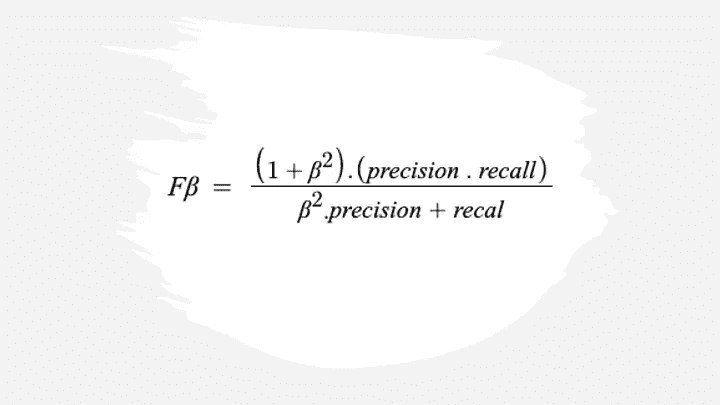
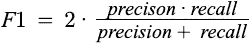
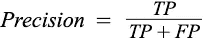
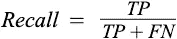
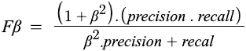
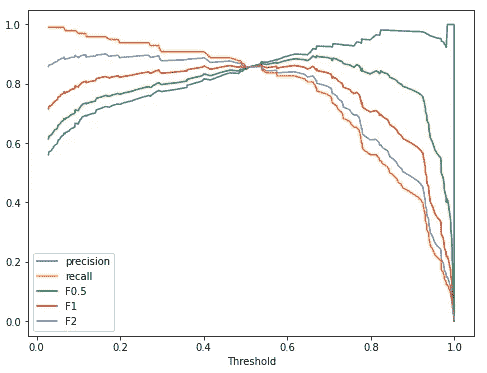
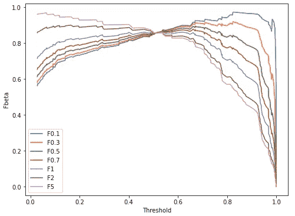

# F1 到 F-beta

> 原文：<https://pub.towardsai.net/f1-to-f-beta-2dc4b957ba11?source=collection_archive---------3----------------------->

## 模型评估



作者图片

# F1 分数

F-1 分数是一个流行的二进制分类指标，代表了**精度**和**召回**之间的平衡。这是精确和回忆的调和平均值。下面的等式可以表示 F-1 分数。



其中**精度**可以定义为作为正类实际成员的正预测的概率。



**召回**是定义为在实际肯定中肯定预测的概率。



其中 **TP** 为**真阳性**， **FP** 为**假阳性，**和 **FN** 为**假阴性**。

*让我们探索一下在 sklearn 中使用虚拟数据集的二元分类问题的 F1 分数。*

```
from sklearn.datasets import make_classification
from sklearn.model_selection import train_test_split
from sklearn.linear_model import LogisticRegression
from sklearn.metrics import f1_scoreX, y = make_classification(n_samples=1000, n_classes=2,
                           random_state=1)
X_train, X_test, y_train, y_test = train_test_split(X, y,
                                                    test_size=.2,
                                                    random_state=2)
lr = LogisticRegression()
lr.fit(X_train, y_train)
y_pred = lr.predict(X_test)
y_pred_prob = lr.predict_proba(X_test)
y_pred_prob = y_pred_prob[:,1]
f1_score(y_test, y_pred)**Output:** 0.8585858585858585
```

虽然许多机器学习和深度学习实践者经常使用 F1 分数进行模型评估，但很少有人熟悉 F-measure，这是 F1 分数的一般形式。

**F-beta 评分**

F-beta 分数的计算遵循与 F1 分数相同的形式。与 F1 分数中的调和平均值不同，它是精确度和召回率的**加权**调和平均值，在 1 处达到最佳值，在 0 处达到最差值。



`beta`参数决定了回忆在综合得分中的权重。`beta < 1`更重视精确度，而`beta > 1`更喜欢回忆。

我们来看看 F-beta 的分数，以及数值是如何随 beta 波动的。

```
from sklearn.metrics import fbeta_scoreprint(fbeta_score(y_test, y_pred, beta=0.5))
print(fbeta_score(y_test, y_pred, beta=1))
print(fbeta_score(y_test, y_pred, beta=2))**Output:** 0.853413654618474
0.8585858585858585
0.8638211382113821
```

在这里，我们已经注意到 F-beta 随着 beta 移动而变化，现在让我们看看在不同阈值下相同的相对于精度和召回曲线。

```
import matplotlib.pyplot as plt
from sklearn.metrics import recall_score
from sklearn.metrics import precision_score
from sklearn.metrics import precision_recall_curve_, _, threshold = precision_recall_curve(y_test, y_pred_prob)f1score = list()
f05score = list()
f2score = list()
precision = list()
recall = list()
for th in threshold:                                                    
    y_test_pred = list()
    for prob in y_pred_prob:
        if prob > th:
            y_test_pred.append(1)
        else:
            y_test_pred.append(0)

    f1score.append(f1_score(y_test, y_test_pred))
    precision.append(precision_score(y_test, y_test_pred))
    recall.append(recall_score(y_test, y_test_pred))
    f05score.append(fbeta_score(y_test, y_test_pred, beta=0.5))
    f2score.append(fbeta_score(y_test, y_test_pred, beta=2))_, ax = plt.subplots(figsize=(8, 6))
ax.set_xlabel('Threshold')
plt.plot(threshold, precision, label='precision')
plt.plot(threshold, recall, label='recall')
plt.plot(threshold, f05score, label='F0.5')
plt.plot(threshold, f1score, label='F1')
plt.plot(threshold, f2score, label='F2')
plt.legend(loc='lower left')
```



精确度、召回率、F1 与阈值|作者图片

从上图中可以明显看出，当我们从 0 开始增加 beta 值时，曲线开始向召回曲线移动，这意味着 beta 值的增加赋予召回更多的重要性，下面的代码绘制了不同 beta 值和阈值下的 F-measure。

```
betas = [0.1, 0.3, 0.5, 0.7, 1, 2, 5]
_, ax = plt.subplots(figsize=(8, 6))
ax.set_xlabel('Threshold')
ax.set_ylabel('Fbeta')
for beta in betas:
    fbetascore = list()
    for i, th in enumerate(threshold):
        y_test_pred = list()
        for prob in y_pred_prob:
            if prob > th:
                y_test_pred.append(1)
            else:
                y_test_pred.append(0)
        fbetascore.append(fbeta_score(y_test, y_test_pred,
                                      beta=beta))
    plt.plot(threshold, fbetascore, label=f'F{beta}')
plt.legend(loc='lower left')
```



Fbeta 与阈值|作者图片

**参考文献:**

[1] F1 分数。[https://sci kit-learn . org/stable/modules/generated/sk learn . metrics . f1 _ score . html # sk learn . metrics . f1 _ score](https://scikit-learn.org/stable/modules/generated/sklearn.metrics.f1_score.html#sklearn.metrics.f1_score)

[2] Fbeta 分数。[https://sci kit-learn . org/stable/modules/generated/sk learn . metrics . fbeta _ score . html](https://scikit-learn.org/stable/modules/generated/sklearn.metrics.fbeta_score.html)