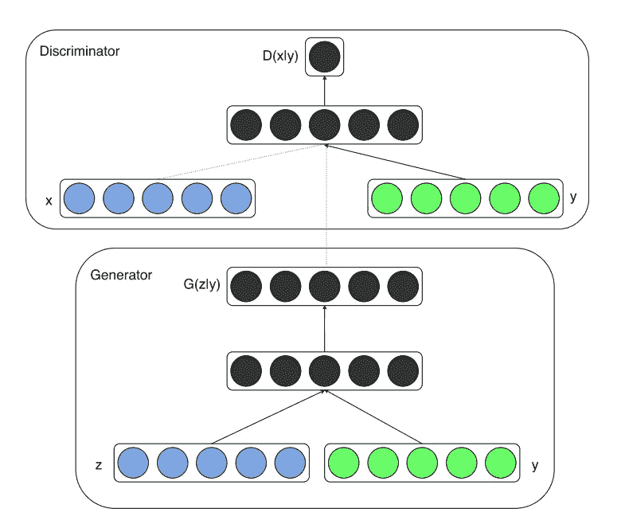
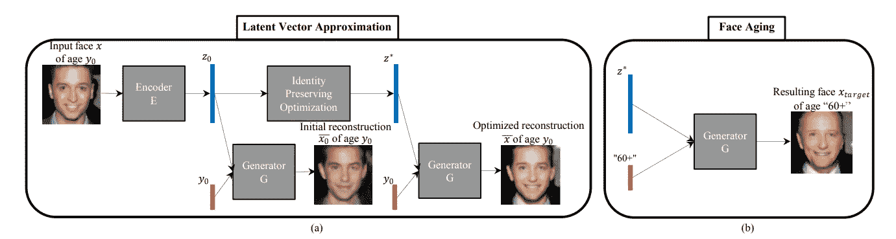
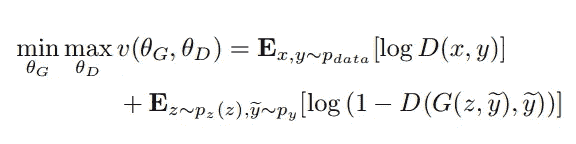
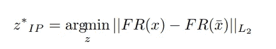
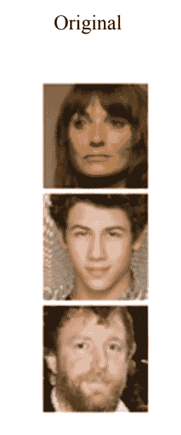
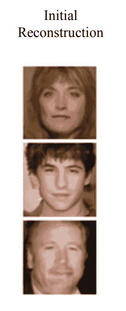
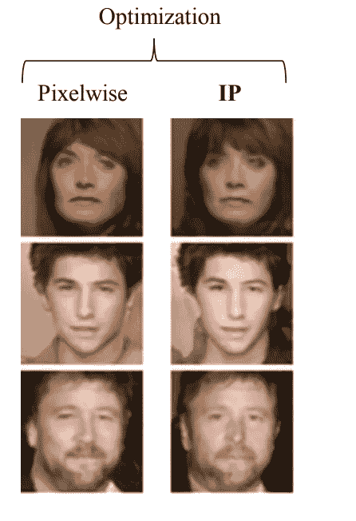

# 使用条件 GANs 的人脸老化

> 原文：<https://pub.towardsai.net/face-aging-using-conditional-gans-an-introduction-to-age-cgans-machine-learning-8a4a6a100201?source=collection_archive---------1----------------------->

## Age-cGANs 向 AI 解释|

## Age-cgan 简介

# 介绍

**条件 GANs** ( [**CGANs**](https://arxiv.org/abs/1411.1784) )是 GANs 模型的扩展。你可以在我之前的帖子[这里](https://medium.com/datadriveninvestor/an-introduction-to-conditional-gans-cgans-727d1f5bb011)阅读**条件句**。在这篇文章中，我将尝试解释我们如何实现一个 **CGANs** 来执行自动人脸老化。**人脸衰老 cGAN(Age-cGANs)** 由 Grigory Antipov、Moez Baccouche 和 Jean-Luc Dugelay 等人提出，在他们题为 [***的论文中提出人脸衰老与条件生成对抗网络***](https://arxiv.org/pdf/1702.01983.pdf) ***。***

# 高级 CGANs 的架构图

[**cGANs 架构**](https://medium.com/@connorshorten300/conditional-gans-639aa3785122)

# 时代·卡根斯的建筑

**脸老化-cGan** 有四个网络。

**编码器:**利用潜在向量 z 学习输入面部图像和年龄条件的逆映射

*   **编码器**网络生成输入图像的潜在向量。**编码器**网络是一个 CNN，它获取(64，64，3)维的图像，并将其转换为 100 维的向量。
*   有四个卷积块和两个密集层。
*   每个卷积块都有一个卷积层，后面是一个批量归一化层，除了第一个卷积层，还有一个激活函数。

**A FaceNet :** 它是一个面部识别网络，学习输入图像 x 和重建图像 x’之间的差异。

*   **FaceNet** 在给定的图像中识别一个人的身份。
*   可以使用没有完全连接的层的预训练的 Inception、ResNet-50 或 Inception-ResNet-2 模型。
*   可以通过计算嵌入的欧几里德距离来计算真实图像和重建图像的提取嵌入。

**生成器网络:**它将人脸图像的隐藏表示和条件向量作为输入，生成图像。

*   **生成器**网络是 CNN，它采用 100 维的潜在向量和条件向量 y，并试图生成(64，64，3)维的真实图像
*   **生成器**网络具有密集层、上采样层和卷积层。
*   它有两个输入，一个是噪声向量，第二个是条件向量。
*   条件向量是提供给网络的附加信息。对于年龄-cGAN，这将是年龄。

**一个鉴别器网络:**它试图区分真实图像和虚假图像。

*   **鉴别器**网络是一个 CNN，它预测给定的图像是真是假。
*   有几个卷积块。每个卷积块包含一个卷积层，后跟一个批量归一化层和一个激活函数，但第一个卷积块除外，它没有批量归一化层。

[**在面对衰老的方法。(a)逼近潜在向量以重建输入图像；(b)在发生器 G 的输入端切换老化条件以执行面部老化。**](https://arxiv.org/pdf/1702.01983.pdf)

# 老龄化-cGANs 的培训

Age-cGAN 有四个网络，分三步训练。

**条件 GAN 训练:生成器**和**鉴别器**网络训练。

*   cGAN 训练可以表示为函数 v(θG，θD)的优化，其中θG 和θD 分别是 G 和 D 的参数。

[**为 cGANs 的训练目标函数**](https://arxiv.org/pdf/1702.01983.pdf)

在哪里

*   log D(x，y)是**鉴别器**模型的损耗。
*   log(1-D(G(x，y′)，y′))是**发电机**模型的损耗。
*   p(数据)是所有可能图像的分布。

**初始潜在向量逼近:编码器**网络训练。

*   初始潜在向量逼近法利用逼近一个潜在向量来优化人脸图像的重建。
*   **编码器**是一个逼近潜在向量的神经网络。
*   我们在生成的图像和真实图像上训练编码器网络。
*   一旦被训练，编码器网络将开始从学习的分布产生潜在向量。
*   用于训练编码器网络的训练目标函数是欧几里德距离损失

**潜在向量优化:**同时优化**编码器**和**发电机**网络。

[**为潜在向量优化方程**](https://arxiv.org/pdf/1702.01983.pdf)

在哪里

*   FR 是面部识别网络，用于在输入面部图像 x 中识别人的身份
*   上面的等式是真实图像 x 和重建图像 x '之间的欧几里德距离，并且它应该是最小的。
*   最小化这个欧几里德距离应该改善重建图像中的身份保持。

[**一个**](https://arxiv.org/pdf/1702.01983.pdf)

[T5 b](https://arxiv.org/pdf/1702.01983.pdf)

[**c**](https://arxiv.org/pdf/1702.01983.pdf)

[**d**](https://arxiv.org/pdf/1702.01983.pdf)

*   图像(a)是原始测试图像。
*   图像(b)是使用初始潜在近似值 z0 生成的重建图像。
*   图像(c)是使用“像素方式”和“身份保持”优化潜在近似生成的重建图像:z∫pixel 和 z∫IP。
*   图像(d)是使用身份保持 z∫IP 潜在近似生成的重建图像的老化，并以相应的年龄类别 y(每列一个)为条件。

**伴随 jupyter 本帖的笔记本可以在**[**Github**](https://github.com/nitwmanish/Face-Aging-Using-Conditional-GAN)**上找到。**

# 结论

**年龄-cGANs** 也可以用来构建*人脸老化*系统*，*年龄合成和年龄进展有许多实际的工业和消费应用像跨年龄人脸识别、寻找走失的孩子、娱乐、电影中的视觉效果。

***我希望这篇文章能很好地解释和理解*年龄 cgan，并*帮助你开始构建自己的*年龄 cgan*。***