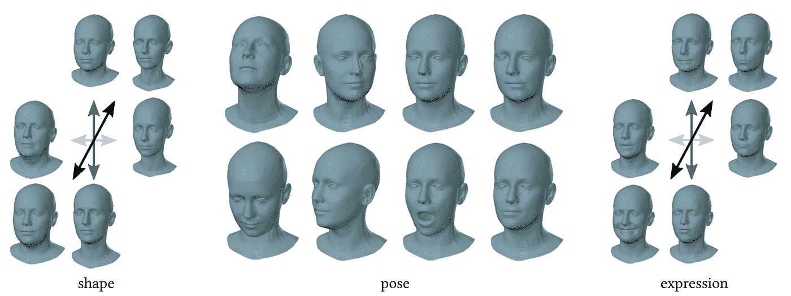
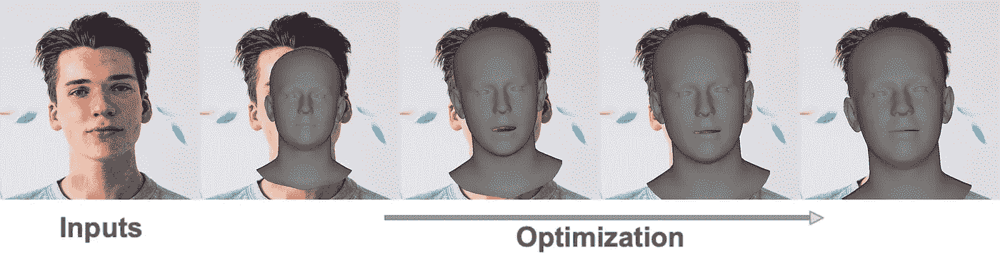
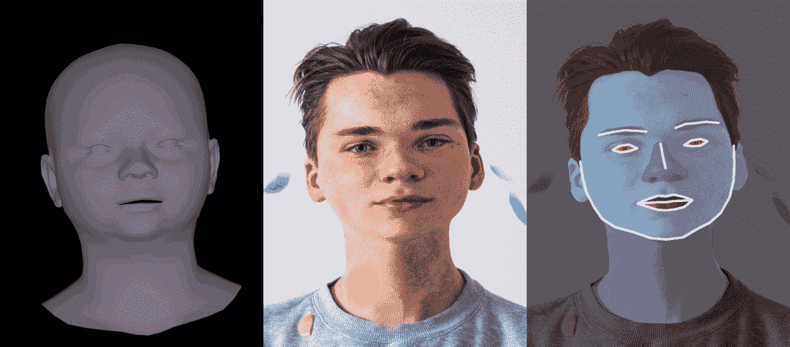

# 面部数据增强。第 1 部分:几何变换

> 原文：<https://pub.towardsai.net/face-data-augmentation-part-1-geometric-transformation-4865abc9e1ba?source=collection_archive---------3----------------------->

深度神经网络的性能在过去二十年中向前迈进了一大步。每年都有新的架构被设计出来，超越最先进的成果。然而，没有高质量的数据集，仅仅改进架构是不行的。数据集对最终性能有很大影响。收集和标记不同的、准确的数据集可能是费力和昂贵的，并且现有的数据集通常不覆盖真实数据分布的全部种类，因此使用数据扩充技术。在本文中，我将展示如何通过 3D 几何变换来丰富人脸数据集，从而提高模型的性能。下面提供了开放源代码实现[1]。

数据扩充是一种通过对样本进行不同的修改来增加数据量的技术。普通图像增强可以分为两类:几何变换和颜色变换。几何变换包括缩放、裁剪、翻转、旋转、平移等。而颜色变换包括颜色抖动、噪声添加、灰度调整、亮度/对比度调整等。

让我们想想，如果我们知道有一张人脸，我们该如何放大图像。我们如何区分一个人和另一个人？有构成身份的面部特征，如肤色、脸型、发型、皱纹、眼睛颜色等。其中最可区分的是脸型。因此，如果我们改变输入人脸图像的形状，对于一个可训练的模型来说，它将是一个稍微不同的人。因此，让我们使用这个属性来扩充我们的数据集。

图来自火焰工程[2]。

我们将通过使用 3D 变形模型(3DMM)来改变面的几何形状，特别是火焰[2]模型。3DMM 是一种三维网格，具有操纵其形状、姿势和表达的参数。3DMM 由已经从真人注册的三维网格构成。因此它可以代表真实人脸形状的分布。在引擎盖下，它由平均形状和一组主要成分组成，这些成分指定了形状和表情的变化方向。α和β是模型的参数。

在改变脸型之前，我们需要找到对应于我们输入照片的 3DMM 的参数。有几种方法可以做到这一点，如优化界标，光度优化，或回归模型预测参数在一个步骤中。我使用 2D 地标优化，因为它有一个简单的实现，并在合理的时间内给出准确的结果。使用 Dlib 面部检测模型在输入图像上检测面部标志。Adam 优化算法与地标的 MSE 损失一起使用，以将 3DMM 拟合到人脸图像中。大约经过 150 次迭代才收敛。

作者图。原图来自[迈达斯](https://unsplash.com/@midashofstra)。

现在我们准备修改面的几何图形。首先，我们已经有了一个与人脸图像对齐的三维网格。с悬挂 3DMM 的形状参数导致网格顶点在图像空间的移动。知道了位移，我们可以用它来移动图像的像素。为了获得密集的偏移贴图，我使用了 OpenGL 库，其中我使用 x 和 y 方向的偏移而不是顶点颜色来渲染 3DMM 网格。还有一件事需要考虑，如何处理人脸网格区域之外的像素。为了这个目的，我使用了外推法，这种方法将改变后的人脸与静态背景平滑地连接起来。只要我们有 x 和 y 方向的密集移位映射，我们就可以将它们应用于任何类型的标签，如面部标志、分段遮罩或成对图像。下图可以看到几何变换的隆脸例子。如果你想知道更多的细节，我邀请你去源代码[1]。

作者图。原图来自[迈达斯](https://unsplash.com/@midashofstra)。

现在，您可以在数据集上尝试它。这种增强技术将帮助您改进模型，使其对输入变化保持稳定。在本文中，我们学习了 3D 几何变换，但除此之外，还有纹理修改，这是对人脸数据集的进一步改进，将在下一篇文章中介绍。

**参考文献**

[1] GitHub 代码。【https://github.com/ainur699/face_data_augmentation 

[2]火焰模型。[https://flame.is.tue.mpg.de/index.html](https://flame.is.tue.mpg.de/index.html)