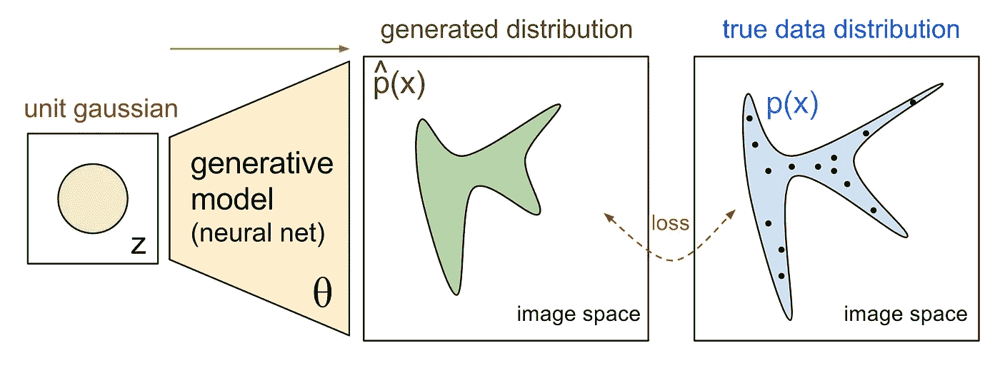
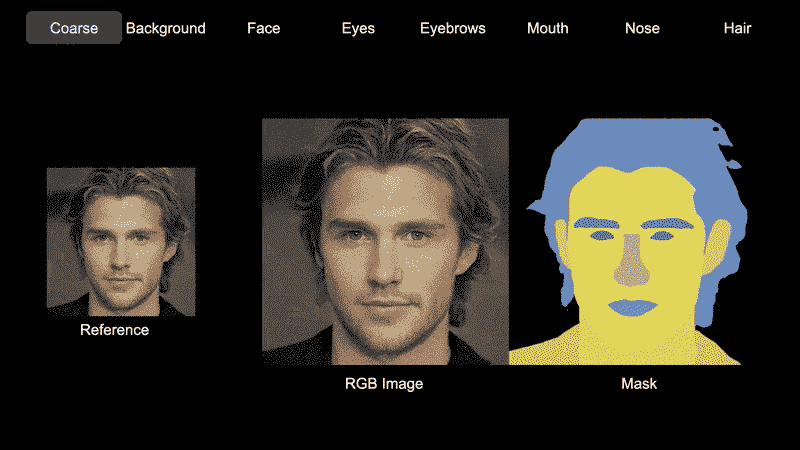
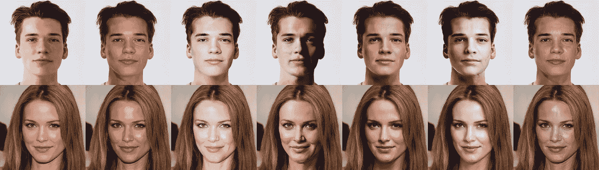
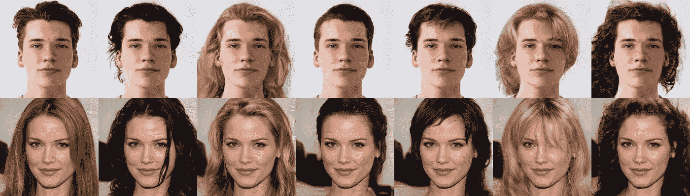

# 面部数据增强。第 2 部分:图像合成

> 原文：<https://pub.towardsai.net/face-data-augmentation-part-2-image-synthesis-ffc642ed0ac2?source=collection_archive---------4----------------------->

## 在这篇论文中，我提出了使用最近提出的 GANs 生成用于面部增强的合成图像的方法。

深度学习的一个基本瓶颈是数据可用性。模型的有效训练需要大量的数据。大量的技术被用于数据集扩充以增加训练样本的数量。典型的数据扩充包括一组非常有限的变换，如现有图像的旋转、反射、裁剪、平移和缩放。从图像的微小变化中可以获得一些额外的信息。合成数据增强是一种新的高级数据增强类型。由生成模型产生的高质量合成数据促进了更多的可变性并丰富了数据集以进一步改进模型。

生成模型的巨大进步为从经过训练的分布中创建新数据提供了强大的工具。数学上，生成模型的工作方式如下。图 1 右侧的黑点代表真实数据分布的图像。黄色的生成模型将单位高斯分布映射为绿色的生成分布。生成的分布а的形状取决于模型参数θ。训练的目标是找到参数θ，使生成的数据分布和真实数据分布之间的差异最小化。

图一。从[到](https://openai.com/blog/generative-models/)的创成式模型示意图。

最流行的生成模型有生成对抗网络(GAN)、变分自动编码器(VAE)和扩散模型。GAN 由两个模型组成，一个生成器和一个鉴别器，它们相互竞争，同时使彼此变得更强。鉴别器学习区分真实或伪造的输入图像，而生成器学习生成鉴别器无法区分的伪造样本。VAE 由两部分组成:编码器和解码器。编码器将输入数据编码成潜在的表示，特别是高斯分布。解码器将潜在点从高斯分布解码回数据空间。扩散模型逐步将高斯噪声添加到数据中，然后学习反转这一过程以生成样本。

让我们看看如何使用 GANs 进行图像增强。有时候，获取一个大的、多样化的、高质量的数据集是不可能的，或者是费力的。在为诸如分类、对象检测、分割等任务训练模型之前，在有限数据上训练 GAN 是有益的。一旦我们训练了一个模型，我们就可以生成尽可能多的数据。当然，这种合成的多样性是有限的，因为我们训练的 GAN 只是复制训练数据。如果我们在更大的数据集上对 GAN 进行预训练，情况就完全不同了。在这种情况下，预先训练的 GAN 可以预先生成丰富多样的数据。如果预训练和训练数据的分布足够接近，微调步骤学习训练数据分布，同时保留预训练模型的属性。这允许您将数据集的大小定性地增加几个数量级。

GANs 的一个有用的特性是操纵图像生成过程的能力。我们先来看看人脸生成领域最热门的 GAN——StyleGan[1]。它不是将输入的 512 维高斯噪声直接映射到图像，而是将其映射到相同维的中间潜在码。神经网络学会解开面孔表征，创造有意义的潜在空间。它可以操控人脸。在这个潜在空间中有一些方向对应着面部的变化，比如性别、发型、情绪、形状等等。向某个方向改变潜在代码，我们分别改变生成的图像。

另一个生成模型 SemanticStyleGAN[2]控制每个面部语义部分的生成，如形状、颜色、眼睛、眉毛、嘴、鼻子、头发、背景等。作者建议对每个面部部分使用不同的潜在代码，并对每个潜在代码使用相应的本地生成器。局部生成器将潜在代码映射到带有深度掩模的面部部分，然后将它们组合成一幅图像。这为图 2 所示的面部图像提供了更精确的局部控制。

图二。SemanticStyleGAN[2]潜在空间修改源于[这个](https://semanticstylegan.github.io/)。

增强过程如下所示。我们从单位高斯分布中提取生成的图像，或者将任何人脸照片转换到潜在空间。可以通过优化算法进行反演。对于我们的图像和反转图像之间的完全相似性，我们可以在计算的潜在代码上微调 GAN 大约 300 次迭代。现在，我们可以通过将我们的潜在代码与其他面部的潜在代码混合来改变面部语义。例如，如果我们解决了人脸识别的问题，我们会对保留身份感兴趣，并对光照条件和发型进行修改。为此，我们冻结了所有潜在的代码，除了负责闪电和理发的代码，并改变它们，如图 3 和图 4 所示。

图 3。合成面部闪电增强。作者图。

图 4。合成面部理发增强。作者图。

生成模型合成似是而非的多样化图像的能力为提高深度学习模型的性能提供了新的机会。在本文中，我们讨论了如何使用 GANs 进行人脸数据增强的几种方法。

感谢您的阅读。我希望这能帮助你改进你的模型。

**参考文献:**

1.  基于风格的生成对抗网络生成器体系结构。泰罗·卡拉斯，萨穆利·莱恩，提莫·艾拉。
2.  可控图像合成和编辑的学习合成生成先验。石宜春，肖扬，杨月婉，沈晓慧。
3.  SemanticStyleGAN 项目地点:[https://semantic stylegan . github . io](https://semanticstylegan.github.io)