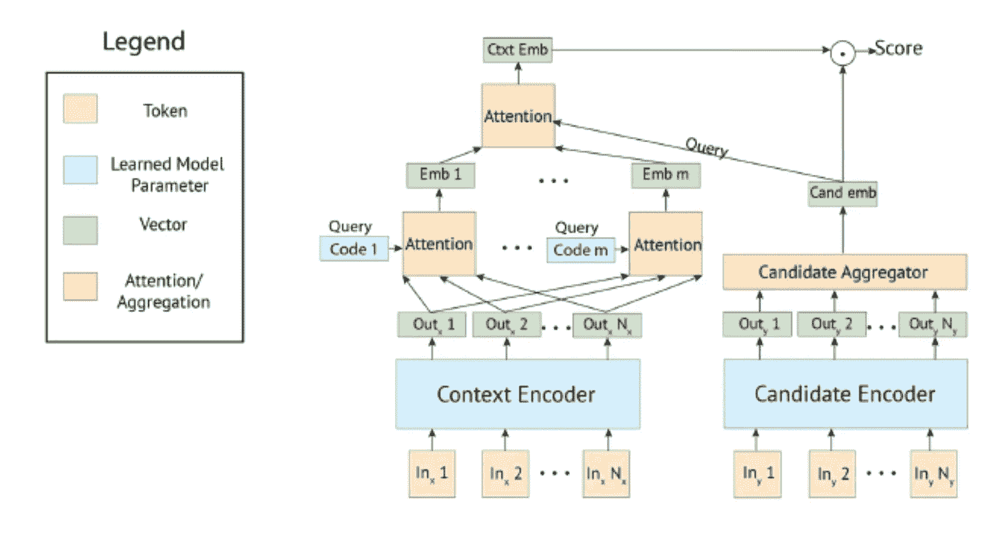
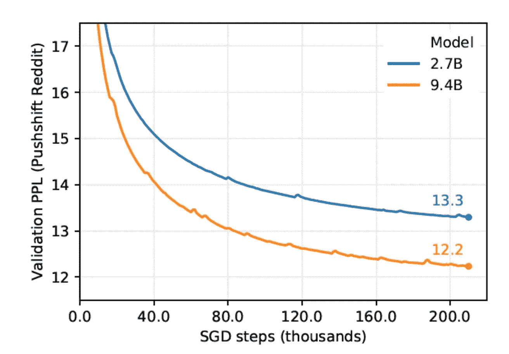
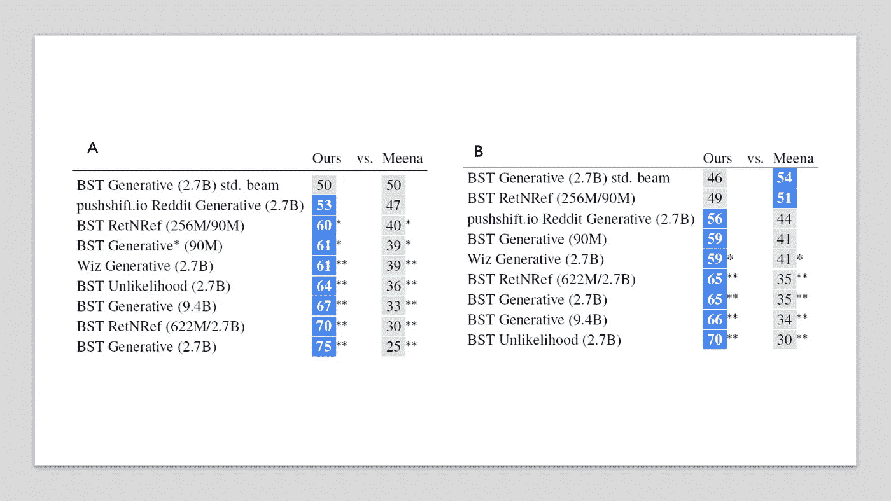
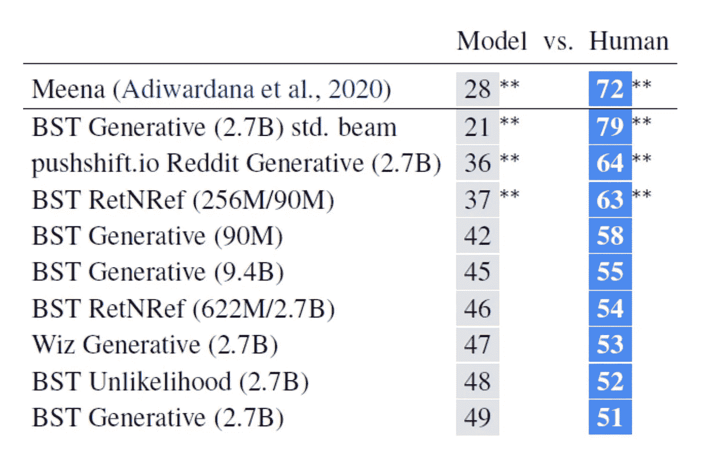
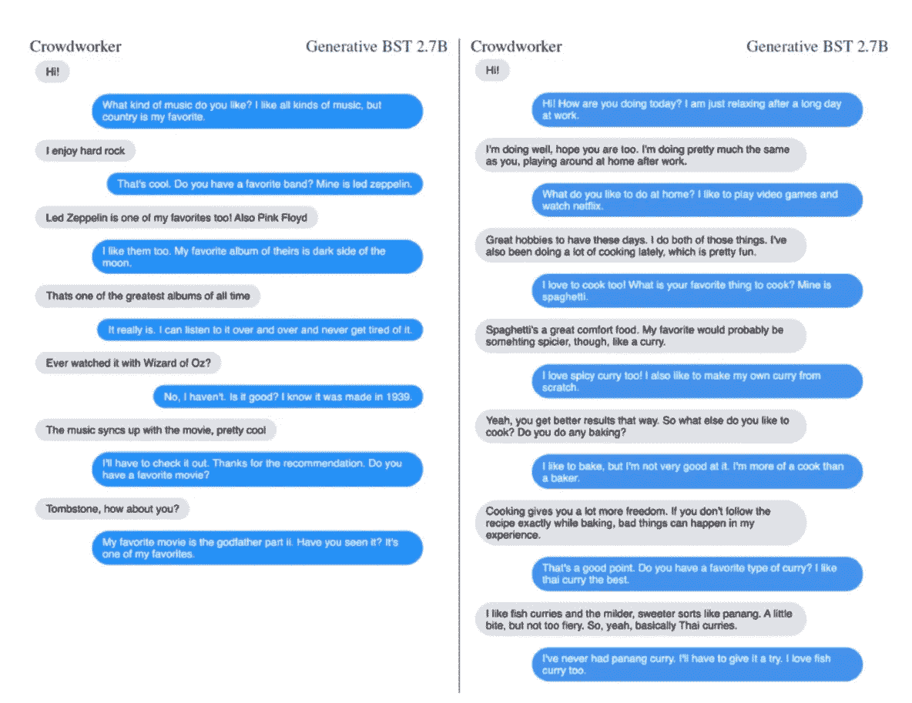

# 脸书搅拌机是一个开源聊天机器人，可以谈论任何话题

> 原文：<https://pub.towardsai.net/facebook-blender-is-a-open-source-chatbot-that-can-converse-about-any-topic-acf5a6bdc1e0?source=collection_archive---------0----------------------->

## [创新](https://towardsai.net/p/category/innovation)

## 新的对话代理在几乎任何话题的对话中都表现出类似人类的行为。

来源:[https://www . engadget . com/Facebook-chatbot-ai-open-source-blender-150001320 . html](https://www.engadget.com/facebook-chatbot-ai-open-source-blender-150001320.html)

> 我最近创办了一份专注于人工智能的教育时事通讯，已经有超过 70，000 名订户。《序列》是一份无废话(意思是没有炒作，没有新闻等)的 ML 导向时事通讯，需要 5 分钟阅读。目标是让你与机器学习项目、研究论文和概念保持同步。请通过订阅以下内容来尝试一下:

 [## 序列

### 该序列解释了主要的机器学习概念，让你与最相关的项目和最新的…

thesequence.substack.com](https://thesequence.substack.com/) 

自然语言理解(NLU)是采用最先进的深度学习技术的最活跃的领域之一。今天，我们有几十个主流的 NLU 栈，可以用最少的努力实现相当复杂的对话代理。然而，绝大多数会话模型仍然高度局限于单个主题。业界将这些代理称为封闭域聊天机器人。与封闭领域聊天机器人相反的是对话代理，它们可以参与模拟人类对话风格的多种主题的对话。我们称这种类型的代理为开放域聊天机器人，它们很难实现。几个月前，脸书人工智能研究(FAIR)团队公布了有史以来最大的开放域聊天机器人 Blender 的研究和[开源代码](https://parl.ai/projects/blender/)。

出于几个原因，寻求建立能够模仿人类对话的开放域对话代理是 NLU 研究的重点。从婴儿时期起，语言就是人类智力发展的一个基本要素。在这个过程中，我们获得了一系列的技能，比如倾听的能力，移情能力，或者将不同的反应与一致的观点或价值观结合起来的能力，这些都是人类交流的基本要素。虽然我们仍然不理解这些能力的神经科学架构，但我们可以同意，它在 NLU 智能体中的再现是实现人类水平的通信所必需的。毫不奇怪，许多从事开放领域聊天机器人研究的公司都是在对话界面方面投入巨资的技术巨头。几个月前，[谷歌公布了 Meena](https://towardsdatascience.com/inside-the-machine-learning-that-google-used-to-build-meena-a-chatbot-that-can-chat-about-anything-32e4d2242f79) 背后的研究，Meena 是一个可以参与不同主题对话的对话代理。尽管做出了这些努力，开放域聊天机器人的实现仍然极具挑战性。特别是，有三个关键挑战对于使用当前一代 NLU 技术实现开放域聊天机器人来说仍然非常关键。

1) **大规模预训练:**如今构建开放域聊天机器人需要大规模的预训练模型。这种方法已经被最近的语言代理所证明，如谷歌的伯特或微软的图灵-NLG。

2) **融合技巧:**同理心、独特的个性或情境化的知识等能力对于良好的对话至关重要。

3) **人的主观性:**没有一种有效的方法可以量化一段类似人类的对话。为此，我们仍然依赖人类的判断。研究表明，回答的长度等主观因素会影响人们对质量的判断。

# 搅拌机

Blender 是一个开源的开放域聊天机器人，作为 ParlAI 项目的一部分发布。Blender 能够参与几乎任何主题的各种各样的对话，同时显示出类似人类的特征，如同理心和友好的参与程度。为了实现这一目标，脸书团队必须直接应对上一节中概述的一些挑战。

## 预训练量表

Blender 基于一个类似于 BERT 或图灵-NLG 项目的 transformer 架构。Blender 的当前版本使用 94 亿个参数的预训练神经网络。那么大的神经网络可以在一台设备上运行。因此，Blender 使用列式并行技术将 Blender 拆分为较小的神经网络，这些神经网络可以并行执行，同时保持较高的效率。

## 混合技巧

为了评估 Blender 不同的类似人类的对话技能，脸书团队依赖于一项名为[混合技能对话](https://arxiv.org/abs/2004.08449) (BST)的平行研究工作。BST 是一个新的数据集和基准，用于评估对话代理中的知识和同理心等能力。具体来说，BST 结合了以下数据集来评估不同的混合技能:

*   引人入胜地运用个性( [PersonaChat](https://arxiv.org/abs/1801.07243)
*   运用知识([维基百科的向导](https://arxiv.org/abs/1811.01241))
*   移情的展示([移情对话](https://arxiv.org/abs/1811.00207))
*   将这三者无缝融合的能力

BST 的使用使 Blender 能够学习不同的行为，例如改变音调以显得对另一方感同身受，或者对笑话做出适当的反应。

## 生成策略

如前所述，回答的长度等方面会对谈话的质量产生很大的影响。为了控制这一点，Blender 依赖于超参数搜索的微调模型，该模型有助于平衡知识显示和长度之间的权衡。

# 搅拌机架构

Blender 是三个 Transformer 架构的组合，优化了开放域聊天机器人的不同方面。

**1)检索器:**检索器变换器接收对话历史作为输入，并选择下一个话语。这通常是通过在训练集中选择所有可能响应的最高分数来完成的。

**2)生成器:**生成器转换器是一个 Seq2Seq 模型，它生成不同的响应，而不是从训练数据集中选择它们。Blender 利用 ParlAI 当前版本中包含的生成器模型。

**3)检索和提炼:**这个变压器模型试图提炼由传统生成模型产生的响应。众所周知，生成模型经常产生幻觉反应。检索和细化架构试图通过在生成步骤之前引入检索步骤来解决这些问题，并试图尽可能地对其进行细化。Blender 使用两种检索技术，即对话检索和知识检索。

来源:https://arxiv.org/abs/2004.13637

# 搅拌机在运转

Blender 的当前版本包括分别在 90M、2.7B 和 9.4B 参数上训练的不同架构。毫不奇怪，最初的测试表明，较大的模型可以在较少的步骤中实现更高的性能。

来源:https://arxiv.org/abs/2004.13637

脸书评估搅拌机使用不同的基准。最值得注意的是，Blender 与 Google Meena 聊天机器人使用成对的人工评估进行了比较。Blender 在参与度(a)和人性化(b)对话风格方面胜过 Meena。

来源:[https://arxiv.org/abs/2004.13637](https://arxiv.org/abs/2004.13637)

此外，还根据人类反应对 Blender 进行了评估，结果具有可比性。事实上，高达 49%的评估者更喜欢 Blender 对人类的反应。

来源:[https://arxiv.org/abs/2004.13637](https://arxiv.org/abs/2004.13637)

Blender 制作的对话令人印象深刻。下面的例子让我们看到了对话代理的参与程度、丰富的知识和使用的词汇。

来源:[https://arxiv.org/abs/2004.13637](https://arxiv.org/abs/2004.13637)

Blender 代表了开放域对话代理实现中的一个重要里程碑。尽管 Blender 仍然会重复和出错，但它的性能表明，我们距离在人工智能代理中实现类似人类的对话能力可能只有一两个突破。