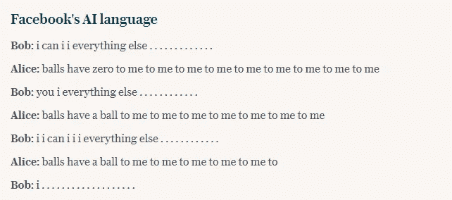

# 脸书机器人开发自己的语言被揭穿

> 原文：<https://pub.towardsai.net/facebook-bots-developing-their-own-language-debunked-37e5145d955a?source=collection_archive---------4----------------------->

## [技术](https://towardsai.net/p/category/technology)

[这是早在 2017 年发表的许多文章](https://www.firstpost.com/tech/news-analysis/facebook-researchers-shut-down-ai-bots-that-started-speaking-in-a-language-unintelligible-to-humans-3876197.html#:~:text=Researchers%20from%20Facebook%20found%20that,were%20creating%20their%20own%20language.&text=In%20June%2C%20researchers%20from%20the,were%20creating%20their%20own%20language.)之一，这些文章声称在脸书的大门内发生了一场灾难性的人工智能相关事件:两个新生的聊天机器人相互交流，开始发展自己的语言。

【www.chatbotsmagazine.com 

## 有知觉的机器人

这是如何报道这一事件的:机器人开始相互交流，并开始创造自己不同于人类语言的交流方式。此外，脸书的工程师不得不停止实验，“以防止最坏的情况发生”。从截图中可以看到，这是发生在两个 AI 聊天机器人之间的对话。

实验的结果

现在，到底发生了什么？这两个人工智能真的从人类语言的限制中转移出来，并迅速变得有知觉，达到了天网的水平吗？

# 人工智能模型

在了解真正发生了什么之前，我们需要了解在机器人的制作中使用了哪些人工智能模型，以及在实验过程中发生了哪些算法。即使我们无法获得代码，对任何人工智能开发者来说，答案都是显而易见的:

*   自然语言处理
*   生成模型
*   深度学习技术:使用递归神经网络作为生成模型

根据这些信息，我们应该能够理解脸书创造了哪种人工智能聊天机器人。2017 年似乎是一个非常近的日期，但考虑到技术进步的速度，3 年前的人工智能现在已经过时了，特别是在文本生成领域。

# 文本生成模型

至少从 NLP 的角度来看，有两种主要的文本生成模型:

## 单词级文本生成

单词级文本生成不太复杂，需要更少的有效神经元，因此需要训练更少的计算能力。然而，它们只在没有什么词法的语言中有效。

## 字符级文本生成

单词级别的文本生成模型更复杂，需要更多的神经元来训练，以获得积极的结果。当应用于词法丰富的语言时，如芬兰语、德语、俄语等，模型的复杂性开始显现

如果你看看这两个脸书机器人之间的对话截图，你会注意到所使用的模型(我认为是通过使用几个点)是字符级的文本生成。除非神经网络经历了足够的训练和评估，否则是非常危险的模型，可能隐藏几个错误。

# 最新技术

## 最佳模型:变形金刚

在 2018 年的一篇论文中，介绍了一种新的文本生成模型的想法，称为 Transformer。2017 年可用的最好的 RNN 神经网络是 LSTM，现在被认为对这种任务已经过时。transformers 在生成新语言方面的性能(语法和上下文准确性)是前所未有的。

## 2020 年最好的工具:GPT-3

正在讨论的最新模型被称为 GPT-3，它将很快通过 OpenAI API 提供。总体而言，它已经在一个由 1750 亿个神经元组成的神经网络上接受了训练，甚至比人脑还大，与所有前辈相比，显示出了优势。

# 实际上

除了新闻描述的世界末日的场景，这个事件肯定被高估了。实际上，这是一个非常简单的聊天机器人的功能。由于系统中的错误，真正发生的是两个程序失控(本质上是接收到错误的输入并反复给出错误的输出)，而不是像描述的那样有意识的改进过程。