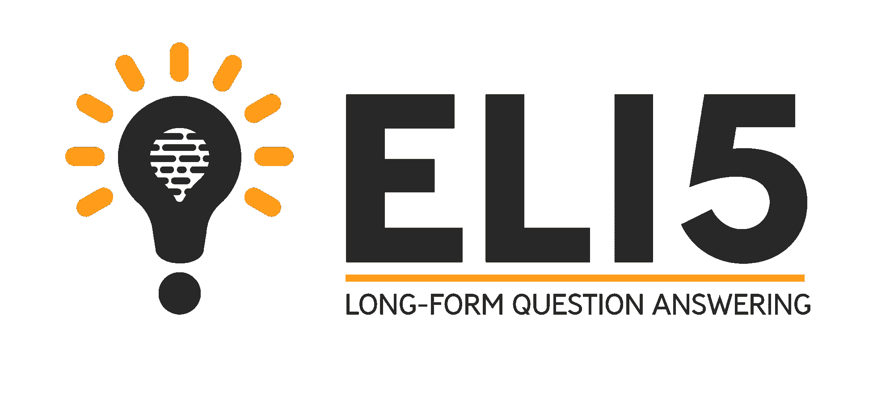
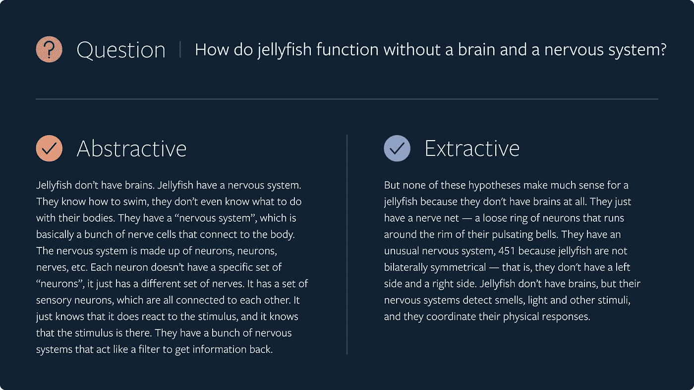
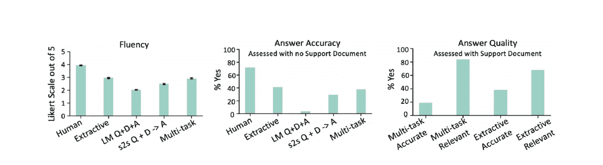

# 脸书 ELI5 是一个用于长格式问答的开源数据集

> 原文：<https://pub.towardsai.net/facebook-eli5-is-an-open-source-dataset-for-long-form-question-answering-bfa823966f66?source=collection_archive---------2----------------------->

## [人工智能](https://towardsai.net/p/category/artificial-intelligence)

## 新数据集旨在推进自然语言理解最困难领域之一的研究。

**图片来源:脸书**

> 我最近创办了一份专注于人工智能的教育时事通讯，已经有超过 80，000 名订户。《序列》是一份无废话(意思是没有炒作，没有新闻等)的 ML 导向时事通讯，需要 5 分钟阅读。目标是让你与机器学习项目、研究论文和概念保持同步。请通过订阅以下内容来尝试一下:

 [## 序列

### 订阅人工智能世界中最相关的项目和研究论文。受到 85，000 多人的信任…

thesequence.substack.com](https://thesequence.substack.com/) 

自然语言理解(NLU)是深度学习领域之一，已经在深度学习领域获得了最大的主流采用。虽然会话应用程序的最初采用是引人注目的，但在接下来的几年中，应该会努力改进这些交互，使其感觉像人类对话。目前，大多数与数字助理和聊天机器人的对话都是基于非常简短的事实问答模型，而不是人类交流中普遍存在的上下文相关的长形式对话。为了实现这一点，我们需要对话式应用程序来理解更复杂的问题并提供更丰富的答案。

问答(QA)是深度学习的一个领域，专注于建立能够在简单的事实问题之外进行对话的模型。理论上，包含许多其他深度学习领域，如信息检索或实体提取。随着数字助理和聊天机器人的最新进展，QA 目前处于改进对话应用程序的竞赛的最前沿。这就是为什么脸书发表了 [Eli5](https://github.com/facebookresearch/ELI5) ，一个新的数据集和样本试图解决对话模型中长格式问答的挑战..

# ELI5

当前一代的对话系统是基于事实问答交互的，这种交互可以满足提取和模糊的答案。对于大多数 NLU 应用程序来说，需要深入解释的长形式对话仍然是一个难以捉摸的领域。长格式问答模型的部分挑战是，大多数训练数据集不是为深度对话结构设计的。脸书人工智能研究(FAIR)团队最近开源了“像我五岁一样解释”(ELI5)，这是一个大型问答模型语料库，需要对开放式问题进行深入回答。

为长形式 QA 模型构建训练数据集比传统 NLU 任务的等效任务复杂一个数量级。对于 starts，数据集中的答案不应基于简短的回答，而应跨越多个句子。此外，答案还代表了解决查询的几种有效方式之一。长格式问答训练数据集的另一个重要目标是以一种迫使模型学习如何组合来自多个句子和部分的信息的方式来组织答案。这与传统的 NLU 训练数据集形成对比，在传统的训练数据集中，可以使用词汇重叠方法找到对给定问题的人类书写的答案。

**当前的质量保证挑战**

最近的餐馆是哪家？

世界上最大的湖是什么？

问:东京现在是几点？

**长篇问答挑战**

问:如果一些餐馆提供基本相同的食物，为什么它们会比其他餐馆好？

问:湖泊、河流和海洋等水体之间有什么区别？

问:为什么我们在东部旅行时更容易倒时差？

在 ELI5 中，问答模型模拟了许多人在被问到一个问题时的行为:如果他们不知道答案，他们可能会在网上搜索相关主题，阅读一些结果，然后提供答案。ELI5 将综合来自多个来源的信息、回答问题和生成文本的挑战结合到现实世界的任务中，使其比以前的 QA 数据集更现实、更困难。

**图片来源:脸书**

在我们的日常对话中，有时我们会对一个特定的问题给出一个教科书式的答案，而其他时候我们会试图在对话的上下文中重新构建我们的解释。当前版本的 ELI5 支持两种类型的长格式问答对话模型:

**提取模型:**这种类型的模型产生从支持文档中逐字复制的答案。

**抽象模型:**这种类型的模型重写底层文档中的信息，以更好地适应对话。

**图片来源:脸书**

## 提取模型:BidAF

当前版本的 Eli5 用于训练通用版本的[双向注意力流(BidAF)](https://allenai.github.io/bi-att-flow/) ，它被认为是最先进的机器理解模型之一。然而，BidAF 的先前版本已经在来自输入文本的单一提取答案中被训练。FAIR 团队训练了一个可以选择多个句子来生成答案的版本。

BidAF 训练包括提取训练集，其在支持文档中具有多达 5 个连续句子的跨度，这些句子与参考答案具有最高相关性，并且对其他支持文档句子进行子采样，使得最终训练文档短于 400 个单词。此时，BidAF 模型被训练来基于问题预测子采样支持文档中的提取跨度。

## 抽象模型:Seq2seq

为了演示抽象模型，Eli5 为抽象建模提供了一种序列到序列(seq2seq)的方法，以综合来自各种 web 源的信息来编写一个段落长度的答案。

与传统的 seq2seq 模型仅被训练来预测答案不同，Eli5 版本将被训练来预测问题、web 源和答案。这是通过创建 Seq2Seq 模型的多任务版本来实现的。在训练过程中，模型在不同生成任务之间建立多任务模型，如问题、支持文档和答案(Q+D+A)。得到的模型优于标准建模和传统的 seq2seq 技术。

FAIR 团队根据最先进的 NLU 方法以及一群众包工作者评估了提取和抽象模型。下面的结果表明，提取和多任务模型的表现与人类相当，在某些情况下，甚至超过了人类。

**图片来源:脸书**

Eli5 的发布应该为更高级的长形式 QA 模型研究打开了大门。提取和抽象模型的包含提供了一个很好的组合来模仿人工智能系统中长形式的、类似人类的转换。Eli5 当然应该被视为验证市场上下一代数字助理和聊天机器人的首选数据集之一。