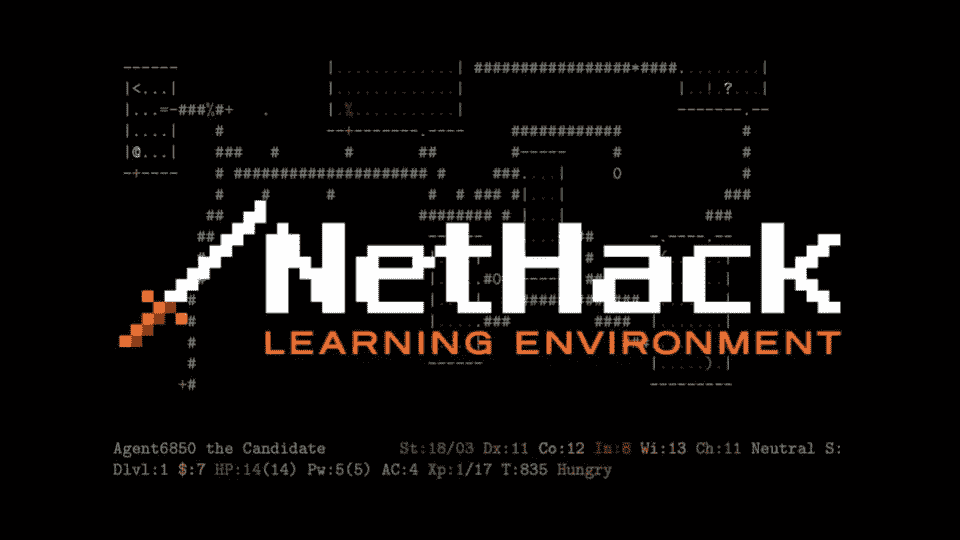
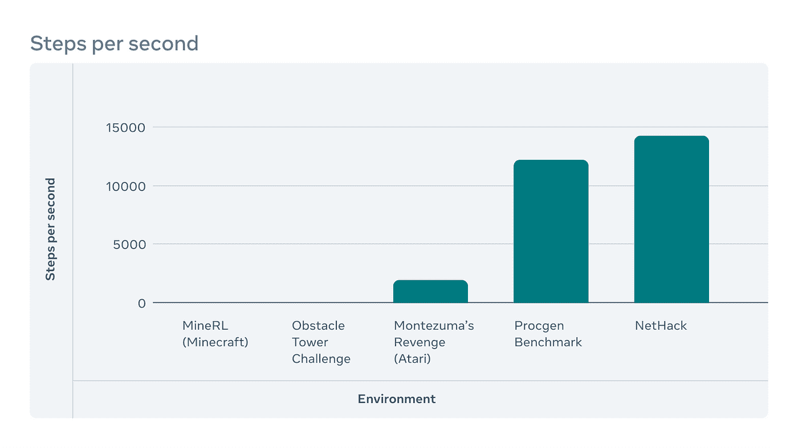

# 脸书发起了史上最艰难的强化学习挑战之一

> 原文：<https://pub.towardsai.net/facebook-launches-one-of-the-toughest-reinforcement-learning-challenges-in-history-efcb1d2062bb?source=collection_archive---------0----------------------->

## [机器学习](https://towardsai.net/p/category/machine-learning)

## NetHack 对 RL 算法提出了新的挑战。

**图片来源:脸书研究**

> 我最近创办了一份专注于人工智能的教育时事通讯，已经有超过 80，000 名订户。《序列》是一份无废话(意思是没有炒作，没有新闻等)的 ML 导向时事通讯，需要 5 分钟阅读。目标是让你与机器学习项目、研究论文和概念保持同步。请通过订阅以下内容来尝试一下:

 [## 序列

### 订阅人工智能世界中最相关的项目和研究论文。受到 85，000 多人的信任…

thesequence.substack.com](https://thesequence.substack.com/) 

强化学习(RL)一直是过去十年人工智能(AI)中一些最令人印象深刻的成就的核心。从 DeepMind 著名的 AlphaGo 到《星际争霸 2》、《Dota 2》或《《我的世界》》等游戏中的里程碑，RL 仍然是深度学习领域发展最快的领域之一。尽管取得了所有的成功，脸书人工智能研究所(FAIR)认为，RL 需要被推向新的水平，为此，他们将注意力转向一个新游戏:NetHack。

公平团队刚刚发起了[网络黑客挑战](http://nethackchallenge.com/?fbclid=IwAR0yzdeJ3t9xfCOGiZ9Kuh7Q_MNFuXbk0deE3Jzfse39T6Jv-xN8E_kXMn8)，作为即将到来的 [NeurIPS 2021 竞赛](https://nips.cc/Conferences/2021/CompetitionTrack?fbclid=IwAR2T2ST6HEKgB2_IG8xQkCSt81ZS_7dlrBs3tUZcYv38eabYcRAeH6gRnUk)的一部分。目标是在世界上最艰苦的游戏环境中测试新的 RL 想法。

# NetHack 和 RL

NetHack 是一款传统的地牢游戏，自 20 世纪 80 年代以来一直在开发中，对于新玩家来说，掌握它非常困难。这一次，网络黑客的失误造成了不成比例的代价。一旦玩家死亡，游戏将在一个完全不同的地牢中从头开始。为了成功完成游戏，玩家需要执行比星际争霸多 25-50 倍的步骤。此外，NetHack 中许多问题的解决方案需要创造性和咨询外部知识来源，这导致从战略角度难以置信地难以建模。

**图片来源:脸书研究**

**图片来源:脸书研究**

从 RL 的角度来看，NetHack 提出了一系列独特的挑战:

*代理无法重置环境，因此蒙特卡罗树搜索等优化方法在这种类型的设置中没有用。*

鉴于环境的部分完整性，探索甚至更为重要。

环境变化的高度可变性要求快速适应的 RL 技术。

此外，NetHack 挑战应该带来一组新的 RL 方法，这些方法可以在高度复杂的环境中操作，在这些环境中，错误具有显著的成本。这应该有助于推进导航或许多工业环境等领域的研究，这些领域与 NetHack 有一些共同的宏观特征。迫不及待地想看到第一波提交。