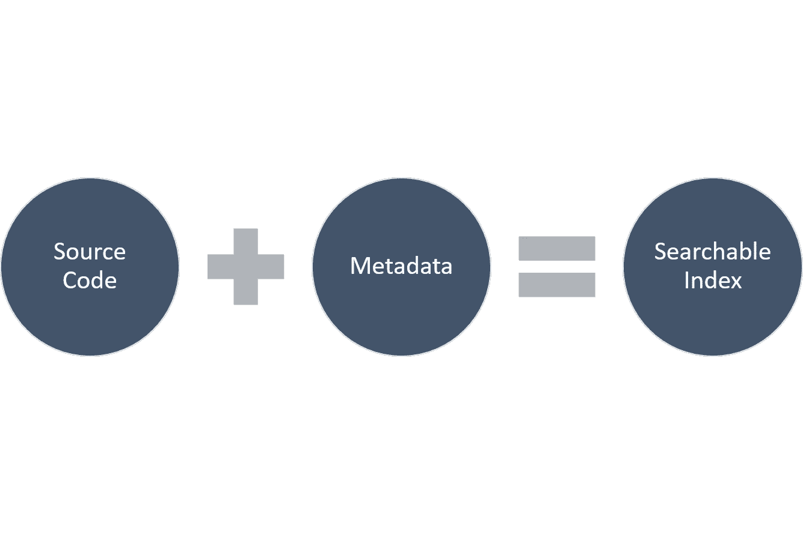
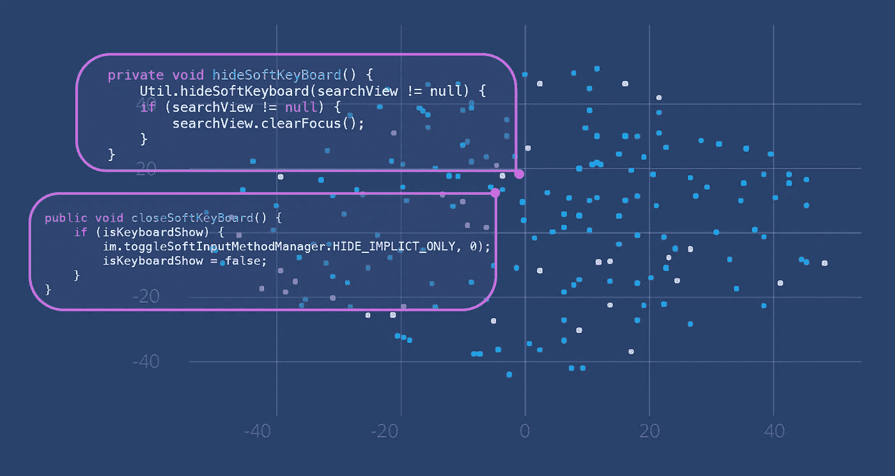
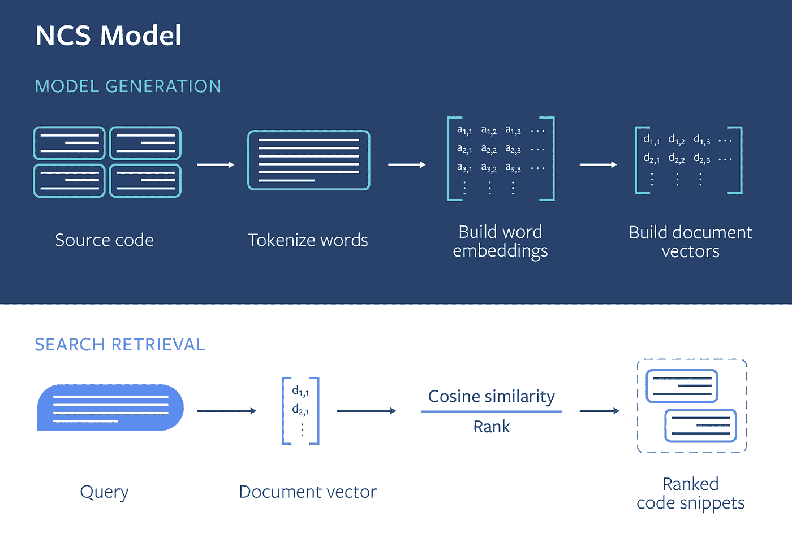
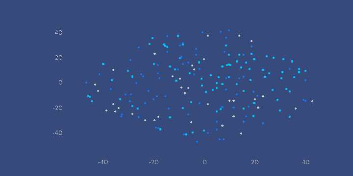
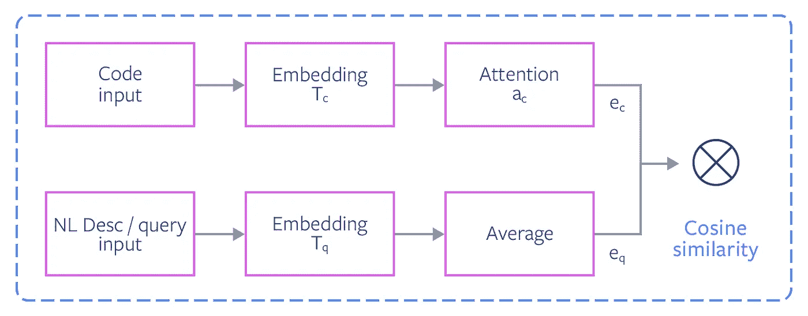
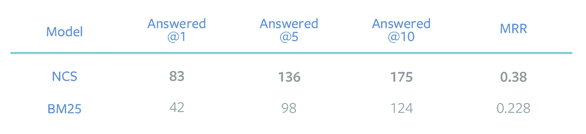
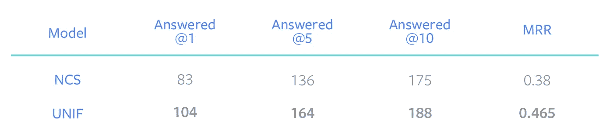

# 脸书使用神经代码搜索来寻找相关的代码片段

> 原文：<https://pub.towardsai.net/facebook-uses-neural-code-search-to-find-relevant-code-snippets-d89eaa79624c?source=collection_archive---------1----------------------->

## [深度学习](https://towardsai.net/p/category/machine-learning/deep-learning)

## 这是一个深度学习的领域，在过去两年里一直在以疯狂的速度前进。


来源:[https://alltopstartups . com/2018/05/25/code pilot-ai-makes-code-search-awesome/](https://alltopstartups.com/2018/05/25/codepilot-ai-makes-code-search-awesome/)

> 我最近创办了一份专注于人工智能的教育时事通讯，已经有超过 10 万名订户。《序列》是一份无废话(意思是没有炒作，没有新闻等)的 ML 导向时事通讯，需要 5 分钟阅读。目标是让你与机器学习项目、研究论文和概念保持同步。请通过订阅以下内容来尝试一下:

[](https://thesequence.substack.com/) [## 序列

### 订阅人工智能世界中最相关的项目和研究论文。受到 102，000 多人的信任…

thesequence.substack.com](https://thesequence.substack.com/) 

随着 OpenAI Codex 等模型的发布，代码搜索领域最近得到了很多关注。除了标题之外，重要的是回过头来回顾一些实现这种突破的技术。几年前，脸书人工智能研究所(FAIR)提出了这个领域最具创新性的想法之一。

如今，Google 和 StackOverflow 是每个开发者最好的朋友。当在一个特定的项目中工作时，开发人员经常求助于外部信息源来寻找给定问题的解决方案或代码片段。然而，搜索分辨率主要基于元数据，而不是代码本身提供的信息。例如，如果开发人员将代码片段发布到 StackOverflow，它通常会包含一个描述和标签，以帮助为将来的搜索建立索引。这种方法依赖于元数据的准确性来呈现准确的搜索结果，但是它也错过了可以直接从代码中推断出来的信息。为了解决这一限制，FAIR 实验室的一个团队一直在研究一种方法，使用自然语言处理(NLP)和信息检索(IR)来直接从源代码文本中推断搜索相关信息。



FAIR 团队工作的第一个实例是一个名为神经代码搜索(NCS)的工具，它接受自然语言查询并返回直接从编码语料库推断的结果。最近发表的两篇研究论文总结了 NCS 背后的技术:

*   [**NCS**](https://dl.acm.org/citation.cfm?id=3211353&fbclid=IwAR3qdp2vDXwBuZb7uw2vR1op7SPngnRr0R6l3pxHrvqWH_0Unj0UXtTYpKA) **:** 本文描述了一种使用结合了 NLP 和 IR 技术的无监督模型的技术。
*   [](https://arxiv.org/pdf/1905.03813.pdf?fbclid=IwAR3_9ejBpho2yNLfMKVCp5rZ58gAD63T_peTg3RQh8tIRLZkYwH9SquLQI8)****:**本文提出了一种 NCS 的扩展，当有良好的监督数据可供训练时，使用监督神经网络模型来提高性能。**

**NCS 和 UNIF 这两种技术背后的原理是相对相似的。这两种方法都依赖于代码片段的矢量表示，这些代码片段可用于训练模型，例如语义相似的代码片段和查询在矢量空间中靠得很近。这种技术能够使用代码片段语料库直接回答自然语言查询，而不依赖于外部元数据。虽然这两种技术(NCS，UNIF)相对相似，但 UNIF 用一个监督模型扩展了 NCS，以创建对 NLP 查询更准确的答案。**

# **无线电网络控制站（Net Control Station 的缩写）**

**这背后的核心原理是使用嵌入从代码语料库中生成向量表示，其方式是相似的代码片段在向量空间中彼此接近。在下面的例子中，有两个不同的方法体，都与关闭或隐藏 Android 软键盘(上面的第一个问题)有关。由于它们共享相似的语义，即使它们不共享完全相同的代码行，它们也由向量空间中彼此接近的点来表示。NCS 使用方法级粒度将每个代码片段嵌入向量空间。**

****

**图片来源:脸书人工智能研究所**

**创建矢量表示的过程有三个主要步骤:**

**1)提取单词**

**2)构建单词嵌入**

**3)构建文档嵌入**

**4)自然语言搜索检索**

****

**图片来源:脸书人工智能研究所**

**给定一个特定的代码片段，NCS 提取不同的语法部分，比如方法名、方法调用、枚举、字符串和注释。这些工件然后使用标准英语惯例进行标记。对于输入语料库中的每个文档，NCS 以能够学习每个单词的嵌入的方式标记源代码。在这一步之后，我们为每个方法体提取的单词列表类似于一个自然语言文档。**

**在单词提取之后，NCS 继续使用 [FastText 框架](https://fasttext.cc/)构建单词嵌入。在这个过程中，FastText 使用两层密集神经网络计算向量表示，该网络可以在大型语料库上进行无监督训练。更具体地说，NCS 使用 skip-gram 模型，其中目标标记的嵌入用于预测固定窗口大小内的上下文标记的嵌入。**

**这个阶段的最后一步是使用提取的单词嵌入来表达方法体的一般意图。NCS 通过为方法体中的单词集计算单词嵌入向量的加权平均值来实现这一点。这一公式的结果被称为文档嵌入及其用户在正文中创建每个方法的索引，以便进行有效的搜索检索。**

**使用向量表示作为起点，NCS 现在可以尝试回答与代码片段相关的自然语言查询。给定一个自然语言查询，NCS 使用 FastText 框架遵循类似的标记化过程。使用相同的 FastText 嵌入矩阵，NCS 对单词的向量表示进行平均，以创建用于查询句子的文档嵌入；不在词汇表中的单词将被删除。然后，NCS 使用标准的相似性搜索算法 [FAISS](https://github.com/facebookresearch/faiss) 来查找与查询具有最近余弦距离的文档向量。**

****

**图片来源:脸书人工智能研究所**

# **UNIF**

**作为一种无监督的技术，NCS 的优势在于它可以以快速和简单的方式直接从编码语料库中构建知识。然而，NCS 的主要限制之一是，该模型隐含地假设查询中的单词与从源代码中提取的单词来自相同的域，因为查询和代码片段都被映射到相同的向量空间。然而，有大量的例子表明代码语料库没有传达任何相关的语义信息。以下面的代码片段为例，它获取内存空间中的可用块。仅仅通过以无监督的方式生成单词 embeddings，NCS 将无法匹配相关的查询，例如“获得内部存储器上的空闲空间”。**

```
File path = Environment.getDataDirectory();
StatFs stat = new StatFs(path.getPath());
long blockSize = stat.getBlockSize();
long availableBlocks = stat.getAvailableBlocks();
return Formatter.formatFileSize(this, availableBlocks * blockSize);
```

**UNIF 是对 NCS 的有监督扩展，它试图弥合自然语言单词和源代码单词之间的差距。本质上，UNIF 使用监督学习来修改初始令牌嵌入矩阵 T，并产生两个嵌入矩阵 Tc 和 Tq，分别用于代码和查询令牌。我们还用一种基于学习注意力的加权方案取代了编码令牌嵌入的 TF-IDF 加权。这种扭曲本质上解释了代码语料库中的一些语义不匹配。**

****

**图片来源:脸书人工智能研究所**

# **NCS 和 UNIF 在行动**

**FAIR 团队根据最先进的信息检索模型评估 NCS 和 UNIF。使用 StackOverflow 问题的初始数据集，NCS 能够在一系列不同的任务中胜过流行的 BM25 模型。**

****

**图片来源:脸书人工智能研究所**

**类似地，添加 UNIF 扩展显示了 NCS 性能的逐步提高。**

****

**图片来源:脸书人工智能研究所**

**NCS 和 UNIF 都提出了一个聪明而简单的实现信息检索的方法。从代码搜索开始是一种提供即时价值的琐碎方式，但是 NCS 和 UNIF 背后的思想适用于许多神经搜索和信息检索场景。**