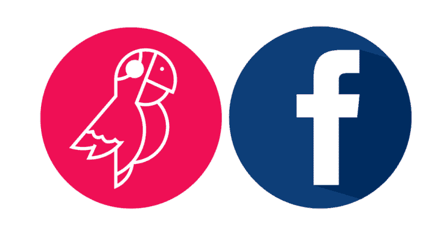
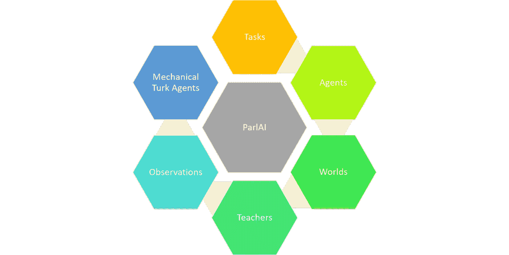
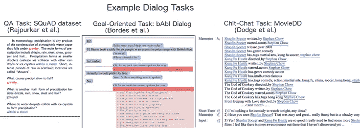
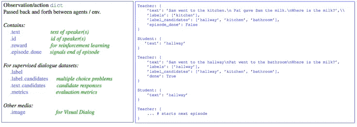
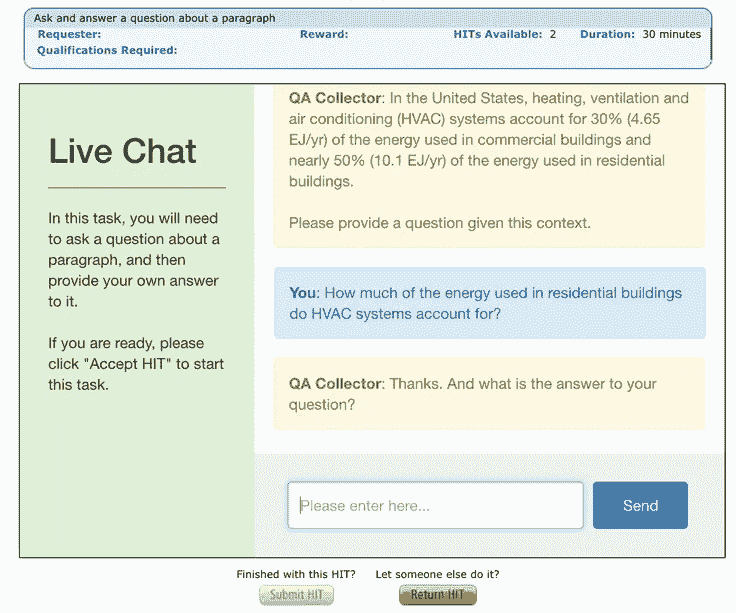

# 脸书的 ParlAI 是一个用于构建类人对话代理的框架

> 原文：<https://pub.towardsai.net/facebooks-parlai-is-a-framework-for-building-human-like-conversational-agents-99711c351fc9?source=collection_archive---------0----------------------->

## [人工智能](https://towardsai.net/p/category/artificial-intelligence)

## 该框架能够训练和测试复杂的对话模型。

图片来源:脸书人工智能研究所

> 我最近创办了一份专注于人工智能的教育时事通讯，已经有超过 10 万名订户。《序列》是一份无废话(意思是没有炒作，没有新闻等)的 ML 导向时事通讯，需要 5 分钟阅读。目标是让你与机器学习项目、研究论文和概念保持同步。请通过订阅以下内容来尝试一下:

 [## 序列

### 订阅人工智能世界中最相关的项目和研究论文。受到 102，000 多人的信任…

thesequence.substack.com](https://thesequence.substack.com/) 

由自然语言处理(NLP)驱动的对话界面一直是过去几年人工智能(AI)革命的中心。当我们看到 Siri 或 Alexa 等数字助理的进步时，我们可能会认为对话应用程序是一个已经解决的问题。这与事实相去甚远。目前这一代的对话界面还远远不能模拟类似人类的对话。构建先进的 NLP 系统仍然是一项极具挑战性的任务。为了应对这一挑战，[脸书开源了 ParlAI](https://parl.ai/) ，一个推进 NLP 系统评估的平台。最近，ParlAI 更新了新的模型、数据集和一个有趣的机器人，我想在这篇由两部分组成的文章中介绍一下。本文的第一部分将介绍 ParlAI 背后的核心概念，而第二部分将重点关注一些旨在推进对话研究的最新功能。

就像图像分析或语音识别一样，NLP 是人工智能的发展趋势之一，其发展分为基本场景的简化和解决更复杂用例的高门槛。在 NLP 的情况下，基本形式的方法(如情感分析或主题提取)的实现已经民主化，可以通过简单的 API(如 Watson Digital Assistant 或 Microsoft Cognitive Services)来实现。然而，那些基于 API 的 NLP 系统只适用于非常基本的 NLP 场景，而对于主流的对话应用来说仍然不切实际。

NLP 的最终目标是实现与模仿人类对话动态的聊天机器人的交互。为了实现这一点，我们需要能够超越理解一个句子或采取离散行动的系统。高级会话应用程序需要在特定的上下文中理解长句，同时平衡像人类一样的方面，如特异性和移情。

# ParlAI 简介

推进对话式应用程序的开发需要不同公司和研究实验室之间的合作，而不仅仅是单一的研究突破。脸书人工智能研究(FAIR)团队设计 ParlAI 来构建一个基于社区的平台，以便轻松访问任务和学习在任务上表现良好的算法，从而推动 NLP 领域的发展。从概念上讲，ParlAI 的创建是为了实现一系列关键目标:

**对话模型开发的统一框架:** ParlAI 旨在将馈送给机器学习代理的对话数据集输入格式统一为单一格式，并尽可能标准化评估框架和度量标准

**实现涉及多种技能的通用对话:** ParlAI 包含真实和模拟语言数据集的无缝组合，并通过使多任务模型易于构建单个任务来鼓励多任务模型开发&评估。

**与人类的真实对话:** ParlAI 允许通过 Amazon Mechanical Turk 收集、训练和评估与人类的实时对话。

协作 NLP 任务: ParlAI 激励新任务的实现，以便提高 NLP 系统参与一般对话的能力。添加到 ParlAI 中的每个任务都应该能够与其他 NLP 任务结合使用，以实现共同的目标。

为了实现上述目标，ParlAI 被设计为一系列相互关联的任务和代理，可用于解决这些问题。从高层次来看，ParlAI 的架构基于一系列关键组件:

## 任务

任务代表了 NLP 代理的特定挑战。ParlAI 使用针对给定 NLP 用例优化的特定数据集来抽象任务。ParlAI 的当前版本包括以下主要类别的任务:

*   **问题回答:**这是最简单的对话形式之一，每个发言者只有一次机会。问题回答特别有用，因为评估比其他形式的对话更简单:如果问题的答案是已知的(即数据集被标记)，那么我们可以快速检查答案是否正确。
*   **句子完成(完形填空测试):**在这个测试中，代理必须填写对话中下一个话语中缺失的单词。虽然这是另一项专门的对话任务，但数据集的制作成本很低，评估也很简单。
*   **面向目标的对话:**一类更现实的对话包括必须实现一个目标；例如，客户和旅行社讨论航班，一个发言者向另一个发言者推荐电影，两个发言者商定一起吃饭的时间和地点，等等。
*   **聊天对话:**有些任务不一定有明确的目标，更多的是讨论；例如，两个说话者讨论体育、电影或共同的兴趣。
*   **视觉对话:**这些任务包括图像和文本。在现实世界中，对话通常基于物理对象。未来，我们计划添加音频等其他感官信息。

图片来源:脸书人工智能研究所

## 代理人

ParlAI 中最基本的概念是代理。一个代理可以是一个人，一个简单的机器人，它可以重复它听到的任何事情，你完美调整的神经网络，一个正在读出的数据集，或者任何其他可能发送消息或与其环境交互的东西。代理可以是学习者(机器学习系统)，也可以是人。

图片来源:脸书人工智能研究所

## 世界

ParlAI 的世界代表了一种 NLP 环境，在这种环境中，代理之间相互作用。世界可以从非常简单的，例如只有两个代理对话，到复杂得多的，例如在一个交互环境中有多个代理。

## 教师

ParlAI 的教师是一种特殊类型的代理，它与其他代理进行对话，以便教授特定的任务。

## 观察

在 ParlAI 中，观察抽象了代理用来相互通信的单一公共格式。观察表示 ParlAI 中代理和环境之间传递消息的主要方式。从编程模型的角度来看，观察通常以包含不同类型信息的 python 字典的形式出现。

## 土耳其机械特工

ParlAI 的一个重要部分是与 Mechanical Turk 无缝集成，用于数据收集、培训或评估。在 ParlAI 中，人类机器人也被视为代理，因此在群聊中，人-人、人-机器人或多个人和机器人都可以在标准框架内进行对话，根据需要切换角色，而无需修改代理的代码。

图片来源:脸书人工智能研究所

ParlAI 是第一个 NLP 系统，研究人员可以在其中协作和重用重要的对话任务。ParlAI 鼓励在 NLP 系统的实现中进行合作，包括与机器人以及人类的集成。毫不奇怪，FAIR 团队已经将 ParlAI 作为他们最近在 NLP 研究中的一些突破的基石。下一部分会有更多的介绍。