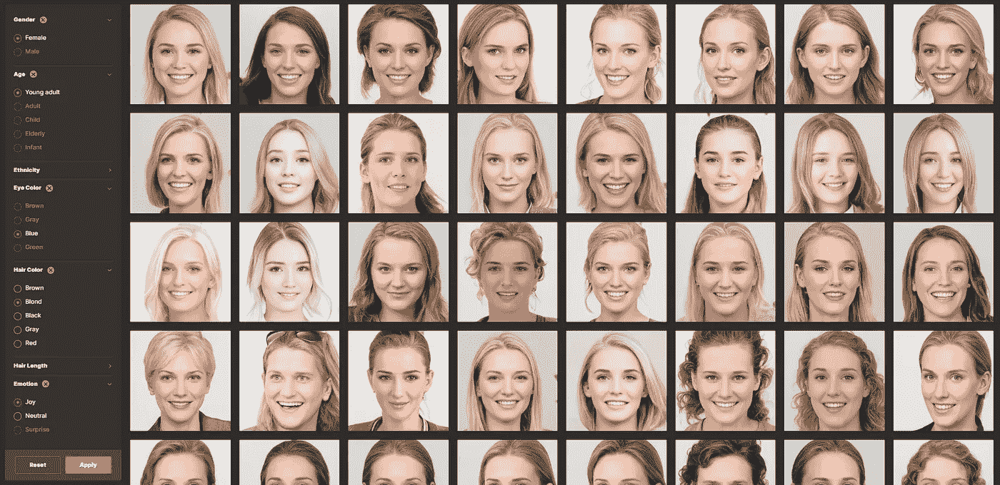
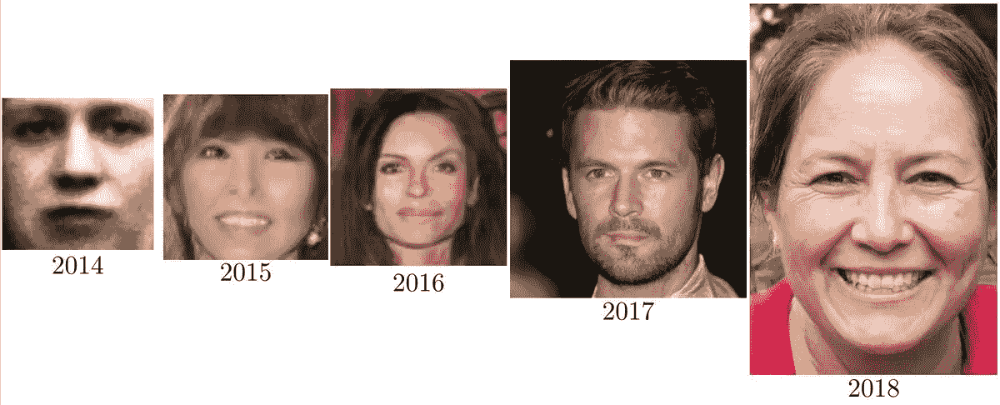
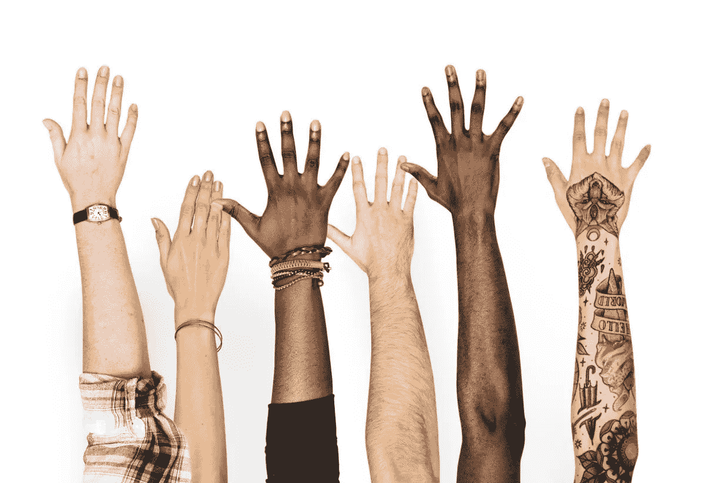
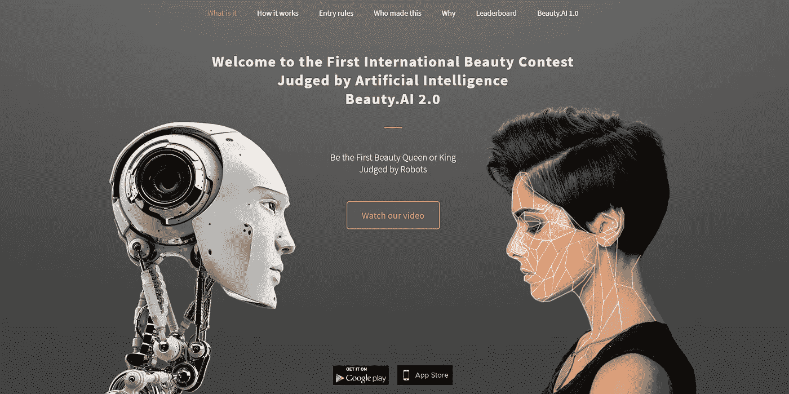
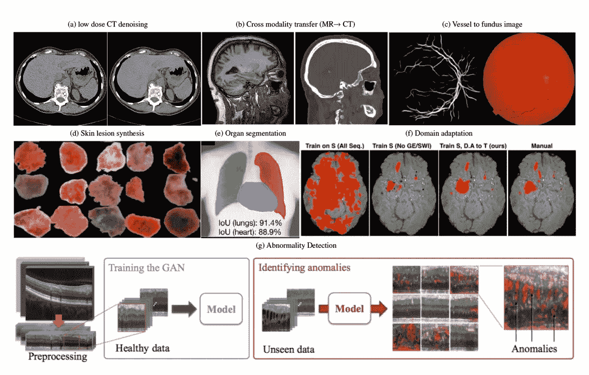

# 「假面」会导致多样性的错觉吗？

> 原文：<https://pub.towardsai.net/fake-faces-fake-diversity-1798f96c7371?source=collection_archive---------2----------------------->

这些人并不存在——他们是由生成的照片开发的算法创造出来的。

## [新闻](https://towardsai.net/p/category/news)

## GANs——或者说生成性对抗网络已经被用来创建代理机构的不存在面孔的照片，这些照片旨在促进多样性，创造商业机会。然而，人工智能的这种使用也可能有许多伦理上的含义。

人工智能在生成令人信服和迷人的图像方面取得了长足的进步，这些图像具有毫无疑问的现实特征，几乎不可能被归类为属于世界上任何地方都不存在的人。如果我们将不到五年前制作的人脸和最近发表的人脸进行比较，进步是令人难以置信的。

脸代的进步来自【https://arxiv.org/abs/1406.2661】[https://arxiv.org/abs/1511.06434](https://t.co/S4aBsU536b)[https://arxiv.org/abs/1606.07536](https://t.co/8di6K6BxVC)[https://arxiv.org/abs/1710.10196](https://t.co/UEFhewds2M)[https://arxiv.org/abs/1812.04948](https://t.co/s6hKQz9gLz)，via Ian Goodfellow

有了新的 GANs——生成对抗网络，算法架构使用两个神经网络，一个与另一个竞争(因此术语“对抗”)来生成新的合成数据实例，这些合成面孔可以轻松定制和编辑，由于特殊的效果，使它们如此可信。

将真实图像的特征(例如皮肤的颜色和头发的颜色)混合应用到虚假图像中，就有可能生成真实世界中不存在的虚拟群体。

来自维基共享，自由媒体仓库

# 商机

但是，为什么使用由算法创建的不存在的人的图像而不是真人的照片会如此令人兴奋呢？

其中一个原因首先是经济上的:一旦算法训练完成，使用真实照片的大型数据集进行，人工智能就可以**在每种可能的情况下用任何形式的表情制造出大量的假人图像**，不可避免地降低“真实模型”和真实摄影作品的价格。

现在，我们应该开始问自己，如果我们在过去的五年里已经走了这么远，五年后我们会在哪里？人工智能还会统治多少今天被认为是人类专属的领域？

这对于那些需要快速增加宣传材料的数量、准备大量草稿、或者为人体模型说明耗费时间和金钱的概念的人来说非常有用。

想象一下一个机构需要一个金发碧眼的迷人女孩？在成千上万的图片中——可以在[生成图片](https://generated.photos/faces)网站上看到——可能有一张适合你。

然而，导致这些服务诞生的第二个原因就不那么直观了，它与历史上**广告形象等缺乏多样性**有关，其中白人男性和女性占压倒性优势。这是一个问题，也可能是某些形式的算法偏差的根源)。

总的来说，在图片社的数据库中，白人男性明显占多数。与此同时，少数群体的代表性往往不足，这使得那些寻找具有精确多样性特征的图像的人很难找到它们。正是在这里，像 GANs 这样的技术可以再次得到应用，这种技术可以快速产生数以千计的具有很高多样性的假照片。

多样性是一个非常微妙的话题，我想知道人工智能是否准备好解决它。我们冒着建立一个错误的多样性幻觉的风险，还考虑到人工智能可以继承在算法训练期间向其呈现的有意识或无意识的偏见，导致增加同质性，而不是增加现实世界中的多样性。

从伦理的角度来看，将这项技术用于这一特定目的应该会引发一些关于我们今天和未来在网上所见内容真实性的讨论。

这种伦理考虑对“假图像”有效，就像它对“深度假货”或“假新闻”有效一样，因为它们使用了相同的技术，称为 GAN，一种生成性对抗网络。

GANs 创造的人工图像和视频被称为 deepfakes。它们在新闻中被广泛讨论，主要是在被恶意使用时。

正如我们在过去几年中人工智能取得了令人印象深刻的进步的其他领域所看到的那样，我们冒着“虚假图像”的风险，发现自己正处于一个区分现实和虚构变得越来越棘手的世界。

也许我们很快就会发现，人工智能也在设法实现一项工作的自动化，这项工作直到昨天还似乎只留给人类:模型。

# 反转角色:不仅是人工智能面孔，还有人工智能选美比赛

如果这还不够令人担忧，如果这似乎没有什么联系，那么在遥远的 2016 年，我们举办了第一届由“机器”评判的国际选美比赛。该软件应该使用客观因素，如面部对称性和皱纹，来确定最有吸引力的参赛者。

这场名为 [**Beauty A.I.**](http://beauty.ai/) 的比赛有来自几个国家的数千人参加，他们提交了自己的照片，希望人工智能在复杂算法的支持下，能够确定他们的脸更像经典的“人类之美”

但是一旦结果出来，创造者们惊讶地发现有一个明显的因素将获胜者联系在一起:机器人不喜欢黑皮肤的人。

在 44 名获奖者中，几乎所有人都是白人，少数是亚洲人，只有一人是深色皮肤。尽管大多数参赛者是白人，但许多有色人种提交了照片，包括来自印度和非洲的大群人。

随之而来的争议引发了关于算法如何使偏见永久化、产生意想不到且往往令人不快的结果的新辩论。

这种算法可能有成千上万个理由表现成那样，偏爱浅色皮肤。尽管如此，这是一个技术事实，这些算法通常依赖于大型照片数据集进行训练。用来建立吸引力标准的数据没有包括足够的多样性。很简单:如果数据集中没有足够的多样性，那么结果可能会有偏差。

> 对于有偏见的算法，最简单的解释通常是，创造它们的人有自己根深蒂固的偏见。尽管人们认为算法在某种程度上是中立和唯一客观的，但它们经常会复制和放大现有的偏见。

我认为 GANs 是当今最强大的新机器学习技术之一。尽管如此，我们必须意识到道德影响，因为像这样的技术已经被使用，例如，人们在 Twitter 上用人工智能生成的个人资料图片和在线工具来生成虚假的个人资料来冒充记者。但是甘斯能被用来做好事吗？

# 今天有可能用甘斯做好事吗？

有很多机会应用 GANs 来创建有用的、强大的、合乎道德的工具。例如，研究人员已经创建了一个项目，他们对 gan 进行编程，以执行各种形式的加密和解密，并有选择地应用这些操作，以满足他们的[密码系统](https://arxiv.org/abs/1610.06918)的保密目标。

但不仅如此，正如你所见，GANs 还可以用在其他一些有趣的地方:

# 与 GANs 对抗偏见

令人惊讶的是，用于创建假图像的相同技术可以用于检测算法中的偏差。对抗性神经网络可以用来确保人工智能系统清除种族偏见。想象一下，一个人工智能已经被灌输了关于人的内在犯罪活动的数据，并计算出他们应该被判处什么样的监禁。第二种人工智能(对抗性)可用于识别与种族或性别相关的潜在偏见。例如，从预测的句子中，然后反馈这些数据，使系统随着时间的推移更加平衡和公平。

# 用合成数据解决隐私问题。

生成模型可以用于以与真实数据不可区分的方式合成私人训练数据。该算法可以学习一种创建合成信息的方法，该合成信息保持真实输入的格式和统计特征。然而，与真实记录不同，生成的数据不代表隐私问题，因为它们不属于任何特定的人。

由此产生的记录允许训练精确的机器学习模型，同时保护人们的隐私。

此外，GANs 可用于生成 [3D 对象](https://youtu.be/HO1LYJb818Q)，可用于[音乐生成](https://arxiv.org/pdf/1703.10847.pdf)，可用于[肿瘤检测](https://arxiv.org/pdf/1703.05921.pdf)。其他几个应用程序目前正在开发中。

# 结论

这种技术仍处于初级阶段。至于任何儿童发展问题，推动这个“婴儿”边缘的专家们拥有巨大的权力和责任。

作为一名技术爱好者和一名有道德的人工智能从业者，我试图关注生殖对抗网络的最新进展，以及这项技术如果得到良好发展可能带来的机遇。

我们必须意识到，我们正在开发的工具和技术有可能改变我们的世界，我们有责任保证用户的安全和知情。