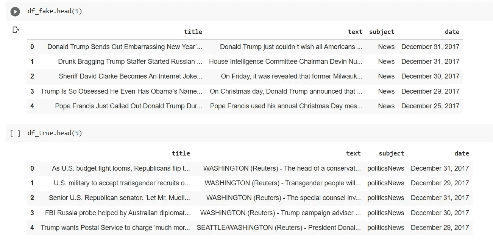
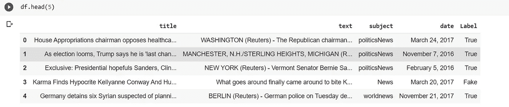
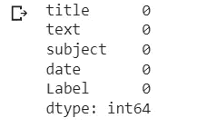
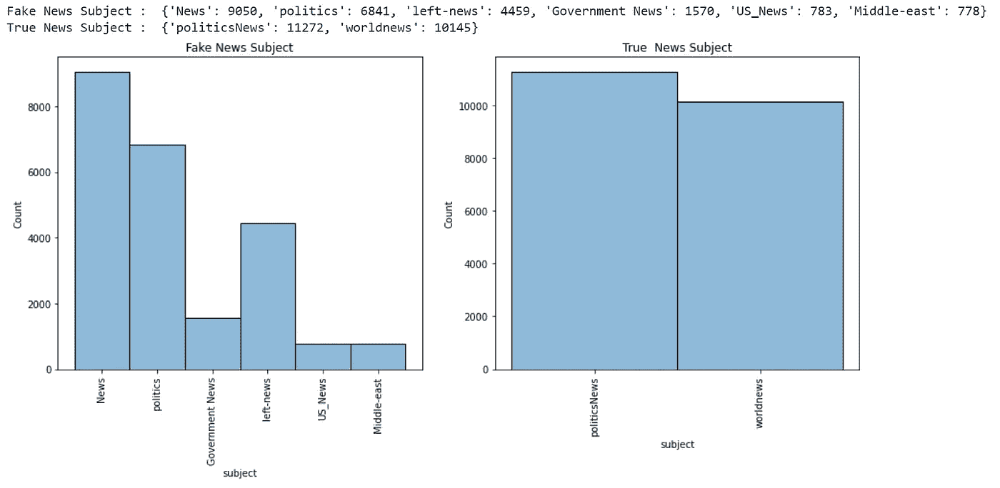
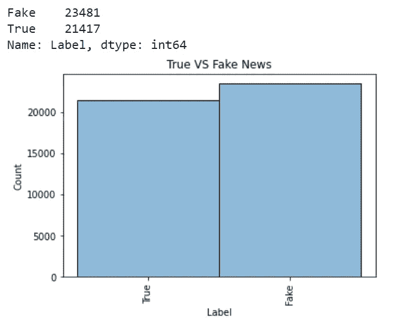
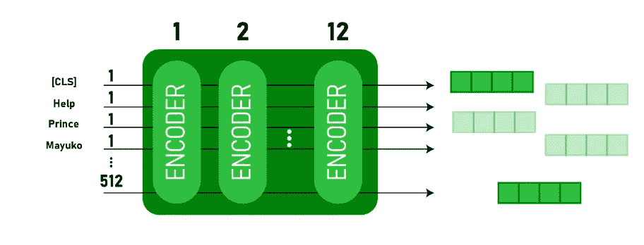
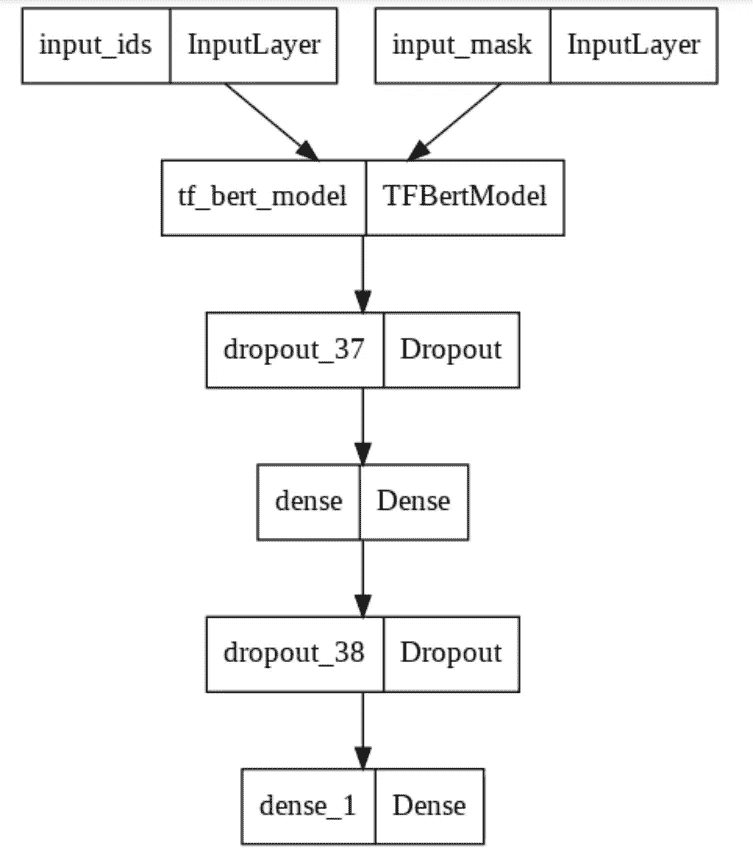
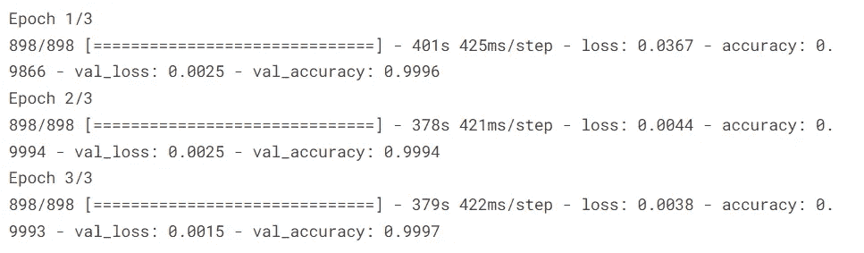
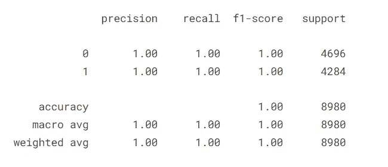

# 基于 BERT 模型 Python 的假新闻检测

> 原文：<https://pub.towardsai.net/fake-news-detection-using-bert-model-python-de005c5809ed?source=collection_archive---------0----------------------->

## 在本文中，我们将尝试使用 Python 构建一个 BERT 分类模型来检测假新闻。


Jorge Franganillo 在 [Unsplash](https://unsplash.com?utm_source=medium&utm_medium=referral) 上的照片

社交媒体的兴起放大了假新闻在我们社会中的影响力。人们经常认为他们读到/听到的是真的，这在政治上和经济上都在很大程度上影响着世界。所以今天我们要用 BERT 模型和 Python 开发一个可以自动检测假新闻的应用。

**加载数据**

本文中用到的数据可以在 **这里找到 [**。**复制数据，解压并粘贴到你的文件夹中。让我们从导入库开始我们的代码—](https://github.com/muttinenisairohith/FakeNewsDetection/tree/main/Data)**

```
import pandas as pd
import csv
```

一旦你复制了数据—

```
df_fake = pd.read_csv("Fake.csv")df_true = pd.read_csv("True.csv")
```



来源:产出

我们已经导入了数据并创建了两个数据框架。现在让我们做一些数据清理和分析—

我们将通过合并上面的两个数据帧来创建一个数据帧。

```
df_fake["Label"] = "Fake"
df_true["Label"] = "True"
```

为了区分真假新闻，我们增加了一个新的栏目——标签..这将是我们的从属专栏。

```
df = pd.concat([df_fake,df_true])df = df.sample(frac=1).reset_index(drop=True)
```

上图中，我们正在合并数据帧并对其进行洗牌。

最后，我们准备好了数据—

```
df.head(5)
```



来源:产出

让我们检查一下是否有丢失的值—

```
df.isnull().sum()
```



来源:产出

**数据分析**

现在让我们尝试分析数据中的一些列——正如我们所知，标题和文本是必要的，因为我们必须根据它们来预测标签；很明显，日期在预测新闻的真假方面并没有起到很大的作用。让我们使用 Seaborn 库来可视化主题列—

```
import matplotlib.pyplot as plt
import seaborn as sns#Creating Figure
fig, axes = plt.subplots(1,2, figsize = (15,6))#Adding the histogram1 - Fake News
sns.histplot(df_fake.subject, palette = 'Set1', alpha = 0.5, ax = axes[0])
axes[0].tick_params(axis = 'x', rotation = 90)
axes[0].set_title('Fake News Subject')#Adding the histogram2 - True News
sns.histplot(df_true.subject, palette = 'Set1', alpha = 0.5, ax = axes[1])
axes[1].tick_params(axis = 'x', rotation = 90)
axes[1].set_title('True  News Subject')#Printing the count of Subject
print("Fake News Subject : ",dict(df_fake.subject.value_counts()))
print("True News Subject : ",dict(df_true.subject.value_counts()))
```



来源:产出

正如我们所看到的，subject 列在两个数据帧中有不同的值。所以我们不能继续包括该专栏。

我们来看看数据是否平衡。

```
sns.histplot(df.Label, palette = 'Set1', alpha = 0.5)plt.tick_params(axis = 'x', rotation = 90)plt.title('True VS Fake News')df.Label.value_counts()
```



来源:产出

```
df["text"] = df["title"]+df["text"] #considering text and title as X
```

正如我们所看到的，标签列是对象格式的，让我们将其编码为数字格式。

```
df['Label'] = df['Label'].map({'True':1, 'Fake':0})
```

这里我们只需要对两个值进行编码，我使用了 DataFrame Python 中的 map()方法。但是对于 Python 编码方法的详细解释，请参考我下面的文章:

[](https://blog.devgenius.io/encoding-methods-to-encode-categorical-data-in-machine-learning-717b5509933c) [## 机器学习中分类数据的编码方法

### 在机器学习领域，在进行建模之前，数据准备是一项强制性任务。有…

blog.devgenius.io](https://blog.devgenius.io/encoding-methods-to-encode-categorical-data-in-machine-learning-717b5509933c) 

所以我们的数据准备好了。让我们进行数据的训练-测试-分割—

```
from sklearn.model_selection import train_test_splitX_train, X_test, y_train, y_test = train_test_split(X, y, stratify = y, test_size = 0.2, random_state = 10)
```

我们已经准备好了训练和测试数据，现在让我们来学习一下 BERT 模型。

**伯特模型**

BERT 代表来自变压器 的 ***双向编码器表示。它由几个堆叠在一起的变压器编码器组成。它使用转换器来理解句子/文本中单词之间的上下文关系。BERT Transformer 通常有两种机制:读取文本输入的编码器和预测给定任务的解码器。***

BERT 在不同 NLP 任务上表现良好的主要原因之一是使用了**半监督学习**。这意味着模型是为特定的任务而训练的，使它能够理解语言的模式。训练后，模型(BERT)具有语言处理能力，可用于增强我们使用监督学习构建和训练的其他模型。

最初，BERT 以两种尺寸发布——基本型号和大型型号。BERT(BASE)在编码器堆栈中有 1 *2 层，*而 BERT(LARGE)在编码器堆栈中有 *24 层*。

BERT 模型首先将分类标记(CLS)作为输入，然后是单词序列。然后，它将输入传递给上面的层。每一层应用自我关注并通过前馈网络传递结果，然后，它移交给下一个编码器。该模型根据 BERT 的大小输出大小的向量。如果我们想从这个模型中输出一个分类器，我们可以得到对应于 CLS 令牌的输出。



这个经过训练的向量可以用于执行许多任务，例如分类、翻译等。,

# **假新闻检测**

因此，让我们专注于我们的任务并开始分类——如前所述，我们需要将符号化的值作为输入传递给 BERT 模型。所以让我们使用 transformers 库中的 tokenizer。

**标记化**

让我们从安装提供 BERT 模型的变压器开始。

```
!pip install transformers
```

让我们开始标记化—

在这种方法中，我们将使用来自 BERT(基本)模型的自动提词器—

与所有神经网络类似，transformers 不能直接处理原始输入文本，因此我们需要对输入进行标记，并将其转换为数字。标记化执行以下功能—它将输入文本拆分成标记(单词、字母等)。)，用唯一的整数映射每个令牌，并根据模型排列它们。

由于我们在应用程序中使用了 BERT 基本模型，所以我们也使用了相应的自动分词器来进行分词。

```
from transformers import AutoTokenizerdef tokenize(X): X = tokenizer(
        text = list(X),
        add_special_tokens = True,
        max_length = 100,
        truncation = True,
        padding = 'max_length',
        return_tensors = 'tf',
        return_token_type_ids = False,
        return_attention_mask = True,
        verbose = True
        ) return Xtokenizer = AutoTokenizer.from_pretrained('bert-base-uncased')
```

让我们把这些值符号化—

```
X_train_tokens = tokenize(X_train)
X_test_tokens = tokenize(X_test)
```

**设计模型**

导入必要的库—

```
import tensorflow as tf
from keras.models import Model, Sequential
from keras.layers import Input, Dense, Dropout, Embedding
from tensorflow.keras.optimizers import Adam
from transformers import TFBertModel
```

设计伯特函数—

```
Length = 100def get_model(): dropout_rate = 0.2 input_ids = Input(shape = (Length,), dtype = tf.int32, name = 'input_ids')
    input_mask = Input(shape = (Length,), dtype = tf.int32, name = 'input_mask') embeddings = bert([input_ids, input_mask])[1] #pooler output
    print(embeddings)
    out = Dropout(0.2)(embeddings) #64 units dense layer out = Dense(64,activation = 'relu')(out)
    out = Dropout(0.2)(out) y = Dense(1,activation = 'sigmoid')(out) model = Model(inputs=[input_ids, input_mask], outputs=y)
    model.layers[2].trainable = True #define optimizer
   optimizer = Adam(learning_rate=1e-05, epsilon=1e-08, decay=0.01,clipnorm=1.0) #complile the model
    model.compile(optimizer = optimizer, loss = 'binary_crossentropy', metrics = 'accuracy') return model
```

加载伯特模型—

```
bert = TFBertModel.from_pretrained('bert-base-uncased')
```

让我们画出伯特模型——

```
model = get_model()
tf.keras.utils.plot_model(model)
```



来源:产出

我们根据上面的解释创建了模型。

**训练我们的模型**

```
from keras.callbacks import EarlyStoppinghistory = model.fit(x = {'input_ids':X_train_tokens['input_ids'],'input_mask':X_train_tokens['attention_mask']}, y = y_train, epochs=3, validation_split = 0.2, batch_size = 64, callbacks=[EarlyStopping( monitor='val_accuracy' ,mode='max', patience=3,verbose=False,restore_best_weights=True)])
```



来源:产出

如我们所见，我们获得了 99.9%的训练准确率。让我们来评估我们的模型—

```
yhat = np.where(model.predict({ 'input_ids' : X_test_seq['input_ids'] , 'input_mask' : X_test_seq['attention_mask']}) >=0.5,1,0)print(classification_report(y_test,yhat))
```



来源:产出

我们可以看到，即使在评估数据上，我们的模型也表现得非常好。

我们可以使用这个模型，甚至评估我们看到的任何日常新闻。

就这些了，朋友们……要关注我的内容和了解我，请参考我下面的文章——

[](https://muttinenisairohith.medium.com/medium-partner-program-and-my-next-journey-8951cbd1650) [## 中型合作伙伴计划和我的下一次旅程

### 嗨，伙计们，

muttinenisairohith.medium.com](https://muttinenisairohith.medium.com/medium-partner-program-and-my-next-journey-8951cbd1650) 

快乐编码…