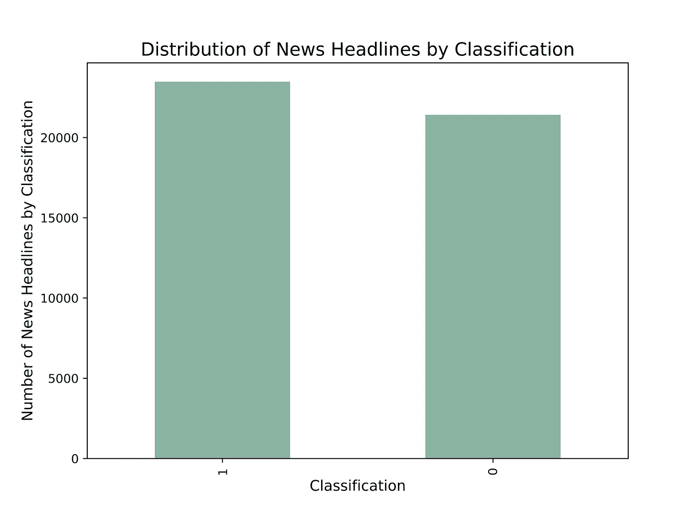
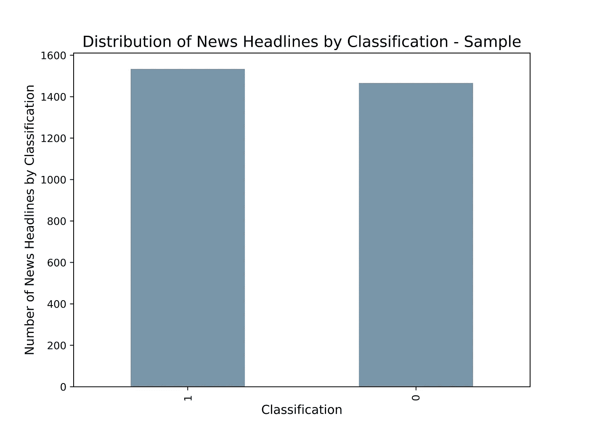
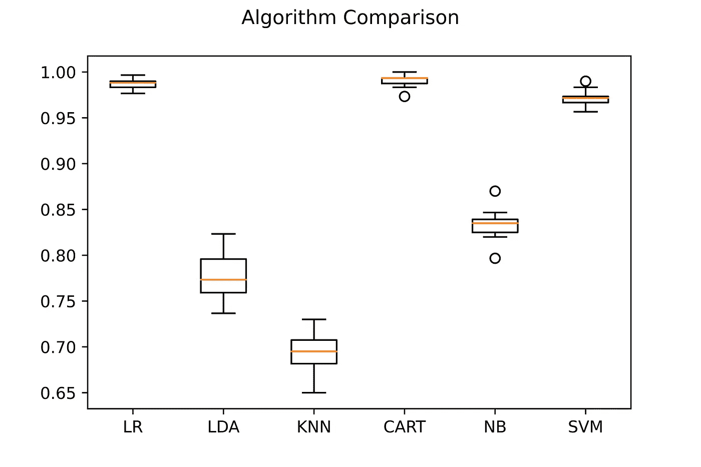

# Python 中模型选择和超参数优化的假新闻检测(> 97% acc。)

> 原文：<https://pub.towardsai.net/fake-news-detection-with-model-selection-and-hyperparameter-optimization-in-python-d738f3d35d3b?source=collection_archive---------0----------------------->

## 模型选择和超参数优化的假新闻检测实用指南


照片由 [Nijwam Swargiary](https://unsplash.com/@pixel_talkies?utm_source=medium&utm_medium=referral) 在 [Unsplash](https://unsplash.com?utm_source=medium&utm_medium=referral) 上拍摄

# 介绍

本文旨在描述用于假新闻检测的模型选择和超参数调整过程。

我的[上一篇文章](https://towardsdatascience.com/model-selection-and-hyperparameter-tuning-on-amazon-kindle-book-reviews-with-python-6d17ec46d318)，在其中我解释了**模型选择**是如何在一个**亚马逊 Kindle 评论**数据集上的机器学习领域内执行的，在读者中获得了成功。该项目提出了一个限制，尽管考虑到包含大约 1，000，000 条评论的数据集的大小，我们无法在很大一部分看不见的数据上部署该算法。由于计算的限制，这是在 50，000 条记录上完成的，大约 5%。

在本文中，我们的目标是识别和调整性能最好的模型。这次将对所有记录进行训练和测试，产生的模型将部署在不同的数据集上，以测试其准确性和泛化能力。

## 数据

训练数据集有两个:一个只包含真实的新闻(`True.csv`)，另一个不包含真实的新闻(`Fake.csv` ) [1]。你可以在下面的[链接](https://www.kaggle.com/datasets/clmentbisaillon/fake-and-real-news-dataset)找到这两个。这两个 CSV 的结构相同:

*   `title` —新闻标题
*   `text` —新闻语料库
*   `subject` —描述新闻标题的内容(新闻、政治……)
*   `date` —新闻标题发布的日期

`True.csv`包含大约 21000 条记录，而`Fake.csv`显示其中的 18000 条。

另一个仅用于测试目的的数据集将用于在看不见的数据上部署模型[4]。记录是根据 Chrome 扩展的分类从 244 个网站搜集来的，该扩展名为 [BS Detector](https://github.com/selfagency/bs-detector) 。你可以在下面的[链接](https://www.kaggle.com/datasets/mrisdal/fake-news)找到数据集。最大的区别是，这一个只包含假评论。它总共有 21 个栏目，其中最相关的是:

*   `uuid` —新闻的唯一标识符字母数字串
*   `ord_in_thread` —同一篇文章被刮了多少次
*   `author`——新闻的作者
*   `published`—发布日期和时间
*   `title`—新闻标题
*   `text`—新闻语料库
*   `language` —新闻语言
*   `crawled` —从网站上抓取的日期和时间
*   `site_url` —网站的帖子网址链接
*   `country` —新闻发布的地方

对于分类问题，对于三个数据集，我们只需要`text`和新闻真实与否的信息。

下面是两个数据集的文本列中的两个示例:

```
The head of a conservative Republican faction in the U.S. Congress, who voted this month for a huge expansion of the national debt to pay for tax cuts, called himself a “fiscal conservative” on Sunday and urged budget restraint in 2018\. In keeping with a sharp pivot under way among Republicans, U.S. Representative Mark Meadows, speaking on CBS’ “Face the Nation,” drew a hard line on federal spending, which lawmakers are bracing to do battle over in January... 
```

第一个语料库提供了真实的新闻，你可以从它专注于讲述事实的客观语气中看出。

```
They should pay all the back all the money plus interest. The entire family and everyone who came in with them need to be deported asap. Why did it take two years to bust them? \nHere we go again …another group stealing from the government and taxpayers! A group of Somalis stole over four million in government benefits over just 10 months! \nWe’ve reported on numerous cases like this one where the Muslim refugees/immigrants commit fraud by scamming our system…It’s way out of control!
```

第二个显示一条假新闻。报道的信息表达了不合理的仇恨，它不仅限于描述事实。这篇文章希望提高公众的意识，并针对特定人群进行负面报道。当然，这样的信息可能是极其危险的，尤其是如果不真实的话。

第二个样本表明需要特别注意清洁部分。除了停用字词之外，还需要过滤掉 HTML 文本标签(例如“\n”、“/”)以及特殊字符(例如“…”、“！”).

## 模型

对于这个项目，我考虑了 7 种常见的分类模型，包括参数和非参数模型。他们都是被监督的学习模型:

*   线性判别分析(LDA)
*   k 近邻
*   高斯朴素贝叶斯
*   逻辑回归
*   决策树分类器
*   支持向量机(SVM)

对于每一个背后的基本原理的更深入的解释，我建议你阅读我的[上一篇文章](https://towardsdatascience.com/model-selection-and-hyperparameter-tuning-on-amazon-kindle-book-reviews-with-python-6d17ec46d318)。

> 第一个目标是确定最适合假新闻分类问题的模型。

我们实现它的方法是通过 ML 管道对每个模型进行交叉验证。在精确度和效率方面最好的两个模型将在由于超参数调整而优化之后被进一步评估。

# 代码部署

## **预处理**

如前所述，第一个[链接](https://www.kaggle.com/datasets/clmentbisaillon/fake-and-real-news-dataset)包含两个数据集，一个只有**真实新闻**，另一个只有**虚假新闻**。如果我们想要执行训练和测试，我们现在需要把它们放在一起。

*   让我们从导入`pandas`开始
*   我们将这两个 CSV 转换成**熊猫数据帧**并命名为它们
*   需要添加一个分类栏来识别某个记录是不是假新闻。使用命令`fake['classification'] = 1`我们创建了一个名为**分类的**新列**，**，它的所有行都被设置为 1。我们的分类器将识别假新闻，并给它们赋值 1。
*   然后将两个数据帧**连接起来**，并且通过将参数`ignore_index`设置为等于`True`来重置它们的索引计数

```
#Importing library
import pandas as pd#assigning dataframe names to csv files
true = pd.read_csv("True.csv")
fake = pd.read_csv("Fake.csv")#Adding classification column
fake['classification'] = 1
true['classification'] = 0#concatenate two dataframes together
true_fake = pd.concat([true,fake], ignore_index=True)
```

## 数据探索

**数据探索**专注于可视化数据，以引导更深入的分析，发现早期见解并识别模式。我们可以通过简单地绘制每个类别的新闻数量来开始这个过程:

*   我们进口`matplotlib`
*   创建了一个名为`category_dist`的新变量，它计算数字 1 和 0 在分类列中出现的次数
*   通过`plt`和一系列命令，我们可以选择大小、图表类型、颜色、标签、标题以及是否需要网格线。

```
#Importing library
import matplotlib.pyplot as plt#Counting values within each classification bucket
category_dist = true_fake['classification'].value_counts()#Defining chart
plt.figure(figsize=(8,6))
category_dist.plot(kind='bar', color = '#89b4a1')
plt.xlabel("Classification", fontsize = 12)
plt.ylabel("Number of News Headlines by Classification", fontsize = 12)
plt.title("Distribution of News Headlines by Classification", fontsize = 15)
plt.grid(False)#Generating chart
plt.show()
```



按分类的新闻分布—按作者的图表

数据帧由大约 **40.000** 条记录组成，假新闻略多。鉴于这种差异不是很大，我们不需要实现任何不平衡的数据处理技术，如上采样。

向型号选择管道输入超过 40，000 条记录，每条记录包含 750 个字或更多，可能导致 **RAM 内存过载**。这个问题的一个简单解决方案是**选择一小部分**记录。

`pandas`提供了一个易于使用的命令，允许开发人员对指定数量的记录进行采样，同时设置一个`random_state`用于结果再现。我决定选择 3000 条记录，这是一个任意的数字，表示略少于 10%的数据帧，它应该不会导致 RAM 过载。

```
sample_df = true_fake.sample(3000, replace=True, random_state = 44)
```



新闻分类分布示例—按作者分类的图表

即使有 3000 条记录，虚假新闻和真实新闻之间的分布保持不变。这意味着我们可以进入下一阶段。

## 文本清理

自然语言处理中的文本清理是最基本的。**停用词**、**特殊字符**和 **HTML 标签**都为我们的模型处理增加了不必要的复杂性。

消除以上所有问题会导致培训和测试时间的**改进**。在完成了对我在文章开头展示的真实新闻样本的清理过程后，最终结果如下所示:

```
washington reuters head conservative republican faction u congress voted month huge expansion national debt pay tax cuts called fiscal conservative sunday urged budget restraint 2018 keeping sharp pivot way among republicans u representative mark meadows speaking cbs face nation drew hard line federal spending lawmakers bracing battle january...
```

以上是模型将被训练和测试的新闻语料库的例子。

## 型号选择

是时候实施**模式选择**机制了。代码通过**计数矢量器**和前面列出的所有模型传输数据，最后执行 **k 倍交叉验证**。然后计算平均精度，并组织成箱线图。让我们一步一步地分解它:

*   `scikit-learn`和`matplotlib`是唯一需要的两个**库**吗？Sklearn 包括对数据执行机器学习所需的所有功能。每个模型通过一个“子库”导入:`LogisticRegression`、`KNeighborsClassifier`、`DecisionTreeClassifier`、`SVC`、`GaussianNB`、`LinearDiscriminantAnalysis`。
*   在这个阶段，我们可以从数据中定义输入和目标变量。输入变量`x`是“ ***文本*** ”，包含评论的语料库；输出变量`y`为“ ***分类*** ”，标注为 **0** 和 **1** 。
*   我们知道，一些用于分析的模型，包括决策树分类器，需要一个**密集矩阵**。密集矩阵大多包含非零值。`ToDenseTransformer`类确保所有矩阵都是密集的，以避免任何错误。
*   然后创建列表`models`，分配给每个模型的对象被添加到列表中。另一方面，列表`results`将包含所有与其名称相关的不同模型分数。
*   `kfold`参数表示我们想要多少个k 倍。这就引入了**交叉验证**的概念。交叉验证旨在更好地估计模型的准确性。定义为 **k 倍**交叉验证，其中 **k** 为数据被划分的子组数。该模型在一个分组上进行训练，并在剩余的 **k-1** 上进行测试。准确度是根据平均分计算的。
*   **流水线**在选择的 **k-fold** 上应用**计数矢量器**、**密集变换器**和**选择模型**并执行交叉验证。然后它在控制台上打印结果。
*   `matplotlib`最终生成一个**箱线图**，这样我们可以更好地解释结果。

为我们的数据寻找性能最佳的模型——按作者编码



模型选择过程后算法的准确性比较—作者提供的图表

箱线图为您提供了我们模型在精确度方面的五个关键数值的信息:

*   **最小值**
*   第一个四分位数(第 25 个百分点)
*   **中位数**(第二个四分位数)
*   第三个四分位数(75%)
*   **最大值**。

在 **x 轴**上，有所有被纳入分析的模型进行交叉验证。相反，在 **y 轴**上，我们有准确度分数。单从图表来看，很难准确说出每个模型的表现有多好；例如，逻辑回归和决策树分类器彼此非常接近。在这种情况下，控制台上打印的值会有所帮助:

```
LR: 0.986333 (0.006046)
LDA: 0.777333 (0.028628)
KNN: 0.693000 (0.022531)
CART: 0.990333 (0.007219)
NB: 0.833333 (0.017951)
SVM: 0.971333 (0.009452)
```

左边的数字表示平均准确度，括号中的数字是交叉验证后计算的方差。很明显 **CART** 在准确性方面是**表现最好的**，但是**逻辑回归**在提供**一致的**结果方面略胜一筹(差距很小)。

## 逻辑回归超参数调整

逻辑回归是具有最高精确度和最低方差的两个模型之一，这使其成为**超参数调整**阶段的绝佳候选。

与逻辑回归模型相关的两个参数是:

*   *解算器*是一种帮助模型更好地适应数据的算法。在逻辑回归的情况下，有 5 种类型:`liblinear`、`lbfgs`、`newton-cg`、`sag`和`saga`。
*   *C 参数*表示正则化强度。分配给 C 的值越高，意味着正则化越强。当模型以看不见的数据呈现时，正则化是泛化的同义词。

以下代码调整上述超参数以及计数矢量器参数，以找到最佳组合:

*   在前一个代码单元中已经导入了库，但是我决定重新导入它们以使这个代码片段独立。在这种情况下，我们只需要`sklearn`以及与交叉验证、模型部署、流水线和计数矢量器相关的子包。
*   这次的流水线只包括**计数矢量器**和**逻辑回归**模型。不需要密集变压器
*   转到参数列表，这些包含了`grid_search`为管道的每个组件尝试的所有可能的超参数组合。例如，参数`max_df`的计数，矢量器负责模型的**泛化**。`max_df`删除出现太频繁的单词，0.7 的`max_df`忽略出现在超过 70%的文档中的术语。在一个场景中，`vect__max_df`将使用内核`poly`和参数`C`10 将 0.7 的`max_df`与(1，1)的`ngram_range`组合起来。因为每个交叉验证进行了 5 次，所以总“适合”(组合)是 405。
*   启动`grid_search.fit`后，最后一部分代码开始在控制台上打印计算结果

为计数矢量器和逻辑回归模型寻找最佳参数—由作者编写代码

逻辑回归模型的最佳超参数设置如下:

```
Best: 0.989000 using {'LR__C': 100, 'LR__solver': 'liblinear', 'vect__max_df': 0.8, 'vect__ngram_range': (1, 3)} 0.986667 (0.004346) with: {'LR__C': 100, 'LR__solver': 'newton-cg', 'vect__max_df': 0.7, 'vect__ngram_range': (1, 1)} 0.984333 (0.005228) with: {'LR__C': 100, 'LR__solver': 'newton-cg', 'vect__max_df': 0.7, 'vect__ngram_range': (1, 2)}
```

*   C = 100
*   内核类型= liblinear
*   max_df = 0.7
*   ngram_range = (1，3)

通过这些设置，当在仅 3000 条新闻上部署交叉验证方法时，该模型实现了 98%的准确性。结果已经非常有希望了。给定最优的**超参数**，例如`C` 和`max_df`，我们已经可以知道算法的泛化应该足以正确地对看不见的数据进行分类。

```
 precision    recall  f1-score   support

           0       1.00      1.00      1.00      4310    
           1       1.00      1.00      1.00      4670 accuracy                           1.00      8980   
   macro avg       1.00      1.00      1.00      8980 
weighted avg       1.00      1.00      1.00      8980
```

令人惊讶的是，当部署在大约 9000 个看不见的测试记录上时，该模型呈现出 100%的准确性。尤其是在这种情况下，可能有多种原因导致一个训练有素的模型如此精确。

**“过拟合”**就是其中之一。如果模型在同一数据集中对记录进行了很好的分类，但是当它部署到新数据上时，它失去了准确性，那么可能会发生过度拟合。

第二个原因可能是“**幸运拉动**”。如果一个模型在数据集的正确部分进行训练，并在容易分类的记录上进行测试，那么可能发生了幸运的拉动。然而，另一方面，交叉验证应该从根本上消除这个问题。

第三个原因可能是数据集具有外部数据所没有的**共同特征**。有可能这个数据集中的所有假新闻都包含“假”这个词或标签。对于一个模型来说，在同一个数据集中理解真实和虚假的新闻要容易得多，但是一旦出现新的数据，准确性可能会下降。

上述所有问题的常见解决方案是在不同的数据集上部署模型，并评估性能是保持不变还是下降。

## 决策树分类器

决策树分类器(CART)在用于分析的 6 种算法中显示出最好的准确性。超参数调优后，性能应该会更好。

购物车模型的三个参数是:

*   `max_features`是“每次做出拆分决定时要考虑的特征数量”[5]。如果数据有 50 列，那么您可以将该参数设置为 10，以便在训练阶段只包括这 50 列中的 10 列。
*   `max_depth`是一棵树可以拥有的“分枝”的最大数量。较高的值可能会导致过度拟合。
*   `min_samples_leaf`是“一个叶节点所需的最小样本数”【5】。该值决定了树需要的最小分割点。

除了超参数之外，与逻辑回归相比，CART 模型的代码片段没有其他变化。

为计数矢量器和 CART 模型寻找最佳参数—按作者编码

购物车模型中性能最好的超参数设置如下:

```
Best: 0.990000 using {'CART__max_depth': 4, 'CART__max_features': 0.8, 'CART__min_samples_leaf': 0.04, 'vect__max_df': 0.7, 'vect__ngram_range': (1, 1)}0.986667 (0.006055) with: {'CART__max_depth': 3, 'CART__max_features': 0.2, 'CART__min_samples_leaf': 0.04, 'vect__max_df': 0.7, 'vect__ngram_range': (1, 2)} 0.906000 (0.104337) with: {'CART__max_depth': 3, 'CART__max_features': 0.2, 'CART__min_samples_leaf': 0.04, 'vect__max_df': 0.7, 'vect__ngram_range': (1, 3)}
```

*   max_depth = 4
*   最大特征数= 0.8
*   最小样本叶= 0.04
*   max_df = 0.7
*   ngram_range = (1，1)

使用计数矢量器和算法的上述超参数，平均准确度达到 99%的分数。

```
 precision    recall  f1-score   support

           0       0.99      1.00      0.99      4310     
           1       1.00      0.99      0.99      4670 accuracy                           0.99      8980    
   macro avg       0.99      0.99      0.99      8980 
weighted avg       0.99      0.99      0.99      8980
```

一旦我们在 40，000 条记录上部署模型，并在 9000 条记录上测试它，准确性保持不变。99%的准确率仍然是一个很大的成就，但另一方面，大约 4000 条记录中有 1%被错误分类，逻辑回归似乎总体上是部署在新记录上的更好的解决方案。

## 对来自不同数据集的看不见的数据测试模型

我们终于到了最后阶段。作为对迄今所做工作的提醒:

1.  我们认为逻辑回归是最好的模型
2.  调整逻辑回归模型
3.  对 31000 条记录进行训练，并对剩下的 9000 条记录进行测试

本节旨在了解数据集内某个共同特征的先前假设是否为真。我们怎么做呢？我们通过在一个单独的假新闻数据集上测试该模型是否产生相同的结果来做到这一点[4]。数据集只呈现一个限制，它只包含假新闻。

以下代码片段显示了如何继续:

*   我们进口`pandas`
*   从 CSV 文件创建数据帧，并将其重新命名为`fake_test`
*   从 21 个可用列中选择相关列，并过滤掉所有非英文记录
*   在我们设置了输入和输出变量之后，所有的记录都需要用单词包方法进行转换
*   最后，命令`LR.predict`用训练好的模型对记录进行分类

```
#Importing libraries
import pandas as pd#Creating dataframe
fake_test = pd.read_csv("fake.csv")#Adding classification column to identify fake-news
fake_test['classification'] = 1#Selecting relevant columns with only english records
fake_test = fake_test[['text', 'language', 'classification']]
fake_test = fake_test.query("language == 'english'")#Espliciting input and output variables
x_test = fake_test['text']
y_test = fake_test['classification']#Transforming 'text' column into bag of words
bow_test = count_vect.transform(x_test.values.astype('U'))#Classify new records
predicted_LR_test = LR.predict(bow_test)#Print accuracy report
print(classification_report(y_test, predicted_LR_test))
```

正如预期的那样，数据集只包含假新闻，分类器正确地预测了每一个假新闻，保持了在调整和测试阶段所承诺的内容。我们的模型以 100%的精度分类新闻是否是假的，即使使用具有最小计算成本的外部数据集。

```
 precision    recall  f1-score   support

           0       0.00      0.00      0.00         0     
           1       1.00      0.97      0.98     12357 accuracy                           0.97     12357    
   macro avg       0.50      0.48      0.49     12357 
weighted avg       1.00      0.97      0.98     12357
```

尽管总体精度受到召回分数的影响。现在，如果精度在数学上定义为:

```
p = true positives / (true positives + false positives)
```

召回分数定义为:

```
r = true positives / (true positives + false negatives)
```

所以你可以从下面的混淆矩阵中看到，420 条本该被归类为假的记录，实际上被模型归类为真。尽管如此，考虑到该算法已经部署在不同的数据集上，性能还是令人满意的。它允许我们消除**过度拟合**和**共同特征**假设。

```
 predicted
             (0)    (1)
            --------------
       (1) | 420  | 11937|
actual      --------------
       (0) | 0    | 0    |
            --------------
```

# 结论

该项目显示了实施**模型选择**和**超参数调整**机制的重要性，它们允许从业者探索各种不同的选项，最终在多个视角下产生出色的执行模型。

最重要的是，与人类相比，它提醒我们机器学习在**速度**方面的潜力。该算法只花了几分钟时间进行训练，随后对数万条记录进行了分类。一个人完成同样的任务需要几个星期。

接下来可能的步骤包括将**部署到另一个包含虚假和真实新闻的数据集**上，或者在基于**机器学习的产品**中实现该算法，例如 [BS 检测器](https://github.com/selfagency/bs-detector)。

最后，这篇文章旨在提高对假新闻问题的认识，这个问题在社交媒体平台上可能太受欢迎了。在信息时代，**误传**是我们需要解决的一个魔咒，而 AI 代表了一个做这件事的伟大工具。

*最后一点，如果您喜欢该内容，请考虑添加一个关注，以便在新文章发布时得到通知。如果你对这篇文章有什么要考虑的，写在评论里吧！我很想读读它们:)谢谢你的阅读！*

*PS:如果你喜欢我写的东西，如果你能通过* [*这个链接*](https://giovanni-valdata.medium.com/membership) *订阅一个灵媒会员，那对我来说就是全世界。有了会员资格，你就获得了媒体文章提供的惊人价值，这是支持我的内容的一种间接方式！*

[1]假新闻检测数据集—维多利亚大学。(2022).2022 年 8 月 11 日检索，来自 Uvic.ca 网站:[https://www . uvic . ca/ECS/ECE/isot/datasets/fake-news/index . PHP](https://www.uvic.ca/ecs/ece/isot/datasets/fake-news/index.php)

[2] Ahmed H，Traore I，Saad S .“使用文本分类检测观点垃圾邮件和假新闻”，《安全与隐私杂志》第 1 卷第 1 期，Wiley，
2018 年 1 月/2 月。

[3] Ahmed H，Traore I，Saad S. (2017)“使用 N-Gram 分析和机器学习技术检测在线假新闻。载于:Traore I .，Woungang I .，Awad A. (eds)分布式和云环境中的智能、安全和可靠的系统。ISDDC 2017。计算机科学讲义，第 10618 卷。施普林格，湛(第 127- 138 页)。

[4]梅根·里斯达尔。(2016).“对假新闻[数据集]变得真实”。卡格尔。[https://doi.org/10.34740/KAGGLE/DSV/911](https://doi.org/10.34740/KAGGLE/DSV/911)

[5]sk learn . tree . decision tree classifier .(2022)。2022 年 8 月 11 日检索，来自 scikit-learn 网站:[https://sci kit-learn . org/stable/modules/generated/sk learn . tree . decision tree classifier . html](https://scikit-learn.org/stable/modules/generated/sklearn.tree.DecisionTreeClassifier.html)‌