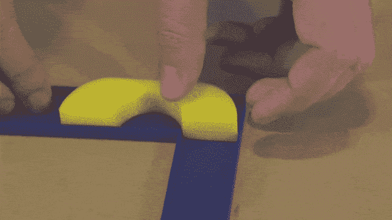
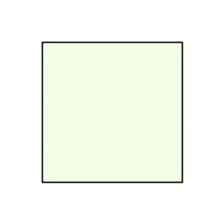
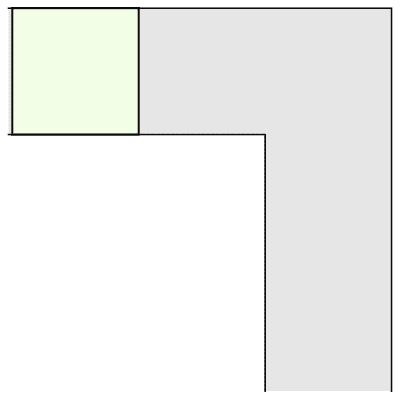
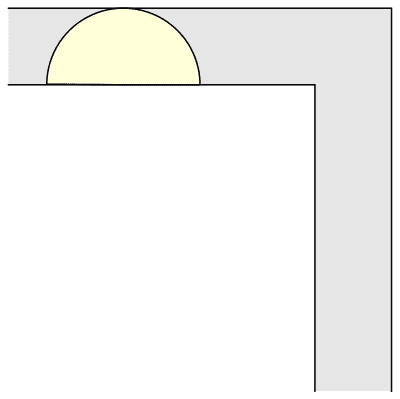
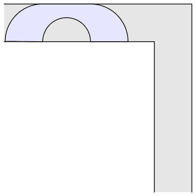

# 著名的现代数学问题:移动的沙发问题

> 原文：<https://pub.towardsai.net/famous-modern-math-problem-the-moving-sofa-problem-e8fad31a65a8?source=collection_archive---------0----------------------->

## [数学](https://towardsai.net/p/category/mathematics)

## 现代几何学中最有趣的问题之一与沙发有关。

来源:[https://www . popular mechanics . com/science/math/a 25808/moving-sofa-problem/](https://www.popularmechanics.com/science/math/a25808/moving-sofa-problem/)

在著名数学问题系列的另一个例子中，今天我们要讨论一个非常简单却没有切实解决方案的问题。这个问题以“移动沙发问题”这个吸引人的名字在数学界广为人知。

移动沙发问题的想法是由奥地利-加拿大数学家 [Leo Moser](https://en.wikipedia.org/wiki/Leo_Moser) 于 1966 年提出的，他提出了如下问题:

"*在宽度为 1 的二维走廊中，可以绕着一个直角拐角移动的平面中最大面积的形状是什么？"*

来源:科学警报

不要让简单的陈述欺骗了你。这是一个很难理解的问题。根据问题陈述，我们知道我们肯定可以放入面积为 1 的方形沙发。

来源:科学警报

嘿，但是考虑到我们可以旋转沙发，我们也可以拟合一个半径为 1 的半圆，它的ᴨ/2 面积较大，大约为 1.57。

来源:科学警报

我们可以构造一些更有趣的形状，比如下面这个，它的 2/ᴨ+ᴨ/2 面积更大，大约是 2.2074。

来源:科学警报

移动沙发问题至今仍没有明确的解决方案。正如作者[道格拉斯·亚当斯](https://en.wikipedia.org/wiki/Douglas_Adams)在他的小说*中所说的那样，德克·詹特利的整体侦探事务所*。

*“古怪，”雷格表示同意。“我肯定从未遇到过任何涉及沙发的不可逆数学。可能是一个新领域。你和任何空间几何学家谈过吗？”*