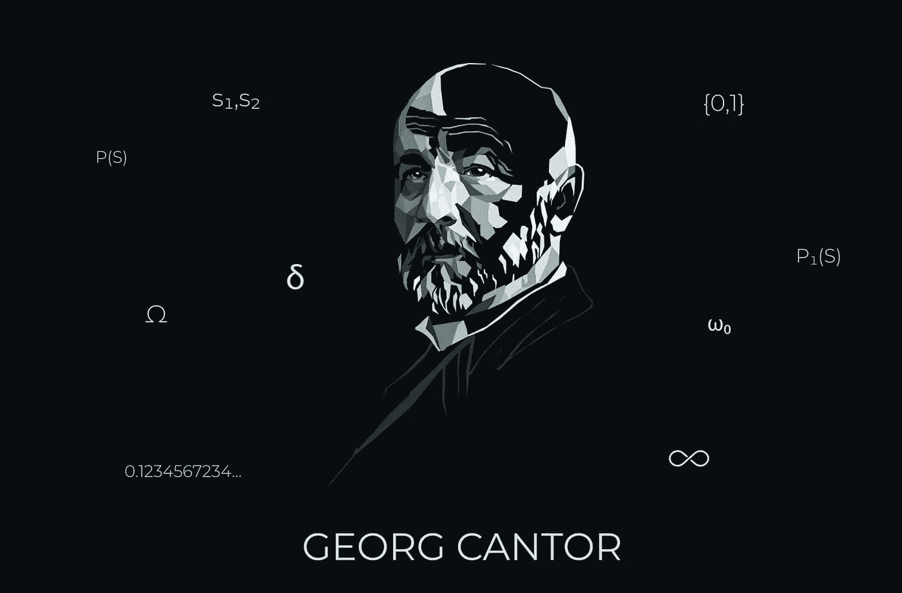
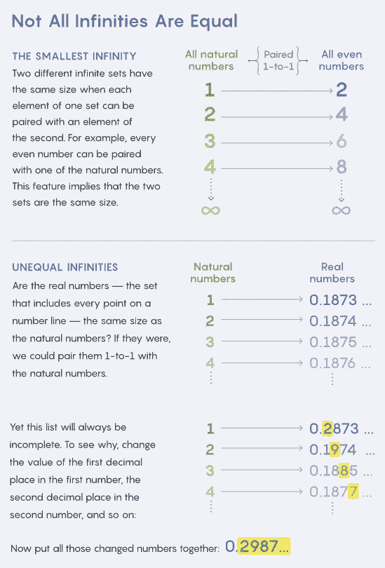

# 著名的现代数学问题:康托连续统假说

> 原文：<https://pub.towardsai.net/famous-modern-math-problems-cantor-continuum-hypothesis-588a5085e12c?source=collection_archive---------2----------------------->

## [数学](https://towardsai.net/p/category/mathematics)

## 现代数学中最难解的问题之一。

来源:[https://abak cus . com/article/the-father of infinity-and-modern-mathematics-Georg-cantor/](https://abakcus.com/article/the-father-of-infinity-and-modern-mathematics-georg-cantor/)

继续我们关于著名数学问题的系列，今天我们想讨论数学史上最具标志性的问题之一。康托的连续统假说(CH)被戴维·希尔伯特列为第一位，他把它放在 20 世纪面临的著名的开放问题清单的第一位。

即使使用基本的数学原理，CH 也非常容易理解，并试图回答一个非常基本的问题:存在多少个数字？

CH 的起源可以追溯到我们今天所认为的集合论。1874 年，德国数学家[格奥尔格·康托](https://en.wikipedia.org/wiki/Georg_Cantor)震惊了世界，他证明了实数(填满一条几何线的数，例如:1.2，1.23，1.24……)比自然数(例如:1，2，3……)多。假设实数和自然数的集合都是无限的，这意味着一些无穷大比另一些更大，或者换句话说，有不止一个无穷大。

来源:广达杂志

在康托尔的分析中，最小的无限基数是א‎0(“aleph 0”)正好是自然数集的大小。下一个更大的基数是א‎1(“aleph 1”)，然后是א‎2，א‎3，等等。利用这种基数分析，康托发现，一个无穷数集合的子集(我们称之为幂集)的任何集合都比原始集合本身具有更大的基数。例如，康托证明了对自然数进行重新排序的集合具有基数א‎1 或者比自然数的基数高一级。

CH 声明实数集具有基数א‎1.比自然数高一级，中间没有其他基数。如果连续统假设为假，则意味着存在一个大于自然数集但小于实数集的实数集。在这种情况下，实数集的基数必须至少是א‎2.

尽管 CH 很直观，但康托无法证明它，这个问题困扰了数学家几十年。1938 年，[库尔特·哥德尔](https://en.wikipedia.org/wiki/Kurt_G%C3%B6del)用标准的数学公理证明了连续统假设是错误的，这是无法证明的(ZFC 称之为“策梅洛-弗兰克尔”)。哥德尔似乎相信 CH 是假的，但无法证明。30 年后，证明了相反的情况，你不能用 ZFC 公理来证明 CH。科恩-哥德尔似乎认为 CH 独立于 ZFC 公理，或者说那些公理不足以证明 CH。

从那以后，在建立新的基础以解决中国的问题上，已经有了一些有趣的进展。目前，CH 仍然是现代数学中最神秘的问题之一。