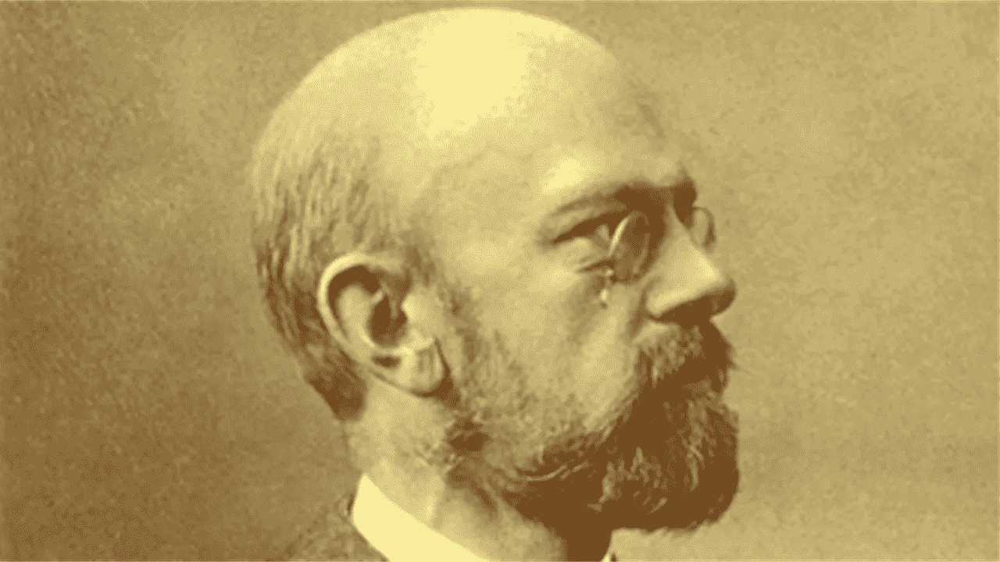

# 现代数学名题:希尔伯特第 13 题

> 原文：<https://pub.towardsai.net/famous-modern-math-problems-hilberts-13th-problem-2ef34a07b5c0?source=collection_archive---------0----------------------->

## [数学](https://towardsai.net/p/category/mathematics)

## 这个著名的问题困扰了数学家一个多世纪。

来源:[https://www . simonsfoundation . org/2020/05/06/hilberts-problems-23-and-math/](https://www.simonsfoundation.org/2020/05/06/hilberts-problems-23-and-math/)

> 我最近创办了一份专注于人工智能的教育时事通讯，已经有超过 10 万名订户。《序列》是一份无废话(意思是没有炒作，没有新闻等)的 ML 导向时事通讯，需要 5 分钟阅读。目标是让你与机器学习项目、研究论文和概念保持同步。请通过订阅以下内容来尝试一下:

 [## 序列

### 订阅人工智能世界中最相关的项目和研究论文。受到 102，000 多人的信任…

thesequence.substack.com](https://thesequence.substack.com/) 

继续今天仍然困扰数学家的著名问题系列，我想讨论一个经受了 120 多年时间考验的问题。我指的是希尔伯特著名的第十三个问题。

在 1900 年的一次会议上，德国数学家戴维·希尔伯特列出了 23 个数学上未解决的问题，他认为这些问题对于推动该领域的发展至关重要。一年来，其中一些问题已经解决，另一些受到质疑，还有一些经受住了时间的考验，有大批数学家试图解决这些问题。最后一组，需要数希尔伯特第 13 题。

就像好的数学谜团一样，希尔伯特的第 13 个问题非常容易解释。问题的核心与解 7 次多项式方程的能力有关。对于多项式，我们指的是由数字系数组成的一串数学术语，变量的幂都通过加法和减法运算连接起来。想象一个如下形式的方程:

***x^7+ax^3+bx^2+CX+1 = 0***

希尔伯特的第 13 个问题只是问这类方程是否可以作为有限多个二元函数的组合来求解。从初等数学开始，我们学习解二次、三次和四次多项式方程的方法。在其他时候，这些方法耗费了著名数学家数年的时间。例如，数学传奇人物如[斐波那契](https://en.wikipedia.org/wiki/Fibonacci)、[尼克洛·塔尔塔利亚](https://en.wikipedia.org/wiki/Niccol%C3%B2_Tartaglia)和[吉罗拉莫·卡尔达诺](https://en.wikipedia.org/wiki/Gerolamo_Cardano)积极致力于解决三次(三次多项式方程)。19 世纪的数学天才之一，[尼尔斯·亨利克·阿贝尔](https://en.wikipedia.org/wiki/Niels_Henrik_Abel)，做了大量工作试图解决五次方程。

7 次多项式似乎是下一个前沿领域。但是一个多世纪以来，这一挑战一直没有得到解决。有趣的是，希尔伯特预测了他的第 13 个问题的否定答案:

*“七次方程的根可能是其系数的函数，而[……]不能通过有限次插入两个自变量的函数来构造。为了证明这一点，有必要证明七次方程 f7 + xf3 + yf2 + zf + 1 = 0 在只有两个自变量的连续函数的帮助下是不可解的。”*

在希尔伯特的第 13 个问题公式化之后，大约过了 50 年，才朝着解决方案取得任何有意义的进展。这个问题最著名的“证明”出现在 20 世纪 50 年代，由苏联数学天才弗拉基米尔·阿诺德和他的导师安德烈·尼科利耶维奇·科尔莫戈罗夫提出。大多数数学家认为 Arnold-Kolmogorov 证明是希尔伯特第 13 个问题的最终答案，但事实证明并非如此。他们的证明局限于连续函数(即值没有突变的函数)。然而，希尔伯特的问题更集中于代数函数(可以定义为多项式方程的根的函数)，而不一定是连续函数。阿诺德本人宣称希尔伯特 13 号问题仍然存在，并花了几十年时间试图找到一个更通用的解决方案，但没有成功。

在过去的几年里，有一些有趣的发展可能指向一个数学问题的最终解决方案。就目前而言，希尔伯特第 13 题仍然可以被认为是上个世纪最具标志性的数学问题之一。