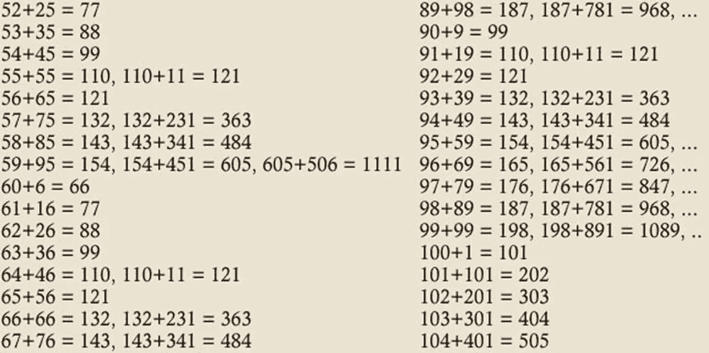

# 著名的现代数学问题:196 里克尔数问题

> 原文：<https://pub.towardsai.net/famous-modern-math-problems-the-196-lychrel-number-problem-7d715516a7ac?source=collection_archive---------0----------------------->

## [数学](https://towardsai.net/p/category/mathematics)

## 一个非常简单且相对较新的数学问题，至今仍未解决。

来源:[https://geek dad . com/2014/04/geek dad-puzzle-lych rel-sequences/](https://geekdad.com/2014/04/geekdad-puzzle-lychrel-sequences/)

在我们关于著名数学问题系列的另一部分中，今天我想讨论一个非常简单且相对较新的问题，这个问题一直在挑战数学家。这个问题的陈述有些耐人寻味:

*196 是一个里克尔数吗？*

有一种简单的数学运算叫做反相加。取两个或两个以上数字的任意自然数，颠倒数字，将其加到原始数字上，并多次重复该操作。众所周知，这一过程最终会产生一个回文数，这个数字在颠倒后保持不变。让我们举几个例子:

*   数字 56 在一次迭代中变成回文:56+65 = 121。
*   *数字在一次迭代后也变成回文:7326 + 6237 = 13563*
*   *数字 57 经过两次迭代变成回文:57+75 = 132，132+231 = 363。*
*   *数字 59 经过三次迭代后成为回文:59+95 = 154，154+451 = 605，605+506 =*[*1111*](https://en.wikipedia.org/wiki/1111)
*   *数字 10，911 在 55 次迭代后变成回文，产生数字:4668731596684224866951378664(28 位)。*

Lychrel 的数字是自然数，当使用反向相加算法应用时，不知道会形成回文。这个词是由美国数学家[韦德·范·兰丁汉](http://www.p196.org/)创造的，是他女朋友的名字谢丽尔的粗略变位词。

第一个 Lychrel 的号码有:196，295，394，493，592，689，691，788，790，879，887 等几个。没有正式的证据证明这些数字在反转相加算法的大量步骤后不会产生回文，但是这个假设在大规模上肯定是成立的。例如，2015 年，Romain Deb 进行了 10 亿次反相加过程，产生了 413，930，770 个数字。没有找到回文。

目前，利克莱尔的数字仍然是一个有趣的数学谜。