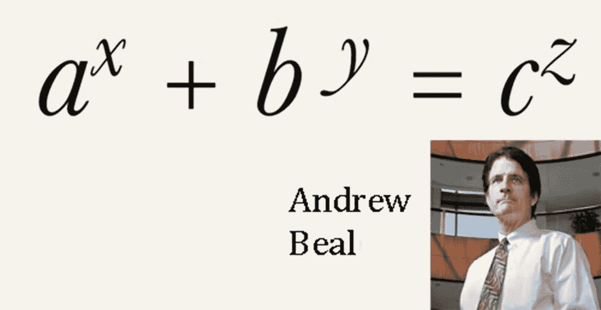

# 著名的现代数学问题:比尔猜想

> 原文：<https://pub.towardsai.net/famous-modern-math-problems-the-beal-conjecture-e49cc854a563?source=collection_archive---------2----------------------->

## [数学](https://towardsai.net/p/category/mathematics)

## 费马大定理最著名的推广之一。

来源:[https://www . David darling . info/encyclopedia/B/Beals _ juvey . html](https://www.daviddarling.info/encyclopedia/B/Beals_conjecture.html)

> 我最近创办了一份专注于人工智能的教育时事通讯，已经有超过 10 万名订户。《序列》是一份无废话(意思是没有炒作，没有新闻等)的 ML 导向时事通讯，需要 5 分钟阅读。目标是让你与机器学习项目、研究论文和概念保持同步。请通过订阅以下内容来尝试一下:

 [## 序列

### 订阅人工智能世界中最相关的项目和研究论文。受到 102，000 多人的信任…

thesequence.substack.com](https://thesequence.substack.com/) 

继续我们关于著名数学问题的系列，今天我想讨论一个尚未证实的非常奇怪的猜想。我们天真地认为，棘手的数学问题总是由数学家提出来的。但事实并非如此。当然，在数学史上，我们有过由哲学家、律师、会计师甚至牧师创造的难以置信的复杂问题，但这是怎么回事呢？今天，我想讨论一个数学猜想，它不是由一位天才数学家，而是由一位银行家提出的。

你可能没有听说过比尔猜想，但你可能知道费马大定理。嗯，原来他们是有关系的。1993 年，[美国银行家 Andrew Beal](https://en.wikipedia.org/wiki/Andrew_Beal) 提出了费马大定理的一个推广，至今仍未被证实。

1637 年，法国数学家[皮埃尔·德·费马](https://www.britannica.com/biography/Pierre-de-Fermat)阐述了其著名的最后一个定理，即对于正整数 *x* 、 *y* 、 *z* 、n，方程*x^n*+*y^n*=*z^n*对于 *n* > 2 无解。1995 年，安德鲁·约翰·怀尔斯爵士用一种基于椭圆曲线的极其复杂的方法最终证明了这个定理。

多年来，费马大定理的许多推广已经形成。比尔猜想仍然是最著名的猜想之一。在怀尔斯证明的几年前，安德鲁·比恩提出了一个猜想，假设:

*x^m*+*y^n*=*z^r*，其中 *m* 、 *n* 、 *r* 为大于 2 的整数，则 *x* 、 *y* 、 *z* 有一个共同的质因数(1 以外)。

比尔给 50 多位数学家写了一封信，以确认问题陈述的独特性。尽管一些数学家认为这个猜想以前就已经知道了，比尔还是被认为是他的创造。

自 1995 年以来，比尔设立了一项奖金，奖励经过同行评议的猜想证明或可证实的反例。目前，这一猜想仍未被证实。