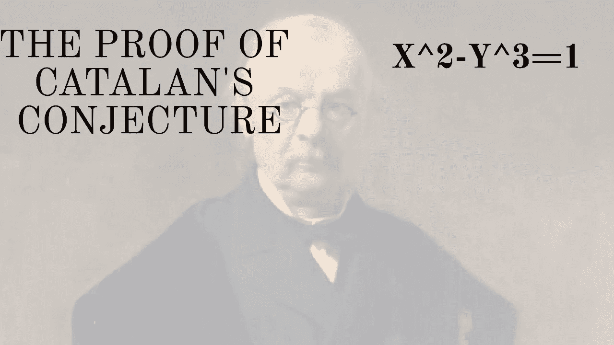

# 著名的现代数学问题:加泰罗尼亚猜想

> 原文：<https://pub.towardsai.net/famous-modern-math-problems-the-catalans-conjecture-ffad8c7165ac?source=collection_archive---------3----------------------->

## [数学](https://towardsai.net/p/category/mathematics)

## 数论中最著名的问题之一终于在二十年前被证明了。

来源:https://www.youtube.com/watch?v=Ib4J0o9nuGM

> 我最近创办了一份专注于人工智能的教育时事通讯，已经有超过 10 万名订户。《序列》是一份无废话(意思是没有炒作，没有新闻等)的 ML 导向时事通讯，需要 5 分钟阅读。目标是让你与机器学习项目、研究论文和概念保持同步。请通过订阅以下内容来尝试一下:

 [## 序列

### 订阅人工智能世界中最相关的项目和研究论文。受到 110，000+的信任…

thesequence.substack.com](https://thesequence.substack.com/) 

继续我们今年关于著名数学问题的系列，我们想讨论一个二十年前刚刚解决的数论中非常简单的问题。这个问题被称为加泰罗尼亚猜想，是由比利时数学家尤金·查尔斯·加泰罗尼亚在 1844 年提出的。

该猜想的论题非常简单，表明整数 2^3 和 3^2 是仅有的两个连续的幂自然数。用更正式的数学术语来表达这个猜想，我们会得到这样的结果:

来源:https://twitter.com/mathtype/status/1089177421071482881

即使形式猜想是在 1844 年形成的，类似的想法也有早期的重复。法国犹太数学家[李维·本·格森(**格索尼德斯)**](https://en.wikipedia.org/wiki/Gersonides) 证明了一个类似的想法，但是只针对 2 和 3 的幂。

加泰罗尼亚猜想的第一个重要进展出现在 1976 年，当时荷兰数学家罗伯特·蒂德曼证明，如果该猜想不成立，那么它只有有限和少量的例外。进一步的进展证实了天文数字的猜想，但直到 21 世纪初才找到普遍的证据。

2002 年，在它最初发表 158 年后，罗马尼亚数学家 Preda Mihă ilescu 为加泰罗尼亚猜想提供了一般性证明。最初，Mihă ilescu 将证明的副本发送给了几位数学家，这项工作最终被接受并于 2004 年发表在 Crelle 杂志上。这个证明使用了一个非常复杂的数字代数数论领域，称为分圆域。

加泰罗尼亚猜想看起来非常简单，但在建筑、工程甚至物理等不同领域都有深远的影响。尽管如此，Mihă ilescu 的证明仍然被认为是过去二十年中最伟大的数学成就之一