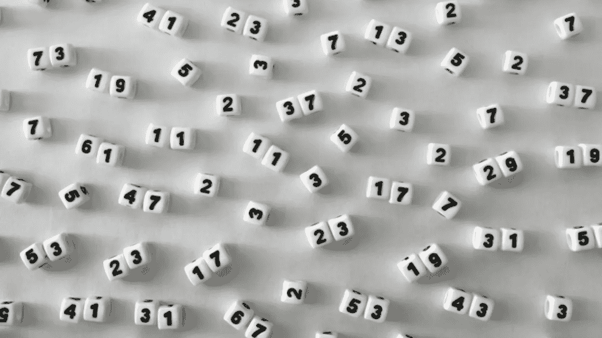
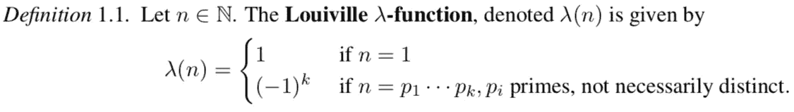
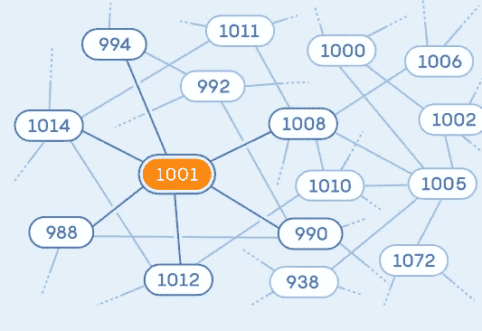
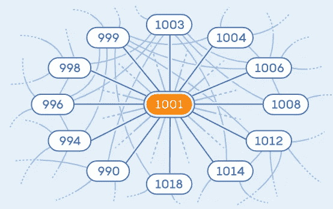

# 著名的现代数学问题:乔拉猜想

> 原文：<https://pub.towardsai.net/famous-modern-math-problems-the-chowla-conjecture-323d9b115e3c?source=collection_archive---------1----------------------->

## [数学](https://towardsai.net/p/category/mathematics)

## 一个 50 年之久的关于质数的问题去年刚刚解决。

来源:[https://Mashable . com/article/why-we-should-care-prime-numbers](https://mashable.com/article/why-should-we-care-about-prime-numbers)

> 我最近创办了一份专注于人工智能的教育时事通讯，已经有超过 10 万名订户。《序列》是一份无废话(意思是没有炒作，没有新闻等)的 ML 导向时事通讯，需要 5 分钟阅读。目标是让你与机器学习项目、研究论文和概念保持同步。请通过订阅以下内容来尝试一下:

 [## 序列

### 订阅人工智能世界中最相关的项目和研究论文。受到 110，000+的信任…

thesequence.substack.com](https://thesequence.substack.com/) 

数学家喜欢阴谋论，今天我想讨论一个包含这种精神的问题。作为我们著名数学问题系列的一部分，我们最近[报道了孪生素数猜想，该猜想指出有无穷多个素数 p，使得 p + 2 也是素数](https://towardsai.net/p/l/famous-modern-math-problems-the-twin-prime-conjecture)。今天，我想讨论一个被称为 Chowla 猜想的相关问题，许多人认为这是解决孪生素数猜想的重要一步。

孪生素数猜想的本质是在给定的数值接近度下显示素数之间的关系。1965 年，数学家 [**萨瓦达曼·乔拉**](https://en.wikipedia.org/wiki/Sarvadaman_Chowla) 提出了一种不同的方式来思考闭素数。 ***Chowla 公式化地表示，无论一个整数有偶数还是奇数个质因数，都不应该影响连续数的质因数个数。***

乔拉猜想的正式数学基础是基于**刘维尔函数**。这个函数以法国数学家约瑟夫·刘维尔的名字命名，如果一个数的质因数是偶数，它的值为+1，如果是奇数，它的值为-1。**例如，10 的刘维尔函数返回+1 (2x5=10)，27 的刘维尔函数返回-1 (3x3x3=27)。**

Chowla 猜想指出，连续数的刘维尔函数值没有相关性。

关于解决乔拉猜想的第一个进展来自于澳大利亚裔美国数学家**[**【陶哲轩】**](https://en.wikipedia.org/wiki/Terence_Tao) ，他使用图形技术来表示整数中质因数之间的关系。在陶的一个图中，如果两个节点相差一个素数或者能被这个素数整除，则这两个节点是连通的。该图的边表示影响网络，其想法是证明该图有太多的连接来表示刘维尔函数。在陶的图中，连接连续整数的路径需要经过多个节点，这使得相关性的概念非常困难。从某种意义上说，陶对 Chowla 猜想有解，但不是很强。猜想的任何解决方案都应该在图中的连续整数之间显示出明显的独立性。在陶的案例中，直到我们处理超级大数时，独立性才变得清晰。**

****

**图片来源:广达杂志**

**2021 年，在陶工作的基础上，数学家 Harald helf gott[mak sym Radziwi](http://www.its.caltech.edu/~maksym/)构建了一个更简单的图，其中的节点只要相差一个质数就可以连接。这个图确实显示了连续整数之间的明显独立性，模拟随机游走非常简单。利用这种图形结构，Helfgott 和 Radziwi 使用了一些复杂的矩阵数学来证明与陶的原始图形的相似性。结果是乔拉猜想的一个漂亮的证明。**

****

**图片来源:广达杂志**

**Chowla 猜想的最近证明打开了许多其他有趣的素数问题的大门，例如孪生素数猜想。无疑是过去几年中最重要的数学发现之一。**