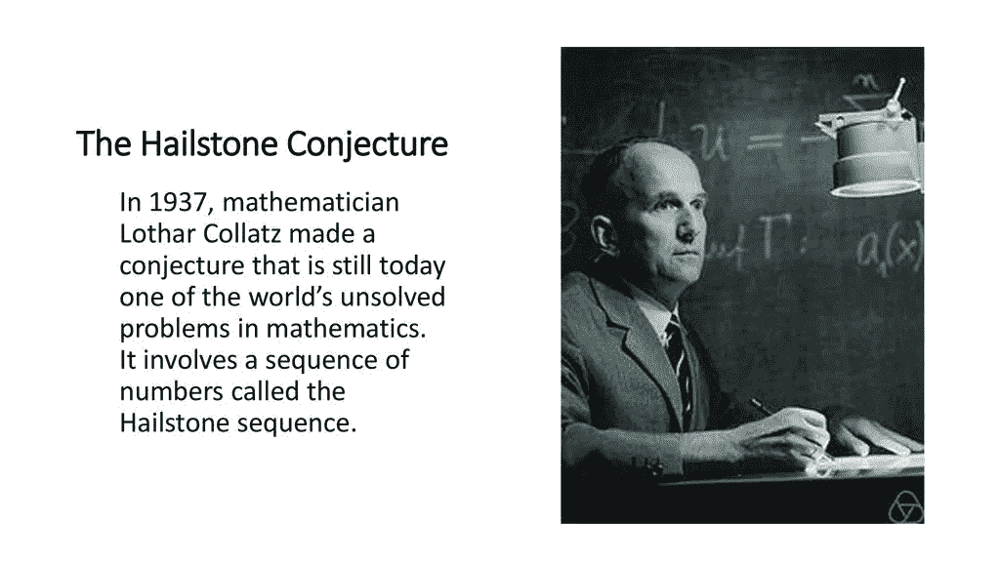
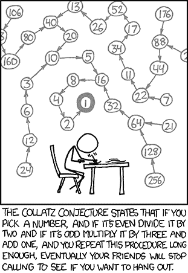
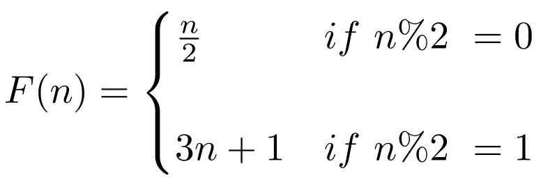
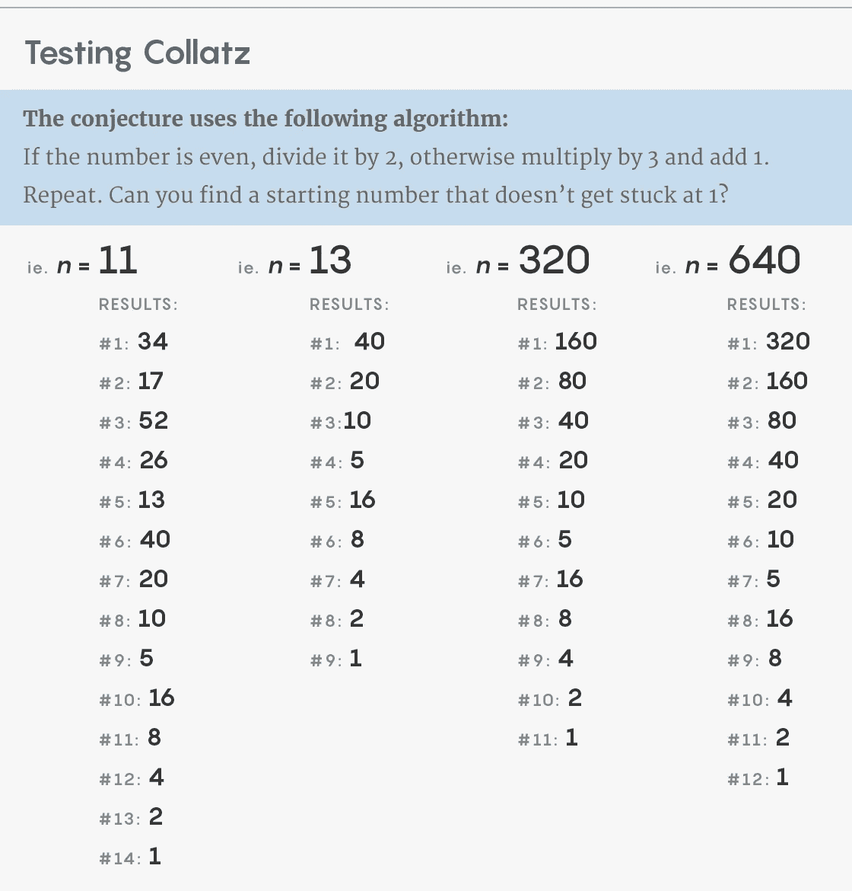

# 著名的现代数学问题:柯拉茨猜想

> 原文：<https://pub.towardsai.net/famous-modern-math-problems-the-collatz-conjecture-7247520ad8ac?source=collection_archive---------1----------------------->

## [数学](https://towardsai.net/p/category/mathematics)

## 这个简单的问题困扰了数学家几十年。

来源:https://slideplayer.com/slide/15295913/

> 我最近创办了一份专注于人工智能的教育时事通讯，已经有超过 90，000 名订户。《序列》是一份无废话(意思是没有炒作，没有新闻等)的 ML 导向时事通讯，需要 5 分钟阅读。目标是让你与机器学习项目、研究论文和概念保持同步。请通过订阅以下内容来尝试一下:

 [## 序列

### 订阅人工智能世界中最相关的项目和研究论文。受到 85，000 多人的信任…

thesequence.substack.com](https://thesequence.substack.com/) 

几天前，我和一个朋友聊天，谈论一些正在积极影响人工智能(AI)和机器学习(ML)领域的现代数学问题。鉴于我很少讨论纯数学，这次谈话给了我在这个博客中总结这些问题的想法，为什么不呢？😊

数学充满了迷人的理论，超越了被追逐短暂证明所折磨的一代又一代数学家。很多时候，一个给定的定理或猜想背后的故事和定理本身一样引人入胜。我想以一个尚未证明的最著名的数学问题开始这一部分。

柯拉茨猜想是一个非常容易理解的问题，然而却困扰了数学家几十年。1937 年，德国数学家[洛萨·科拉茨](https://en.wikipedia.org/wiki/Lothar_Collatz)概述了这个问题，它简单得令人误解，看起来就像一个数字游戏。

Collatz 猜想是基于一个以任意数字开始的数列。如果是奇数，乘以 3 再加 1。如果是偶数，就除以 2。对新号码应用相同的规则。Collatz 预测，如果你应用这个过程足够长的时间，所有的值都会变成 1。

来源:[https://blog.adilakhter.com/tag/brute-force/](https://blog.adilakhter.com/tag/brute-force/)

您可以在下图中看到一些示例 Collatz 计算:

图片来源:广达杂志

数学传奇人物保罗·erdős 曾经说过“数学还没有准备好解决诸如柯拉茨猜想这样的问题”。多年来，为了证明这个著名的定理，人们做了许多徒劳的尝试。在 20 世纪 70 年代，一群数学家几乎证明了所有的 Collatz 序列最终会达到一个比它们开始时更小的数。近年来，我们已经看到了一些用现代统计和机器学习技术进行证明的进展。

柯拉茨猜想是这样一个问题，它结合了问题诱人的简单性和得到证明的巨大困难。一个问题清楚地表明，数学仍然像以往一样神秘。