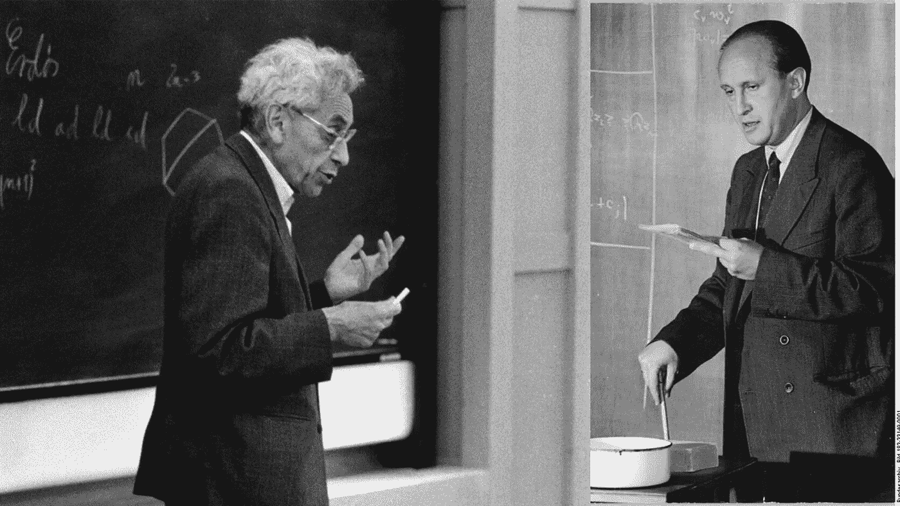
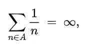

# 著名的现代数学问题:鄂尔多斯-图兰猜想

> 原文：<https://pub.towardsai.net/famous-modern-math-problems-the-erdos-turan-conjecture-380bd8365b5e?source=collection_archive---------0----------------------->

## 数论中尚未证实的最优雅的问题之一。

图片来源:广达杂志

> 我最近创办了一份专注于人工智能的教育时事通讯，已经有超过 125，000 名订户。《序列》是一份无废话(意思是没有炒作，没有新闻等)的 ML 导向时事通讯，需要 5 分钟阅读。目标是让你与机器学习项目、研究论文和概念保持同步。请通过订阅以下内容来尝试一下:

 [## 序列

### 与机器学习、人工智能和数据发展保持同步的最佳资源…

thesequence.substack.com](https://thesequence.substack.com/) 

在我们著名数学问题系列的另一篇文章中，今天我们将讲述一个关于大数级数性质的最著名的猜想。由数学传奇人物保罗·Erdős 和他的长期合作者帕尔·图兰提出，这个问题仍然是 erdős.提出的众多猜想中最神秘的一个

这个问题本身表明，在一个足够密集的大数列中，有任意长的等间距数列。例如，在一个大的自然数序列中，我们可以找到一个间隔为 3 的数字子序列，如 42、45、48。在数学中，这种均匀分布的数列被称为[算术级数](https://en.wikipedia.org/wiki/Arithmetic_progression)。Erdős-Turan 猜想基本上是说，任何大而密的级数都应该包含无穷多个任意长度的算术级数。

这个问题最初是由 Erdős 和图兰在 1938 年提出的。到了 1976 年，Erdős 开始为任何能解答这个猜想的人提供奖金。

图片来源:维基百科

Erdős-Turan 猜想的复杂性在于细节。例如，我们所说的足够密集的数列是什么意思。显然，创建一个足够稀疏的数列(例如:1、10、100、1，000、10，000……)是非常容易的，其中的数字相距足够远，以防止任何算术级数的出现。那个系列不够密集。Erdős 为他的猜想——级数的倒数之和必然趋向于无穷大——提出了一个密度准则。

1953 年，德裔英国数学家克劳斯·罗斯取得了证明 Erdős-Turan 猜想的第一个重大进展。使用一个更灵活的密度标准，Roth 证明了均匀间隔的三元组的存在。虽然不是最终的证明，罗斯的想法让数学家走上了证明猜想的正确道路。

尽管有一些有趣的想法，Erdős-Turan 猜想几十年来一直困扰着数学家。下一个重要的里程碑出现在 2020 年，剑桥大学的数学家 Thomas Bloom 和斯德哥尔摩大学的 olof sisask 发表了一篇令人惊讶的长篇论文，证明了符合 Erdős 密度标准的数列中存在三元组。这个证明使用了极其复杂的数学和博弈论。Bloom 和 Sisask 花了大约六年的时间来研究它，直到他们最终把所有的部分拼凑在一起。

尽管取得了巨大的成就，Boom-sisak 证明只覆盖了均匀间隔的三元组。对于所有其他大小的算术级数，Erdős-Turan 猜想仍未被证实，这是现代数学中最神秘的问题之一。