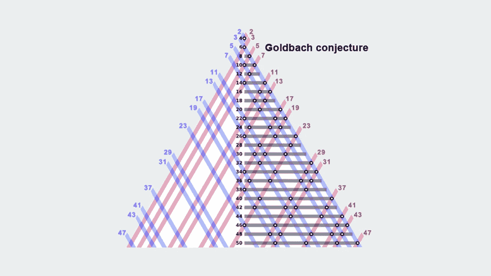
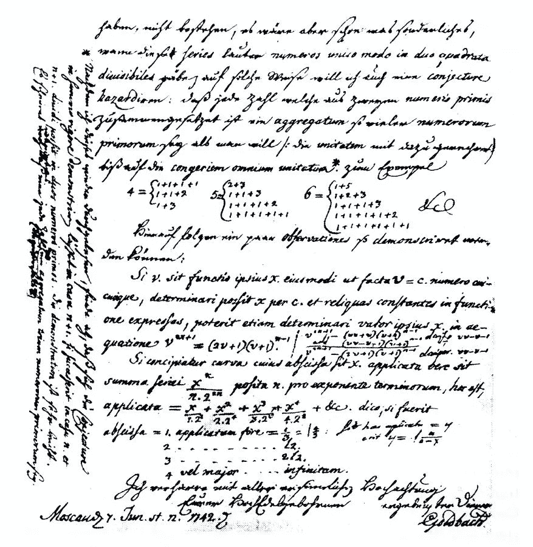
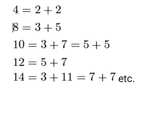
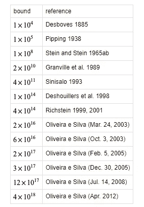

# 著名的现代数学问题:哥德巴赫猜想

> 原文：<https://pub.towardsai.net/famous-modern-math-problems-the-goldbach-conjecture-48f33887b105?source=collection_archive---------1----------------------->

## [数学](https://towardsai.net/p/category/mathematics)

## 数学中最古老的未解难题之一。

来源:[https://www . easy calculation . com/maths-dictionary/Goldbach _ juvey . html](https://www.easycalculation.com/maths-dictionary/goldbach_conjecture.html)

> 我最近创办了一份专注于人工智能的教育时事通讯，已经有超过 10 万名订户。《序列》是一份无废话(意思是没有炒作，没有新闻等)的 ML 导向时事通讯，需要 5 分钟阅读。目标是让你与机器学习项目、研究论文和概念保持同步。请通过订阅以下内容来尝试一下:

 [## 序列

### 订阅人工智能世界中最相关的项目和研究论文。受到 102，000 多人的信任…

thesequence.substack.com](https://thesequence.substack.com/) 

在另一个关于历史数学问题的帖子中，我想讨论数论中最古老的未解决问题之一。我说的是著名的哥德巴赫猜想。这个猜想的陈述非常简单，可能会导致令人困惑的结果，直到今天它还没有被证明。

这个问题的起源可以追溯到 1742 年德俄数学家[克里斯蒂安·歌德巴赫](https://en.wikipedia.org/wiki/Christian_Goldbach)写给他的朋友，无与伦比的[莱昂哈德·欧拉](https://en.wikipedia.org/wiki/Leonhard_Euler)的一封信。在信中，哥德巴赫提出了如下猜想:

*“至少看起来每个大于 2 的数都是三个素数之和”*

来源:维基百科

在 18 世纪，数字 1 被认为是质数。欧拉重新表述了最初的猜想，断言所有的正整数都可以表示为两个素数的和。这就是今天众所周知的哥德巴赫二元猜想。欧拉用一种定义了这个数学猜想的未来的方式表达了他的断言:

*“那个……每一个偶数都是两个素数的和，我认为是完全确定的定理，虽然我无法证明。”*

当用小整数测试时，该语句看起来非常琐碎:

尽管很直观，这个猜想至今还没有被证实。值得一提的是，大多数数学家认为哥德巴赫猜想是正确的。不同的数学家[在一个计算基准](http://sweet.ua.pt/tos/goldbach.html)中合作，证明了这个猜想的数字高达如下:

图片来源:Wolfram Research

然而，几个世纪以来，数学家们一直没有找到哥德巴赫猜想的完整、正式的证明，这使它成为最古老的未解决的数学问题之一。