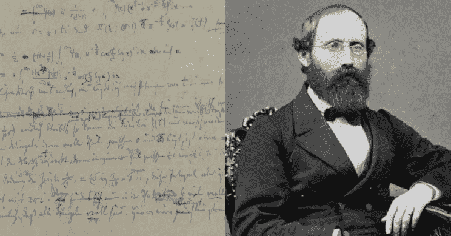
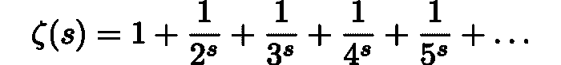
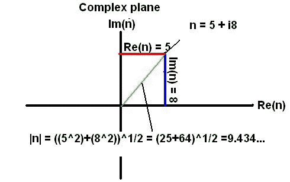

# 著名的现代数学问题:黎曼假设

> 原文：<https://pub.towardsai.net/famous-modern-math-problems-the-riemann-hypothesis-8844e091e69c?source=collection_archive---------3----------------------->

## [数学](https://towardsai.net/p/category/mathematics)

## 今天我们讨论数学中最著名的未解决问题。

来源:[https://interesting engineering . com/the-riemann-hypothesis-a-160 岁的百万美元数学题](https://interestingengineering.com/the-riemann-hypothesis-a-160-year-old-million-dollar-maths-problem)

> 我最近创办了一份专注于人工智能的教育时事通讯，已经有超过 10 万名订户。《序列》是一份无废话(意思是没有炒作，没有新闻等)的 ML 导向时事通讯，需要 5 分钟阅读。目标是让你与机器学习项目、研究论文和概念保持同步。请通过订阅以下内容来尝试一下:

 [## 序列

### 订阅人工智能世界中最相关的项目和研究论文。受到 110，000+的信任…

thesequence.substack.com](https://thesequence.substack.com/) 

继续我们关于著名数学问题的系列，今天我们想讨论被认为是现代数学中最古老和最著名的未解决问题。黎曼假设是[克莱数学研究所的](https://en.wikipedia.org/wiki/Clay_Mathematics_Institute) [千年奖问题](https://en.wikipedia.org/wiki/Millennium_Prize_Problems)的一部分，其中包括任何解决方案的 100 万美元奖金。这也被[戴维·希尔伯特](https://en.wikipedia.org/wiki/David_Hilbert)列入了他在 1900 年的 [23 个未解决问题的清单中。](https://en.wikipedia.org/wiki/Hilbert%27s_problems)

这个问题是由德国数学家波恩哈德·黎曼在 1859 年提出的，它与素数的分布有关。在研究素数的过程中，黎曼观察到素数的出现频率更接近于基于以下函数的分布:

之前的公式被称为*黎曼泽塔函数*。黎曼假设断言ζ(s) = 0 的所有解都位于某一垂直直线上。给定黎曼ζ函数是基于复数 a + bi 的，零表示ζ(a+ bi)=0 的点。黎曼假设的基础始于这样一个事实，即对于所有负的偶数整数 2、4、6、…，zeta 函数等于零。这些被称为平凡的零。在落在直线 *x* = 0 和 *x* = 1 之间的复数中，泽塔函数有无限个零。zeta 函数的非平凡零点关于直线 *x* = 1/2 对称。黎曼假设推测所有的非平凡零点都在临界线上。

来源:[https://www.robertelder.ca/whatisriemannhypothesis/](https://www.robertelder.ca/whatisriemannhypothesis/)

黎曼假设已经在 zeta 函数的前 10，000，000，000，000 个解中得到验证。然而，还没有找到一般性的证明，这使得它成为现代数学中最著名的未解决问题。