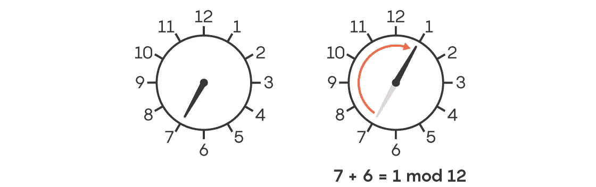

# 著名的现代数学问题:孪生素数猜想

> 原文：<https://pub.towardsai.net/famous-modern-math-problems-the-twin-prime-conjecture-96d2a79eb492?source=collection_archive---------1----------------------->

## [数学](https://towardsai.net/p/category/mathematics)

## 这个显著的简单问题几乎解决了，但还没有完全解决。

图片来源:连线杂志

在我关于著名数学问题系列的另一部分中，今天我想讨论超级优雅的孪生素数猜想。似乎质数有一段启发性问题的历史，这些问题既容易理解又不可能解决。孪生素数猜想当然符合这一描述。

当我们在学校开始学习质数的时候，我们会发现有多少质数与另一个质数相差 2，这是非常值得注意的。想想看:3，5，7，11，13，41，43，还有很多。这个简单的数字模式是孪生素数猜想的精髓。

*1846 年，法国数学家* [*阿方斯·德·波利纳克*](https://en.wikipedia.org/wiki/Alphonse_de_Polignac) *概述了一个猜想，指出有无穷多个素数 p 使得 p + 2 也是素数。他接着提出了一个更一般的猜想:对于每一个自然数 k，都有无穷多个素数 p，使得 p + 2k 也是素数。*

在波利纳克发表猜想后，160 多年来进展甚微。2013 年，数学家[张一堂](https://en.wikipedia.org/wiki/Yitang_Zhang)证明了有无穷多个素数对的差距不超过 7000 万。在此基础上，像陶(Terry Tao)这样的数学家提出了一些工作，将差距缩小到一个很小的数字，比如 246。

孪生素数猜想最近最大的突破发生在 2018 年，哥伦比亚大学的[威尔·索文](https://williamsawin.com/)和威斯康星大学的[马克·舒斯特曼](https://markshus.wixsite.com/math)。这两位数学家发表了一篇论文，解决了被称为有限系统的一小组数字系统的孪生素数猜想。顾名思义，有限数系就是其中数的个数是有限的集合。思考这个问题最简单的方法是把数字放在一个时钟里，而不是放在一条无限长的线上。这是在学校使用 mod 操作教授的。无限数字系统介绍，我们可以有奇怪的场景相加两个数字，并获得比每个数字更小的结果😉

图片来源:广达杂志

Sawin-Shusterman 验证了孪生素数猜想，这是一个很小但仍然相关的数字系统子集。这个猜想的更一般的版本仍然没有解决。