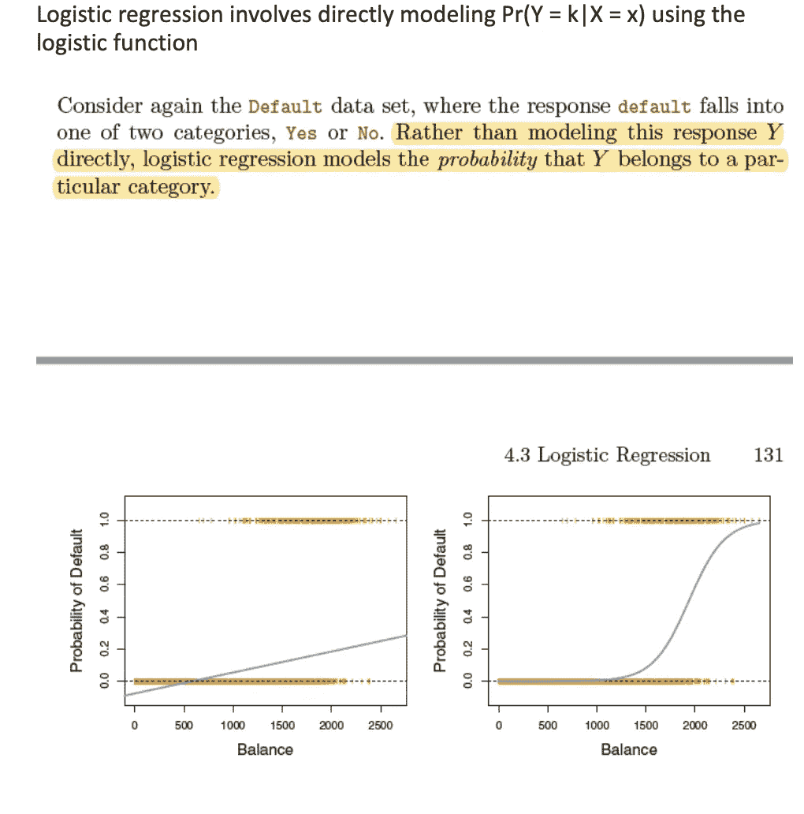
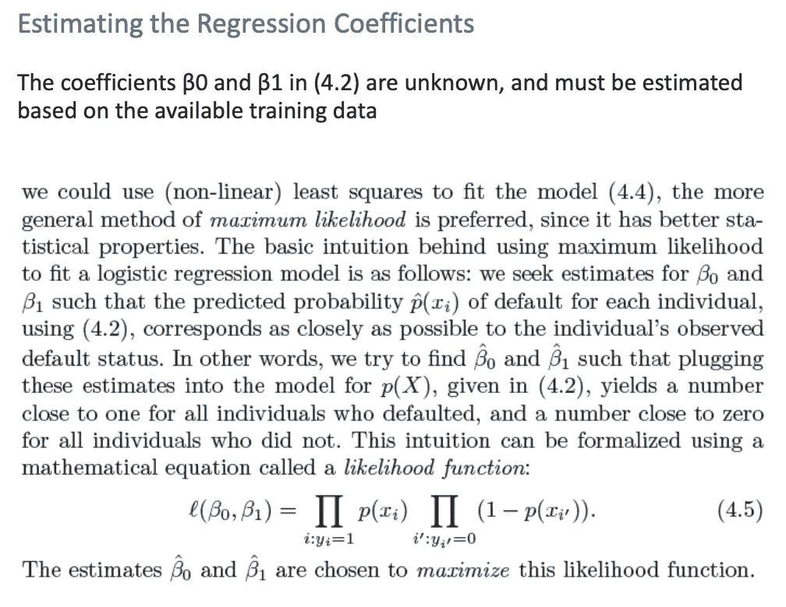

# 方数据科学家访谈问答

> 原文：<https://pub.towardsai.net/fang-data-scientist-interview-questions-and-answers-8275d5c92378?source=collection_archive---------0----------------------->

解码脸书，亚马逊，网飞和谷歌采访！


Emile Perron 在 [Unsplash](https://unsplash.com/s/photos/resume?utm_source=unsplash&utm_medium=referral&utm_content=creditCopyText) 上的照片

各位数据科学家，大家好！

今天就来聊聊面试吧。特别是数据科学面试中问的问题。我将与其他顶尖科技公司分享一些方采访时提出的有趣问题。我通过订阅“数据科学准备”的电子邮件，在一年的时间里收集了这些问题。并尝试分享我遇到的一些有趣的问题(并尽我所能回答它们)。如果你发现自己有其他/更好的答案，请在评论中分享——我很乐意向你学习！:)

# 谷歌

```
**This problem was asked by Google.**Let’s say you are on the team for Google Doodles. What metrics would you use to measure how successful a given Doodle was?**Answer** 1\. Number of clicks on the doodle
2\. Number of hovers over the doodle
3\. Number of seconds spend on reading doodle details (doodle page)
4\. Number of shares across social media platforms
5\. Number of doodle mentions on that particular day
6\. Number of actively searched doodles on Google search itself**This problem was asked by Google.**Assume you are given the below table of measurement values from a sensor for several days. Each measurement can happen several times in a given day. Write a query to output the sum of values for every odd measurement and the sum of values for every even measurement by date.measurementscolumn_name, type
measurement_id, integer
measurement_value, integer
measurement_time, datetime**Answer** SELECT date_trunc('day', measurement_time) as day_of_measure,
case when mod(measurement_value,2) = 0 then 'even' else 'odd' end as even_odd,
sum(measurement_value) as sum_measurement_valueFROM measurements
group by 1,2 **Note** Using PostgreSQL
```

# 网飞

```
**This problem was asked by Netflix.**Before a show is released, it is shown to several in-house raters. You assume there are two types of shows: hits, which have an 80% chance of being liked by any viewer, and misses, which have a 20% chance of being liked by any viewer. There is currently a new show which you believe has a prior distribution of 60% being a hit, and 40% being a miss. Given that 8 raters rated the show and 6 of the 8 liked the show, what is the new posterior distribution of being a hit or miss?**Answer** P(L | H) = 0.8
P(L | M) = 0.2
P(H) = 0.6 (prior)
P(M) = 0.3 (prior)new prob of liking the show = 6/8 = 0.75 (approx 0.8)NEW
Assuming the likelihood distribution to be binomialP(H|L) = P(L|H) . P(H) / P(L|H) . P(H) + P(L|M) . P(M)
P(H|L) = (8 C 6 x 0.8^6 x 0.2^2) . (0.6) / (8 C 6 x 0.8^6 x 0.2^2) . (0.6) + (8 C 6 x 0.2^6 x 0.8^2) . (0.4)
P(H|L) = 0.99**This problem was asked by Netflix.**Describe the idea and mathematical formulation of kernel trick. **ANSWER** In machine learning, a “kernel” is usually used to refer to the kernel trick, a method of using a linear classifier to solve a non-linear problem. It entails transforming linearly inseparable data like to linearly separable ones. The kernel function is what is applied on each data instance to map the original non-linear observations into a higher-dimensional space in which they become separable.We map the problem to a new space by doing non linear transformation using a suitably chosen basis functions and then use a linear model in this new space. The linear model in this new space corresponds to non linear model in the original space. SVM is a very good example of kernel trick/smoothing.
```

# 脸谱网

```
**This problem was asked by Facebook.**There is a fair coin (one side heads, one side tails) and an unfair coin (both sides tails). You pick one at random, flip it 5 times, and observe that it comes up as tails all five times. Whatis the chance that you are flipping the unfair coin?**Answer** This problem can be solved using Bayes Rule. We are asked to calculate P(Unfair | 5Tails)P(U | 5T) = P(5T|U) . P(U) / P(5T|U) . P(U) + P(5T|F) . P(F)
P(U | 5T) = 1^5 x 0.5 / (1^5 x 0.5) + (0.5^5 x 0.5)
P(U | 5T) = 0.96
```

# 种类

```
**This problem was asked by Stripe.**Describe the model formulation behind logistic regression. How do you maximize the log-likelihood of a given model (using the two-class case)?**Answer** as follows
```



```
Estimation by maximum likelihoodMaximum likelihood estimation (MLE) is a statistical method for estimating the coefficients of a model. MLE is usually used as an alternative to non-linear least squares for nonlinear equations.The likelihood function (L) measures the probability of observing the particular set of dependent variable values (p1, p2, …, pn) that occur in the sample. It is written as the probability of the product of the dependent variables:L = Prob (p1* p2* * * pn)The higher the likelihood function, the higher the probability of observing the ps in the sample. MLE involves finding the coeffients (***a***, ***B***) that makes the log of the likelihood function (LL < 0) as large as possible or -2 times the log of the likelihood function (-2LL) as small as possible. The maximum likelihood estimates solve the following condition:{Y — p(Y=1)}Xi = 0, summed over all observations
```

# 其他几个有趣的

```
**This problem was asked by Twilio.**You are modeling the wait time a customer has for a support call as exponentially distributed with a mean of 10 minutes. Suppose a customer calls in and is told that all lines are currently busy, and the most recent last spot was occupied 5 minutes ago. What is the probability that the current customer will need to wait no more than another 5 minutes?**Answer** This is a simeple exponential problem 
lambda = 10
P(X <= x) = 1 - e ^(-lambda . x)
P(X <= 5) = 1 - e ^(-1/10 . 5)
P(X <= 5) = 0.393**This problem was asked by Etsy.**Assume you are given the below table on transactions from users for purchases. Write a query to get the list of customers where their earliest purchase was at least $50.user_transactionscolumn_name, type
transaction_id, integer
product_id, integer
user_id, integer
spend, float
transaction_date, datetime**Answer**SELECT user_id, spend, row_num FROM
(SELECT user_id, spend
row_number() over (partition by user_id order by transaction_date) as row_numFROM user_transactions
) as a
where row_num = 1
AND spend >= 50 **Note** Assuming that earliest purchase means the first purchase 
```

就是这样！又短又甜。我希望这些是有帮助的，并且你在阅读/解决它们的时候有乐趣。