# Fastai 课程第一章 Linux

> 原文：<https://pub.towardsai.net/fastai-course-chapter-1-on-linux-d69df3db69a7?source=collection_archive---------4----------------------->

## 系列:[人工智能](https://towardsai.net/p/category/artificial-intelligence)

## 包含术语和命令定义的扩展指南


图片由[拉夫(拉维)凯登](https://unsplash.com/@ralphkayden)

T 他的文章是一个扩展指南，旨在帮助你了解整个章节发生了什么。它提供了本文中使用的术语、命令和代码的定义。它还包括带下划线的文本，这些文本链接到文章词汇表中的其他定义。

教材的第一章展示了如何用大约 5 行代码构建 5 个不同的模型。它为图像分类、图像分割、文本分类、表格数据回归和协同过滤建立模型。它还使用类似的代码加载数据集并构建模型。

## 打开笔记本:

*笔记本*是一个在 [Jupyter Noteboo](#4aeb) k 中使用的文档，用于包含 web 应用程序中的可视内容。它包括计算的输入和输出、降价文本、等式、图像、视频和文本。它也有自己的内核，可以使用单一的编程语言运行代码。

1.  打开 web 浏览器
2.  输入 Jupyter 笔记本电脑服务器的 IP 地址
3.  按“回车”
4.  点击“桌面”
5.  点击“快速预订”
6.  单击“清理”
7.  点击“01_intro.ipynb”

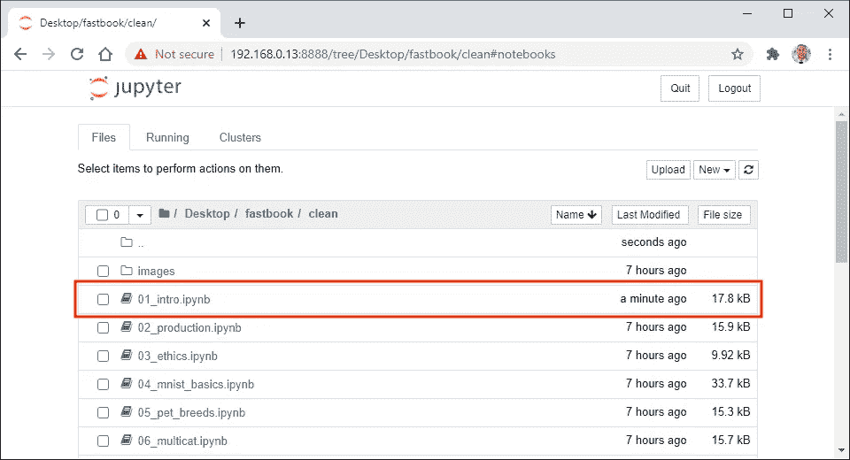

## 更改内核:

*笔记本内核*是 Jupyter Notebook 中使用的一个程序，用于运行代码单元中的代码，并以特定的编程语言显示输出。它会记住代码单元之间的事件和用户交互，而不管代码单元的运行顺序。

1.  单击“内核”菜单
2.  选择“更改内核”子菜单
3.  单击“FastAI (PyTorch)”菜单项

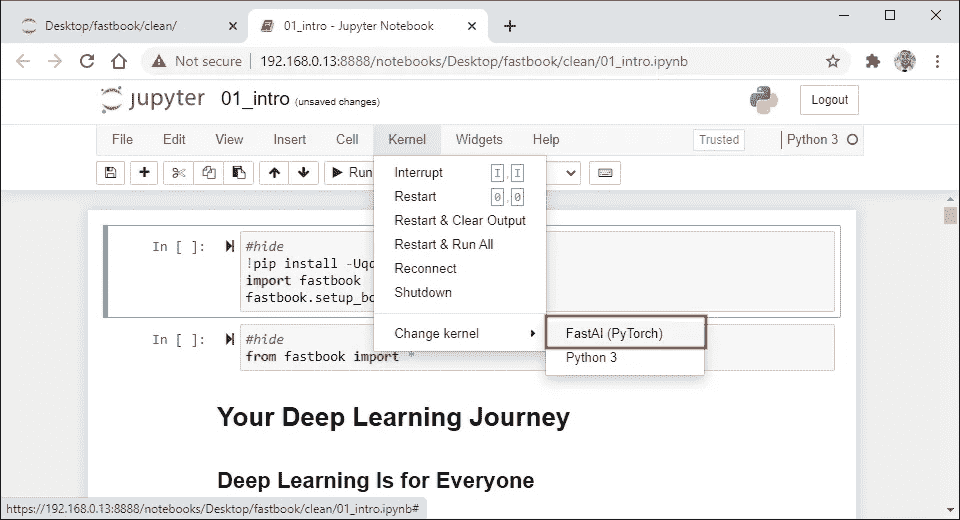

## 设置 Fastbook 库:

*Fastai* 是 Python 中用于深度学习的库。它提供了一个构建在低级 API 层次结构之上的高级 API，可以通过重新构建来定制高级功能。它还支持计算机视觉、自然语言处理和表格数据处理。

1.  选择第一个代码单元格
2.  点击“运行”

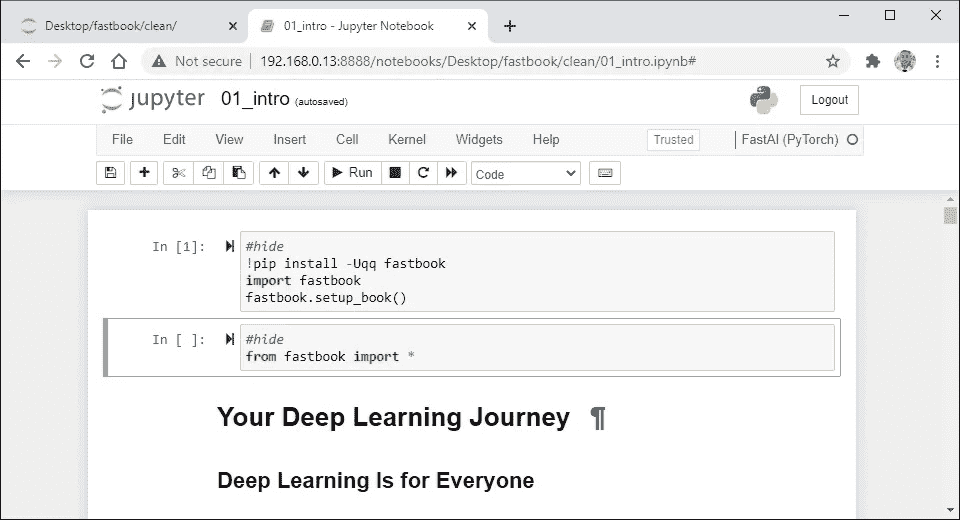

## 导入 Fastbook 库:

*Star Import* 是一种语法，在 [Python](#33e5) 中用于将整个库导入名称空间。它没有指定导入了什么名称，这可能会意外地覆盖名称空间中的其他函数。它也只在特定情况下工作良好，如 Jupyter 笔记本中的交互式工作。

1.  选择下一个代码单元格
2.  点击“运行”


## 训练图像分类模型:

第一行星号从`Fastai`库中导入`vision`模块。它导入了许多函数，比如以模型命名的函数(创建模型)和以评估度量命名的函数(作为参数传递给函数以修改输出)。

第二行在`path`变量中存储了[宠物数据集](#79fd)的目录路径。它从`[untar_data](#b8a6)`函数中获取路径(该函数使用`[URLs](#b60d)`类的`PETS`属性中的 url 获取数据集。它还将`images`子目录附加到`path`变量中字符串的末尾。

第三行定义了用于为数据集创建标签的标签函数。它根据文件名的第一个字母是否大写(由数据集创建者决定)将图像标记为猫。它还将使用不同的步骤从不同的数据集中提取标签。

第四行使用`[ImageDataLoaders](#fb5e)`类创建 dataloaders 对象。它将`path`变量(保存到`images`子目录的路径)传递给`path`参数，将图像的文件路径列表(由`get_image_files`函数生成)传递给`fnames`参数，将`is_cat`函数(创建标签)传递给`label_func` 参数。它还将`valid_pct`参数(设置验证集百分比)、`seed`参数(设置[随机种子](#d88e))和`Resize`函数(调整图像大小)设置为`item_tfms`参数。

第五行使用`[cnn_learner](#247a)`类创建学习者对象。它将`dls`变量(保存训练和验证数据集)传递给`dls`参数(加载数据加载器)，将`[resnet34](#8021)`函数(创建 PyTorch 模型)传递给`arch`参数(加载架构)。它还将`error_rate`函数(在输出中显示特定的指标)传递给`metrics`参数。

第六行使用`[fine_tune](#348d)`方法执行迁移学习。它将模型的最终层(在微调过程中被替换)训练一个时期，然后将整个模型(包括最终层)重新训练指定数量的时期。它还设置`epochs`参数(该参数设置训练模型的时期数)。

1.  选择下一个代码单元格
2.  点击“运行”

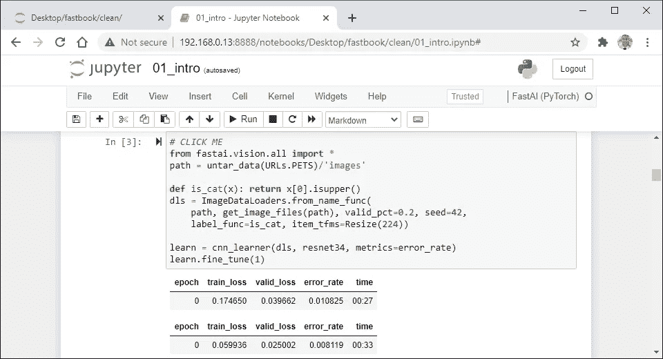

## 在输出中显示文本:

单线显示了 Jupyter 笔记本 [REPL](#7f6b) 中显示的不同类型的输出之一。它可以显示丰富的文本，降价，多媒体，图表，表格和计算。它还可以显示交互式小部件，让用户上传文件、定制数据和可视化数据。

1.  选择下一个代码单元格
2.  点击“运行”

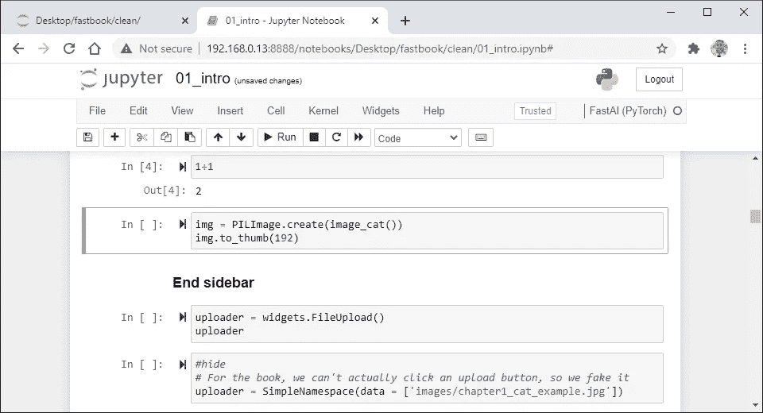

## 在输出中显示图像:

第一行在`img`变量中存储一个图像对象。它使用来自`Fastai` 库的`core`模块中的`create`方法(使用来自`PIL`库的`Image`模块中的`open`方法)加载图像对象。它还设置`fn`参数(设置从`Fastai`库中的`image_cat`函数加载并返回的原始图像数据)。

第二行创建一个缩略图。它使用 image 对象中的`to_thumb`方法创建缩略图(该方法将 image 对象的副本从`[PIL](#6ab1)`库中传递给`Image`类中的`thumbnail`方法)。它还设置了`h`参数(设置高度并保存纵横比)。

1.  选择下一个代码单元格
2.  点击“运行”

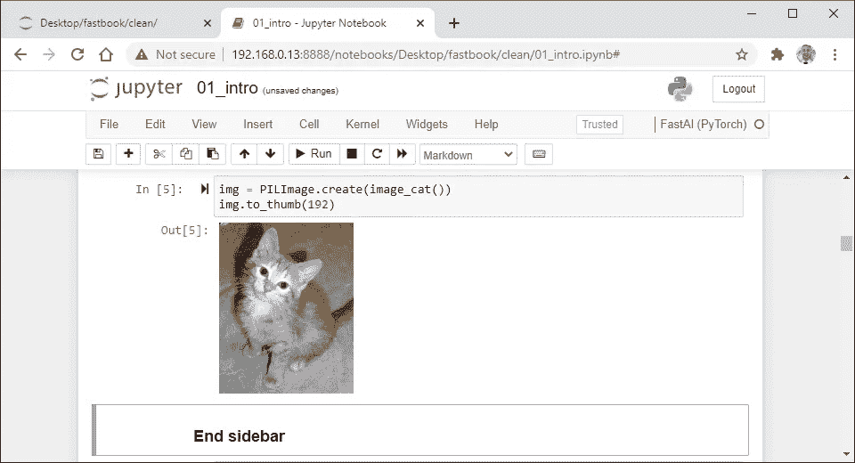

## 显示交互式小部件:

第一行将文件上传小部件存储在`uploader`变量中。它使用来自`ipwidgets`库的`widget-_upload`模块中的`FileUpload`类创建文件上传小部件。它还将选定的文件上传到内核的内存中，以便在笔记本中引用。

第二行显示了 Jupyter 笔记本 REPL 输出中的文件上传小部件。它显示上传按钮(打开一个窗口选择文件)。它还显示按钮内选定文件的数量，并通过单击按钮添加文件或通过重新运行代码单元格进行重置。

1.  选择下一个代码单元格
2.  点击“运行”

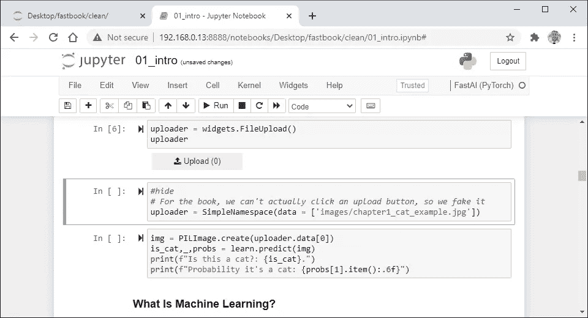

## 替换图像:

简单名称空间是 Python 中用来创建可以存储属性的对象的类。它通过定义参数来设置属性名，通过传递参数来设置属性值。它还可以用点符号添加属性，或者用 del 关键字删除属性。

1.  选择下一个代码单元格
2.  点击“运行”

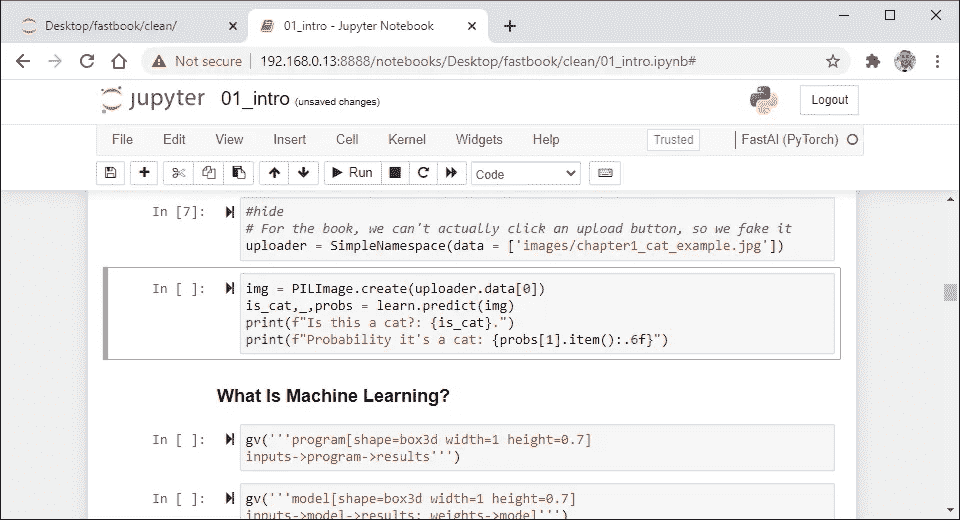

## 做个预测:

第一行在`img`变量中存储一个图像对象。它从`PILImage`类中的`create`方法获取图像对象(传递 FileUpload 小部件选择的图像)。它还可以从变量`uploader`的`data`属性的列表中传递图像的路径。

第二行使用`predict`方法进行预测。它将`img`变量(保存图像)传递给`item`参数(加载图像)。它还解构了返回到`is_cat`变量(真或假)、`_`变量(0 或 1)和`probs`变量(十进制数的概率列表)中的元组。

第三行和第四行使用两个格式化的字符串文字打印预测。它打印图像是否是一只猫(它指定了文本和`is_cat`变量)。它还使用六位数的精度打印第二个概率(使用`Tensor`类中的`item`方法获得值)。

*预测*是 Fastai 中使用的一种方法，用于对某个项目进行预测。它使用`Learner`类中的`pred_batch`方法进行预测，该方法使用`PyTorch`库中`Module`类中的`eval`方法。它还返回一个保存预测类、标签和概率的元组。

1.  选择下一个代码单元格
2.  点击“运行”

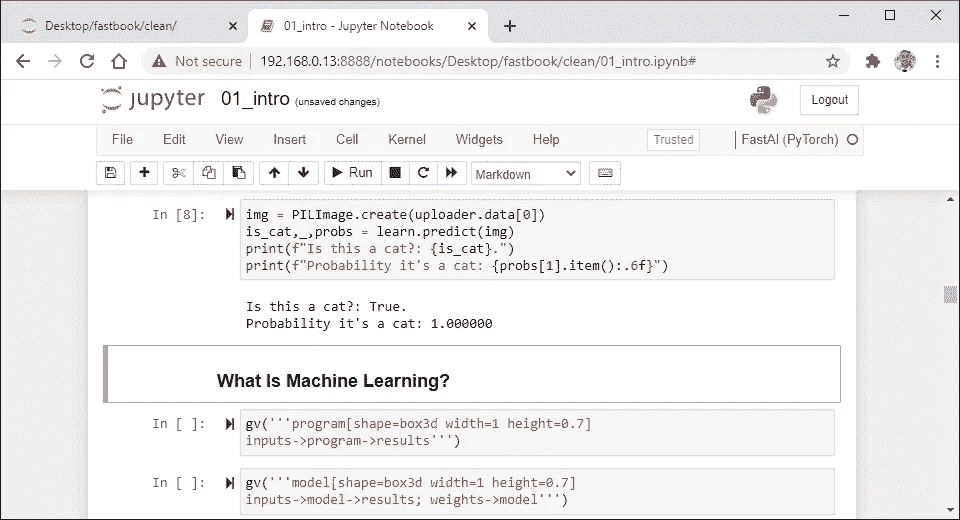

## 训练图像分割模型:

第一行在`path`变量中存储了 [camvid 数据集](#ef61)的目录路径。它从`untar_data`函数获取路径(该函数使用`URLs`类的`CAMVID_TINY`属性中的 url 获取数据集)。它也不像上一节那样修改`path`变量中的字符串。

第二行使用`[SegmentationData-Loaders](#a528)`类创建 dataloaders 对象。它将`path`变量(保存数据集目录的路径)传递给`path`参数，将图像的文件路径列表(由`get_image_files`函数使用`path`变量和`images`子目录创建)传递给`fnames`参数，将 lambda 函数(定义从数据集提取标签的函数)传递给`label_func`参数。它还设置`bs`参数(设置批量大小)并将对象类别代码列表(由`Numpy`库中的`loadtxt`函数加载)传递给`codes`参数。

第三行使用`[unet_learner](#73a1)`类创建一个更精简的对象。它将`dls`变量(保存训练和验证数据集)传递给`dls`参数(加载数据加载器)，将`resnet34`函数(创建 PyTorch 模型)传递给`arch`参数(加载架构)。它也不像以前那样传递度量函数。

第四行使用`fine_tune`方法执行迁移学习。它将模型的最终层(在微调过程中被替换)训练一个时期，然后将整个模型(包括最终层)重新训练指定数量的时期。它还设置了`epochs`参数(该参数设置了训练模型的历元数)。

1.  选择下一个代码单元格
2.  点击“运行”

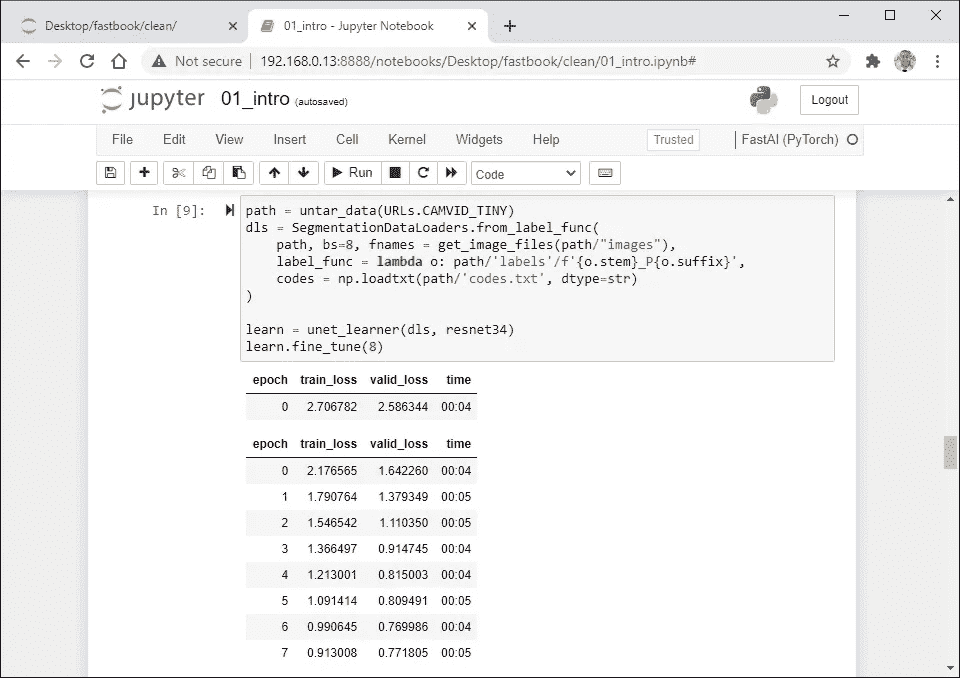

## 显示结果:

单行显示了使用`show_results`方法的一些预测。它设置`max_n`参数(设置显示多少个样本)和`figsize`参数(设置样本的宽度和高度)。它还在左侧显示实际图像，在右侧显示预测图像。

*显示结果*是 Fastai 中用来显示预测的方法。它可以指定要显示的预测数量，但是参数是可选的，并且有默认值。它还在`vision`、`text`和`tabular`模块中的`Learner`类中使用了不同版本的`show_results` 方法。

1.  选择下一个代码单元格
2.  点击“运行”

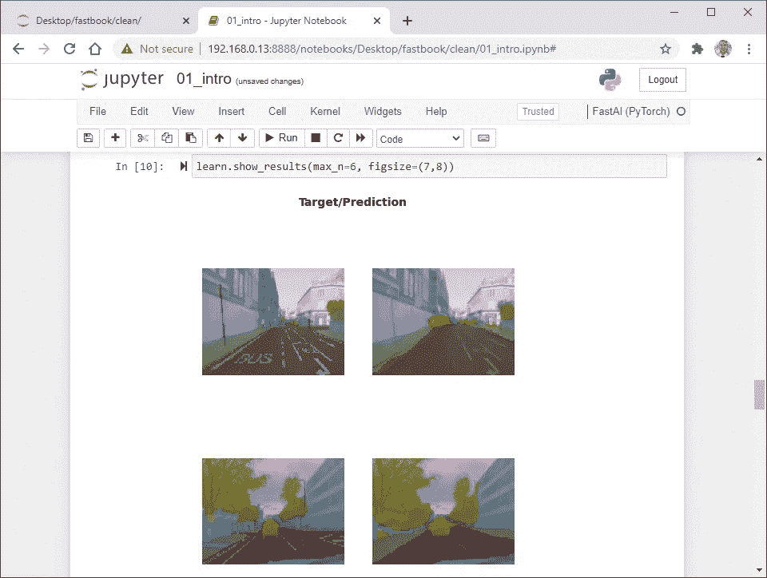

## 训练文本分类器模型:

第一行星号从`Fastai`库中导入`text`模块。它导入了许多函数，比如以模型命名的函数(创建模型)和以评估度量命名的函数(作为参数传递给函数以修改输出)。

第二行使用`[TextDataLoaders](#cc6b)` 类创建 dataloaders 对象。它使用`untar_data`函数将数据集的路径传递给`path`参数(该函数使用`URLs`类的`IMDB`属性中的 url 获取数据集)。它还设置了`valid`参数(设置包含验证数据集文本文件的子目录名称)。

第三行使用`[text_classifier_learner](#ba81)` 类创建一个更精简的对象。它将`dls`变量(保存训练和验证数据集)传递给`dls`参数(加载数据加载器)，将`AWD_LSTM`函数(构建 PyTorch 模型)传递给`arch`参数(加载架构)，并设置`drop_mult`参数(乘以所有辍学率)。它还将`accuracy`函数(在输出中显示特定的指标)传递给`metrics`参数。

第四行使用`fine_tune`方法执行迁移学习。它将模型的最终层(在微调过程中被替换)训练一个时期，然后将整个模型(包括最终层)重新训练指定数量的时期。它还设置`epochs`参数(设置训练模型的时期数)和`base_lr`参数(设置最小学习率)。

1.  选择下一个代码单元格
2.  点击“运行”

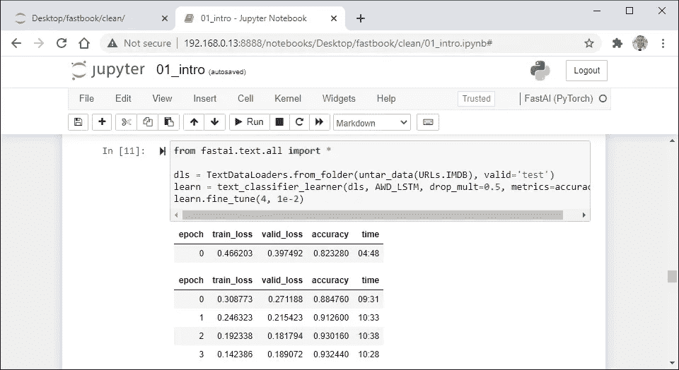

## 做个预测:

单线使用`predict`方法进行预测。它将该字符串(即电影评论)传递给`item`参数(该参数加载该字符串)。它还显示返回的元组，其中包含情感(消极或积极)、标签(0 或 1)和概率(十进制数形式的概率列表)。

1.  选择下一个代码单元格
2.  点击“运行”

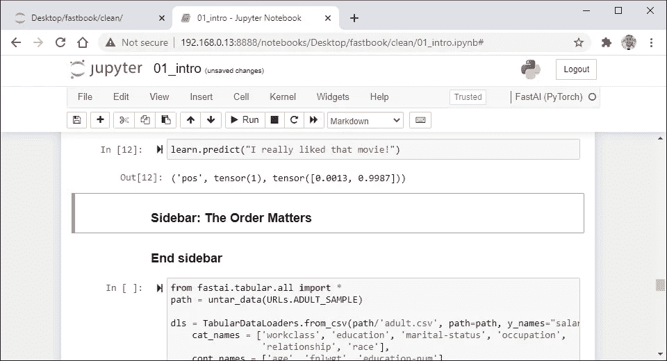

## 准备表格模型:

第一行星号从`Fastai`库中导入`tabular`模块。它导入了许多函数，比如以模型命名的函数(创建模型)和以评估度量命名的函数(作为参数传递给函数以修改输出)。

第二行在`path`变量中存储了[成人数据集](#2879)的目录路径。它从`untar_data`函数中获取路径(该函数使用`URLs`类的`ADULT_SAMPLE`属性中的 url 获取数据集。它也不像前面的部分那样修改`path`变量中的字符串。

第三行使用`[TabularDataLoaders](#35ca)` 类创建 dataloaders 对象。它将`path`变量(用 CSV 文件路径修改)传递给`csv`参数，将`path`变量(保存数据集目录的路径)传递给`path`参数。它还设置了`y_names`参数(指定相关变量名)、`cat_names`参数(指定包含分类数据的列)、`cont_names`参数(指定包含连续数据的列)和`procs`参数(指定预处理转换函数)。

第四行使用`[tabular_learner](#7672)`类创建学习者对象。它将`dls`变量(保存训练和验证数据集)传递给`dls`参数(加载数据加载器)并将`accuracy`函数(在输出中显示特定指标)传递给`metrics`参数。它也没有将模型函数传递给`model`参数(它加载模型)，因为没有可用的模型函数。

1.  选择下一个代码单元格
2.  点击“运行”

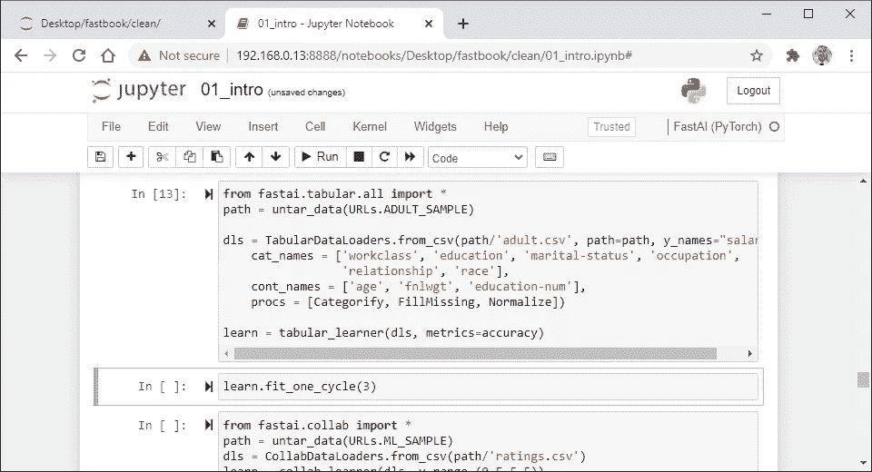

## 训练表格模型:

单线使用`fit_one_cycle`方法训练模型。它设置`n_epoch`参数(该参数设置用于训练模型的时期数),并从头开始为表格模型训练时期数。它还可以传递其他已经有默认值的可选参数。

*拟合一个周期*是 Fastai 使用一个周期策略训练模型的一种方法，比`fit`方法产生更快的训练速度和更高的精度。它指定了训练模型的历元数。它还可以指定已经有默认值的可选参数。

*单周期策略*是一种用于机器学习的技术，可以快速训练模型。它使用一个具有两个步骤的周期来修改学习速率。它也以低学习速率开始，将速率增加到非常高的值，并将速率降低到比初始值低得多的值。

1.  选择下一个代码单元格
2.  点击“运行”

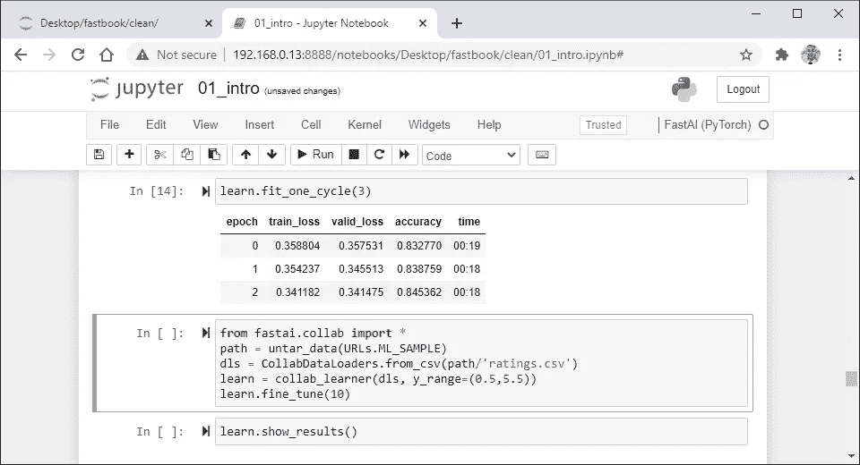

## 训练协作过滤模型:

第一线星从`Fastai`库中导入`collab`模块。它导入了许多函数，比如以模型命名的函数(创建模型)和以评估度量命名的函数(作为参数传递给函数以修改输出)。

第二行在`path`变量中存储了 [movielens 数据集](#ed6a)的目录路径。它从`untar_data`函数获取路径(该函数使用`URLs`类的`ML_SAMPLE`属性中的 url 获取数据集。它也不会像最早的部分那样修改`path`变量中的字符串。

第三行使用`[CollabDataLoaders](#1c74)`类创建学习者对象。它将`path`变量(用 CSV 文件路径修改)传递给`csv`参数。它还使用`CollabDataLoaders`类中的`from_df`方法从 CSV 文件中提取表格数据，该方法将最初的三列传递给`user_name`、`item_name`和`rating_name`参数。

第四行使用`[collab_learner](#7a89)`类创建学习者对象。它将`dls`变量(保存训练和验证数据集)传递给`dls`参数(加载数据加载器)并设置`y_range`参数(设置可预测的最小和最大值)。它也没有将模型函数传递给`model`参数(该参数加载模型)，因为没有一个模型函数可用于该任务。

第五行使用`fine_tune`方法训练模型(通常会执行迁移学习)。它设置`epochs`参数(该参数设置历元数)并为历元数训练模型。也有人写道，这将在下一章解释。

1.  选择下一个代码单元格
2.  点击“运行”

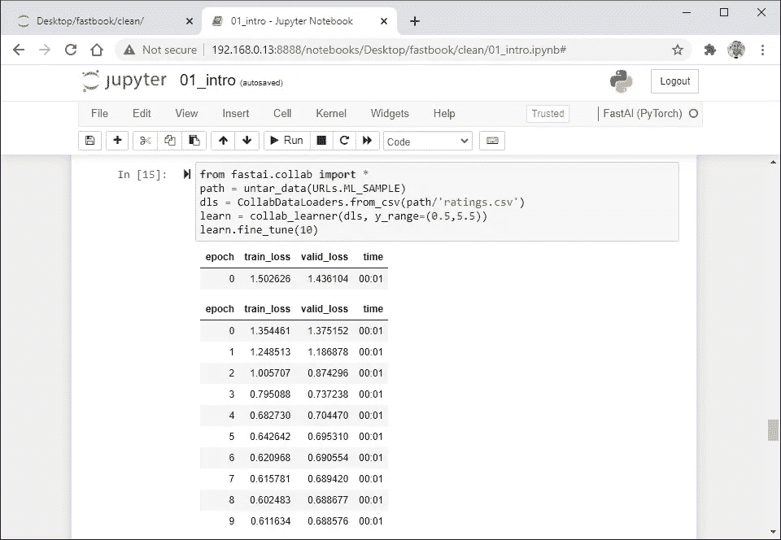

## 显示结果:

单行显示使用`show_results`方法的预测。它使用默认值(9)来设置`max_n`参数(设置要显示的最大样本数)。它还在左侧显示实际用户 id、电影 id 和收视率，在右侧显示预测收视率。

1.  选择下一个代码单元格
2.  点击“运行”

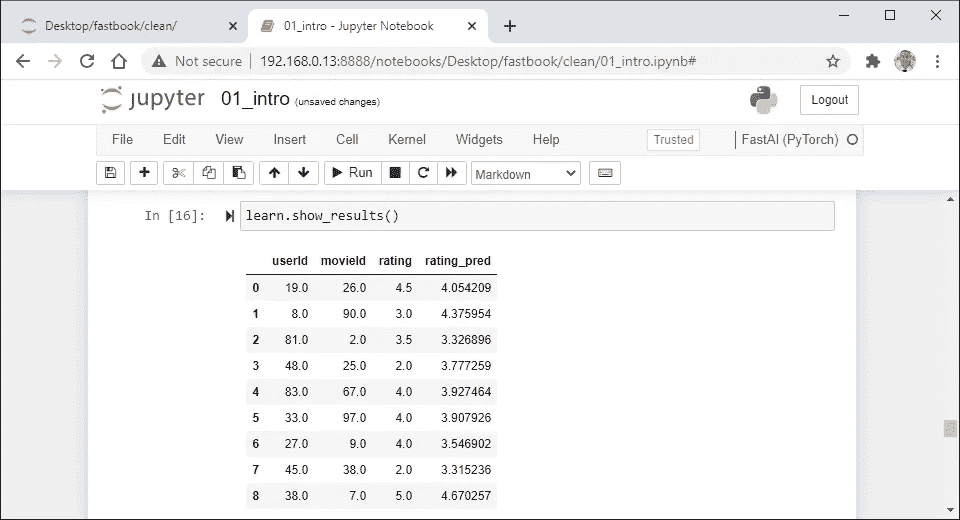

> “希望这篇文章能帮助您获得👯‍♀️🏆👯‍♀️，记得订阅获取更多内容🏅"

## 后续步骤:

本文是帮助您从头到尾设置完成 Fast.ai 课程所需的一切的系列文章的一部分。它包含在教科书每章末尾提供问卷答案的指南。它还包含使用术语和命令的定义、说明和屏幕截图一步一步地浏览代码的指南。

```
**Linux:**
01\. [Install the Fastai Requirements](https://medium.com/p/116415a9df22)
02\. [Fastai Course Chapter 1 Q&A](https://medium.com/p/735f932def0a)
03\. [Fastai Course Chapter 1](https://medium.com/p/d69df3db69a7)
04\. [Fastai Course Chapter 2 Q&A](https://medium.com/p/af9dab3ce8c6)
05\. [Fastai Course Chapter 2](https://medium.com/p/42d7a406349)
06\. [Fastai Course Chapter 3 Q&A](https://medium.com/p/2df7f3a9711)
07\. Fastai Course Chapter 3
08\. [Fastai Course Chapter 4 Q&A](https://medium.com/p/90d2ccb6eaa9)
```

## 其他资源:

本文是帮助您设置开始使用人工智能、机器学习和深度学习所需的一切的系列文章的一部分。它包含扩展的指南，提供术语和命令的定义，帮助您了解正在发生的事情。它还包含简明指南，提供说明和屏幕截图，帮助您更快获得结果。

```
**Linux:**
01\. [Install and Manage Multiple Python Versions](https://medium.com/p/916990dabe4b)
02\. [Install the NVIDIA CUDA Driver, Toolkit, cuDNN, and TensorRT](https://medium.com/p/cd5b3a4f824)
03\. [Install the Jupyter Notebook Server](https://medium.com/p/b2c14c47b446)
04\. [Install Virtual Environments in Jupyter Notebook](https://medium.com/p/1556c8655506)
05\. [Install the Python Environment for AI and Machine Learning](https://medium.com/p/765678fcb4fb)**WSL2:**
01\. [Install Windows Subsystem for Linux 2](https://medium.com/p/cbdd835612fb)
02\. [Install and Manage Multiple Python Versions](https://medium.com/p/1131c4e50a58)
03\. [Install the NVIDIA CUDA Driver, Toolkit, cuDNN, and TensorRT](https://medium.com/p/9800abd74409) 
04\. [Install the Jupyter Notebook Server](https://medium.com/p/7c96b3705df1)
05\. [Install Virtual Environments in Jupyter Notebook](https://medium.com/p/3e6bf456041b)
06\. [Install the Python Environment for AI and Machine Learning](https://medium.com/p/612240cb8c0c)
07\. [Install Ubuntu Desktop With a Graphical User Interface](https://medium.com/p/95911ee2997f) (Bonus)**Windows 10:**
01\. [Install and Manage Multiple Python Versions](https://medium.com/p/c90098d7ba5a)
02\. [Install the NVIDIA CUDA Driver, Toolkit, cuDNN, and TensorRT](https://medium.com/p/55febc19b58)
03\. [Install the Jupyter Notebook Server](https://medium.com/p/e8f3e9436044)
04\. [Install Virtual Environments in Jupyter Notebook](https://medium.com/p/5c189856479)
05\. [Install the Python Environment for AI and Machine Learning](https://medium.com/p/23c34b2baf12)**MacOS:** 01\. [Install and Manage Multiple Python Versions](https://medium.com/p/ca01a5e398d4)
02\. [Install the Jupyter Notebook Server](https://medium.com/p/2a276f679e0)
03\. [Install Virtual Environments in Jupyter Notebook](https://medium.com/p/e3de97491b3a)
04\. [Install the Python Environment for AI and Machine Learning](https://medium.com/p/2b2353d7bcc3)
```

## 词汇表:

Jupyter Notebook 是一个用于创建、修改和分发包含代码、等式、可视化和叙述性文本的笔记本的程序。它提供了一个在 web 浏览器中运行的交互式编码环境。它也已经成为机器学习和数据科学的首选工具。
[ [返回](#a82d)

*Python* 是一种面向对象的语言，以其简单的语法、代码可读性、灵活性和可伸缩性而闻名。它主要用于开发 web 和软件应用程序。它也已经成为人工智能、机器学习和数据科学最流行的语言之一。
[返回](#7e86)

牛津-IIIT 宠物数据集是一个包含 7349 张猫狗图片的数据集，代表了 37 个品种的大约 200 张图片。它包括从社交媒体网站、Flickr 和 Google 下载的不同比例、姿势和光线的图片。它还包括地面实况数据，并附有品种、头部位置和像素分割的注释。
[ [返回](#e8e0)

*Untar Data* 是 Fastai 中使用的一个功能，用于下载归档文件并将文件提取到目的地。它可以指定下载归档文件的 url，或者使用来自`URLs`类的 URL 之一。它还可以指定一个自定义位置来提取文件或使用默认的下载位置。
[ [返回](#e8e0)

URLs 是 Fastai 中使用的一个类，用于存储数据集和模型的 URL。它包含图像分类、图像分割、音频分类和自然语言处理的流行数据集。它还可以使用`URLs`类中的`path`方法创建保存数据集的本地路径。
[ [返回](#e8e0)

*图像数据加载器*是 Fastai 中使用的一个类，用于创建用于图像分类的[数据加载器](#b4c6)对象。它包含从文件路径、文件和子目录名称或 CSV 文件中的文本提取数据集标签的方法。它还可以指定具有默认值的可选参数。
[ [返回](#b728)

*数据加载器*是 PyTorch 中使用的一个类，用于将数据集中的数据预处理成模型需要的格式。它指定要加载的数据集，并定制数据集的加载方式。它还主要用于批处理数据、混排数据和并行加载数据。
[ [回车](#fb5e)

*随机种子*是一个在机器学习中用来初始化随机数生成器的数字。它使随机数生成器能够产生具有相同数字序列的权重。它还允许用户使用相同的代码、数据和权重来训练模型，以产生相似的结果。
[返回](#b728)

CNN 学习器是 Fastai 中使用的一个类，用于执行图像分类的迁移学习。它主要扩展了`[Learner](#e163)`类来微调模型，用为新数据集定制的层替换最终层。它还可以指定具有默认值的可选参数。
[回车](#2299)

*Learner* 是 Fastai 中用来训练模型的类。它指定了训练模型和执行迁移学习所需的数据加载器和模型对象。它还可以指定优化器函数、损失函数和其他已经有默认值的可选参数。
[ [返回](#247a)

*残差神经网络(ResNet)* 是一种卷积神经网络，用于对图像进行分类。它可以训练数百甚至数千层，并达到最先进的性能。它还使用残余块来解决消失和爆炸梯度问题，该问题将每一层馈入下一层，并直接馈入前面两三层的层。
[ [返回](#2299)

*微调*是 Fastai 用来进行迁移学习的一种方法。它规定了在最后一层被替换，除最后一层之外的所有层都被[冻结](#5b01)，最后一层被训练了一个时期，冻结层被解冻后，训练模型的时期数。它还可以指定具有默认值的可选参数。
[ [返回](#4b27)

*冻结*是迁移学习中用来进行微调的一个过程。它保护除最后一层之外的所有层在模型根据新数据训练时不被改变。它还只在训练过程的反向传递期间训练最后一层，这提高了速度和准确性。
[ [回车](#348d)

*Read Eval Print Loop (REPL)* 是一个编程环境，提供了[解释器](#50e7)的交互部分。它读取输入，对其求值，打印结果，然后返回读取下一个输入。通过在虚拟机上运行解释器，它也可以在所有编译语言上使用。
[返回](#e25a)

*解释器*是一个程序，它读取以人类可读编程语言编写的指令，并从上到下执行这些指令。它将每条指令翻译成硬件能够理解的机器语言，执行它，然后继续下一条指令。
[ [返回](#7f6b)

*Site-Packages* 是位于 Python 环境的安装目录中的子目录。它表示包管理器用来安装 Python 包的默认位置。它还表示 Python 用来导入已经安装的 Python 包的子目录。
[ [返回](#ebfb)

*Python 图像库(PIL)* 是一个在 Python 中使用的库，用于向 Python 解释器添加图像编辑功能。它提供了从文件中加载图像、处理图像以及以不同文件格式创建新图像的功能。也是 2011 年停产，正式换成抱枕。
[返回](#90a8)

*剑桥驾驶标记视频数据库*是一个数据集，包含 701 张捕捉汽车视角的图像。它包括由一个人手动指定的每像素语义分割，并由另一个人检查和确认其准确性。它还包括地面真实数据，用 32 个语义类别之一来标记每个像素。
[ [返回](#4ed6)

*分割数据加载器*是 Fastai 中使用的一个类，用于创建图像分割的数据加载器对象。它包含一个从文件路径和文件名中的文本提取数据集标签的方法。它还可以指定具有默认值的可选参数。
[ [回车](#7a43)

*U Net Learner* 是 Fastai 中使用的一个类，用于执行图像分割的迁移学习。它主要扩展了`Learner`类来微调模型，用为新数据集定制的层替换最终层。它还可以指定具有默认值的可选参数。
[ [回车](#df84) ]

*文本数据加载器*是 Fastai 中用于创建自然语言处理的数据加载器对象的一个类。它包含从子目录名称、dataframe 或 CSV 文件中的文本提取数据集标签的方法。它还可以指定具有默认值的可选参数。
[返回](#142e)

*文本分类器学习器*是 Fastai 中使用的一个类，用于执行文本分类的迁移学习。它扩展了`Learner`类来微调模型，用为新数据集定制的层替换最终层。它还可以指定具有默认值的可选参数。
[返回](#3e59)

*成人数据集*是从 1994 年人口普查局数据库中提取的数据集。它包含 32，561 行和 15 列数据，代表样本总体的属性。它还包含 16 岁以上、调整后总收入为 100 美元或以上、最终体重为 1 或以上、每周工作 1 小时或以上的人的记录。
[ [返回](#6954)

*表格数据加载器*是 Fastai 中用于创建表格数据回归和分类的数据加载器对象的类。它包含从 dataframe 或 CSV 文件中提取数据集的表格数据的方法。它还可以指定具有默认值的附加可选参数。
[返回](#462e)

*表格学习器*是 Fastai 中用来训练模型执行回归和分类的类。它扩展了`Learner`类来训练表格模型，而不使用从头开始训练模型的迁移学习。它还可以指定具有默认值的可选参数。
[ [返回](#6b65)

*MovieLens 样本数据集*是一个包含电影分级的数据集。它包含 6031 行和 4 列数据，表示对电影进行评级的用户、电影的 id、用户给出的评级以及给出评级的时间。它还包括 100 名用户对大约 100 部电影的评级，这些电影是以半星的增量在五星的尺度上制作的。
[回车](#18f8)

*Collab Data Loaders* 是 Fastai 中使用的一个类，用于为协作过滤创建 Data Loaders 对象。它包含从 dataframe 或 CSV 文件中提取数据集的表格数据的方法。它还可以指定已经有默认值的附加可选参数。
[返回](#e183)

*Collab Learner* 是 Fastai 中用来训练模型执行协作过滤的类。它扩展了`Learner`类来训练表格模型，而不使用从头开始训练模型的迁移学习。它还可以指定已经有默认值的可选参数。
[回车](#0e3f)