# Fastai 课程第二章 Linux

> 原文：<https://pub.towardsai.net/fastai-course-chapter-2-on-linux-42d7a406349?source=collection_archive---------2----------------------->

## 系列:人工智能

## 包含术语和命令定义的扩展指南


图片由[桑德罗·卡塔琳娜](https://unsplash.com/@sandrokatalina)

T 他的文章是一个扩展指南，旨在帮助你了解整章发生了什么。它提供了本文中使用的术语、命令和代码的定义。它还包括带下划线的文本，这些文本链接到文章词汇表中的其他定义。

教材的第二章展示了如何构建一个自定义数据集，使用数据集训练一个模型，以及使用小部件使用模型构建一个应用程序。它设置一个 Azure 帐户，用一个 API 查找和下载图像，并准备数据集。它还训练模型，保存和加载模型，并使用小部件用模型构建一个应用程序。

## 打开笔记本:

*笔记本*是一个在 [Jupyter Noteboo](#4aeb) k 中使用的文档，用于包含 web 应用程序中的可视内容。它包括计算的输入和输出、降价文本、等式、图像、视频和文本。它也有自己的内核，可以使用单一的编程语言运行代码。

1.  打开 web 浏览器
2.  输入 Jupyter 笔记本电脑服务器的 IP 地址
3.  按“回车”
4.  点击“桌面”
5.  点击“快速预订”
6.  单击“清理”
7.  点击“02_production.ipynb”

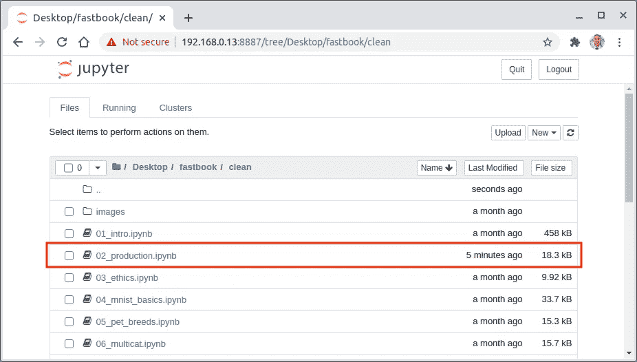

## 更改内核:

*笔记本内核*是 Jupyter Notebook 中使用的一个程序，用于运行代码单元中的代码，并以特定的编程语言显示输出。它会记住代码单元之间的事件和用户交互，而不管代码单元的运行顺序。

1.  单击“内核”菜单
2.  选择“更改内核”子菜单
3.  单击“FastAI (PyTorch)”菜单项

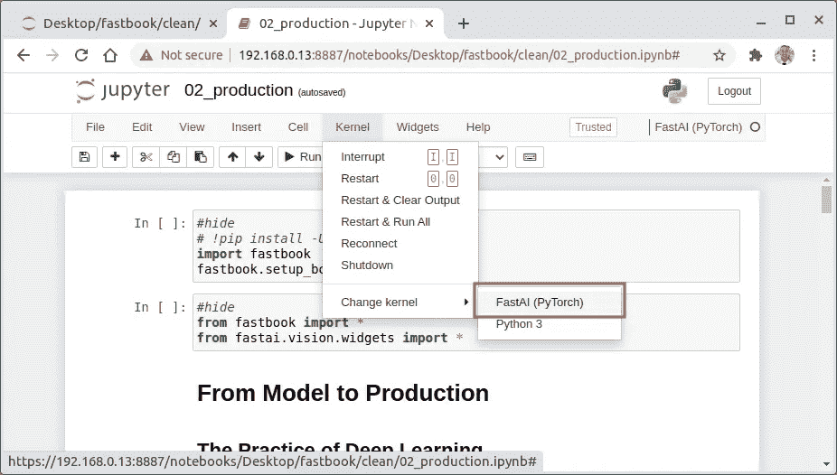

## 设置 Fastbook 库:

*Fastai* 是一个在 [Python](#d499) 中用于深度学习的库。它提供了一个构建在低级 API 层次结构之上的高级 API，可以通过重新构建来定制高级功能。它还支持计算机视觉、自然语言处理和表格数据处理。

1.  选择代码单元格
2.  点击“运行”

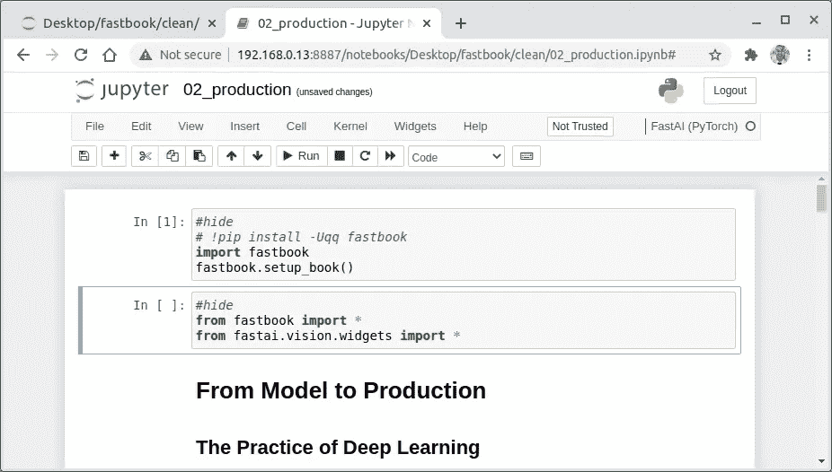

## 导入 Fastbook 库和 Widgets 模块:

*Star Import* 是 Python 中用于将整个库导入名称空间的语法。它没有指定导入了什么名称，这可能会意外地覆盖名称空间中的其他函数。它也只在特定情况下工作良好，如 Jupyter 笔记本中的交互式工作。

1.  选择代码单元格
2.  点击“运行”

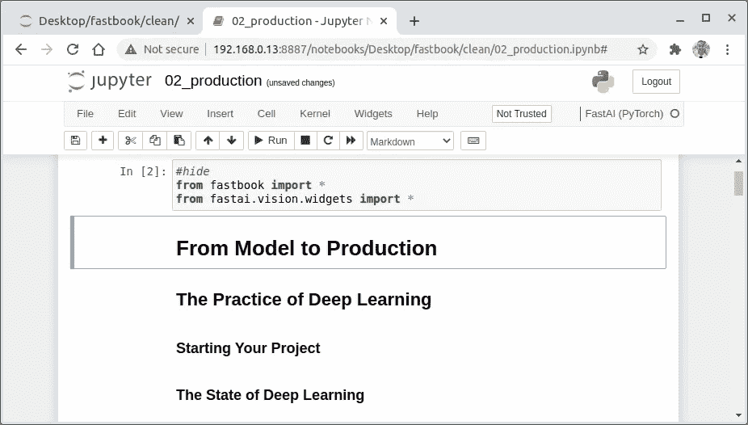

## 设置 Azure 帐户:

*微软 Azure* 是一家云计算服务提供商，用于构建、测试、部署和管理应用程序和服务。它提供软件即服务、平台即服务和基础设施即服务，并支持许多编程语言、工具和框架。它还可以用于分析、虚拟计算、存储和网络等服务。

1.  访问[官网](https://azure.microsoft.com/en-us/account/)
2.  单击“转到门户”
3.  登录或创建新帐户
4.  单击“创建资源”

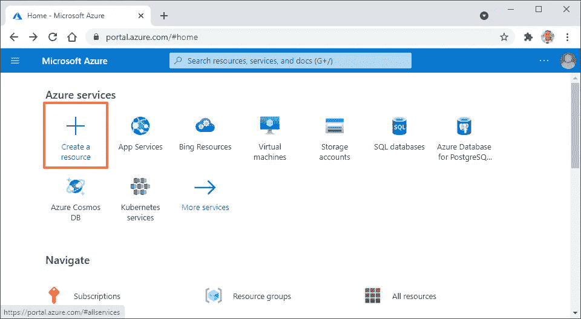

## 导航到 Bing 搜索 API:

*Bing 搜索 API* 是一个 Azure Marketplace 服务，用于访问数十亿网页、图像、视频和新闻结果，无需广告。它可以根据当地位置或市场进行定制，以增加相关性。它还提供了 8 个功能，包括[图片搜索](#cf2b)、视频搜索、新闻搜索、网络搜索、视觉搜索、实体搜索、拼写检查和自动建议 API。

1.  在搜索栏中输入“必应搜索”
2.  点击“必应搜索 v7”
3.  点击“创建”


## 创建 Bing 搜索 API 帐户:

需要阿炳搜索帐户才能访问 fastai 用来下载图像数据集的 Bing 图像搜索 API。它可以选择使用定价层下拉列表中的免费计划，其中包括每秒 3 次交易和每月 1，000 次交易。它还希望分配一个资源组来标记共享相同生命周期、权限和策略的其他服务。

1.  输入 Bing 搜索帐户的名称
2.  选择“免费 F1”定价等级
3.  单击资源组下的“新建”
4.  输入资源组的名称
5.  单击“确定”
6.  单击“我确认我已经阅读并理解下面的通知”
7.  点击“创建”

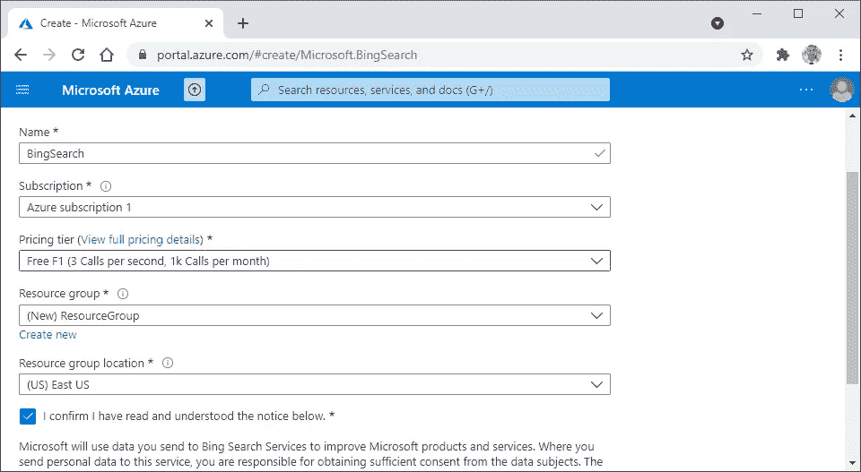

## 复制 Bing 搜索 API 密钥:

*应用编程接口密钥(API 密钥)*是一个唯一的代码，用于访问 REST API。它用于跟踪和控制 API 的使用方式，这通常可以防止恶意使用或滥用 API。它还经常充当唯一标识符和身份验证的秘密令牌。

1.  单击“转到资源”
2.  单击“密钥和端点”
3.  单击“显示密钥”
4.  将代码复制到 Key 1 文本字段中

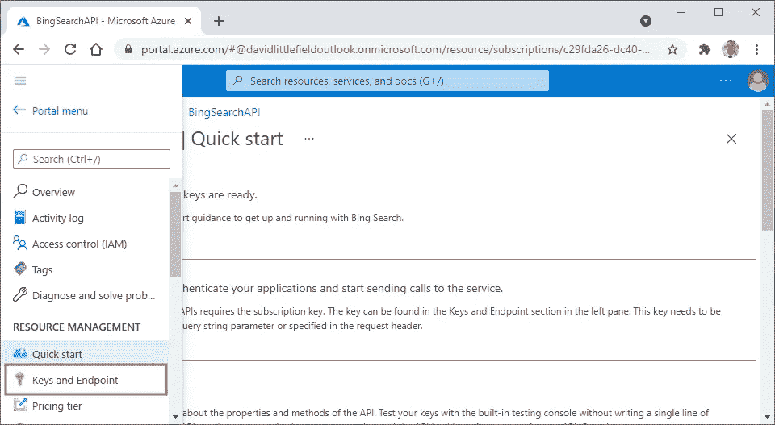

## 粘贴 Bing 搜索 API 密钥:

单行代码将 API 键存储在`key`变量中。它使用来自`Python`库的`os`模块中的`environ`对象中的`get`方法(该方法获取环境变量的值)获取密钥。它还设置了`key`参数(设置环境变量)和`default`参数(如果没有环境变量，则设置返回值)。

1.  将代码粘贴到“XXX”上
2.  选择代码单元格
3.  点击“运行”

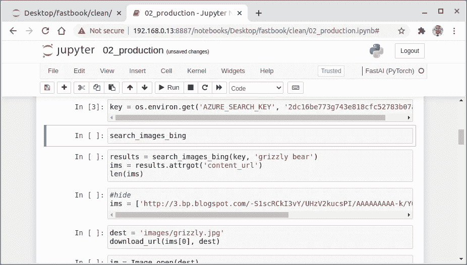

## 检查搜索图片 Bing 功能:

单行代码打印了一个丰富的字符串表示形式的`search_images_bing` 函数。它打印类、模块、函数名、输入参数和默认参数。它还显示了使用来自`[IPython](#1df0)`库的`display`函数在代码单元中运行的任何对象的丰富表示。

1.  选择代码单元格
2.  点击“运行”

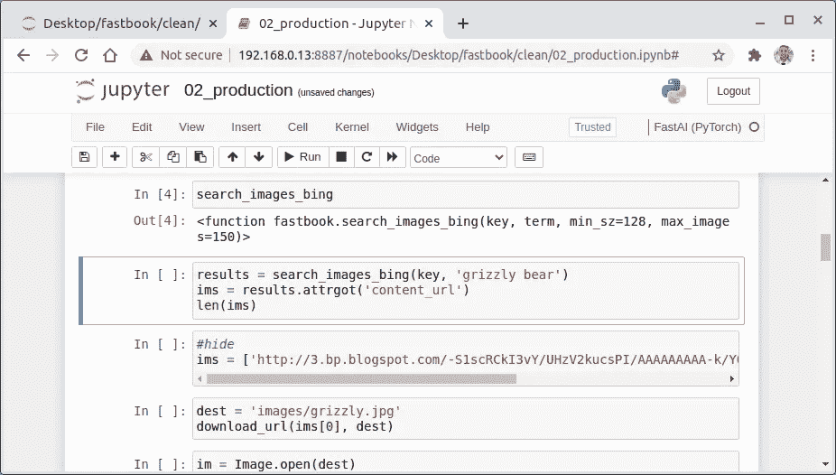

## 获取图像 URL:

第一行在`results`变量中存储了一个字典列表。它使用`fastbook`库中的`search_images_bing`函数(发出 API 请求并处理响应)搜索图像。它还设置了`key`参数(设置访问 Bing 搜索 API 的 API 键)和`term`参数(设置查找图片的搜索词)。

第二行在`ims`变量中存储了图像的 URL 列表。它使用来自`fastai`库的`L`类中的`attrgot`方法(该方法使用键提取相关值)从`results`变量的字典列表中获取 URL。它还设置了`k`参数(该参数设置了访问字典列表中每个字典的相关值的键)。

第三、第四和第五行说明了前面几行后面的过程。它从`results`变量的字典列表中打印一个 API 响应，从`ims`变量的图像 URL 列表中打印一个图像 URL。它还打印存储在`ims`变量中的图像 URL 的数量。

1.  从这些指令下面复制代码
2.  将代码粘贴到代码单元格中的代码上
3.  选择代码单元格
4.  点击“运行”

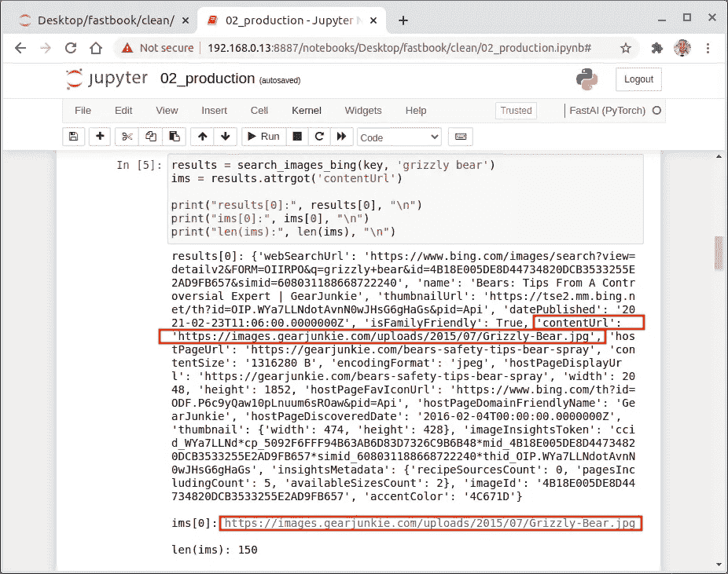

## 替换图像:

这一行用包含一个图像 URL 的列表替换了`ims`变量中的图像 URL 列表。它确保在下一步显示适当的图像(防止显示任何可能令人不愉快的图像)。它也不是必需的，应该被认为是可选的。

1.  选择代码单元格
2.  点击“运行”

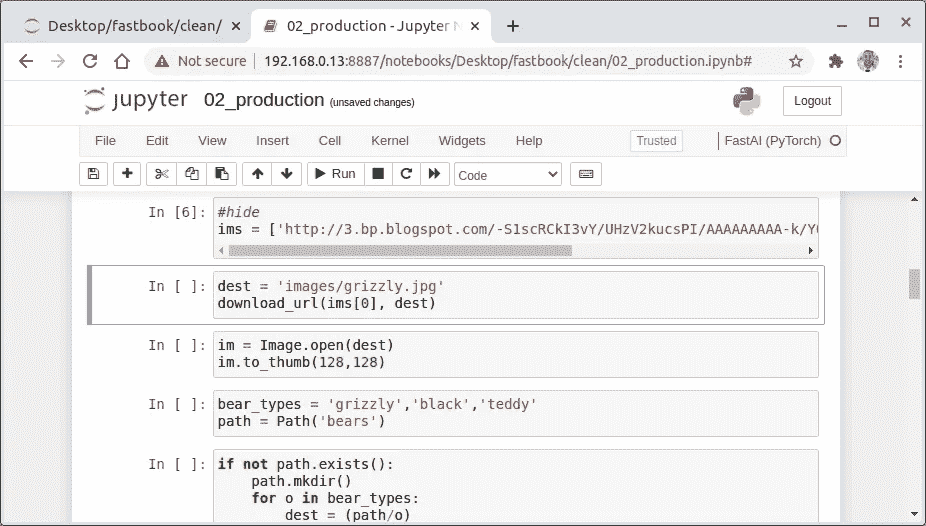

## 下载第一张图片:

第一行和第二行在`dest` 变量中存储保存图像的位置，并从`ims`变量中的 URL 下载图像。它使用`fastai`库中的`download_url`函数(可以从互联网上下载任何文件)获取图像。它还设置了`url`参数(设置 URL)和`dest`参数(设置目的地)。

1.  选择代码单元格
2.  点击“运行”

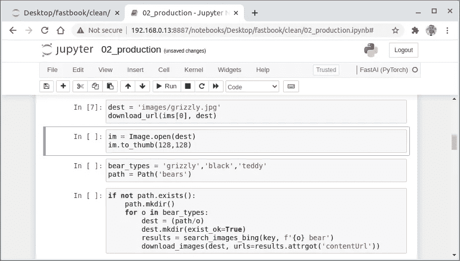

## 在输出中显示图像:

第一行将图像对象存储在`im`变量中。它使用来自`[PIL](#d3cd)`库的`Image`模块中的`open`函数(从`dest`变量中的文件路径获取图像)获取图像对象。它还设置`fp`参数(设置标识图像文件的文件指针)。

第二行显示缩略图。它使用来自`PIL`库的`Image`模块中的`to_thumb`方法(使用图像的副本来保存原始图像)创建缩略图。它还设置`h`参数(设置高度)和`w`参数(设置宽度)。

1.  选择代码单元格
2.  点击“运行”

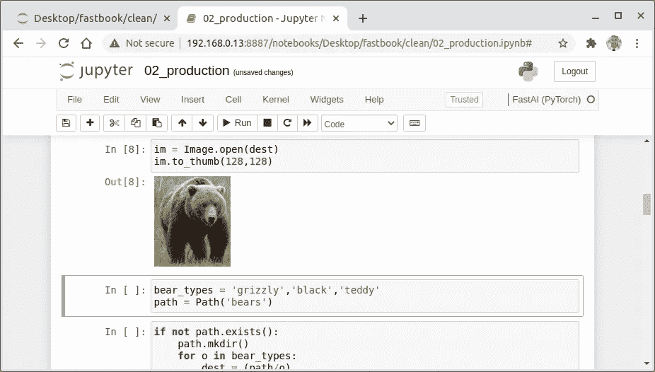

## 定义子目录名称和图像目录路径:

第一行和第二行在`bear_types` 变量中存储子目录名称，在`path`变量中存储图像目录的路径。它创建一个子目录名称元组(表示预测类别)。它还使用来自`Python`库的`pathlib`模块中的`Path`类(接受文件路径作为字符串)创建了一个 Path 对象。

1.  选择代码单元格
2.  点击“运行”

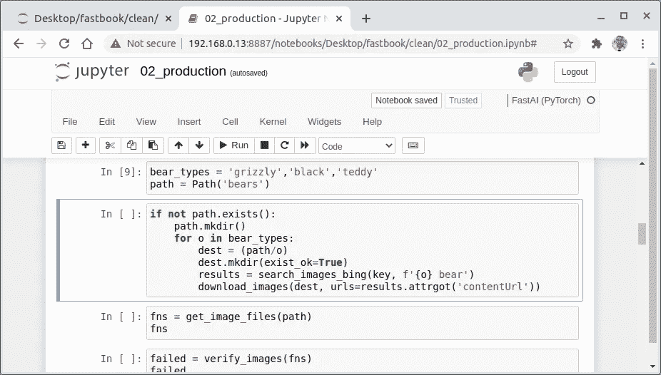

## 下载图片:

第一行和第二行使用`path`变量中的路径创建`bear`目录。它使用`not`关键字和来自`Python`库的`pathlib`模块中的`exists`方法(检查路径是否存在)检查`path`变量中的路径是否不存在。如果路径不存在，它还会使用来自`Python`库的`pathlib`模块中的`mkdir`方法创建目录。

第三行和第四行遍历`bear_types`变量中的子目录名，并将子目录的路径存储在`dest` 变量中。它通过使用来自`Python`库的`pathlib`模块中的`forward slash`操作符连接`path`变量中的路径和`o`变量中的子目录名称来创建子目录的路径。

第五行使用`dest` 变量中的路径创建图像子目录。它使用来自`Python`库的`pathlib`模块中的`mkdir`方法(创建子目录)创建子目录。它还设置`exist_ok`参数(防止`FileExistsError`错误)。

第六行将搜索结果存储在`results`变量中。它使用来自`fastai`库的`search_images_bing`函数(发出 API 请求并处理响应)搜索 f 字符串(将`o`变量中的子目录名称添加到 bear 字符串的前面)。它还设置了`key`参数(设置访问 Bing 搜索 API 的 API 键)和`term`参数(设置查找图片的搜索词)。

第七行使用来自`fastai`库的`download_images`函数(从 URL 列表中获取图像)将图像下载到`dest`变量的子目录中。它设置了`dest`参数(设置目的地)和`urls`参数(设置 URL 列表)。它还使用来自`fastai`库的`L`类中的`attrgot`方法(使用`contentUrl`键提取 URL)从`results`变量(这是一个字典列表)中的搜索结果中获取 URL 列表。

1.  选择代码单元格
2.  点击“运行”

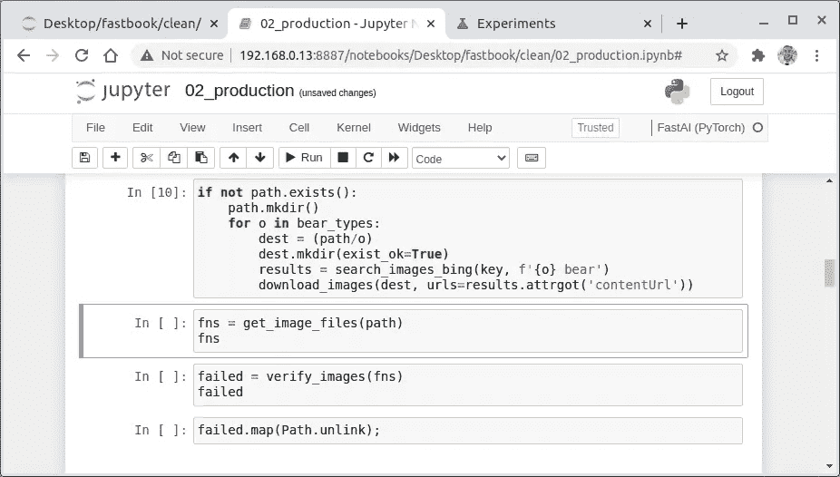

## 获取图像的文件路径:

第一行存储了`fns`变量中的文件路径列表。它使用来自`fastai`库的`transforms`模块中的`get_image_files`函数(查找目录和所有子目录中的所有图像)获取文件路径。它还设置`path`参数(设置目录)。

第二行打印了`fns`变量中文件路径列表的丰富字符串表示。它打印在目录和子目录中找到的图像数量。它还打印列表中的部分文件路径，包括目录、子目录、文件名和文件扩展名。

第五行打印了`failed`变量中文件路径列表的丰富字符串表示。它在`fns`变量中打印从列表中断开的图像数量。它还打印列表中的部分文件路径，包括目录、子目录、文件名和文件扩展名。

1.  选择代码单元格
2.  点击“运行”

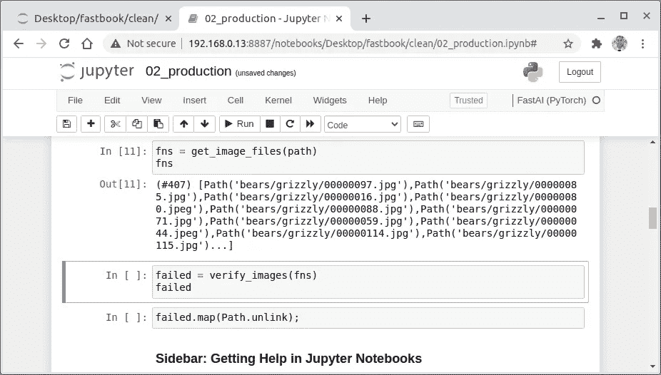

## 找到不起作用的图像:

第一行存储了无法在`failed`变量中打开的文件路径列表。它使用`fastai`库的`utils`模块中的`verify_images`函数(检查图像是否可以打开)获取文件路径。它还设置`fns`参数(设置文件路径)。

第二行打印了在`failed`变量中文件路径列表的丰富字符串表示。它在`fns`变量中打印列表中被破坏的图像数量。它还打印列表中的部分文件路径，包括目录、子目录、文件名和文件扩展名。

1.  选择代码单元格
2.  点击“运行”

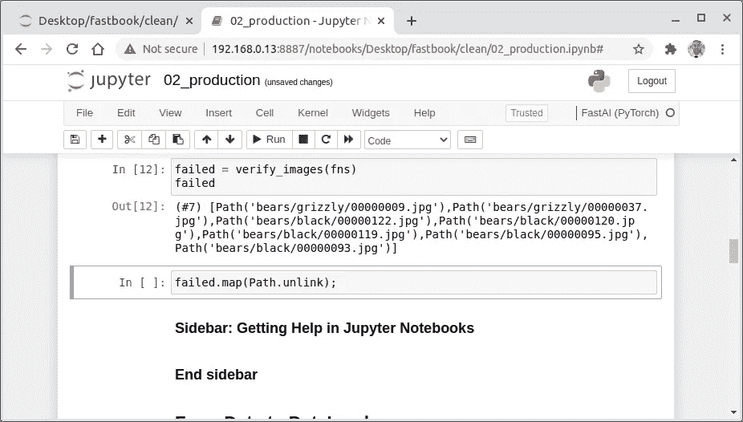

## 删除无效的图像:

这一行删除了`failed`变量中文件路径列表中的图像。它使用`map`函数(将函数应用于列表)和`pathlib`模块中的`unlink`方法(从计算机中删除图像)从`Python`库中删除图像。它还设置了`function`参数(设置应用于列表的函数)。

1.  选择代码单元格
2.  点击“运行”

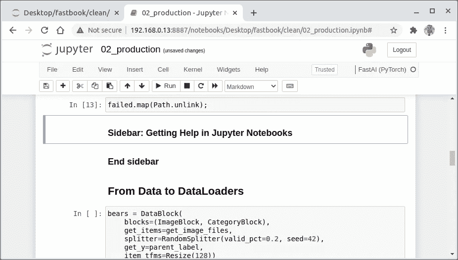

## 创建数据块:

单行将数据块对象存储在`bears`变量中。它使用来自`fastai`库的`block`模块中的`DataBlock`类(用于构建数据加载器对象)创建数据块对象。它还设置了`blocks`参数(设置输入和输出数据类型)、`get_items`参数(设置文件路径列表)、`splitter`参数(设置如何将数据集分成训练集和验证集)、`get_y`参数(从数据集中提取标签)和`item_tfms`参数(将转换应用于图像)。

这一行代码还向`DataBlock`类传递了几个函数来创建数据块对象。它从`fastai`库中传递`transforms`模块中的`RandomSplitter`函数(将数据集随机分为训练集和验证集)，并设置`valid_pct` 参数(设置用于验证集的数据百分比)和`seed`参数(设置随机种子)。它还从`fastai`库中传递`augment`模块中的`Resize`函数(调整图像大小)并设置`size`参数(设置图像大小)。

1.  选择代码单元格
2.  点击“运行”

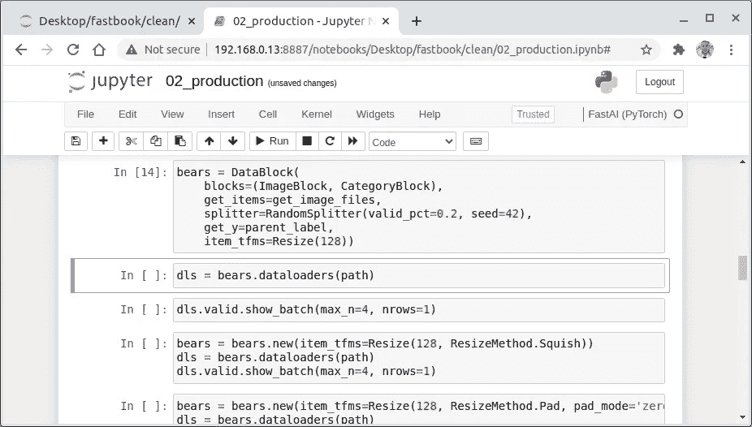

## 创建数据加载器:

单行代码将数据加载器对象存储在`dls`变量中。它使用来自`fastai`库的`DataBlock`类中的`dataloaders`方法(为模型预处理数据集)创建数据加载器对象。它还设置了`source`参数(设置定位数据集的路径)。

1.  选择代码单元格
2.  点击“运行”

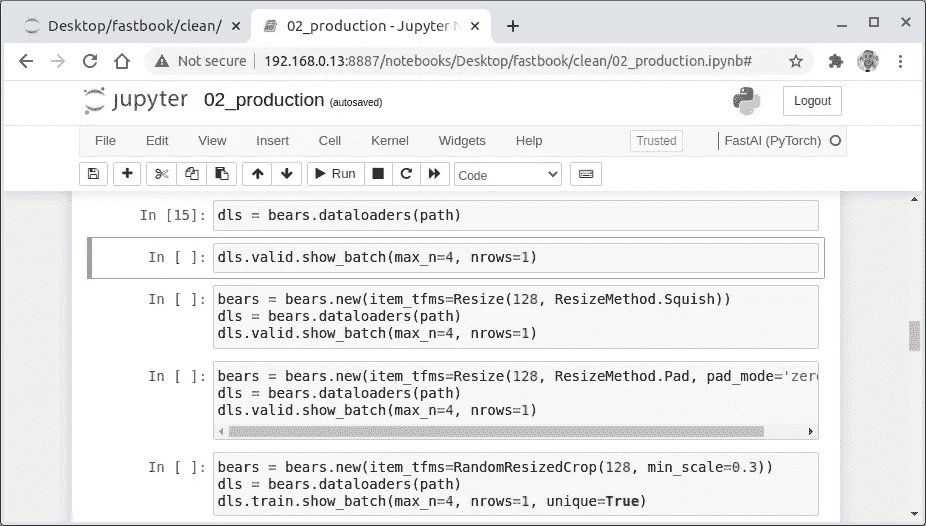

## 显示来自验证集的图像:

单行显示来自`dls` 变量中数据加载器对象的图像。它使用`fastai`库中`core`模块中的`show_batch`方法(显示子集的图像)显示图像。它设置了`max_n`参数(设置要显示的图像数量)和`nrows`参数(设置要使用的行数)。

1.  选择代码单元格
2.  点击“运行”

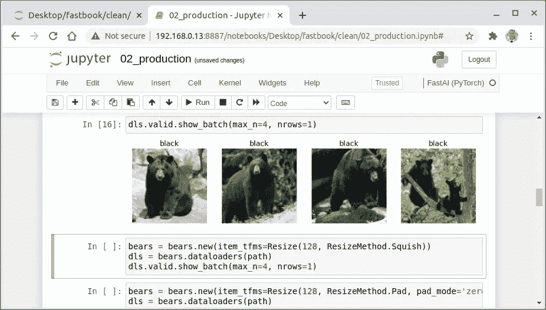

## 显示压扁的图像:

第一行在`bears`变量中存储了一个新的数据块对象。它使用来自`fastai`库的`block`模块中的`new`方法创建新的数据块对象(使用不同的转换创建新的数据块对象)。它还设置了`item_tfms`参数(该参数设置了与其他项目转换合并的新转换)。

第一行还将一个转换类传递给`new`方法来创建数据块对象。它从`fastai`库中传递`augment`模块中的`Resize`类(调整图像大小),并设置`size`参数(设置图像大小)和`method`参数(设置要执行的调整大小方法)。它还从`fastai`库中传递了`basics`模块中`ResizeMethod`的`Squish`属性(压缩图像)。

第二行将数据加载器对象存储在`dls`变量中。它使用来自`fastai`库的`DataBlock`类中的`dataloaders`方法(为模型预处理数据集)创建数据加载器对象。它还设置了`source`参数(设置定位数据集的路径)。

第三行显示来自`dls` 变量中数据加载器对象的图像。它使用`fastai`库中`core`模块中的`show_batch`方法(显示子集的图像)显示图像。它设置了`max_n`参数(设置要显示的图像数量)和`nrows`参数(设置要使用的行数)。

1.  选择代码单元格
2.  点击“运行”


## 显示填充的图像:

第一行在`bears`变量中存储了一个新的数据块对象。它使用来自`fastai`库的`block`模块中的`new`方法创建新的数据块对象(使用不同的转换创建新的数据块对象)。它还设置了`item_tfms`参数(该参数设置了与其他项目转换合并的新转换)。

第一行还将一个转换类传递给`new`方法来创建数据块对象。它从`fastai`库中传递`augment`模块中的`Resize`类(调整图像大小)，并设置`size`参数(设置图像大小)、`method`参数(设置要执行的调整大小方法)和`pad_mode`参数(设置要使用的填充类型)。它还从`fastai`库中传递了`basics`模块的`ResizeMethod`类中的`Pad`属性(将填充添加到图像中)和`zeros`属性(将填充设置为黑色像素)。

第二行将数据加载器对象存储在`dls`变量中。它使用来自`fastai`库的`DataBlock`类中的`dataloaders`方法(为模型预处理数据集)创建数据加载器对象。它还设置了`source`参数(设置定位数据集的路径)。

第三行显示来自`dls` 变量中数据加载器对象的图像。它使用`fastai`库中`core`模块中的`show_batch`方法(显示子集的图像)显示图像。它设置了`max_n`参数(设置要显示的图像数量)和`nrows`参数(设置要使用的行数)。

1.  选择代码单元格
2.  点击“运行”

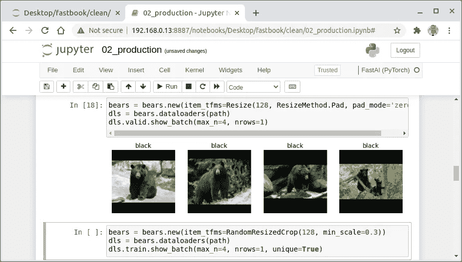

## 显示裁剪的图像:

第一行在`bears`变量中存储一个新的数据块对象。它使用来自`fastai`库的`block`模块中的`new`方法创建新的数据块对象(使用不同的转换创建新的数据块对象)。它还设置了`item_tfms`参数(该参数设置了与其他项目转换合并的新转换)。

第一行还将一个转换类传递给`new`方法来创建数据块对象。它从`fastai`库中传递`augment`模块中的`RandomResizedCrop`类(将图像调整为随机裁剪的部分),并设置`size`参数(设置图像大小)和`min_scale`参数(设置要使用的图像的最低比例)。

第二行将数据加载器对象存储在`dls`变量中。它使用来自`fastai`库的`DataBlock`类中的`dataloaders`方法(为模型预处理数据集)创建数据加载器对象。它还设置了`source`参数(设置定位数据集的路径)。

第三行显示来自`dls` 变量中数据加载器对象的图像。它使用`fastai`库中`core`模块中的`show_batch`方法(显示子集的图像)显示图像。它设置了`max_n`参数(设置要显示的图像数量)、`nrows`参数(设置要使用的行数)和`unique`参数(使用相同的批处理进行转换)。

1.  选择代码单元格
2.  点击“运行”

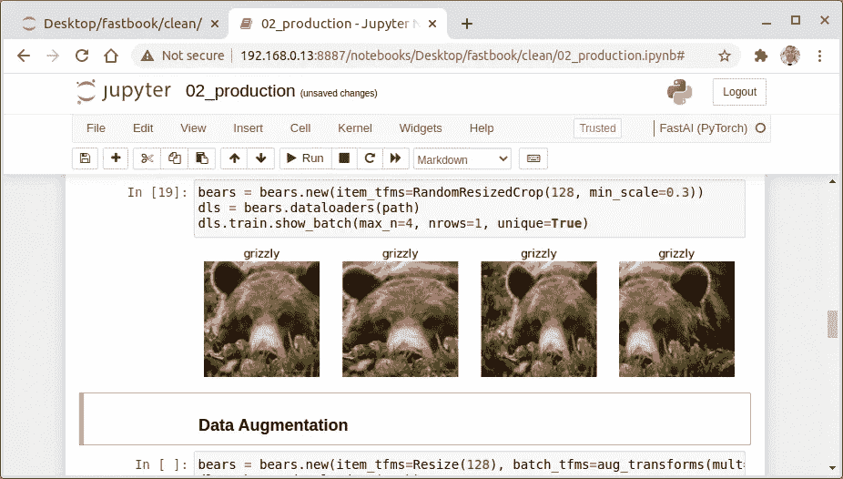

## 显示增强图像:

第一行在`bears`变量中存储一个新的数据块对象。它使用来自`fastai`库的`block`模块中的`new`方法(使用不同的转换创建一个新的数据块对象)创建新的数据块对象。它还设置了`item_tfms`参数(设置与其他项目转换合并的新转换)和`batch_tfms`参数(设置批处理的转换)。

第一行还将一个转换类传递给`new`方法来创建数据块对象。它从`fastai`库中传递`augment`模块中的`Resize`类(调整图像大小)并设置`size`参数(设置图像大小)。它还从`fastai`库中传递`augment`模块中的`aug_transforms`函数(这是预设的变换),并设置`mult`参数(这增加了增强)。

第二行将数据加载器对象存储在`dls`变量中。它使用来自`fastai`库的`DataBlock`类中的`dataloaders`方法(为模型预处理数据集)创建数据加载器对象。它还设置`source`参数(设置定位数据集的路径)。

第三行显示来自`dls` 变量中数据加载器对象的图像。它使用`fastai`库中`core`模块中的`show_batch`方法(显示子集的图像)显示图像。它设置了`max_n`参数(设置要显示的图像数量)、`nrows`参数(设置要使用的行数)和`unique`参数(使用相同的批处理进行转换)。

1.  选择代码单元格
2.  点击“运行”

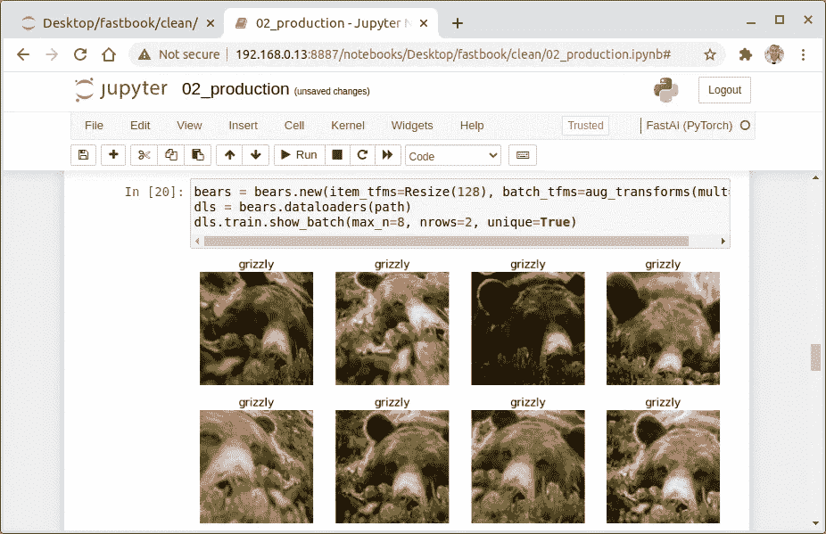

## 创建新的数据加载器:

第一行在`bears`变量中存储了一个新的数据块对象。它使用来自`fastai`库的`block`模块中的`new`方法创建新的数据块对象(使用不同的转换创建新的数据块对象)。它还设置了`item_tfms`参数(设置与其他项目转换合并的新转换)和`batch_tfms`参数(设置批处理的转换)。

第二行将数据加载器对象存储在`dls`变量中。它使用来自`fastai`库的`DataBlock`类中的`dataloaders`方法(为模型预处理数据集)创建数据加载器对象。它还设置了`source`参数(设置定位数据集的路径)。

1.  选择代码单元格
2.  点击“运行”

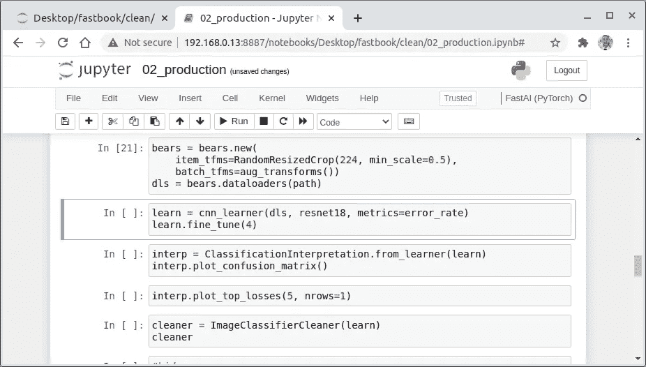

## 训练图像分类模型:

第一行将学习者对象存储在`learn`变量中。它使用来自`fastai`库的`learner`模块中的`cnn_learner`函数(构建一个学习器来执行计算机视觉的迁移学习)创建学习器对象。它还设置了`dls`参数(设置数据加载器对象)、`arch`参数(设置构建模型的架构)和`metrics`参数(设置要显示的指标)。

第二行使用`fine_tune`方法执行迁移学习。它将模型的最终层(在微调过程中被替换)训练一个时期，然后将整个模型(包括最终层)重新训练指定数量的时期。它还设置`epochs`参数(设置训练模型的时期数)。

1.  选择代码单元格
2.  点击“运行”

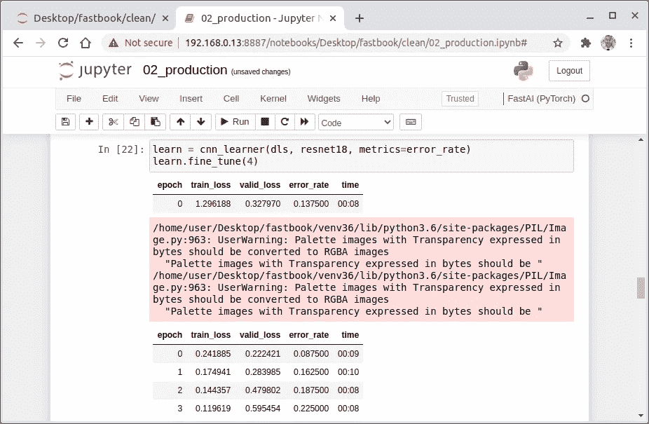

## 显示混淆矩阵:

第一行将解释对象存储在`interp`变量中。它使用来自`fastai`库的`interpret`模块中的`ClassificationInterpretation`类(存储分类模型的解释方法)中的`from_learner`方法创建解释对象。它还设置`learn`参数(设置学习者对象)。

第二行显示混淆矩阵。它使用来自`fastai`库的`interpret`模块的`Classification-Interpretation`类中的`plot_confusion_matrix`方法显示混淆矩阵。它也大部分是从`sklearn`库中的`metics`模块复制过来的。

1.  选择代码单元格
2.  点击“运行”

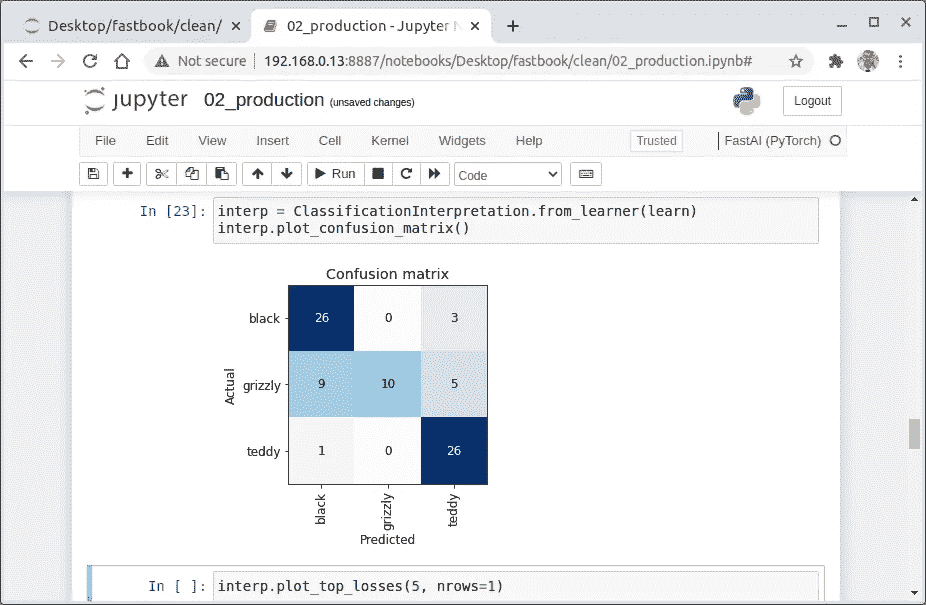

## 显示最高损失:

单行显示损失最大的图像。它使用来自`fastai`库的`interpret`模块的`Class-ificationInterpretation`类中的`plot_top_losses`方法显示图像(该方法显示图像和相关的预测、实际标签、损失和概率)。它还设置了`k`参数(设置要显示的最高损耗数)和`nrows`参数(设置要使用的行数)。

1.  选择代码单元格
2.  点击“运行”

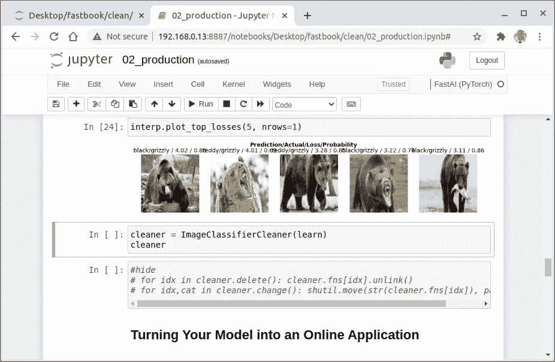

## 清洁图像:

第一行在`cleaner`变量中存储了 images cleaner 小部件。它使用来自`fastai` 库的`widgets`模块中的`ImageClassifierCleaner`类(创建图像清洁器)创建图像清洁器小部件。它还设置了`learn`参数(设置更瘦的对象)。

第二行显示图像清洁器小部件。它显示图像子目录下拉列表(设置子目录)和数据集下拉列表(设置训练集或验证集)。它还显示所选图像子目录和数据集中模型最不确定的图像，并显示操作下拉列表(设置是保留、删除还是将图像移动到不同的子目录)。

1.  选择代码单元格
2.  点击“运行”

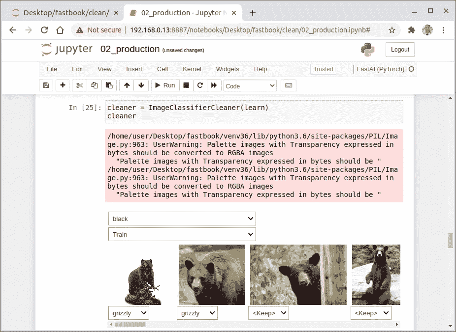

## 进行更改:

第一行删除用 image cleaner 小部件设置为“delete”的图像。它遍历由图像分类器清洁器对象中的`delete`方法返回的索引(返回一个列表),并使用`pathlib`模块中的`unlink`方法(从计算机中删除图像)从`Python`库中删除图像。它还使用索引来获取图像分类器清洁器对象的`fns`属性的文件路径列表中的文件路径(用于删除图像)。

第二行移动用 image cleaner 小部件设置到不同子目录的图像。它遍历由图像分类器清理器对象中的`change`方法(返回列表)和来自`Python`库的`shutil`模块中的`move`方法(移动图像)返回的项目(包含索引和子目录的元组)。它还使用索引来获取图像分类器清理器对象的`fns`属性中的文件路径列表中的文件路径(用于移动图像),并设置`src`参数(用于设置图像的位置)和`dst`参数(用于设置图像的移动位置)。

1.  从这些指令下面复制代码
2.  将代码粘贴到代码单元格中的代码上
3.  选择代码单元格
4.  点击“运行”

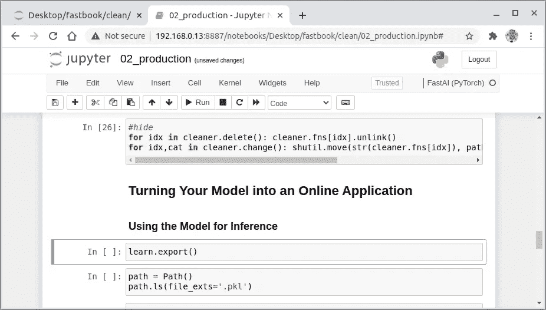

## 保存模型:

单行保存训练好的模型以用于生产。它使用来自`fastai`库的`Learner`模块中的`export`函数保存模型(该函数保存了重新构建用于推理的学习者对象所需的一切)。它还保存架构(定义如何构建模型)、训练参数(定义如何进行预测)和数据加载器参数(定义如何转换数据)。

1.  选择代码单元格
2.  点击“运行”

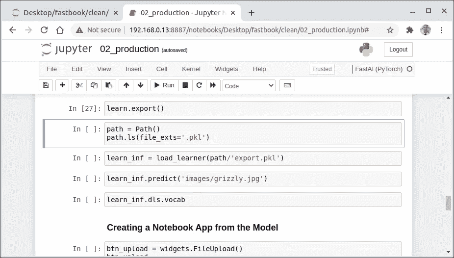

## 检查保存的文件:

第一行在`path`变量中存储了一个路径对象。它使用来自`Python`库的`pathlib`模块中的`Path`类(创建文件系统路径对象)创建路径对象。它也默认使用当前目录，因为没有设置`args`参数(设置文件路径)。

第二行列出了`path`变量中具有“pkl”文件扩展名的文件路径。它使用来自`fastai`库的`xtras`模块中的`ls`方法(显示路径的内容)过滤文件路径。它还设置了`file_exts`参数(设置要过滤的文件扩展名)

1.  选择代码单元格
2.  点击“运行”

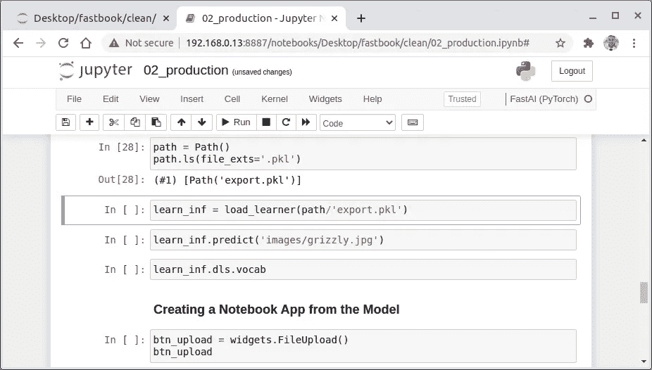

## 加载模型:

单行代码将一个学习者对象存储在`learn_inf`变量中。它使用来自`fastai`库的`Learner`模块中的`load_learner`函数(从 pickle 文件加载学习者对象)加载学习者对象。它还设置了`fname`参数(为 pickle 文件设置文件路径)。

1.  选择代码单元格
2.  点击“运行”

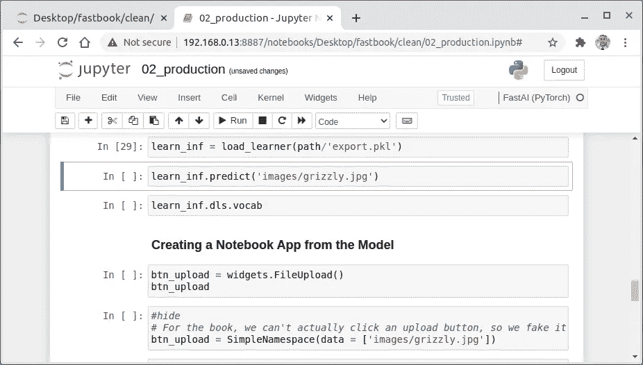

## 做个预测:

这一行预测了一幅图像。它使用来自`fastai`库的`learner`模块中的`Learner`类中的`predict`方法(返回一个包含预测的类、索引和概率的元组)进行预测。它还设置`item`参数(设置图像)。

1.  选择代码单元格
2.  点击“运行”

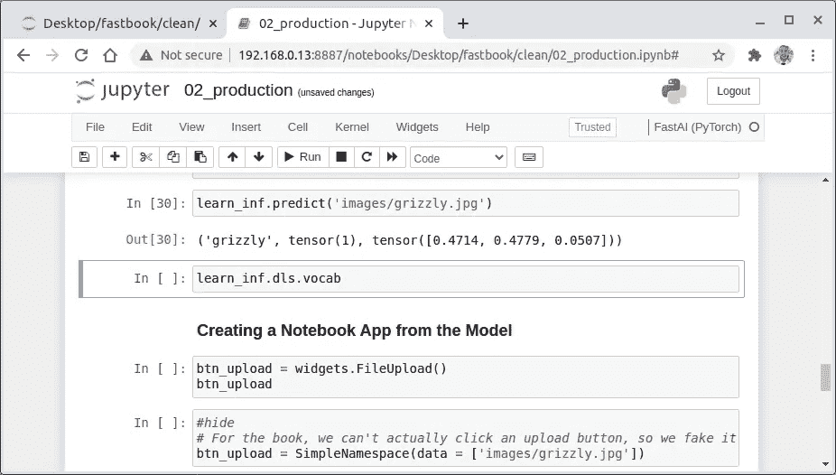

## 检查预测类别:

单行显示了可能的预测类别列表。它从`fastai`库中的`core`模块的`DataLoaders`类的`vocab`属性中获取预测类别列表。它还表示与预测指数和预测概率相关的列表。

1.  选择代码单元格
2.  点击“运行”


## 创建文件上传小部件:

第一行将文件上传小部件存储在`btn_upload`变量中。它使用来自`ipwidgets`库的`widget-_upload`模块中的`FileUpload`类创建文件上传小部件。它还将选定的文件上传到内核的内存中，以便在笔记本中引用。

第二行显示了 Jupyter 笔记本 REPL 输出中的文件上传小部件。它显示按钮(打开一个对话框窗口来选择文件)。它还显示按钮中选定文件的数量(通过单击按钮添加文件或通过运行代码单元格重置)。

1.  选择代码单元格
2.  点击“运行”

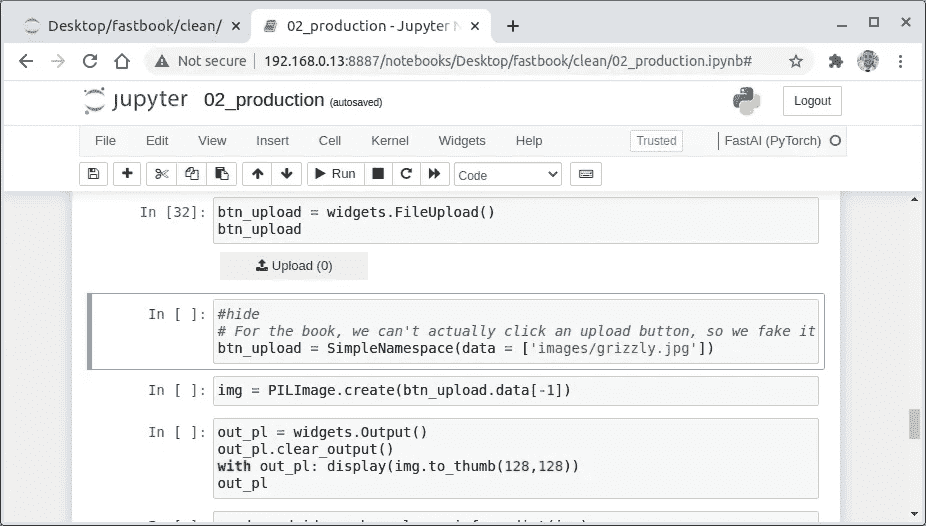

## 替换图像:

单行在`btn_upload`变量中存储一个对象。它使用来自`Python`库的`types`模块中的`SimpleNameSpace`类创建对象。它还设置了`data`参数(设置属性名)和`data`参数(设置相关的属性值)。

简单名称空间是 Python 中用来创建可以存储属性的对象的类。它通过定义参数来设置属性名，通过传递参数来设置属性值。它还可以用点符号添加属性，或者用 del 关键字删除属性。

1.  选择代码单元格
2.  点击“运行”

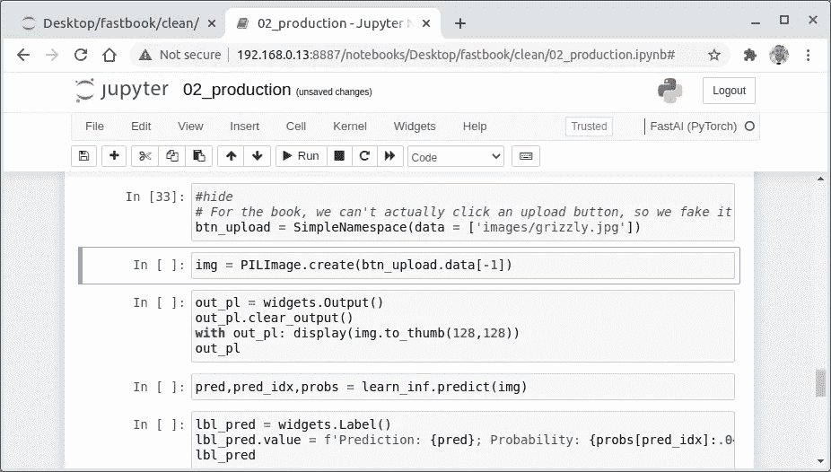

## 加载图像:

单行在`img`变量中存储一个图像对象。它使用来自`fastai`库的`core`模块中的`create`方法(使用来自`PIL`库的`Image`模块中的`open`方法)加载图像对象。它还设置了`fn`参数(该参数设置了从`btn_upload`变量的`data`属性中的文件路径列表返回的文件路径)。

1.  选择代码单元格
2.  点击“运行”

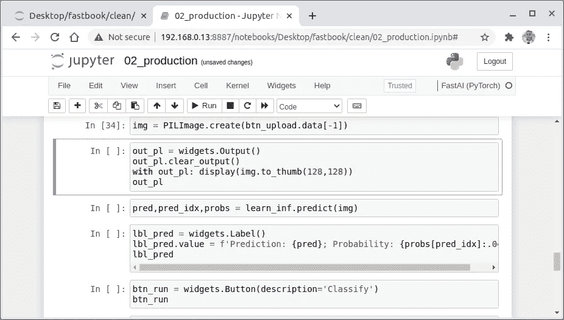

## 创建输出小部件:

第一行将输出小部件存储在`out_pl`变量中。它使用来自`[ipywidgets](#7a89)`库的`widget_output`模块中的`Output`类(可以捕获和显示标准输出、标准错误和任何由`IPython`库生成的丰富输出)创建输出小部件。

第二行清除了变量`out_pl`中输出小部件的数据。它使用来自`ipywidgets`模块的`widget_output`模块的`Output`类中的`clear_output`方法(使用来自`IPython`库的`display`模块中的`clear-_output`函数)清除数据。

调用输出小部件时，第三行显示一个缩略图。它使用`with`语句(调用输出小部件时运行相关代码)和`out_pl`变量(包含附加到`with`语句的输出小部件)显示缩略图。

第三行还向`display`函数传递一个缩略图。它使用来自`fastai`库的`core`模块中的`to_thumb`方法(使用`img`变量中图像对象的副本创建图像)创建缩略图。它还设置`h`参数(设置图像高度)和`w`参数(设置图像宽度)。

第四行调用`out_pl`变量中的输出小部件。它显示了传递给与`with`语句相关的代码中的`display`函数的图像(使用`to_thumb`方法创建的)(运行该语句是因为调用了`out_pl`变量中的输出小部件)。

1.  选择代码单元格
2.  点击“运行”

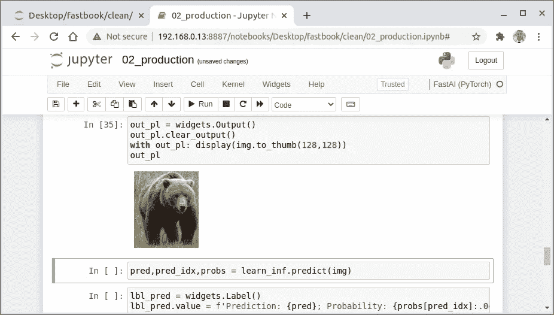

## 做个预测:

这一行预测了一幅图像。它使用来自`fastai`库的`learner`模块的`Leaner`类中的`predict`方法进行预测，并将解构后的预测(包括预测、预测指数和概率)存储在`pred`、`pred_idx`和`probs`变量中。它还设置`item`参数(设置图像)。

1.  选择代码单元格
2.  点击“运行”

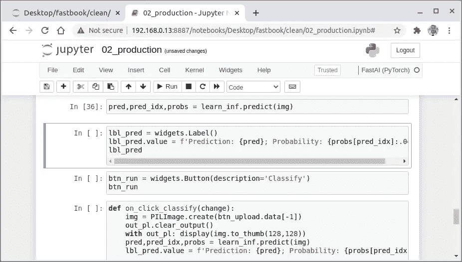

## 创建标签小部件:

第一行将标签小部件存储在`lbl_pred`变量中。它使用来自`ipywidgets`库的`widget_string`模块中的`Label`类创建标签小部件(该类使用与控件小部件的内置描述相似的样式在控件小部件旁边创建自定义描述)。

第二行和第三行设置标签的值，并在输出中显示标签小部件。它使用 f-string 在 label 小部件中设置`value`属性(存储显示的文本值)(使用`pred`变量显示预测，使用`probs`和`pred_idx`变量使用四个小数位显示预测的概率)。它还调用`lbl_pred`变量(在输出中显示标签小部件)。

1.  选择代码单元格
2.  点击“运行”

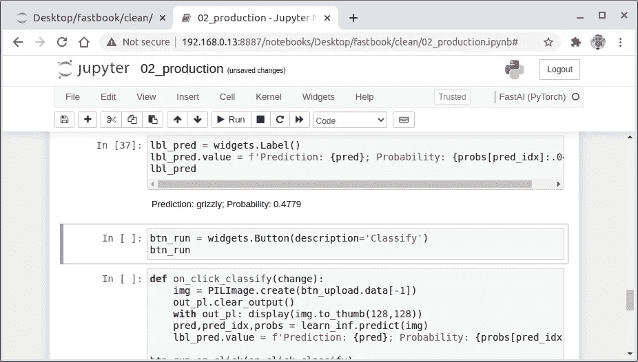

## 创建按钮小部件:

第一行将按钮小部件存储在`btn_run`变量中。它使用来自`ipywidgets`库的`widget-_button`模块中的`Button`类(当按钮被点击时，它显示一个运行`on_click`方法中的代码的按钮)创建按钮小部件。它还设置了`description`参数(该参数设置显示在按钮小部件内部的文本)。

第二行显示输出中的按钮小部件。它显示按钮部件，该部件运行从`ipywidgets`库中传递给`widget-_button`模块中`Button`类的`on_click`方法的`callback` 参数的任何函数。当点击按钮时，它也不做任何事情，因为还没有设置`callback`参数。

1.  选择代码单元格
2.  点击“运行”

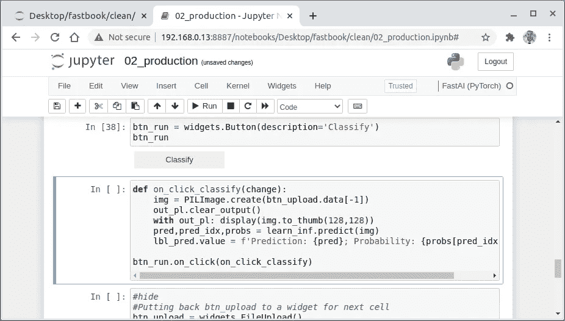

## 定义应用程序逻辑:

前六行定义了`on_click_classify`功能。它使用前面步骤中的代码定义函数(包含应用程序的逻辑)。它还加载图像，清除输出，显示缩略图，进行预测，并显示预测。

第七行设置了单击按钮时运行的函数。它使用来自`ipywidgets`库的`widget_button`模块的`Button`类中的`on_click`方法来设置函数。它还设置了`call-back`参数(设置点击按钮时运行的功能)。

1.  选择代码单元格
2.  点击“运行”


## 创建文件上传小部件:

第一行将文件上传小部件存储在`btn_upload`变量中。它使用来自`ipwidgets`库的`widget-_upload`模块中的`FileUpload`类创建文件上传小部件。它还将选定的文件上传到内核的内存中，以便在笔记本中引用。

1.  选择代码单元格
2.  点击“运行”

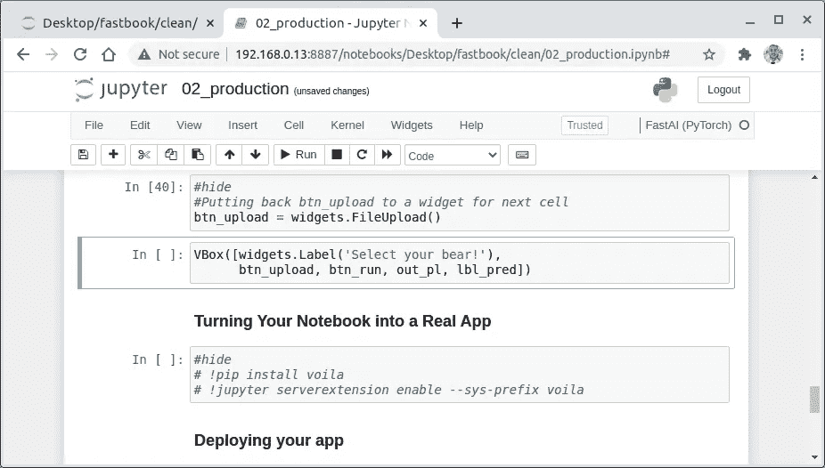

## 创建应用程序:

这一行创建了应用程序的布局。它使用来自`ipywidgets`库的`widgets`模块中的`VBox`类(垂直显示多个小部件)创建布局。它还设置了一个小部件列表，包括新标签小部件、`btn_upload`变量中的文件上传小部件、`btn_run`变量中的分类按钮小部件、`out_pl`变量中的输出小部件和`lbl_pred`变量中的预测标签小部件。

1.  选择代码单元格
2.  点击“运行”
3.  点击“上传”
4.  选择一幅图像
5.  点击“分类”

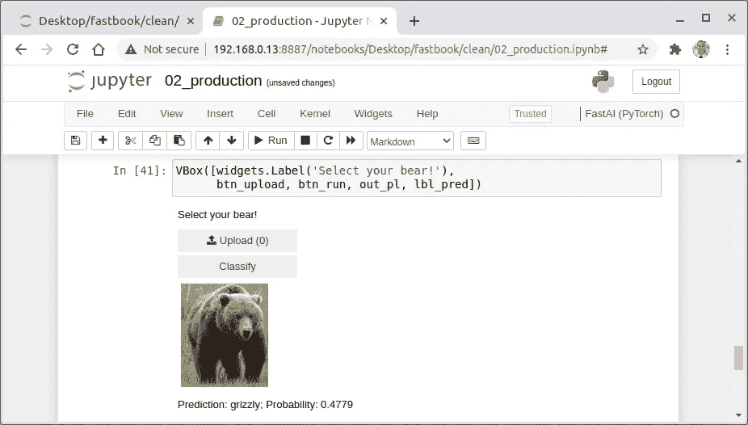

> “希望这篇文章能帮助您获得👯‍♀️🏆👯‍♀️，记得订阅获取更多内容🏅"

## 后续步骤:

本文是帮助您从头到尾设置完成 Fast.ai 课程所需的一切的系列文章的一部分。它包含在教科书每章末尾提供问卷答案的指南。它还包含使用术语和命令的定义、说明和屏幕截图一步一步地浏览代码的指南。

```
**Linux:**
01\. [Install the Fastai Requirements](https://medium.com/p/116415a9df22)
02\. [Fastai Course Chapter 1 Q&A](https://medium.com/p/735f932def0a)
03\. [Fastai Course Chapter 1](https://medium.com/p/d69df3db69a7)
04\. [Fastai Course Chapter 2 Q&A](https://medium.com/p/af9dab3ce8c6)
05\. [Fastai Course Chapter 2](https://medium.com/p/42d7a406349)
06\. [Fastai Course Chapter 3 Q&A](https://medium.com/p/2df7f3a9711)
07\. Fastai Course Chapter 3
08\. [Fastai Course Chapter 4 Q&A](https://medium.com/p/90d2ccb6eaa9)
```

## 其他资源:

本文是帮助您设置开始使用人工智能、机器学习和深度学习所需的一切的系列文章的一部分。它包含扩展的指南，提供术语和命令的定义，帮助您了解正在发生的事情。它还包含简明指南，提供说明和屏幕截图，帮助您更快获得结果。

```
**Linux:**
01\. [Install and Manage Multiple Python Versions](https://medium.com/p/916990dabe4b)
02\. [Install the NVIDIA CUDA Driver, Toolkit, cuDNN, and TensorRT](https://medium.com/p/cd5b3a4f824)
03\. [Install the Jupyter Notebook Server](https://medium.com/p/b2c14c47b446)
04\. [Install Virtual Environments in Jupyter Notebook](https://medium.com/p/1556c8655506)
05\. [Install the Python Environment for AI and Machine Learning](https://medium.com/p/765678fcb4fb)**WSL2:**
01\. [Install Windows Subsystem for Linux 2](https://medium.com/p/cbdd835612fb)
02\. [Install and Manage Multiple Python Versions](https://medium.com/p/1131c4e50a58)
03\. [Install the NVIDIA CUDA Driver, Toolkit, cuDNN, and TensorRT](https://medium.com/p/9800abd74409) 
04\. [Install the Jupyter Notebook Server](https://medium.com/p/7c96b3705df1)
05\. [Install Virtual Environments in Jupyter Notebook](https://medium.com/p/3e6bf456041b)
06\. [Install the Python Environment for AI and Machine Learning](https://medium.com/p/612240cb8c0c)
07\. [Install Ubuntu Desktop With a Graphical User Interface](https://medium.com/p/95911ee2997f) (Bonus)**Windows 10:**
01\. [Install and Manage Multiple Python Versions](https://medium.com/p/c90098d7ba5a)
02\. [Install the NVIDIA CUDA Driver, Toolkit, cuDNN, and TensorRT](https://medium.com/p/55febc19b58)
03\. [Install the Jupyter Notebook Server](https://medium.com/p/e8f3e9436044)
04\. [Install Virtual Environments in Jupyter Notebook](https://medium.com/p/5c189856479)
05\. [Install the Python Environment for AI and Machine Learning](https://medium.com/p/23c34b2baf12)**MacOS:** 01\. [Install and Manage Multiple Python Versions](https://medium.com/p/ca01a5e398d4)
02\. [Install the Jupyter Notebook Server](https://medium.com/p/2a276f679e0)
03\. [Install Virtual Environments in Jupyter Notebook](https://medium.com/p/e3de97491b3a)
04\. [Install the Python Environment for AI and Machine Learning](https://medium.com/p/2b2353d7bcc3)
```

## 词汇表:

*Jupyter Notebook* 是一个用于创建、修改和分发包含代码、等式、可视化和叙述性文本的笔记本的程序。它提供了一个在 web 浏览器中运行的交互式编码环境。它也已经成为机器学习和数据科学的首选工具。
[ [返回](#a82d)

Python 是一种面向对象的语言，以其简单的语法、代码可读性、灵活性和可伸缩性而闻名。它主要用于开发 web 和软件应用程序。它也已经成为人工智能、机器学习和数据科学最流行的语言之一。
[ [返回](#52e1)

Bing 图片搜索 API 是一个 RESTful 网络服务，用于在互联网上搜索图片。默认情况下，它返回用户请求的图像。它还可以使用查询参数按照纵横比、颜色、新旧程度、高度、宽度、图像类型、许可证和大小对图像进行排序和过滤。
[返回](#99ef)

*交互式 Python (IPython)* 是 Jupyter Notebook 中使用的交互式外壳和默认内核。它运行包含在 Jupyter 笔记本文件中的 Python 代码。它还增加了新的功能，如自省、并行计算、富媒体、shell 语法、制表符结束和历史。
[回车](#1072)

*Python 图像库(PIL)* 是一个在 Python 中使用的库，用于向 Python 解释器添加图像编辑功能。它提供了从文件中加载图像、处理图像以及以不同文件格式创建新图像的功能。也是 2011 年停产，正式换成抱枕。
[ [返回](#041f)

Ipywidgets 是 Python 中的一个库，用于为 Jupyter Notebook 提供交互式 HTML 小部件。它包括按钮、滑块和下拉菜单等小部件，在 web 浏览器中结合了 Python 和 JavaScript 功能。它还允许用户通过响应事件和调用指定的事件处理程序来控制数据和可视化数据的变化。
[ [返回](#8f10) ]