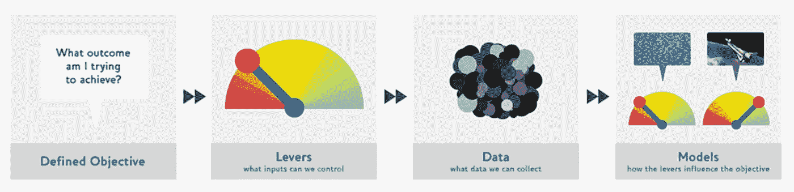

# Fastai 课程第二章 Linux 问答

> 原文：<https://pub.towardsai.net/fastai-course-chapter-2-q-a-on-linux-af9dab3ce8c6?source=collection_archive---------1----------------------->

## [人工智能](https://towardsai.net/p/category/artificial-intelligence)，[教育](https://towardsai.net/p/category/education)

## 本章末尾的问卷答案


图片由[亚当做](https://unsplash.com/@adamdosphotos)

教科书的第二章提供了该模型的概述。它涵盖了与构建模型相关的一些功能、限制、挑战和注意事项。它还涵盖了与将模型部署到生产环境中相关的一些挑战和考虑事项。

> 我们花了很多周时间写问卷。这样做的原因是，因为我们试图思考我们希望你从每一章中学到什么。因此，如果您先阅读调查问卷，您可以了解我们认为您在继续下一章之前应该了解的内容，因此，请确保在继续下一章之前完成调查问卷。
> 
> —杰瑞米·霍华德，Fast.ai

## 1.文本模型目前在哪些方面有重大缺陷？

当被问及关于事实信息的问题时，文本模型仍然很难做出事实上正确的回答。它可以产生外行人看来很有说服力但完全不正确的反应。这也可以归因于自然语言处理中与准确性相关的挑战，例如[上下文单词](#53c3)、[同音异义词](#fd87)、[同义词](#68e5)、[讽刺](#1d51)和[歧义](#738c)。

## 2.文本生成模型可能带来哪些负面的社会影响？

文本生成模型的负面社会影响是假新闻和虚假信息的传播。它可以用来以更高的效率和更低的准入门槛大规模制作引人注目的内容。它还可能被用来进行依赖文本的有害社会活动，如垃圾邮件、网络钓鱼、滥用法律和政府程序、欺诈性学术论文写作和社会工程伪装。

## 3.在模型可能犯错误的情况下，这些错误可能是有害的，自动化过程的一个好的替代方案是什么？

人工智能的最佳替代品是 T2 增强智能，它期望人类与模型密切互动。它可以使人类的生产率比使用严格的手工方法高 20 倍。它还可以产生比严格使用人类更精确的过程。

## 4.深度学习特别擅长什么样的表格数据？

[深度学习](#9705)特别擅长分析包含纯文本列和高基数分类变量的表格数据，这些变量有许多可能的值。它可以在这些条件下胜过流行的[机器学习](#1218)算法。它还需要更长的训练时间，更难解释，涉及超参数调整，并需要 GPU 硬件。

## 5.直接将深度学习模型用于推荐系统的一个关键缺点是什么？

推荐系统的一个关键缺点是，几乎所有的深度学习模型都只推荐用户可能喜欢的产品，而不是他们可能需要或觉得有用的产品。它只根据购买历史、产品销售和产品评级来推荐类似的产品。它也不能推荐还没有被很多用户发现的新奇产品。

## 6.动力传动系统方法的步骤是什么？

*传动系统方法*是一个框架，用于机器学习来设计一个可以解决复杂问题的系统。它使用数据来产生可操作的结果，而不仅仅是以预测的形式产生更多的数据。它还使用以下 4 步流程来构建数据产品:

1.  明确你想要达到的结果
2.  找出你可以影响结果的杠杆
3.  考虑产生结果所需的数据
4.  确定您可以构建哪些模型来实现结果



## 7.传动系统方法的步骤如何映射到推荐系统？

结果是通过向没有推荐就不会购买的客户推荐产品来获得额外的销售。杠杆是用来选择向客户展示的建议的方法。收集这些数据是为了确定引起新销售的建议，这需要进行随机实验，为广泛的客户测试广泛的建议。

该模型实际上是两个模型，根据是否向客户展示推荐来预测产品的购买概率。它计算购买概率之间的差异，以决定要显示的最佳推荐。它还考虑了那些忽视推荐并在没有推荐的情况下购买的客户。

## 8.使用您收集的数据创建一个图像识别模型，并将其部署到 web 上。

教科书建议使用 [Binder](https://mybinder.org/) 将应用程序的初始原型部署为交互式 Jupyter 笔记本。它允许用户创建可共享的笔记本，只需一个链接即可访问。它还分配一个虚拟机来运行应用程序，该应用程序分配存储空间来存储在云中运行 Jupyter 笔记本所需的所有文件。

## 9.什么是数据加载器？

*数据加载器*是在 [PyTorch](#9446) 中使用的一个类，用于将数据集中的数据预处理成模型所需的格式。它指定要加载的数据集，并定制数据集的加载方式。它还主要用于批处理数据、混排数据和并行加载数据。

## 10.我们需要告诉 fastai 哪四件事来创建数据加载器？

*数据块*是在 [Fastai](#9fe1) 中用于构建数据集和数据加载器对象的类。它必须指定 blocks、get_items、splitter 和 get_y 参数来构建 dataloaders 对象。它还可以使用参数的各种组合来为深度学习模型构建不同类型的数据加载器。

1.  `*blocks*` *:* 设置输入(左)和输出(右)类型的功能
2.  `*get_items*`:使用`get_image_files`功能设置输入文件路径
3.  `splitter`:设置分割训练集和验证集的功能
4.  `get_y`:设置从数据集中提取标签的标签函数

## 11.数据块的拆分器参数有什么作用？

*Splitter* 是 Fastai 中使用的 DataBlock 类中的一个参数，用于将数据集分割成子集。它设置了定义如何将数据集分成训练和验证子集的函数。它也主要使用 RandomSplitter 函数来随机拆分数据，但是有九种方法来拆分数据。

## 12.我们如何确保随机分割总是给出相同的验证集？

*随机种子*是一个在机器学习中用来初始化随机数生成器的数字。它使随机数生成器能够产生具有相同数字序列的权重。它还允许用户使用相同的代码、数据和权重来训练模型，以产生相似的结果。

## 13.什么字母常用来表示自变量和因变量？

*独立变量*是在机器学习中使用的变量，用来表示被操作的输入值。它的值预计会影响输出值，但它不受实验中任何其他变量的影响。在方程式中，它也通常用字母“x”来表示。

*因变量*是在机器学习中使用的变量，用于表示预测的输出值。它的值取决于独立变量，这意味着它只在独立变量改变时才改变。在方程式中，它也通常用字母“y”来表示。

## 14.裁剪、填充和挤压调整大小方法之间有什么区别？什么时候你会选择其中一个？

*裁剪*是一种在数据扩充中使用的技术，用于裁剪图像以适合要求大小的正方形。通过将图像添加到对象不完全可见的训练集中，它可以帮助模型更好地泛化。它还会丢失被裁剪掉的图像中的重要细节。

*Pad* 是一种用于数据扩充的技术，在图像的每一侧添加像素。它有助于在保持纵横比的情况下将图像调整到模型期望的大小。它还会在空白区域浪费计算时间，降低图像有用部分的分辨率。

*挤压*是一种用于数据增强的技术，可以挤压或拉伸图像。它可以帮助将图像的大小调整到模型期望的大小，而不保留纵横比。它还会在图像中造成不真实的比例，从而混淆模型并降低准确性。

每种技术都有其缺点，因此最佳技术取决于每个问题和数据集。教科书中建议随机裁剪图像的不同部分，这有助于模型学习关注图像中的不同事物。它还反映了图像在现实世界中的工作方式，在现实世界中，同一物体可能会以不同的方式被框住。


## 15.什么是数据增强？为什么需要它？

*数据扩充*是一种在机器学习中使用的技术，通过创建数据集中图像的修改版本来人为增加训练数据集的大小。它可以包括翻转、旋转、缩放、填充、裁剪、平移和变换图像。它还可以帮助防止在训练机器学习模型时过度拟合。

## 16.提供一个示例，说明由于训练数据中的结构或风格差异，熊分类模型在生产中可能不太适用。

熊分类模型在生产中效果不佳，因为训练数据与生产数据不匹配。之所以会发生这种情况，是因为训练图像是从互联网上下载的，这比它们在现实世界中看起来更清晰、更艺术。

## 17.item_tfms 和 batch_tfms 有什么区别？

*Item Transforms* 是 Fastai 中使用的参数，用于在将图像分组为批次之前，使用 CPU 对所有图像进行一次或多次转换。批处理转换也使用它在批处理转换应用到批处理之前将所有图像调整到相同的大小。

*批处理转换*是 Fastai 中使用的参数，用于在批处理形成后对其应用一个或多个转换。它使用项目变换将所有图像的大小调整为相同的大小，然后将它们分组为批次，这使它可以使用 GPU 将批次变换应用于批次。

## 18.什么是混淆矩阵？

*混淆矩阵*是机器学习中用来评估分类模型性能的表格。它将实际标签与预测值进行比较，并提供模型执行情况的整体视图。它还在行中显示实际标签，在列中显示预测值，其中对角方块表示正确的预测，其余方块表示不正确的预测。


## 19.出口拯救了什么？

*Export* 是 Fastai 中使用的一个函数，用于保存训练好的模型，以便在生产中进行预测。它保存了重建学习者所需的一切，包括架构和训练参数。它还包括定义如何转换数据的 dataloader 参数。

## 20.当我们使用一个模型进行预测，而不是训练时，这叫什么？

*推理*是使用训练好的模型对看不见的数据进行预测的过程。它可以通过执行正向传递而不包括反向传递来计算误差和更新权重，从而进行预测。在实际应用之前，还可以对其进行优化，以提高吞吐量、响应时间、功耗和内存消耗。

## 21.什么是 IPython 小部件？

*IPython Widget* 是一个 GUI 元素，在 [Jupyter Notebook](#409a) 中使用，以增强笔记本中的交互功能。它包括按钮、滑块和下拉框等小部件，在 web 浏览器中结合了 Python 和 JavaScript 的功能。它还允许用户通过响应事件和调用指定的事件处理程序来控制数据和可视化数据的变化。


## 22.您何时会使用 CPU 进行部署？GPU 什么时候可能更好？

CPU 是通用处理器，即使它们比 GPU 具有低得多的吞吐量和更高的延迟，也能在推理方面做得很好。对于速度不是很重要的分析单个数据的应用程序来说，这是一种经济高效的方法。租用服务器也更便宜，因为 CPU 服务器的市场竞争比 GPU 服务器更激烈。

GPU 是并行协处理器，设计用于理想的推理，因为它们比 CPU 具有更高的吞吐量和更低的延迟。对于具有足够大的容量来一次分析一批数据的应用程序来说，这可能是经济高效的。它还可能需要额外的复杂性，如内存管理和队列处理系统。

## 23.将您的应用部署到服务器，而不是手机或 PC 等客户端(或边缘)设备，有哪些缺点？

教科书提供了四个将模型部署到服务器的缺点的例子，包括有限的可访问性、更长的等待时间、更高的安全性和额外的成本。用户需要有互联网连接才能使用该模型，并且在数据传输到服务器和从服务器传输数据时，他们将经历更长的延迟。这还需要保护用户上传的敏感数据，管理、扩展和保护服务器的复杂性会增加开销。

## 24.在实践中推出熊市预警系统时，可能出现的三个问题是什么？

熊警告系统可以做出准确的预测，检测熊，但不能产生有用的可操作的结果。它可能做出不准确的预测，从而引发无益的错误警报。它也可以根本不工作，因为培训和生产数据是不同的。

## 25.什么是域外数据？

*域外数据*是机器学习中的生产数据，在某些方面与用于训练模型的训练数据有很大不同。它可能会导致模型中的意外行为，从而导致实践中的各种问题。它也可以通过使用一个仔细考虑过的过程和进行第一手数据收集和标记来减轻。

## 26.什么是域转移？

*域转移* t 是机器学习中的一个问题，生产数据随时间变化，直到它不再代表用于训练模型的训练数据。它会导致模型不太有效，甚至无效。它也可以通过使用深思熟虑的过程来部分缓解。

## 27.部署流程的三个步骤是什么？

部署过程的第一步是使用一个完全手动的过程，其中模型与人工监督并行运行，而不用于驱动任何操作。它需要人类参与到这个过程中来，查看模型输出，以确保它们有意义并检查问题。

部署过程的第二步是限制模型的范围并仔细监督它。它可以在一个有时间限制的小地理区域中使用模型驱动的方法作为试验来实现。它还可以要求一个人在采取任何行动之前批准每个预测。

部署过程的第三步是逐步扩大模型的范围。它可以逐渐增加模型的范围，并逐渐减少人工监督。与人工流程相比，它还需要良好的报告系统来检查所采取的措施是否有任何变化。

> “希望这篇文章能帮助您获得👯‍♀️🏆👯‍♀️，记得订阅获取更多内容🏅"

## 后续步骤:

本文是帮助您从头到尾设置完成 Fast.ai 课程所需的一切的系列文章的一部分。它包含在教科书每章末尾提供问卷答案的指南。它还包含使用术语和命令的定义、说明和屏幕截图一步一步地浏览代码的指南。

```
**Linux:**
01\. [Install the Fastai Requirements](https://medium.com/p/116415a9df22)
02\. [Fastai Course Chapter 1 Q&A](https://medium.com/p/735f932def0a)
03\. [Fastai Course Chapter 1](https://medium.com/p/d69df3db69a7)
04\. [Fastai Course Chapter 2 Q&A](https://medium.com/p/af9dab3ce8c6)
05\. [Fastai Course Chapter 2](https://medium.com/p/42d7a406349)
06\. [Fastai Course Chapter 3 Q&A](https://medium.com/p/2df7f3a9711)
07\. Fastai Course Chapter 3
08\. [Fastai Course Chapter 4 Q&A](https://medium.com/p/90d2ccb6eaa9)
```

## 其他资源:

本文是帮助您设置开始使用人工智能、机器学习和深度学习所需的一切的系列文章的一部分。它包含扩展的指南，提供术语和命令的定义，帮助您了解正在发生的事情。它还包含简明指南，提供说明和屏幕截图，帮助您更快获得结果。

```
**Linux:**
01\. [Install and Manage Multiple Python Versions](https://medium.com/p/916990dabe4b)
02\. [Install the NVIDIA CUDA Driver, Toolkit, cuDNN, and TensorRT](https://medium.com/p/cd5b3a4f824)
03\. [Install the Jupyter Notebook Server](https://medium.com/p/b2c14c47b446)
04\. [Install Virtual Environments in Jupyter Notebook](https://medium.com/p/1556c8655506)
05\. [Install the Python Environment for AI and Machine Learning](https://medium.com/p/765678fcb4fb)**WSL2:**
01\. [Install Windows Subsystem for Linux 2](https://medium.com/p/cbdd835612fb)
02\. [Install and Manage Multiple Python Versions](https://medium.com/p/1131c4e50a58)
03\. [Install the NVIDIA CUDA Driver, Toolkit, cuDNN, and TensorRT](https://medium.com/p/9800abd74409) 
04\. [Install the Jupyter Notebook Server](https://medium.com/p/7c96b3705df1)
05\. [Install Virtual Environments in Jupyter Notebook](https://medium.com/p/3e6bf456041b)
06\. [Install the Python Environment for AI and Machine Learning](https://medium.com/p/612240cb8c0c)
07\. [Install Ubuntu Desktop With a Graphical User Interface](https://medium.com/p/95911ee2997f) (Bonus)**Windows 10:**
01\. [Install and Manage Multiple Python Versions](https://medium.com/p/c90098d7ba5a)
02\. [Install the NVIDIA CUDA Driver, Toolkit, cuDNN, and TensorRT](https://medium.com/p/55febc19b58)
03\. [Install the Jupyter Notebook Server](https://medium.com/p/e8f3e9436044)
04\. [Install Virtual Environments in Jupyter Notebook](https://medium.com/p/5c189856479)
05\. [Install the Python Environment for AI and Machine Learning](https://medium.com/p/23c34b2baf12)**Mac:** 01\. [Install and Manage Multiple Python Versions](https://medium.com/p/ca01a5e398d4)
02\. [Install the Jupyter Notebook Server](https://medium.com/p/2a276f679e0)
03\. [Install Virtual Environments in Jupyter Notebook](https://medium.com/p/e3de97491b3a)
04\. [Install the Python Environment for AI and Machine Learning](https://medium.com/p/2b2353d7bcc3)
```

## 词汇表:

*上下文单词*是根据句子的上下文来表达不同意思的单词，如“跑去商店”和“用完牛奶”文本模型可能很难在上下文中区分这些种类的单词，即使它已经学习了所有的定义。
[返回](#a350)

*同音异义词*是拼写和发音相同但含义不同的词，如“银行”，如金融机构和沿河的土地。当单词不是以文本形式书写时，文本模型很难执行问答和语音到文本转换。
[回车](#a350)

*同义词*是与“大”和“大”等其他单词具有相同含义的单词文本模型可能难以理解同义词的正确含义，因为一些单词在某些上下文中具有相同的含义，但并非在所有上下文中都具有相同的含义，例如“big”和“large”brother。
[ [返回](#a350)

*讽刺*指的是定义上可能有正面或负面情绪，但实际上暗示相反情绪的词。文本模型可能很难检测讽刺，因为它需要理解情境的上下文、特定主题和引用的环境。
[返回](#a350)

*歧义*指有多种解释的句子，比如“我用双筒望远镜看到一只狗在沙滩上。”文本模型可能难以解释歧义，因为一些单词强烈依赖于句子上下文，这使得不可能预先定义极性。
[回车](#a350)

*人工智能* *(AI)* 是计算机科学的一个广泛领域，它构建了能够执行通常需要人类智能才能完成的任务的智能机器。它使机器能够模拟人类的感知、学习、解决问题和决策。还包括机器学习、深度学习、人工神经网络等概念。
[ [返回](#7ae4)

*增强智能*是人工智能的替代使用，它专注于将技术作为增强人类智能的工具，而不是取代它。它可以将人类从高要求、耗时和重复的任务中解放出来。它也可以支持人类的思考和决策，但解释和决策完全由人类做出。
[返回](#7ae4)

*深度学习(DL)* 是机器学习的一个子类，它使用特殊的算法来学习如何越来越准确地执行特定的任务。它有四种学习方法，包括监督、半监督、无监督和强化学习。它还基于包含两个或更多隐藏层的人工神经网络生成模型。
[ [返回](#6558)

*机器学习(ML)* 是人工智能的一个子类，它使用算法来分析数据，从数据中学习，并对新数据做出决策或预测。它有三种学习方法，包括监督、非监督和半监督学习。它还产生基于具有一个隐藏层的人工神经网络的模型。
[回车](#6558)

PyTorch 是一个 C++库，在 Python 中用于构建、训练和部署深度学习模型以进行原型开发。它提供了高性能、可用性和灵活性。它还针对 Python 进行了优化，这带来了更好的内存和优化、错误消息、模型结构和模型行为。
[返回](#8d6d)

Fastai 是 Python 中用于深度学习的库。它提供了一个构建在低级 API 层次结构之上的高级 API，可以通过重新构建来定制高级功能。它还支持计算机视觉、自然语言处理和表格数据处理。
[回车](#87f6)

Jupyter Notebook 是一个用于创建、修改和分发包含代码、等式、可视化和叙述性文本的笔记本的程序。它提供了一个在 web 浏览器中运行的交互式编码环境。它也已经成为机器学习和数据科学的首选工具。
[ [返回](#3b74)

Python 是一种面向对象的语言，以其简单的语法、代码可读性、灵活性和可伸缩性而闻名。它主要用于开发 web 和软件应用程序。它也已经成为人工智能、机器学习和数据科学最流行的语言之一。
[ [返回](#3b74) ]