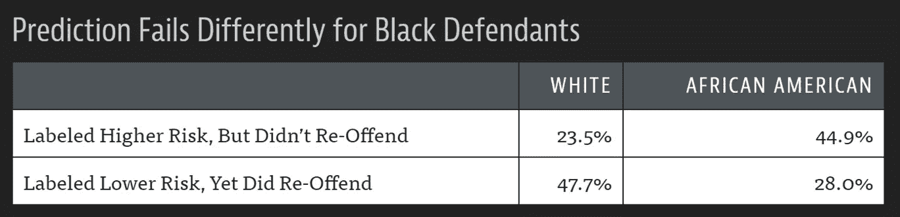

# Fastai 课程第三章 Linux 问答

> 原文：<https://pub.towardsai.net/fastai-course-chapter-3-q-a-on-linux-2df7f3a9711?source=collection_archive---------3----------------------->

## [编程](https://towardsai.net/p/category/programming)

## 本章末尾的问卷答案


图片由[乔尔·菲利普](https://unsplash.com/@joelfilip)拍摄

教科书的第三章概述了人工智能领域存在的伦理问题。它提供了警示故事，意想不到的后果，和伦理考虑。它还涵盖了导致道德问题的偏见和一些可以帮助解决这些问题的工具。

> 我们花了很多周时间写问卷。这样做的原因是，因为我们试图思考我们希望你从每一章中学到什么。因此，如果您先阅读调查问卷，您可以了解我们认为您在继续下一章之前应该了解的内容，因此，请确保在继续下一章之前完成调查问卷。
> 
> —杰瑞米·霍华德，Fast.ai

## 1.伦理学是否提供了一个“正确答案”的列表？

伦理学没有提供解决道德问题的“正确答案”列表。它确实提供了一套原则，可以帮助消除困惑，澄清问题，并确定一些明确的选择。它还可以帮助确定几个“正确答案”，但每个人仍必须得出自己的结论。

## 2.在考虑道德问题时，与不同背景的人一起工作会有什么帮助？

研究结果表明，多元化团队解决问题的能力要优于由最有才华的个人组成的团队。它有助于增加来自具有不同经历和身份的人的不同观点，这些人可能有特权获得与道德问题相关的见解和理解。它还可以帮助制定政策，开展研究和创新，以更好地满足人们的需求。

## 3.IBM 在纳粹德国扮演了什么角色？为什么公司会这样参与？工人们为什么要参加？

IBM 向纳粹提供数据列表产品，用于跟踪大规模灭绝犹太人和其他群体的情况。它创建了一个穿孔卡系统，对每个人被杀的方式进行分类，他们被分配到哪个组，以及用于通过庞大的大屠杀系统跟踪他们的后勤信息。它还在集中营现场提供定期培训和维护，如打印打孔卡、配置机器和维修机器。

该公司总裁托马斯·沃森被指控为了利益与纳粹合作。他在 1937 年获得了特殊的“为帝国服务”奖章。他还亲自批准发布 IBM 字母排序机器，以帮助组织驱逐波兰犹太人。

这些工人是工人阶级，他们努力过着普通的生活，关心他们的家庭，做好他们的工作。据推测，这些项目经理、工程师、技术人员和营销人员只是在执行命令。也有人推测，有一种混合的动机，如群体动力的一致性，服从权威，角色适应，以及改变道德规范，以证明他们的行为。

## 4.大众柴油丑闻中第一个入狱的人是什么角色？

梁兆兵是大众汽车公司的一名工程师，他因在大众汽车柴油丑闻中的角色被判入狱 40 个月，并被罚款 20 万美元。他有意设计了检测车辆测试时间的软件，并相应地临时改变了发动机性能，从而将结果提高了 40 倍。

## 5.由加州执法官员维护的犯罪嫌疑人数据库有什么问题？

2016 年，一项国家审计显示，卡尔冈数据库包含许多错误，削弱了其打击犯罪的价值。它发现了该系统的缺陷，如网站太少，缺乏透明度，违反政策，以及难以证明为什么一些人被添加到该系统中。它也没有适当的流程来纠正错误或删除添加后的人员。

## 6.为什么 YouTube 的推荐算法会向恋童癖者推荐半裸儿童的视频，尽管谷歌没有任何员工设计过这项功能？

YouTube 的推荐系统旨在增加人们在 YouTube 上花费的时间。它创建了反馈循环，根据人们的观看历史和相似的人观看过什么来为他们筛选视频推荐。它还将继续优化这一指标，从而无差别地生成非常受欢迎的播放列表。

## 7.度量的中心性有什么问题？

这本教科书探讨了 YouTube 决定优化他们的推荐系统以最大化观看时间的一些意想不到的后果。它鼓励内容创作者制作更长、更频繁的视频，这些视频专注于娱乐，而不是内容的质量或多样性。这也导致了各种极端的情况，人们会搜索、发现并利用这些情况和反馈循环来为自己谋利。

## 8.为什么 Meetup.com 没有将性别纳入科技聚会的推荐系统？

Meetup 在其推荐系统中没有包括性别，因为他们觉得无论性别如何，向他们的用户推荐 meetup 都更好。他们注意到男性比女性对科技聚会更感兴趣。他们还得出结论，这将形成一个反馈循环，导致更少的女性了解和参加技术会议。

## 9.根据 Suresh 和 Guttag 的说法，机器学习中的六种偏见是什么？

*历史偏差*是当用于训练模型的数据不再准确反映当前现实时，机器学习中出现的偏差。即使测量、采样和特征选择完美完成，也会发生这种情况，因为人、过程和社会已经存在偏见。

*测量偏差*是在机器学习中测量和使用错误的特征和标签时出现的偏差。当模型因为错误的事情被测量，正确的事情被以错误的方式测量，或者测量被不正确地合并到模型中而产生错误时，就会发生这种情况。

*聚合偏差*是当模型无法区分异质人群中的群体时，机器学习中出现的偏差。这是因为模型假设从输入到标签的映射在不同的组中是一致的，而这些组在不同的组中通常是不同的。

*表示偏差*是机器学习中出现的一种偏差，当模型无法很好地概括时，因为部分群体的表示不足。这是因为模型注意到了一个清晰的潜在关系，并假设这种关系会一直存在。

*评估偏差*是当用于衡量模型质量的基准数据不代表总体时，机器学习中出现的偏差。发生这种情况是因为基准数据不能代表一般人群，或者不适合模型的使用方式。

*开发偏差*是当模型以不恰当的方式使用或解释时，机器学习中出现的偏差。这是因为模型要解决的问题与它的使用方式不同。当一个系统被构建和评估为自治的，但不是自治的时，也会发生这种情况。

## 10.举两个美国历史上种族偏见的例子。

2016 年，一项独立调查显示， [COMPAS](#62c2) 算法在实践中包含明显的种族偏见。研究发现，美国黑人被贴上高风险标签的可能性是美国白人的两倍，但实际上并没有再犯。它还发现，美国白人比美国黑人更有可能被贴上低风险的标签，但实际上却犯下了其他罪行。



2012 年，一项大学研究显示，全白人陪审团判定黑人被告有罪的可能性比白人高出 16%。研究发现，当陪审团中没有黑人陪审员时，黑人被告被定罪的几率为 81%，相比之下，白人被告被定罪的几率为 61%。它还发现，当陪审团中有一名或多名黑人陪审员时，黑人被告被定罪的几率为 71%，而白人被告被定罪的几率为 73%。

## 11.ImageNet 中的大部分图像来自哪里？

ImageNet 数据集包含超过 1400 万张从 Flickr 和图片搜索引擎中搜集的图片。它主要包括来自美国和西方国家的图像，因为这些图像在数据集编制时主导了互联网。它在其他国家的场景上表现更差，因为它们在数据集中没有太多的表示。

## 12.在论文《机器学习会自动化道德风险和错误吗？为什么鼻窦炎被认为是中风的先兆？

鼻窦炎被发现是中风的预测因素，因为这个过程实际上并不能预测中风。它没有测量脑细胞血流受限的生物特征。它还使用了包含行为和生物数据的医疗数据，包括谁有中风样症状，决定寻求医疗护理，并由医生进行测试和诊断。

## 13.什么是表征偏差？

*表示偏差*是机器学习中出现的一种偏差，当模型由于部分群体代表性不足而无法很好地概括时。这是因为模型注意到了一个清晰的潜在关系，并假设这种关系会一直存在。

## 14.就机器和人在决策中的用途而言，它们有什么不同？

当涉及到获得决策建议时，机器的使用与人非常不同。假设算法是客观的，没有错误的。它还可以在没有上诉程序的情况下大规模实施，并且比人工决策的成本低得多。

## 15.造谣和“假新闻”一样吗？

虚假信息是出于操纵目的而提供的虚假或误导性信息。它通常具有造成经济损失、操纵公众舆论或产生金钱利润的意图。它还包含被断章取义的夸张和/或真相的种子。

*假新闻*是以合法新闻的名义出现的虚假或误导性信息。它通常具有损害个人或实体声誉或通过在线广告收入赚钱的意图。它还包含刻意制作的、耸人听闻的、情绪化的、误导的和/或完全捏造的模仿主流新闻形式的信息。

## 16.为什么通过自动生成文本的虚假信息是一个特别重要的问题？

文本生成模型的负面社会影响是假新闻和虚假信息的传播。它可以用来以更高的效率和更低的准入门槛大规模制作引人注目的内容。它还可能被用来进行依赖文本的有害社会活动，如垃圾邮件、网络钓鱼、滥用法律和政府程序、欺诈性学术论文写作和社会工程伪装。

## 17.马库拉中心描述的五个伦理镜头是什么？

*道德透镜*是一个概念框架，旨在帮助技术公司将道德考量嵌入其工作流程，并促进道德产品和服务的发展。它包括被学术和职业伦理学家广泛使用的理论。它还包括主要在西方哲学思想背景下的理论。

*权利途径:* 哪个选项尊重所有利益相关者的权利？

*公正的做法:* 哪个选项平等或按比例待人？

*功利主义方法:* 哪个选项产生的好处最多，造成的危害最小？

*共同利益方法:* 哪个选项服务于整个社区，而不仅仅是某些成员？

*美德途径:* 哪个选项引导我成为我想要成为的那种人？

## 18.政策在哪里是解决数据伦理问题的合适工具？进一步研究

当法规和法律带来严重的财务和法律后果时，解决数据道德问题的政策成为公司的优先事项。对于侵犯人权且无法通过个人购买决策解决的数据伦理问题，有必要通过协调一致的监管行动来保护公众。

> “希望这篇文章能帮助您获得👯‍♀️🏆👯‍♀️，记得订阅获取更多内容🏅"

## 后续步骤:

本文是帮助您从头到尾设置完成 Fast.ai 课程所需的一切的系列文章的一部分。它包含在教科书每章末尾提供问卷答案的指南。它还包含使用术语和命令的定义、说明和屏幕截图一步一步地浏览代码的指南。

```
**Linux:**
01\. [Install the Fastai Requirements](https://medium.com/p/116415a9df22)
02\. [Fastai Course Chapter 1 Q&A](https://medium.com/p/735f932def0a)
03\. [Fastai Course Chapter 1](https://medium.com/p/d69df3db69a7)
04\. [Fastai Course Chapter 2 Q&A](https://medium.com/p/af9dab3ce8c6)
05\. [Fastai Course Chapter 2](https://medium.com/p/42d7a406349)
06\. [Fastai Course Chapter 3 Q&A](https://medium.com/p/2df7f3a9711)
07\. Fastai Course Chapter 3
08\. [Fastai Course Chapter 4 Q&A](https://medium.com/p/90d2ccb6eaa9)
```

## 其他资源:

本文是帮助您设置开始使用人工智能、机器学习和深度学习所需的一切的系列文章的一部分。它包含扩展的指南，提供术语和命令的定义，帮助您了解正在发生的事情。它还包含简明指南，提供说明和屏幕截图，帮助您更快获得结果。

```
**Linux:**
01\. [Install and Manage Multiple Python Versions](https://medium.com/p/916990dabe4b)
02\. [Install the NVIDIA CUDA Driver, Toolkit, cuDNN, and TensorRT](https://medium.com/p/cd5b3a4f824)
03\. [Install the Jupyter Notebook Server](https://medium.com/p/b2c14c47b446)
04\. [Install Virtual Environments in Jupyter Notebook](https://medium.com/p/1556c8655506)
05\. [Install the Python Environment for AI and Machine Learning](https://medium.com/p/765678fcb4fb)**WSL2:**
01\. [Install Windows Subsystem for Linux 2](https://medium.com/p/cbdd835612fb)
02\. [Install and Manage Multiple Python Versions](https://medium.com/p/1131c4e50a58)
03\. [Install the NVIDIA CUDA Driver, Toolkit, cuDNN, and TensorRT](https://medium.com/p/9800abd74409) 
04\. [Install the Jupyter Notebook Server](https://medium.com/p/7c96b3705df1)
05\. [Install Virtual Environments in Jupyter Notebook](https://medium.com/p/3e6bf456041b)
06\. [Install the Python Environment for AI and Machine Learning](https://medium.com/p/612240cb8c0c)
07\. [Install Ubuntu Desktop With a Graphical User Interface](https://medium.com/p/95911ee2997f) (Bonus)**Windows 10:**
01\. [Install and Manage Multiple Python Versions](https://medium.com/p/c90098d7ba5a)
02\. [Install the NVIDIA CUDA Driver, Toolkit, cuDNN, and TensorRT](https://medium.com/p/55febc19b58)
03\. [Install the Jupyter Notebook Server](https://medium.com/p/e8f3e9436044)
04\. [Install Virtual Environments in Jupyter Notebook](https://medium.com/p/5c189856479)
05\. [Install the Python Environment for AI and Machine Learning](https://medium.com/p/23c34b2baf12)**MacOS:** 01\. [Install and Manage Multiple Python Versions](https://medium.com/p/ca01a5e398d4)
02\. [Install the Jupyter Notebook Server](https://medium.com/p/2a276f679e0)
03\. [Install Virtual Environments in Jupyter Notebook](https://medium.com/p/e3de97491b3a)
04\. [Install the Python Environment for AI and Machine Learning](https://medium.com/p/2b2353d7bcc3)
```

## 词汇表:

*伦理学*是哲学的一个分支，涉及对正确和错误行为概念的系统化、辩护和推荐。它试图通过定义诸如善与恶、对与错、善与恶、正义与犯罪等概念来解决人类道德问题。它还有三个主要的研究领域，即元伦理学、规范伦理学和应用伦理学。
[返回](#f586)

大众柴油丑闻是大众承认在政府排放测试中作弊的丑闻。据透露，他们安装了非法软件，只有在车辆进行测试时才打开污染控制，这种测试暂时将排放量减少了 40 倍。
[返回](#e5fb)

*惩教罪犯管理概况替代制裁(COMPAS)* 是一种用于帮助法官做出量刑和保释决定的工具。它使用一种算法来预测被告再次犯罪的可能性。它还提供了一个风险评分，用于判断犯罪是一般犯罪、暴力犯罪还是审前不当行为。
[回车](#102b)