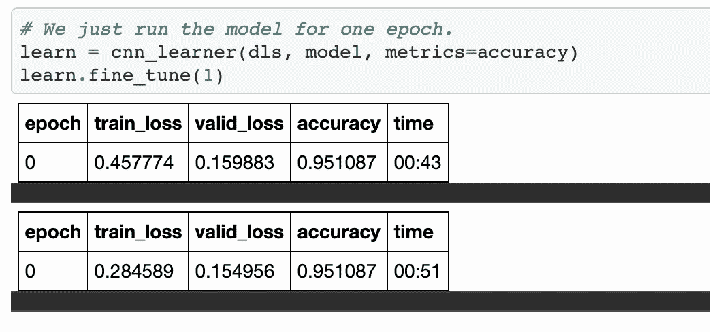
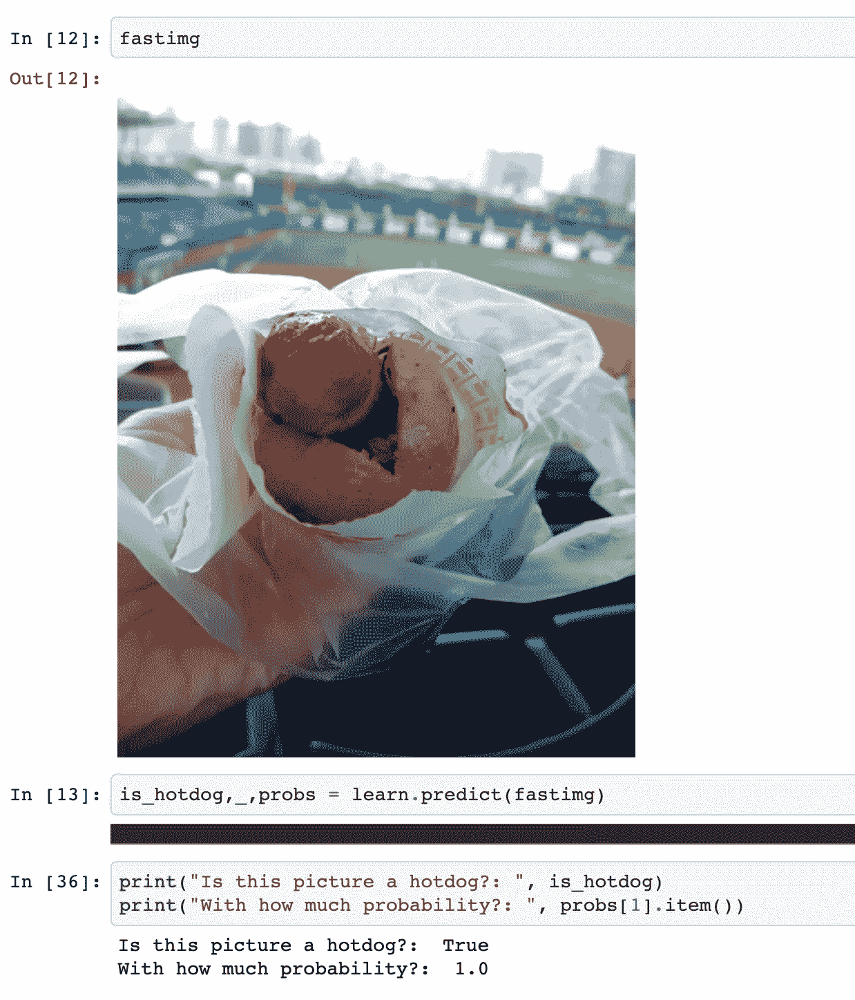
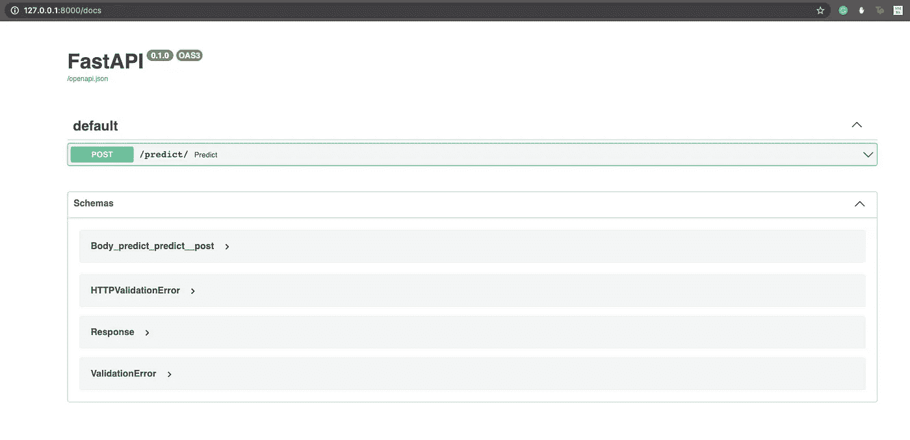
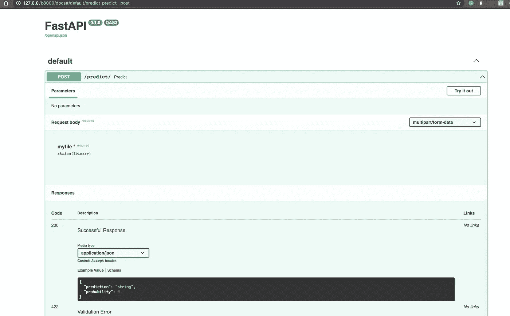
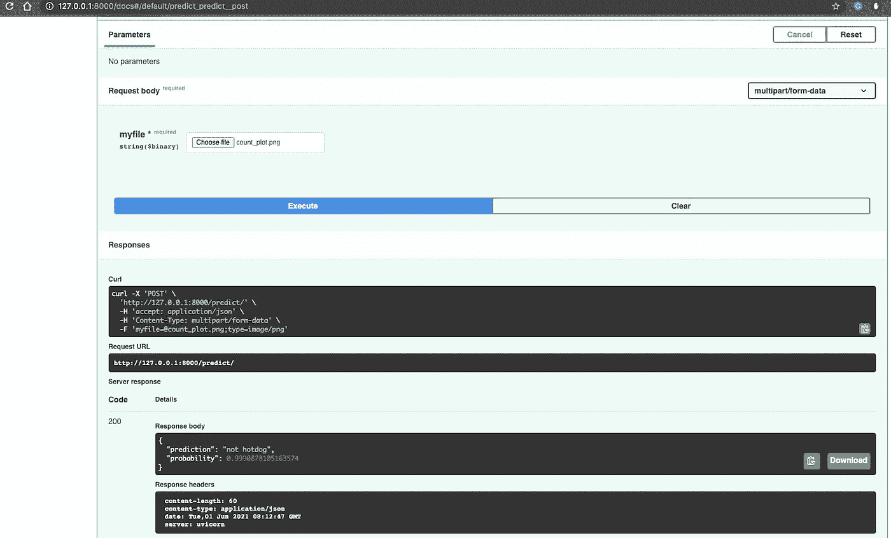

# FastAPI —创建和部署热狗检测器

> 原文：<https://pub.towardsai.net/fastapi-create-and-deploy-hot-dog-detector-cf89d9b51a3c?source=collection_archive---------0----------------------->

## [计算机视觉](https://towardsai.net/p/category/computer-vision)

## 并学习使用 Docker 将其容器化


由[马特乌斯·菲利克斯克](https://unsplash.com/@mateusz_feliksik?utm_source=medium&utm_medium=referral)在 [Unsplash](https://unsplash.com?utm_source=medium&utm_medium=referral) 上拍摄的照片

> 我不抽烟，除了特殊场合——杨坚

对于那些熟悉热播电视剧 [**硅谷**](https://www.imdb.com/title/tt2575988/) 的人来说，你应该已经猜到了这篇文章的灵感来源。

欧阳万成在硅谷的角色 [**开发了一个应用**](https://www.youtube.com/watch?v=vIci3C4JkL0) ，它使用计算机视觉来检测照片是否是热狗。

今天，我们将看看如何使用 FastAPI 和 Docker 来复制和部署这样一个 API。

FastAPI 是发展最快的 web 框架之一，用于在 Python 中构建 API。

> ***TL；*** [***Github 库***](https://github.com/Sayar1106/HotOrNotHotDog)

# 资料组📊

我将使用的数据集来自 Kaggle。你可以在这里找到[](https://www.kaggle.com/c/hotdogornot)**。**

# **训练模型🏃**

**为了训练我们的计算机视觉模型，我决定使用杰瑞米·霍华德著名的 Fastai 库。**

**简而言之，Fastai 是 Pytorch 库之上的一个包装器，它使开发人员能够快速开发机器学习模型。**

**为了训练我们的热狗分类器，我们使用了一个预先训练好的 **Resnet34** 模型。**

**为了更好的了解培训过程中还有哪些选择，可以参考**谷歌 Colab 笔记本**这里 [**可以找到**](https://github.com/Sayar1106/HotOrNotHotDog/blob/master/HotDogOrNot.ipynb) 。**

****

**正如你所看到的，经过一个时期的训练，我们的模型在验证集上达到了 95%的准确率。**

****

**我们看到我们的模型对于从我们的测试集中获取的样本图像工作得相当好。**

# **创建 API💻**

**在本节中，我们将构建一个 API 来将我们训练过的 hotdog 检测器模型部署到生产中。**

## **项目结构**

```
.
├── LICENSE
├── README.md
├── app
│   ├── __init__.py
│   ├── json_models
│   │   ├── __init__.py
│   │   └── request.py
│   ├── main.py
│   ├── models
│   │   ├── __init__.py
│   │   └── model.pkl
│   └── utils.py
├── notebooks
│   └── HotDogOrNot.ipynb
└── requirements.txt
```

**大多数相关代码都位于`app`目录中。请注意，我们已经创建了一个名为`models`的目录来存储我们的训练模型文件。**

**在我们开始之前，请确保通过从父目录运行以下命令来安装所有要求:**

```
$ pip3 install -r requirements.txt
```

**让我们看看我们的代码。**

## **utils.py**

**我们的`utils.py`文件包含三个函数。这三种功能各有不同的用途:**

**`read_image`相当自明。该功能有助于从请求中以字节形式读取图像数据，并将其转换为**适当的格式**，以便输入模型进行预测。**

**`is_hotdog`是一个更加细致入微的功能。这个函数实际上是由我们的`fastai` **数据加载器**使用的，用于适当地为我们的模型提供数据。**

**虽然我们的模型在训练后被存储在一个`.pkl`文件中，但它并没有整体存储`is_hotdog`函数。**

**相反，它**在文件中存储对函数的引用**。因此，我们在我们的 utils 文件中编写函数，以便当模型被加载时，它能够成功地搜索到`is_hotdog`函数，并且能够按照预期进行操作。**

**更多关于这个和`ImageDataLoaders`的信息，可以阅读官方 [**Fastai docs**](https://docs.fast.ai/vision.data.html#ImageDataLoaders) 和本 [**论坛线程**](https://forums.fast.ai/t/loading-custom-databunch-fails-with-attribute-error/70789/2) 。**

**最后，我们的`predict_hotdog`函数加载我们的模型，该模型将利用`is_hotdog`函数并提供预测。该函数返回一个**字典**，它将作为我们的 API 的响应。**

## **响应. py**

**这个位于`json_models`目录中的文件包含一个用于 API 响应模型的`Pydantic`类。**

**简而言之， **Pydantic** 是一个很棒的库，它在运行时使用 python 类型注释提供了**数据验证**。**

**这个库对于构建 API 特别有用，并且与 FastAPI 有极好的互操作性。**

**正如我们所看到的，我们的`Response`类的属性与我们的`predict_hotdog`函数的键具有相同的名称。**

****main.py****

**最后，这是我们的应用程序将在生产中运行的文件。**

**首先，我们创建一个`FastAPI`类对象。然后，我们使用这个类对象来装饰我们的`predict`函数。`@app.post`表示我们的请求将是一个 post 请求，后跟 API 的路径`/predict/`。**

**这里我们还有一个名为`response_model`的参数，它接受我们的 Pydantic 模型作为输入。该参数用于在运行时验证我们的响应。**

**最后，我们的`predict`函数有一个名为`myfile`的查询参数，类型为`UploadFile`，它将用于读取 API 中的图像文件。**

**这个变量被传递到我们之前看到的`read_image`函数中，该函数将以字节为单位将我们的图像数据转换成一个`PILImage`对象，我们可以很容易地使用该对象来填充我们的 FastAI 模型。**

**最后，图像被传递给我们的`predict_hotdog`函数，该函数提供预测并返回一个 dictionary 对象作为响应。**

# **测试📝**

**为了手动测试 API，您必须首先运行它。**

**转到 repo 中的`app`目录，键入以下命令:**

```
$ uvicorn main:app --reload 
```

***注:以下节选直接摘自* [*FastAPI 文档*](https://fastapi.tiangolo.com/tutorial/first-steps/) *。***

**命令`uvicorn main:app`是指:**

*   **`main`:文件`main.py`(Python“模块”)。**
*   **`app`:用行`app = FastAPI()`在`main.py`内创建的对象。**
*   **`--reload`:修改代码后重启服务器。仅用于开发。**

**在您的终端上，您应该看到以下行:**

**`INFO: Uvicorn running on [http://127.0.0.1:8000](http://127.0.0.1:8000) (Press CTRL+C to quit`**

**在您选择的浏览器上打开`http://127.0.0.1:8000/docs`。**

**你应该看到类似这样的东西，这就是 [**Swagger 文档 UI**](https://swagger.io/tools/swagger-ui/) 。**

****

**如果您单击 POST 的下拉列表，您应该能够看到以下内容:**

****

**点击 ***尝试一下*** ，之后会提示你上传你的图片。一旦你这样做了，点击 ***执行*** ，你将得到如下:**

****

**请注意，除了响应之外，UI 还会生成一个定制的 curl 命令，供您在终端上使用。很漂亮吧？**

# **归档📦**

**到目前为止，我们已经看到了如何成功地在本地部署 hotdog 检测器模型。然而，在实践中，人们希望能够在任何机器上部署这样的应用程序。**

**因此，最好的方法是使用 Docker 将应用程序容器化。**

**继续之前，请确保您的系统上安装了 Docker。可以从 [**这里**](https://docs.docker.com/get-docker/) 安装。**

**我们可以利用 FastAPI 创建者创建的 [**官方 Docker 图像**](https://github.com/tiangolo/uvicorn-gunicorn-fastapi-docker) 来建立我们的本地图像。让我们看看我们的 docker 文件:**

```
FROM tiangolo/uvicorn-gunicorn-fastapi:python3.7 COPY ./app /app COPY requirements.txt requirements.txt RUN pip3 install -r requirements.txt
```

**在终端中运行以下命令以创建映像:**

```
$ docker build -t fastimage .
```

**此后，您可以在容器中运行映像，如下所示:**

```
$ docker run -d --name fastcontainer -p 80:80 fastimage
```

**如果在浏览器上打开`localhost/docs`，应该能看到霸气的 UI。**

**因此，现在我们已经创建了 Docker 映像，现在可以将它推送到 **Docker Hub** 或任何其他**容器注册表**以用于生产。**

**恭喜你！您已到达这篇文章的结尾。我希望你喜欢读它。我会留下一些资源来学习更多关于 FastAPI、FastAI 和 Docker 的知识。下次见！✋**

# **资源📚**

*   **[https://fastapi.tiangolo.com/](https://fastapi.tiangolo.com/)**
*   **[https://docs.fast.ai/](https://docs.fast.ai/)**
*   **[https://docs.docker.com/](https://docs.docker.com/)**
*   **[https://www.tutorialspoint.com/docker/index.htm](https://www.tutorialspoint.com/docker/index.htm)**
*   **[https://docs.fast.ai/tutorial.vision](https://docs.fast.ai/tutorial.vision)**