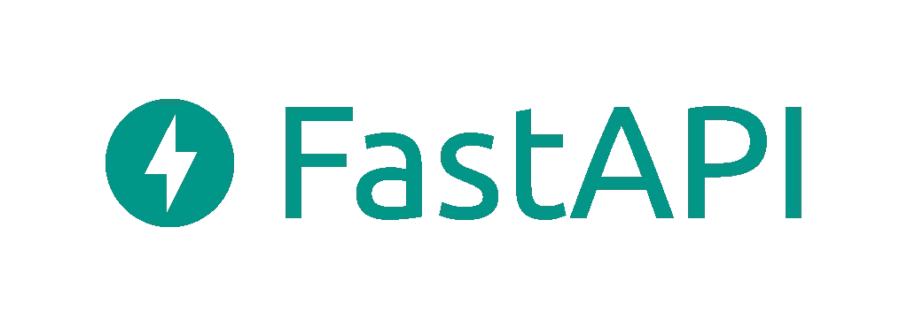
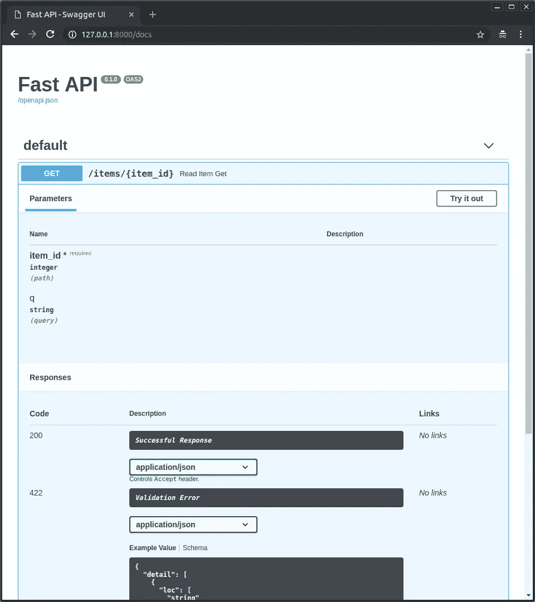
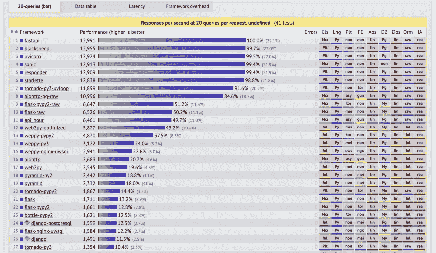
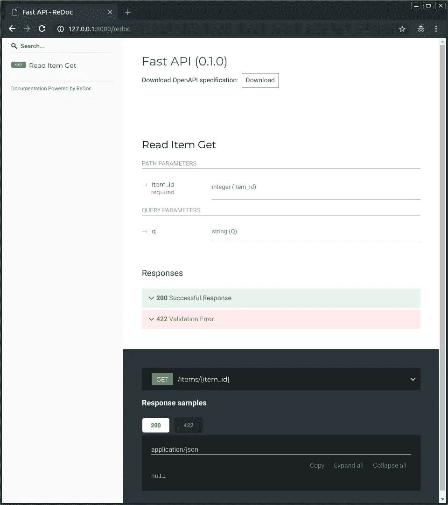
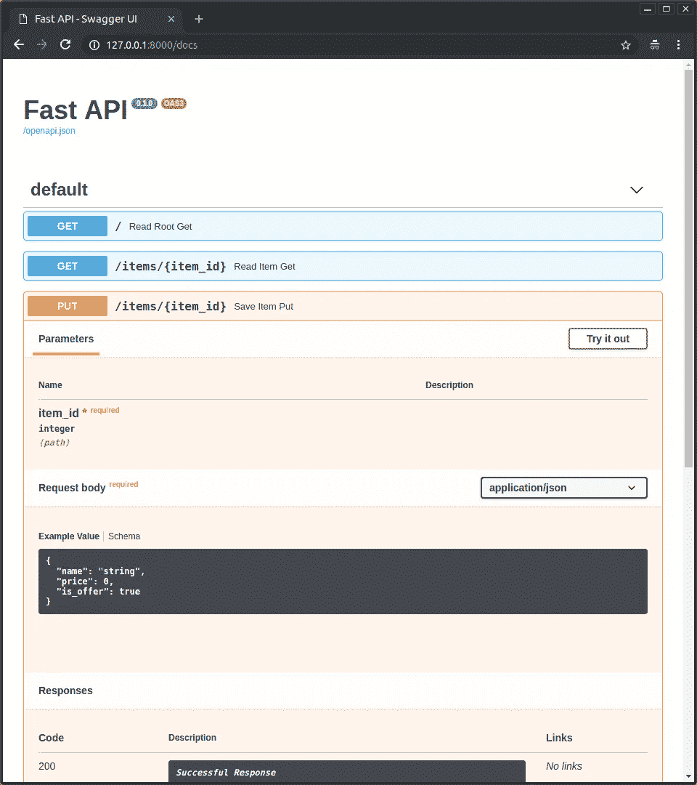
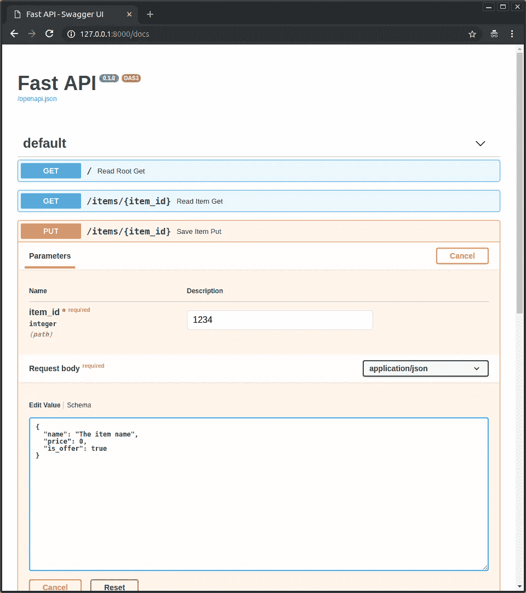
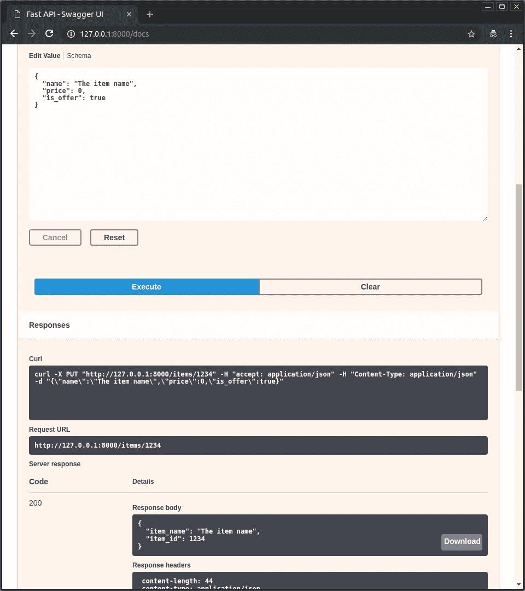

# FastAPI——超越 Flask 的精彩方式！

> 原文：<https://pub.towardsai.net/fastapi-the-spiffy-way-beyond-flask-b00f4f883e1d?source=collection_archive---------0----------------------->

## [编程](https://towardsai.net/p/category/programming)

## *一个优雅而高效的框架，可在几分钟内公开生产就绪的低延迟 API。*



近来，数据科学和机器学习应用呈指数级增长。随着这些数据驱动应用程序的出现，python 成为大多数开发人员的首选。在过去的几年里，python 已经跃居 ML 语言的第一名，这主要是因为打包模型并将其作为服务公开的便利性。

模型准备和训练是机器学习生命周期中的许多步骤之一。除了一个活动的 ML 应用程序之外，还有多个东西在幕后同时工作。在高层次上，它包括数据清理和准备、选择和微调算法、模型训练、通过公开一个端点(称为 ***、【API】****)以端点的形式交付模型预测。*

## 什么是 API？

一个**应用编程接口** ( **API** )是一个计算接口，它定义了多个软件中介之间的交互。它定义了可以进行的调用或请求的种类、如何进行、应该使用的数据格式以及要遵循的约定。

> *将 FastAPI 视为数据科学应用的包装器，以 RESTFUL 微服务的形式公开其功能。*

自从企业数据科学出现以来，Flask 已经成为数据科学家快速公开用于交付应用程序的 HTTP 端点的标准。它相当轻量级、成熟、文档完善，并且已经存在了足够长的时间，已经在组织中扎根。

为了生产一个机器学习模型，标准的方法是将它包装在一个 REST API 中，并将其部署为一个微服务。Flask 目前是编写这些 API 的事实上的选择，原因有两个:

*   烧瓶是最小的。因为推理 API 在历史上倾向于简单的`predict()`方法，由更固执己见的框架(如 Django)引入的复杂性被认为是不必要的。
*   Flask 是用 Python 写的，Python 已经成为机器学习的标准语言。所有主流框架都有 Python 绑定，几乎所有数据科学家/ML 工程师都熟悉它。

## 什么是 FastAPI？

FastAPI 是一个现代、快速(高性能)的 web 框架，用于基于标准 Python 类型提示用 Python 3.6+构建 API。 [*FastAPI*](https://github.com/tiangolo/fastapi) *是构建在*[*Starlette*](https://www.starlette.io/)*、*[*Pydantic*](https://pydantic-docs.helpmanual.io/)*、以及*[*uvicon*](https://www.uvicorn.org/)*之上的 Python API 微框架。*


FastAPI 构建在 Pydantic 和 Starlette 之上

对于开发人员来说，所有的 web 框架都需要在功能性和灵活性之间取得平衡。Flask 的级别很低，足以提供很大的自由度，但是还有很多事情留给开发人员去做。FastAPI 就像 Flask，但是它设法达到了更健康的平衡。

## 为什么选择 FastAPI？

*   **原生异步支持:**与 Node.js 或 Go 中的框架相比，Python WSGI web 框架的最大缺点之一是无法异步处理请求。自从引入 ASGI 以来，这不再是一个问题，FastAPI 正在充分利用这一点。您所要做的只是用关键字`async`声明端点，就像这样:

```
@app.post("/")
**async** def endpoint():   
# ...    
# call async functions here with `await`    
# ...    
return {"msg": "FastAPI is awesome!"}
```

*   自动化交互 API 文档: FastAPI 以 API 文档的形式提供了一个自动化交互接口。它有一个简单而优雅的界面，可以动态创建 API 文档。FastAPI 基于 [OpenAPI](https://github.com/OAI/OpenAPI-Specification) 和 [JSON 模式](http://json-schema.org/)的开放标准。因此，只要您使用适当的 Pydantic 数据类型，它可以自动为 web API 构建一个 SwaggerUI，而无需任何额外的编码。SwaggerUI 本质上是交互式的，允许我们直接从浏览器测试 API。自动化文档受到 APISpec 的启发。



FastAPI 应用程序的 Swagger UI

*   **快速创建 REST API 端点:** Flask 用户必须安装 Flask-rest plus 包来为他们的数据科学应用程序创建 REST 端点。FastAPI 支持 GET、PUT、POST、DELETE、OPTIONS、HEAD、PATCH 和 TRACE Rest 操作，无需任何额外的包。所有路线及其操作都是在文档中自动生成的。
*   依赖注入: FastAPI 提供了一个内置的注入系统来处理端点上的依赖。它为实现[用户认证](https://fastapi.tiangolo.com/tutorial/security/first-steps/)提供了一种有效的方法。
*   **轻松的数据库集成:**就数据库集成而言，FastAPI 是同类产品中最简单的 web 框架。它不会限制您围绕自己选择的几个数据库来构建应用程序。相反，它支持你能想到的所有数据库，并能顺利地将它们集成到你的应用程序中。
*   **最先进的性能:** FastAPI 真的很快！它不仅编码速度快，而且处理请求的速度也非常快！在由 [TechEmpower 基准测试工具](https://www.techempower.com/benchmarks/#section=test&runid=7464e520-0dc2-473d-bd34-dbdfd7e85911&hw=cl&test=composite&l=zijzen-7&a=2)对多个 API 框架的性能进行基准测试的调查中，FastAPI 的表现远远超过 flask。



## FastAPI 的实际应用:

FastAPI 建立在***【nanos gigantum humeris insidentes】***的理念之上，也就是说，如果我站在巨人的肩膀上看得更远。FastAPI 站在两大巨头的肩膀上:

*   [*Starlette*](https://www.starlette.io/)*为 web 部件。*
*   [](https://pydantic-docs.helpmanual.io/)**为数据部分。**

***安装***

*FastAPI 在 PyPI 上以易于安装的 python 包的形式提供。FastAPI 最好的一点是它的 Flask 式简单语法，这使得以前使用过 Flask 的人很容易适应。*

```
*$ pip install fastapi*
```

*由于 FastAPI 本质上是异步的，它还需要 ASGI 服务器来公开生产端点，如[uvicon](http://www.uvicorn.org/)或 [Hypercorn](https://gitlab.com/pgjones/hypercorn) 。*

```
*$ pip install uvicorn
$ pip install hypercorn*
```

***带插图的示例***

*从 FastAPI 开始非常简单，您只需要在您的项目中有一个 ***main.py*** 文件，您可以在其中使用类似于 flask 的装饰器轻松定义不同的 API 端点。*

```
*# Import Dependencies
from typing import Optional  
from fastapi import FastAPI # Initialize the app with FastAPI object
app = FastAPI() # First Endpoint
@app.get("/") 
def read_root():     
  return {"Hello": "World"}# Second Endpoint 
@app.get("/items/{item_id}") 
def read_item(item_id: int, q: Optional[str] = None):     
  return {"item_id": item_id, "q": q}*
```

*到目前为止，它与你用 flask 所做的非常相似，你可能想知道我是否必须做同样的事情，把我的代码从 Flask 转移到 FastAPI 有什么意义。为了证明你的努力，FastAPI 附带了这个惊人的动态交互式 API 文档生成器。它为你提供了一个更干净、更简单、更优雅的用户界面，你可以从网上用零行 HTML 代码来测试你的 API。*

**

*即时生成的自动化交互式文档…*

*现在我们将看到 PUT 方法的运行，以及 FastAPI 如何在其核心使用 Pydantic 来声明使用标准 python 类型的函数体。*

```
*# Importing Dependencies 
from typing import Optional  
from fastapi import FastAPI 
from pydantic import BaseModel# Initialize the app with FastAPI object
app = FastAPI() # Defining a custom object using Pydantic
class Item(BaseModel):
   str price: float     
   is_offer: Optional[bool] = None # Endpoint-1 
@app.get("/") 
def read_root():     
   return {"Hello": "World"}# Endpoint-2
@app.get("/items/{item_id}") 
def read_item(item_id: int, q: Optional[str] = None): 
   return {"item_id": item_id, "q": q} # Endpoint-3
@app.put("/items/{item_id}") 
def update_item(item_id: int, item: Item):     
   return {"item_name": item.name, "item_id": item_id}*
```

*运行上述代码将导致触发事件，这些事件将根据更新的端点自动创建 API doc。*

**

*通过点击 ***【试用】，*** ，它会提供一个文本框让你直接从 web 界面输入 *item_id* 并与 API 交互。*

**

*现在点击 ***“执行”*** 按钮，用户界面将自动与您的 API 通信，发送参数，获取结果并在屏幕上显示出来*

**

## *摘要*

*FastAPI 于 2018 年首次亮相，与 flask 相比，它是一个相对较新的框架，但仍然成为构建高性能数据科学应用程序的事实上的选择。它遵循了 flask 的极简方法，但在此基础上增加了创新功能，使其使用起来非常高效和直观。*

*如果你想了解更多，或者想让我写更多关于这个主题的东西，请随时联系…*

*我的社交链接:[LinkedIn](https://www.linkedin.com/in/shubhamsaboo/)|[Twitter](https://twitter.com/Saboo_Shubham_)|[Github](https://github.com/Shubhamsaboo)*

**如果你喜欢这篇文章或觉得它有帮助，请花一分钟按一下拍手按钮，它会增加文章对其他媒体用户的可见性。**