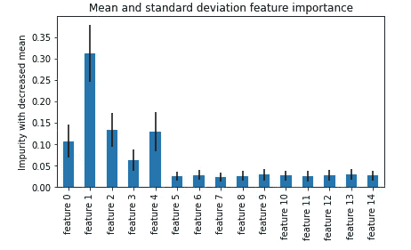
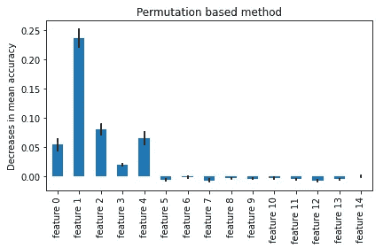

# Python 机器学习中数据的特征重要性

> 原文：<https://pub.towardsai.net/feature-importance-of-data-in-machine-learning-with-python-76ad3b0f5845?source=collection_archive---------1----------------------->

## [机器学习](https://towardsai.net/p/category/machine-learning)

## 用于预测建模的减少输入特征技术


由[亚历克斯·丘马克](https://unsplash.com/@ralexnder?utm_source=medium&utm_medium=referral)在 [Unsplash](https://unsplash.com?utm_source=medium&utm_medium=referral) 上拍摄的照片

要素重要性是一种根据某些系数值来了解输入要素重要性的技术。这种技术可能有助于大规模数据集，有时我们需要根据相关性或使用降维技术移除输入要素。

## 涵盖的主题:

**第一部分:**特征重要性介绍

**第二节:**合成数据生成

**第 3 节:**基于特征重要性的杂质均值减少

**第 4 节:**基于排列的特征重要性

这篇文章将帮助机器学习的学习者，他们倾向于学习更多关于机器学习的主题。

首先想到的是，回归和分类算法的不同特征重要性系数度量是什么。

> ***第 1 节:特性重要性介绍***

当我们在做预测建模项目时，了解数据的特征或维度的重要性是很重要的。我们在这个世界上有很多问题，但有了适量的数据，我们可以对数据进行分类或回归，以预测结果。例如，流失问题是许多公司关心的问题，了解早期预测流失的正确特征是任何行业的主要成就。

> ***第二节:合成数据生成***

有时，我们需要生成合成数据用于学习和测试。在这里，我们将用一个名为***make _ classification***的方法生成数据及其属性。数据集将被分为训练集和测试集，没有洗牌。

这里，我们将使用随机森林算法来检查不同方法的特征重要性。

导入 python 示例所需的库

```
import matplotlib.pyplot as pltfrom sklearn.datasets import make_classification
from sklearn.model_selection import train_test_splitfrom sklearn.ensemble import RandomForestClassifierimport time
import numpy as npimport pandas as pd
```

这里，我们使用 sklearn 库来处理二进制分类数据和训练测试分裂方法。matplotlib 库用于绘制图形。随机森林分类器来自同一个 sklearn 库。time 和 NumPy 库用于计算训练的时间和数值计算。

```
X, y = make_classification(n_samples=2000,n_features=15,
                           n_informative=5, n_redundant=0,
                           n_repeated=0, n_classes=2,
                           random_state=0, shuffle=False,
)
X_train, X_test, y_train, y_test = train_test_split(X, y, stratify=y, random_state=42)
```

现在，我们将使用获取功能名称并使用随机森林分类器

```
feature_names = [f"feature {i}" for i in range(X.shape[1])]
```


```
forest = RandomForestClassifier(random_state=0)
forest.fit(X_train, y_train)#output:
RandomForestClassifier(random_state=0)
```

[](/why-data-science-is-booming-e240b1a64645) [## 数据科学为何蓬勃发展？

### 对他们的企业和整个社会的宝贵贡献

pub.towardsai.net](/why-data-science-is-booming-e240b1a64645) [](/are-you-switching-careers-to-data-science-and-machine-learning-5fab0b75470e) [## 你要转行做数据科学和机器学习吗？

### 分析角色和成为数据科学家的路线图

pub.towardsai.net](/are-you-switching-careers-to-data-science-and-machine-learning-5fab0b75470e) 

> ***第 3 节:基于特征重要性的杂质均值减少***

在这种方法中，每个树内的杂质减少。基于数据的标准偏差和平均值计算特征重要性。

用 python 计算特征重要性的时间

```
start_time = time.time()
importances = forest.feature_importances_
std = np.std([tree.feature_importances_ for tree in forest.estimators_], axis=0)
time_taken = time.time() - start_timeprint(f"Feature importance computing time: {time_taken:.3f} seconds")#output:
Feature importance computing time: 0.057 seconds
```

绘制图表以了解哪些列具有较高的特性重要性。

```
forest_importances = pd.Series(importances, index=feature_names)fig, ax = plt.subplots()
forest_importances.plot.bar(yerr=std, ax=ax)
ax.set_title("Mean and standard deviation feature importance")
ax.set_ylabel("Impurity with decreased mean")
fig.tight_layout()
```



我们可以看到，前五个特征比其他特征更重要。

这种高基数特性方法的一个问题是，列中的类别或类更多。为了解决这个问题，我们使用了另一种叫做特征置换的方法。

> ***第 4 节:基于排列的特征重要性***

这种方法用于克服前一种方法的问题，但是由于数据混洗，计算特征的时间成本很高。

```
from sklearn.inspection import permutation_importancestart_time = time.time()
result = permutation_importance(
    forest, X_test, y_test, n_repeats=10, random_state=42, n_jobs=2
)
elapsed_time = time.time() - start_time
print(f"Feature importance computing time: {elapsed_time:.3f} seconds")forest_importances = pd.Series(result.importances_mean, index=feature_names)
```

让我们在图表上标出这些特征

```
fig, ax = plt.subplots()
forest_importances.plot.bar(yerr=result.importances_std, ax=ax)
ax.set_title("Permutation based method")
ax.set_ylabel("Decreases in mean accuracy")
fig.tight_layout()
plt.show()
```



如果我们比较这两种方法，两种方法都给出了同一列的重要特征，但相对重要性不同。

> ***结论***

基于排列的方法仍然比杂质方法更优选，因为偏差更小且基数低。但是在基于置换的方法中仍然存在相关特征访问的问题，使得特征的重要性降低。这个问题可以通过多重共线排列从不同的聚类中选择特征来解决。

我希望你喜欢这篇文章。通过我的 [LinkedIn](https://www.linkedin.com/in/data-scientist-95040a1ab/) 和 [twitter](https://twitter.com/amitprius) 联系我。

# 推荐文章

1.[8 Python 的主动学习见解收集模块](/8-active-learning-insights-of-python-collection-module-6c9e0cc16f6b?source=friends_link&sk=4a5c9f9ad552005636ae720a658281b1)
2。 [NumPy:图像上的线性代数](/numpy-linear-algebra-on-images-ed3180978cdb?source=friends_link&sk=d9afa4a1206971f9b1f64862f6291ac0)3。[Python 中的异常处理概念](/exception-handling-concepts-in-python-4d5116decac3?source=friends_link&sk=a0ed49d9fdeaa67925eac34ecb55ea30)
4。[熊猫:处理分类数据](/pandas-dealing-with-categorical-data-7547305582ff?source=friends_link&sk=11c6809f6623dd4f6dd74d43727297cf)
5。[超参数:机器学习中的 RandomSeachCV 和 GridSearchCV](/hyper-parameters-randomseachcv-and-gridsearchcv-in-machine-learning-b7d091cf56f4?source=friends_link&sk=cab337083fb09601114a6e466ec59689)
6。[用 Python](https://medium.com/towards-artificial-intelligence/fully-explained-linear-regression-with-python-fe2b313f32f3?source=friends_link&sk=53c91a2a51347ec2d93f8222c0e06402)
7 全面讲解了线性回归。[用 Python](https://medium.com/towards-artificial-intelligence/fully-explained-logistic-regression-with-python-f4a16413ddcd?source=friends_link&sk=528181f15a44e48ea38fdd9579241a78)
充分解释了 Logistic 回归 8。[数据分发使用 Numpy 与 Python](/data-distribution-using-numpy-with-python-3b64aae6f9d6?source=friends_link&sk=809e75802cbd25ddceb5f0f6496c9803)
9。[机器学习中的决策树 vs 随机森林](/decision-trees-vs-random-forests-in-machine-learning-be56c093b0f?source=friends_link&sk=91377248a43b62fe7aeb89a69e590860)
10。[用 Python 实现数据预处理的标准化](/standardization-in-data-preprocessing-with-python-96ae89d2f658?source=friends_link&sk=f348435582e8fbb47407e9b359787e41)